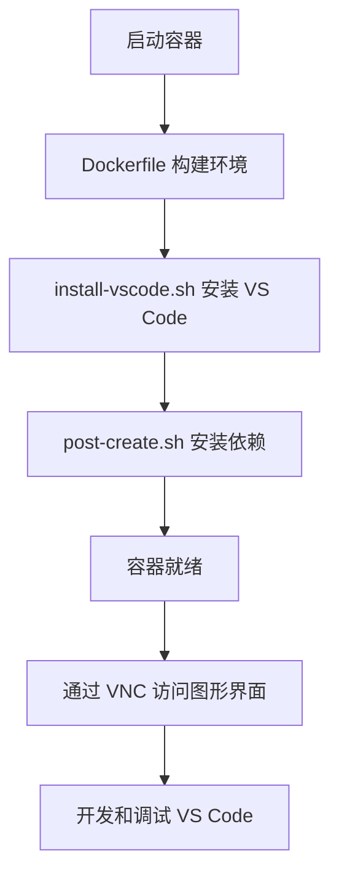

# VS Code 开发容器配置分析

## 📋 概述

这个目录配置了 VS Code 的开发容器环境，让开发者可以在 Docker 容器或 GitHub Codespaces 中开发 VS Code 本身，无需在本地配置复杂的编译环境。

## 📁 目录结构

```
.devcontainer/
├── devcontainer.json          # 开发容器主配置文件
├── devcontainer-lock.json     # 功能版本锁定文件
├── Dockerfile                 # 容器镜像定义
├── install-vscode.sh          # VS Code Insiders 安装脚本
├── post-create.sh             # 容器创建后执行脚本
├── README.md                  # 英文使用文档
├── README.zh-CN.md            # 中文分析文档（本文件）
├── MIRRORS.md                 # 国内镜像配置详解
└── WHY-INSIDERS.md            # 为什么需要安装 VS Code Insiders
```

## 🔧 核心配置文件详解

### 1. devcontainer.json - 开发容器主配置

这是 Dev Containers 的核心配置文件，定义了容器的各项设置。

**主要配置项：**

```jsonc
{
  "name": "Code - OSS",                    // 容器名称
  "build": {
    "dockerfile": "Dockerfile"             // 使用本地 Dockerfile 构建
  },
  "features": {
    "desktop-lite": {},                    // 轻量级桌面环境（VNC）
    "rust": {}                             // Rust 工具链（CLI 需要）
  },
  "hostRequirements": {
    "memory": "9gb"                        // 推荐 9GB 内存
  }
}
```

**关键特性：**

- **图形界面支持**：集成 desktop-lite 功能，提供 VNC 桌面环境
- **端口转发**：
  - `6080` - noVNC web 客户端（浏览器访问）
  - `5901` - VNC TCP 端口（VNC 客户端访问）
- **持久化存储**：挂载 `vscode-dev` 卷用于缓存和数据持久化
- **自动安装扩展**：
  - `dbaeumer.vscode-eslint` - ESLint 代码检查
  - `EditorConfig.EditorConfig` - 编辑器配置
  - `GitHub.vscode-pull-request-github` - GitHub PR 集成
  - `mutantdino.resourcemonitor` - 资源监控

### 2. Dockerfile - 容器镜像定义

定义了开发容器的基础环境和依赖安装。

**镜像构建流程：**

```dockerfile
# 1. 基础镜像：Node.js 22 + TypeScript (Debian Bookworm)
FROM mcr.microsoft.com/devcontainers/typescript-node:22-bookworm

# 2. 配置国内镜像加速
RUN export ELECTRON_MIRROR="https://cdn.npmmirror.com/binaries/electron/"

# 3. 安装 VS Code Insiders
ADD install-vscode.sh /root/
RUN /root/install-vscode.sh

# 4. 配置 Git（隐藏 Codespaces 主题状态）
RUN git config --system codespaces-theme.hide-status 1

# 5. 用户环境配置（node 用户）
USER node
RUN npm install -g node-gyp --registry https://registry.npmmirror.com/
RUN NPM_CACHE="$(npm config get cache)" && \
    rm -rf "$NPM_CACHE" && \
    ln -s /vscode-dev/npm-cache "$NPM_CACHE"
RUN echo 'export DISPLAY="${DISPLAY:-:1}"' | tee -a ~/.bashrc >> ~/.zshrc

# 6. 容器启动命令
USER root
CMD chown node:node /vscode-dev && \
    sudo -u node mkdir -p /vscode-dev/npm-cache && \
    sleep inf
```

**关键优化：**

- ✅ 使用 npmmirror.com 加速 Electron 下载
- ✅ npm 缓存软链接到持久化卷，避免重复下载
- ✅ 自动配置 DISPLAY 环境变量用于图形界面
- ✅ 使用 node 用户运行，提高安全性

### 3. install-vscode.sh - VS Code Insiders 安装脚本

自动安装 VS Code Insiders 和必需的系统依赖。

> **你需要它吗？** 对于大多数开发者来说，**不需要**。这是 VS Code 团队内部配置的一部分，用于特定的对比测试场景。如果你只是修复 bug 或添加功能，可以跳过安装以节省时间。详见 [WHY-INSIDERS.md](./WHY-INSIDERS.md)

**执行步骤：**

```bash
#!/bin/sh

# 1. 更新包管理器并安装基础工具
apt update
apt install -y wget gpg

# 2. 添加 Microsoft GPG 密钥
wget -qO- https://packages.microsoft.com/keys/microsoft.asc | \
    gpg --dearmor > packages.microsoft.gpg
install -D -o root -g root -m 644 \
    packages.microsoft.gpg /etc/apt/keyrings/packages.microsoft.gpg

# 3. 配置 VS Code APT 源（使用清华大学镜像）
sh -c 'echo "deb [arch=amd64,arm64,armhf signed-by=/etc/apt/keyrings/packages.microsoft.gpg] \
    https://mirrors.tuna.tsinghua.edu.cn/vscode/deb stable main" \
    > /etc/apt/sources.list.d/vscode.list'
rm -f packages.microsoft.gpg

# 4. 安装 VS Code Insiders 和开发依赖
apt update
apt install -y \
    code-insiders \      # VS Code 内测版
    libsecret-1-dev \    # 密钥存储库（用于凭证管理）
    libxkbfile-dev \     # 键盘文件支持
    libkrb5-dev          # Kerberos 认证库
```

**依赖说明：**

| 依赖包 | 用途 |
|--------|------|
| `code-insiders` | VS Code 内测版，用于在容器内运行和测试 |
| `libsecret-1-dev` | 密钥存储开发库，用于安全存储凭证 |
| `libxkbfile-dev` | X 键盘文件库，编译原生模块需要 |
| `libkrb5-dev` | Kerberos 认证库，企业环境认证需要 |

### 4. post-create.sh - 容器创建后脚本

容器创建完成后自动执行，初始化开发环境。

```bash
#!/bin/sh

# 1. 安装所有 npm 依赖（包括开发依赖）
npm i

# 2. 下载和配置 Electron
npm run electron
```

**作用：**

- 安装 VS Code 源码的所有依赖包
- 预下载 Electron 二进制文件，避免首次构建时下载

### 5. devcontainer-lock.json - 功能版本锁定

锁定 Dev Container Features 的具体版本，确保环境一致性。

```json
{
  "features": {
    "ghcr.io/devcontainers/features/desktop-lite:": {
      "version": "1.2.8",
      "resolved": "ghcr.io/devcontainers/features/desktop-lite@sha256:14ac23...",
      "integrity": "sha256:14ac23..."
    },
    "ghcr.io/devcontainers/features/rust:": {
      "version": "1.5.0",
      "resolved": "ghcr.io/devcontainers/features/rust@sha256:0c55e6...",
      "integrity": "sha256:0c55e6..."
    }
  }
}
```

## 🎯 完整工作流程



**详细步骤：**

1. **容器初始化**：根据 Dockerfile 构建基础环境
2. **安装 VS Code**：执行 install-vscode.sh 安装 code-insiders
3. **安装依赖**：执行 post-create.sh 运行 `npm i` 和 `npm run electron`
4. **启动服务**：VNC 服务器在端口 5901 启动，noVNC 在 6080 启动
5. **开始开发**：通过浏览器或 VNC 客户端访问图形界面

## 🚀 使用方式

### 方式一：本地 Docker 容器

**前置要求：**
- Docker Desktop（至少 4 核 CPU + 9GB 内存）
- VS Code + Dev Containers 扩展

**步骤：**

1. 打开 VS Code，按 `Ctrl+Shift+P` (macOS: `Cmd+Shift+P`)
2. 选择 **Dev Containers: Clone Repository in Container Volume...**
3. 输入仓库地址：`https://github.com/microsoft/vscode`
4. 等待容器构建完成（首次需要 10-20 分钟）
5. 在容器内终端执行：
   ```bash
   npm i                    # 如果 post-create.sh 未自动执行
   bash scripts/code.sh     # 启动开发版 VS Code
   ```
6. 访问 http://localhost:6080，密码：`vscode`

### 方式二：GitHub Codespaces

**步骤：**

1. 访问 https://github.com/microsoft/vscode
2. 点击 **Code** → **Codespaces** → **New codespace**
3. 选择 **Standard** 机器类型（4 核 8GB）
4. 等待 Codespace 启动
5. 按 `Ctrl+Shift+P`，选择 **Ports: Focus on Ports View**
6. 找到端口 6080，点击地球图标在浏览器中打开
7. 在 noVNC 页面点击 **Connect**，输入密码：`vscode`

### 方式三：使用 VNC 客户端（更流畅）

如果你有 VNC Viewer（如 RealVNC），可以获得更好的性能：

```bash
# 连接信息
地址：localhost:5901
密码：vscode
```

**提示**：将 VNC 客户端的 **Picture Quality** 设置为 **High** 以获得全彩显示。

## 💡 开发技巧

### 1. 构建和运行

```bash
# 安装依赖
npm i

# 启动监听模式（自动编译）
npm run watch

# 在图形界面中运行 VS Code
bash scripts/code.sh

# 或在 VS Code 中按 F5 启动调试
```

### 2. 调试

1. 在容器内的 VS Code 中打开 Run/Debug 视图
2. 选择 **VS Code** 配置
3. 按 `F5` 启动调试
4. 在 VNC 界面中会看到新的 VS Code 窗口，已附加调试器

### 3. 运行测试

```bash
# 单元测试
./scripts/test.sh

# 集成测试
./scripts/test-integration.sh

# 运行特定测试
./scripts/test.sh --grep "test pattern"
```

### 4. 设置分辨率

在容器终端中执行：
```bash
set-resolution
```

### 5. 访问容器内的 VS Code Insiders

```bash
# 在集成终端中运行
VSCODE_IPC_HOOK_CLI= /usr/bin/code-insiders .
```

## 🔍 故障排查

### 问题 1：构建超时

**症状**：启动调试时提示 timeout

**解决方案**：
```bash
# 先手动运行一次，初始化 Electron
./scripts/code.sh
```

### 问题 2：内存不足

**症状**：构建失败或容器崩溃

**解决方案**：
- Docker Desktop → Settings → Resources → Memory
- 调整为至少 9GB

### 问题 3：VNC 连接失败

**症状**：无法访问 localhost:6080

**解决方案**：
```bash
# 检查端口转发
# 在 VS Code 中按 Ctrl+Shift+P
# 选择 "Ports: Focus on Ports View"
# 确认 6080 和 5901 已转发
```

### 问题 4：npm 安装慢

**症状**：npm i 执行很慢

**解决方案**：
```bash
# 已配置国内镜像，如需更换：
npm config set registry https://registry.npmmirror.com
```

## 📊 资源使用

| 资源 | 最低要求 | 推荐配置 |
|------|---------|---------|
| CPU | 4 核 | 8 核 |
| 内存 | 6 GB | 9 GB |
| 磁盘 | 20 GB | 50 GB |
| 网络 | 稳定连接 | 高速连接 |

## 🌟 关键特性

### ✅ 国内优化

本开发容器已全面配置国内镜像源，构建速度提升 **6-10 倍**！

- **Debian 软件包**：使用阿里云镜像（apt 安装提速 10 倍）
- **VS Code 安装包**：使用清华大学 TUNA 镜像（下载提速 10-20 倍）
- **npm 包仓库**：使用 npmmirror.com（淘宝镜像，提速 10-50 倍）
- **Electron 二进制**：使用 npmmirror CDN（提速 20-50 倍）
- **原生模块**：node-sass, ChromeDriver, Puppeteer 等均使用国内镜像

**性能对比**：
- 首次构建：从 ~33 分钟降至 ~5 分钟
- 重建容器：从 ~15 分钟降至 ~2 分钟
- 使用缓存：从 ~5 分钟降至 ~30 秒

详细配置说明请查看 [MIRRORS.md](./MIRRORS.md)

### ✅ 持久化缓存

- npm 缓存存储在 `/vscode-dev/npm-cache`
- 使用 Docker 卷持久化，重建容器不丢失
- 大幅减少重复下载时间

### ✅ 完整开发环境

- **语言支持**：TypeScript, JavaScript, Rust
- **运行时**：Node.js 22, Electron
- **工具链**：node-gyp, C/C++ 编译器
- **图形界面**：Fluxbox + VNC

### ✅ 开箱即用

- 自动安装所有依赖
- 预配置 VS Code 扩展
- 一键启动开发环境

## 📚 相关资源

- [VS Code 贡献指南](https://github.com/microsoft/vscode/wiki/How-to-Contribute)
- [Dev Containers 文档](https://code.visualstudio.com/docs/devcontainers/containers)
- [GitHub Codespaces 文档](https://docs.github.com/en/codespaces)
- [VS Code 架构文档](../.github/copilot-instructions.md)
- [国内镜像配置详解](./MIRRORS.md) ⭐
- [为什么需要 VS Code Insiders](./WHY-INSIDERS.md) ⭐

## 🤝 贡献

如果你发现配置问题或有改进建议，欢迎提交 Issue 或 Pull Request！

---

**最后更新**：2026-03-27
**维护者**：VS Code 团队
