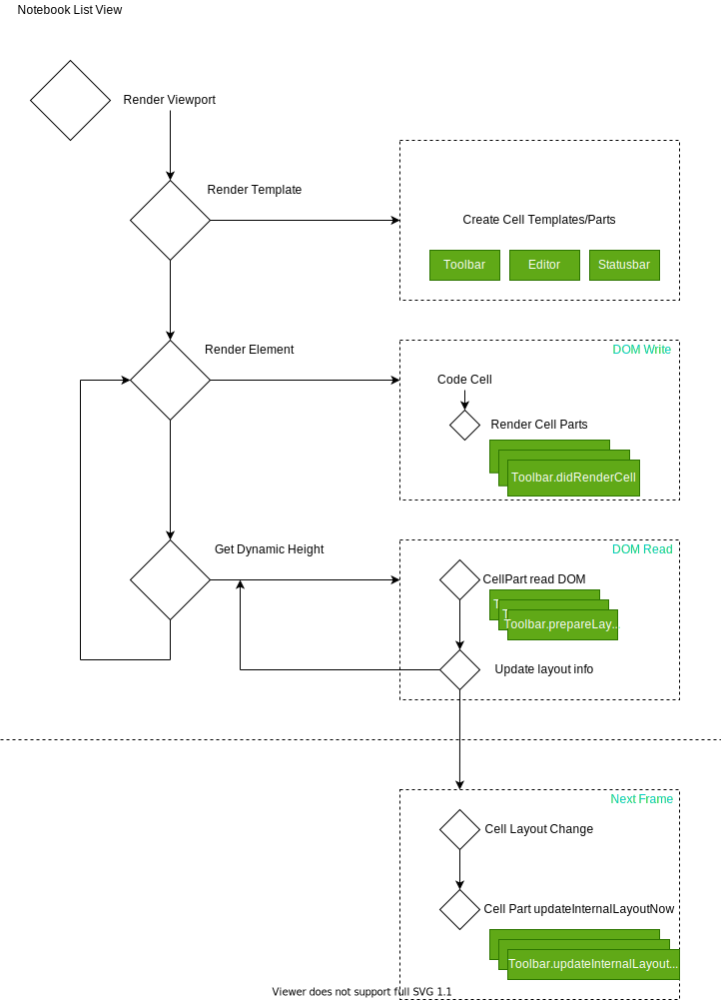

# Notebook Architecture

This document describes the internal architecture of VS Code's notebook implementation.

## Model resolution

Notebook model resolution is handled by `NotebookService`. It resolves notebook models from the file system or other sources. The notebook model is a tree of cells, where each cell has a type (code or markdown) and a list of outputs.

## Viewport rendering (virtualization)

The notebook viewport is virtualized to improve performance. Only visible cells are rendered, and cells outside the viewport are recycled. The viewport rendering is handled by `NotebookCellList` which extends `WorkbenchList<CellViewModel>`.

The rendering has the following steps:

1. **Render Viewport** - Layout/render only the cells that are in the visible viewport
2. **Render Template** - Each cell type has a template (code cell, markdown cell) that is instantiated via `CodeCellRenderer` or `MarkupCellRenderer`
3. **Render Element** - The cell content is rendered into the template
4. **Get Dynamic Height** - Cell height is computed dynamically based on content (editor lines, outputs, etc.)
5. **Cell Parts Lifecycle** - Each cell has lifecycle parts that manage focus, selection, and other state

### Cell resize above viewport

When a cell above the viewport is resized (e.g., output grows), the viewport needs to be updated to maintain scroll position. This is handled by tracking scroll anchors.

## Cell Rendering

The notebook editor renders cells through a contribution system. Cell parts are organized into two categories via `CellPartsCollection`:

- **CellContentPart** - Non-floating elements rendered inside a cell synchronously to avoid flickering
  - `prepareRenderCell()` - Prepare model (no DOM operations)
  - `renderCell()` / `didRenderCell()` - Update DOM for the cell
  - `unrenderCell()` - Cleanup when cell leaves viewport
  - `updateInternalLayoutNow()` - Update layout per cell layout changes
  - `updateState()` - Update per cell state change
  - `updateForExecutionState()` - Update per execution state change

- **CellOverlayPart** - Floating elements rendered on top, may be deferred to next animation frame

Cell parts are located in `view/cellParts/` and contribute to different aspects:
- **Editor** - The Monaco editor for code cells
- **Outputs** - Rendered outputs from code execution
- **Toolbar** - Cell toolbar with actions
- **Status Bar** - Execution status, language info
- **Decorations** - Fold regions, diagnostics, etc.
- **Context Keys** - Cell-specific context key management
- **Drag and Drop** - Cell reordering via `CellDragAndDropController`

## Focus Tracking

Focus in the notebook editor is complex because there are multiple focusable elements:

1. The notebook list itself (`NotebookCellList`)
2. Individual cell containers
3. Monaco editors within cells
4. Output elements (webviews via `BackLayerWebView`)

The `NotebookEditorWidget` tracks focus state and provides APIs to manage focus across these components. Context keys like `NOTEBOOK_EDITOR_FOCUSED`, `NOTEBOOK_OUTPUT_FOCUSED`, and `NOTEBOOK_OUTPUT_INPUT_FOCUSED` are used to track focus state.

## Optimizations

### Output virtualization

Large outputs are virtualized similar to cells. Only visible portions of outputs are rendered.

### Cell DOM recycling

Cell DOM elements are pooled and recycled to reduce DOM operations. When scrolling, cells that move out of the viewport have their templates returned to the pool. Editor instances are managed via `NotebookCellEditorPool`.

### Webview reuse

Output webviews are reused across cells when possible to reduce the overhead of creating new webview contexts. The `BackLayerWebView` manages the webview lifecycle.

---

# Find in Notebook Outputs

The notebook find feature supports searching in both text models and rendered outputs. The find functionality is implemented via `FindModel` and `CellFindMatchModel` classes.

## Hybrid Find

For rendered outputs (HTML, images with alt text, etc.), the find uses a hybrid approach:

1. **Text model search** - Searches cell source code using standard text search via `FindMatch`
2. **DOM search in webview** - Uses `window.find()` to search rendered output content via `CellWebviewFindMatch`

The hybrid find works by:

1. First finding matches in text models (cell inputs) - stored in `contentMatches`
2. Then finding matches in rendered outputs via webview - stored in `webviewMatches`
3. Mixing both match types into a unified result set via `CellFindMatchModel`
4. Navigating between matches reveals the appropriate editor or output

### Implementation details

- Uses `window.find()` for DOM searching in webview
- Uses `document.execCommand('hiliteColor')` to highlight matches
- Serializes `document.getSelection()` to get match positions
- Creates ranges for current match highlighting
