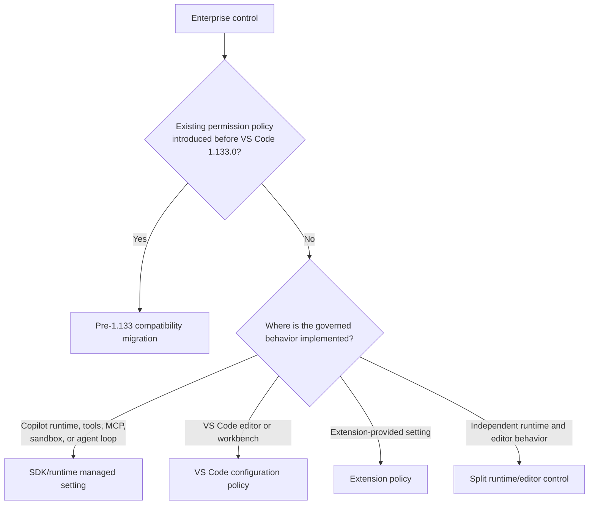

# Adding an Enterprise Policy

Choose the policy destination by **where the governed behavior is implemented**, not by
which team requested it. Most controls for Copilot agent behavior belong in the
SDK/runtime rather than VS Code.

Follow the matching guide:

- [SDK/runtime managed setting](./sdk-runtime-policy.md)
- [VS Code configuration policy](./vscode-policy.md)
- [Extension-provided setting](./extension-policy.md)
- [Split runtime/editor control](./mixed-policy.md)
- [Pre-1.133 permission-policy migration](./legacy-permission-policy.md)

General rules:

- Runtime enforcement is authoritative for behavior executed inside the runtime.
- Do not duplicate a runtime parser, matcher, or security decision in VS Code.
- A VS Code policy is appropriate only for editor/workbench-owned behavior.
- New Copilot enterprise controls should target the shared managed-settings/SDK model.
- The VS Code settings-to-managed-settings bridge is a compatibility path for legacy
  settings only. Do not add a new VS Code setting in order to bridge it; define new
  runtime-owned controls directly in the managed-settings/SDK contract. A temporary,
  false-by-default compatibility gate for the bridge itself is allowed; it is not a
  runtime control and must not become a template for new mapped settings.
- Run `npm run export-policy-data` for every VS Code or extension policy change. Never
  edit `build/lib/policies/policyData.jsonc` manually.

## Deprecated and Historical Channels

Some policy channels remain supported for existing controls but are closed to new
properties:

- **GitHub token/account policy data** (`IPolicyData` fields consumed by
  `AccountPolicyService`) is deprecated for new controls. Do not add new entitlement or
  policy properties from the GitHub token. Existing fields remain for compatibility.
- New Copilot enterprise controls use managed settings and runtime/SDK enforcement.
- Pre-1.133 permission-policy translation is a bounded migration, not a reusable channel.

When another channel is deprecated, record the boundary here and keep implementation
details in the relevant destination guide.

Supporting references:

- [GitHub Copilot managed settings](./github-managed-settings.md)
- [Local policy testing](./local-testing.md)

Keep these guides contract-focused. Document contributor decisions and behavioral
invariants; point to source rather than copying implementation that will drift.

Trust executable source and tests over planning documents.
