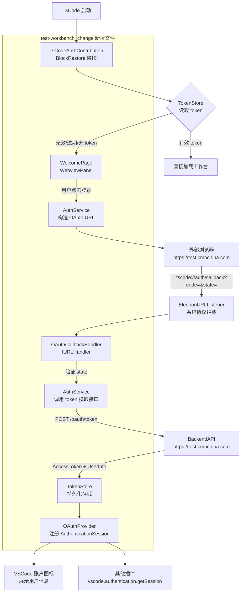

# Design Document: TSCode OAuth Login

## Overview

本设计为 TSCode（VSCode fork 项目）实现完整的 OAuth 2.0 登录认证机制。系统在启动时检查本地存储的 token 有效性，若无效则展示登录欢迎页（WebviewPanel），引导用户通过外部浏览器完成 OAuth 授权，获取 token 后持久化存储，并通过 VSCode Authentication API 对外暴露认证信息供其他插件使用。

所有 fork 特有改动需在代码中添加 `test-workbench_change` 注释标记，以便与上游 VSCode 合并时识别差异。

### 关键设计决策

1. **内置 Workbench Contribution 而非独立扩展**：由于需要在工作台加载前拦截 UI 流程（阻止用户访问工作台），认证逻辑必须作为 workbench contribution 内置到核心代码中，而非作为普通扩展实现。
2. **`tscode://` 协议复用现有 URL 处理机制**：VSCode 已有完整的自定义协议处理链路（`ElectronURLListener` → `IURLService` → `IURLHandler`），通过注册 `IURLHandler` 即可拦截 `tscode://auth/callback` 回调，无需修改 Electron 主进程协议注册逻辑（`product.urlProtocol` 已配置为 `tscode`）。
3. **`WorkbenchPhase.BlockRestore` 阻断工作台恢复**：利用 `registerWorkbenchContribution2` 的 `BlockRestore` 阶段，在工作台 UI 恢复前执行 token 校验，若无效则展示 WelcomePage 并阻止后续加载。

---

## Architecture



### 分层架构

```
src/vs/workbench/contrib/tsCodeAuth/          ← test-workbench_change 新增目录
├── browser/
│   ├── tsCodeAuth.contribution.ts            ← Workbench Contribution 注册入口
│   ├── tsCodeAuthService.ts                  ← AuthService：核心认证逻辑
│   ├── tsCodeOAuthProvider.ts                ← OAuthProvider：实现 IAuthenticationProvider
│   ├── tsCodeTokenStore.ts                   ← TokenStore：SecretStorage + globalState
│   ├── tsCodeCallbackHandler.ts              ← CallbackHandler：IURLHandler 实现
│   └── tsCodeWelcomePage.ts                  ← WelcomePage：WebviewPanel
└── common/
    └── tsCodeAuth.ts                         ← 接口定义与常量

product.json                                  ← test-workbench_change: urlProtocol 改为 tscode
src/vs/workbench/workbench.desktop.main.ts    ← test-workbench_change: 导入 contribution
```

---

## Components and Interfaces

### 1. TsCodeAuthContribution（入口）

```typescript
// test-workbench_change - new file
class TsCodeAuthContribution implements IWorkbenchContribution {
    static ID = 'workbench.contrib.tsCodeAuth';

    constructor(
        @ITsCodeAuthService private readonly authService: ITsCodeAuthService,
        @ILifecycleService private readonly lifecycleService: ILifecycleService,
    )
}
```

注册为 `WorkbenchPhase.BlockRestore`，在工作台恢复前执行 token 校验。若 token 无效，展示 WelcomePage 并等待登录完成后再放行工作台加载。

### 2. ITsCodeAuthService / TsCodeAuthService

```typescript
interface ITsCodeAuthService {
    checkAndHandleAuth(): Promise<void>;
    startOAuthFlow(): Promise<void>;
    exchangeCodeForToken(code: string, state: string): Promise<void>;
    refreshTokenIfNeeded(): Promise<void>;
    readonly onDidLogin: Event<AuthenticationSession>;
    readonly onDidLogout: Event<void>;
}
```

核心认证服务，协调 TokenStore、CallbackHandler、OAuthProvider 之间的交互。

### 3. TsCodeTokenStore

```typescript
interface ITsCodeTokenStore {
    getAccessToken(): Promise<StoredToken | undefined>;
    saveToken(token: StoredToken): Promise<void>;
    clearToken(): Promise<void>;
    getUserInfo(): UserInfo | undefined;
    saveUserInfo(info: UserInfo): void;
}
```

- `AccessToken` 存储于 `ISecretStorageService`，key 为 `tscode-oauth.accessToken`
- `UserInfo` 存储于 `IStorageService`（globalState），key 为 `tscode-oauth.userInfo`

### 4. TsCodeCallbackHandler

```typescript
class TsCodeCallbackHandler implements IURLHandler {
    handleURL(uri: URI, options?: IOpenURLOptions): Promise<boolean>;
}
```

注册到 `IURLService`，处理 `tscode://auth/callback` URI。提取 `code` 和 `state` 参数，验证 state 后通知 AuthService 换取 token。

### 5. TsCodeWelcomePage

```typescript
class TsCodeWelcomePage extends Disposable {
    show(): void;
    hide(): void;
    showWaitingState(): void;
    showErrorState(message: string): void;
    readonly onLoginClicked: Event<void>;
}
```

使用 `IWebviewService` 创建 WebviewPanel，渲染品牌登录页面。通过 `webview.onDidReceiveMessage` 接收用户点击事件。

### 6. TsCodeOAuthProvider

```typescript
class TsCodeOAuthProvider implements IAuthenticationProvider {
    readonly id = 'tscode-oauth';
    readonly label = 'TSCode';
    readonly supportsMultipleAccounts = false;
    readonly onDidChangeSessions: Event<AuthenticationSessionsChangeEvent>;

    getSessions(scopes?: string[]): Promise<readonly AuthenticationSession[]>;
    createSession(scopes: string[]): Promise<AuthenticationSession>;
    removeSession(sessionId: string): Promise<void>;
}
```

实现 `IAuthenticationProvider` 接口，注册到 `IAuthenticationService`。

---

## Data Models

### StoredToken

```typescript
interface StoredToken {
    accessToken: string;
    expiresAt?: number;      // Unix timestamp (ms)，可选
    refreshToken?: string;   // 若 BackendAPI 支持刷新
}
```

序列化为 JSON 字符串存入 SecretStorage。

### UserInfo

```typescript
interface UserInfo {
    id: string;              // 用户唯一标识符
    displayName: string;     // 用户显示名称
}
```

序列化为 JSON 字符串存入 globalState。

### OAuthState

```typescript
interface OAuthState {
    value: string;           // crypto.randomUUID() 生成的随机值
    createdAt: number;       // 创建时间戳，用于超时检测
}
```

仅在内存中保存，不持久化。

### AuthenticationSession（VSCode 标准类型）

```typescript
// 使用 VSCode 内置 AuthenticationSession 类型
{
    id: userInfo.id,
    accessToken: storedToken.accessToken,
    account: {
        id: userInfo.id,
        label: userInfo.displayName,
    },
    scopes: [],
}
```

### BackendAPI 响应格式

```typescript
// POST https://test.cmbchina.com/oauth/token
interface TokenResponse {
    access_token: string;
    expires_in?: number;     // 秒数
    refresh_token?: string;
    user_id: string;
    display_name: string;
}
```

---

## Correctness Properties

*A property is a characteristic or behavior that should hold true across all valid executions of a system—essentially, a formal statement about what the system should do. Properties serve as the bridge between human-readable specifications and machine-verifiable correctness guarantees.*

### Property 1: Token 有效性决定登录流程触发

*For any* 存储在 TokenStore 中的 token，若该 token 存在且未过期，则 AuthService 的 `checkAndHandleAuth()` 不应触发 WelcomePage；若 token 不存在或已过期，则必须触发 WelcomePage。

**Validates: Requirements 1.2, 1.3, 1.4**

### Property 2: OAuth state 参数唯一性

*For any* 两次连续调用 `startOAuthFlow()`，生成的 state 值应互不相同。

**Validates: Requirements 3.1**

### Property 3: 授权 URL 包含所有必需参数

*For any* 调用 `buildAuthorizationUrl(state)` 生成的 URL，该 URL 必须包含 `client_id`、`redirect_uri=tscode://auth/callback`、`state` 三个查询参数，且 `state` 值与传入参数一致。

**Validates: Requirements 3.2, 3.4**

### Property 4: 回调 URI 参数解析 round-trip

*For any* 合法的 `code` 和 `state` 字符串，将其编码为 `tscode://auth/callback?code={code}&state={state}` URI 后，`CallbackHandler` 解析出的 `code` 和 `state` 应与原始值完全一致。

**Validates: Requirements 4.2**

### Property 5: state 验证正确性

*For any* 预期 state 值 `expected` 和回调 state 值 `received`，当且仅当 `expected === received` 时，state 验证应通过；否则应拒绝并返回安全错误。

**Validates: Requirements 4.3, 4.4**

### Property 6: BackendAPI 响应解析 round-trip

*For any* 合法的 `TokenResponse` 对象，将其序列化为 HTTP 响应体后，`AuthService` 解析出的 `StoredToken` 和 `UserInfo` 应与原始数据字段一一对应。

**Validates: Requirements 4.6**

### Property 7: TokenStore 存储 round-trip

*For any* `StoredToken` 和 `UserInfo` 对象，调用 `saveToken()` / `saveUserInfo()` 后再调用 `getAccessToken()` / `getUserInfo()`，应得到与原始对象等价的数据。

**Validates: Requirements 5.1, 5.2, 5.3**

### Property 8: AuthenticationSession 字段映射

*For any* `UserInfo` 对象，由其构造的 `AuthenticationSession` 的 `id` 字段应等于 `userInfo.id`，`account.label` 字段应等于 `userInfo.displayName`。

**Validates: Requirements 6.3**

### Property 9: getSessions 返回有效 token

*For any* 已登录状态（TokenStore 中存在有效 token），调用 `OAuthProvider.getSessions()` 应返回至少一个包含非空 `accessToken` 的 session。

**Validates: Requirements 7.2**

### Property 10: token 变更触发 onDidChangeSessions 事件

*For any* 导致 token 状态变更的操作（登录成功、token 刷新、token 清除），`OAuthProvider.onDidChangeSessions` 事件应被触发恰好一次。

**Validates: Requirements 7.3, 8.4**

### Property 11: token 刷新阈值判断

*For any* `StoredToken`，若其 `expiresAt` 距当前时间不足 5 分钟（300,000 ms），则 `AuthService.isTokenExpiringSoon()` 应返回 `true`；若超过 5 分钟，应返回 `false`。

**Validates: Requirements 8.1**

---

## Error Handling

| 错误场景 | 处理策略 |
|---------|---------|
| TokenStore 读取失败 | 记录错误日志，触发 WelcomePage（降级为未登录状态） |
| OAuth state 不匹配 | 中止流程，WelcomePage 展示安全错误提示，允许重试 |
| BackendAPI token 换取失败 | WelcomePage 展示登录失败提示，允许用户重新点击登录 |
| TokenStore 存储失败 | 记录错误日志，展示存储失败提示 |
| token 刷新失败 | 清除 TokenStore 中的 token，触发 `onDidChangeSessions`，下次认证时触发重新登录 |
| 回调 URI 缺少 code 参数 | 记录错误，WelcomePage 展示错误提示 |
| OAuthState 超时（超过 10 分钟未回调） | 清除内存中的 state，WelcomePage 恢复初始状态 |

所有错误均通过 `ILogService` 记录，用户可见错误通过 WelcomePage 的 `showErrorState()` 方法展示，不使用 VSCode 通知系统（因为工作台可能尚未完全加载）。

---

## Testing Strategy

### 单元测试

针对具体示例和边界条件：

- `TsCodeTokenStore`：存储/读取/清除操作，mock `ISecretStorageService` 和 `IStorageService`
- `TsCodeCallbackHandler`：合法 URI 解析、缺少参数的 URI、非 auth/callback 路径的 URI
- `TsCodeAuthService`：state 不匹配时中止流程、BackendAPI 错误时的降级处理、刷新失败时清除 token
- `TsCodeOAuthProvider`：未登录时 `getSessions()` 返回空数组、`createSession()` 触发登录流程
- `TsCodeWelcomePage`：HTML 内容包含 "TSCode"、"欢迎使用 TSCode"、登录按钮

### 属性测试（Property-Based Testing）

使用 **fast-check**（TypeScript 生态主流 PBT 库）实现，每个属性测试运行最少 100 次迭代。

每个属性测试需添加注释标记：
```typescript
// Feature: tscode-oauth-login, Property {N}: {property_text}
```

| 属性 | 生成器策略 |
|-----|---------|
| Property 1: Token 有效性 | 生成随机 `StoredToken`（有效/过期/undefined） |
| Property 2: state 唯一性 | 多次调用，收集所有 state 值，验证无重复 |
| Property 3: 授权 URL 参数 | 生成随机 state 字符串，验证 URL 结构 |
| Property 4: 回调 URI 解析 | 生成随机 code/state 字符串（含特殊字符） |
| Property 5: state 验证 | 生成随机 expected/received state 对 |
| Property 6: 响应解析 | 生成随机 `TokenResponse` 对象 |
| Property 7: TokenStore round-trip | 生成随机 `StoredToken` 和 `UserInfo` |
| Property 8: Session 字段映射 | 生成随机 `UserInfo` 对象 |
| Property 9: getSessions 返回 | 生成随机有效 token，验证 session 非空 |
| Property 10: 事件触发 | 生成随机 token 变更操作序列 |
| Property 11: 刷新阈值 | 生成随机 `expiresAt` 时间戳（边界值附近） |

### 集成测试

- 完整 OAuth 流程 happy path：mock BackendAPI，验证从点击登录到 session 注册的完整链路
- token 过期自动刷新：mock 时间和 BackendAPI，验证刷新逻辑
- 多插件 session 共享：验证 `vscode.authentication.getSession('tscode-oauth', [])` 返回正确 session
