# Fix explanation: refreshing an Agent Host subscription after same-URI session recreation

This document explains the fix for [microsoft/vscode#327804](https://github.com/microsoft/vscode/issues/327804).

It starts from first principles. No prior knowledge of the Agent Host, subscriptions, snapshots, action envelopes, reducers, or optimistic state is assumed.

## Executive summary

The bug is caused by two different things sharing the same session URI:

1. The server deletes provisional session **A** and creates provisional session **B**.
2. The client intentionally reuses its existing subscription object because B has the same URI as A.
3. The server puts B's working directory and customizations directly into B's initial state.
4. No incremental action tells the existing client subscription to replace A with B.
5. The UI therefore keeps reading A from the existing subscription object.

The fix adds an explicit snapshot refresh after a successful `createSession` request:

1. Keep the existing subscription object and all of its holders.
2. Ask the server for a fresh snapshot of the recreated session.
3. Replace the old confirmed state inside the subscription.
4. Replay any server actions that arrived after that snapshot was taken.
5. Fire the subscription's change event so existing consumers read the new state.

The fix is entirely in the VS Code client. It does not change the Agent Host Protocol.

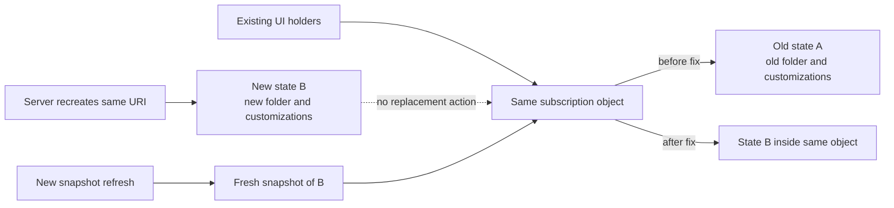
```mermaid
flowchart LR
    UI["Existing UI holders"] --> SUB["Same subscription object"]
    SUB -->|before fix| A["Old state A<br/>old folder and customizations"]
    SERVER["Server recreates same URI"] --> B["New state B<br/>new folder and customizations"]
    B -. "no replacement action" .-> SUB

    REFRESH["New snapshot refresh"] --> SNAP["Fresh snapshot of B"]
    SNAP --> SUB
    SUB -->|after fix| B2["State B inside same object"]
```

## 1. The pieces involved

### 1.1 A resource URI

The Agent Host exposes state through resource URIs. A session can have a URI such as:

```text
copilot:/provisional-session-123
```

That URI is the key used by both:

- the server's session state manager; and
- the client's `AgentSubscriptionManager`.

For the folder-change flow, the provisional backend session is deliberately recreated with the **same URI**. The mapping between the untitled chat and its backend session therefore stays stable.

Source: [`AgentHostUntitledProvisionalSessionService._changeWorkingDirectory`](src/vs/workbench/contrib/chat/browser/agentSessions/agentHost/agentHostUntitledProvisionalSessionService.ts).

### 1.2 Server state

The server stores the authoritative state for each session. A simplified session state looks like:

```ts
{
	provider: 'copilot',
	workingDirectories: ['file:///workspace-a'],
	customizations: [
		{ type: 'plugin', uri: 'file:///workspace-a/.github/plugin' }
	]
}
```

When a provisional session is created, the server computes its initial customizations and assigns them directly to `state.customizations`.

This direct assignment is intentional: the first subscriber should receive one complete initial snapshot instead of receiving an incomplete snapshot followed by a customization action.

Source: [`AgentService.createSession`](src/vs/platform/agentHost/node/agentService.ts), especially the initial customization seeding immediately after `AgentHostStateManager.createSession`.

### 1.3 A snapshot

A snapshot is a complete copy of a resource's state at a particular server sequence number:

```ts
{
	resource: 'copilot:/provisional-session-123',
	state: { /* complete SessionState */ },
	fromSeq: 10
}
```

`fromSeq: 10` means:

- the snapshot already includes server actions through sequence 10; and
- the client should apply later envelopes only when `serverSeq > 10`.

The server records the current sequence number when it creates the snapshot.

Source: [`AgentHostStateManager.getSnapshot`](src/vs/platform/agentHost/node/agentHostStateManager.ts).

### 1.4 An action envelope

A snapshot is the complete starting point. After that, the server normally sends incremental changes as action envelopes.

Example:

```ts
{
	channel: 'copilot:/provisional-session-123',
	serverSeq: 11,
	action: {
		type: 'session/titleChanged',
		title: 'New title'
	}
}
```

The envelope says:

- which resource changed (`channel`);
- what changed (`action`);
- where the action sits in server order (`serverSeq`); and
- optionally which client action caused it (`origin`).

### 1.5 A reducer

A reducer is a function that applies one action to one state and returns the next state.

Conceptually:

```text
nextState = reducer(currentState, action)
```

For a session subscription, `sessionReducer` applies session actions. Other subscription types use their corresponding reducers.

### 1.6 A client subscription

An `IAgentSubscription<T>` is the client's live, read-only view of one server resource.

It exposes:

| Property or event | Meaning |
| --- | --- |
| `value` | What consumers should display now. It can include optimistic local actions. |
| `verifiedValue` | The last server-confirmed state only. |
| `onDidChange` | Fires when the value changes. |
| `onDidError` | Fires when the subscription enters an error state. |
| `onWillApplyAction` | Fires before a server envelope is applied. |
| `onDidApplyAction` | Fires after a server envelope is applied. |

Source: [`IAgentSubscription`](src/vs/platform/agentHost/common/state/agentSubscription.ts).

The important distinction is:

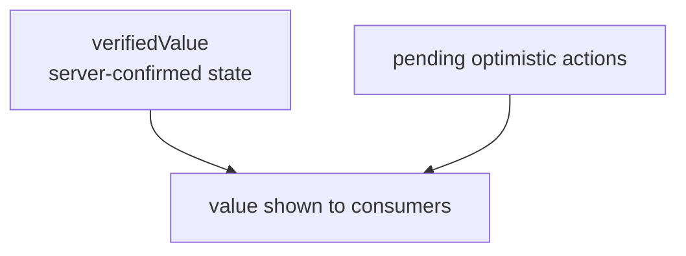
```mermaid
flowchart TD
    VERIFIED["verifiedValue<br/>server-confirmed state"] --> VALUE["value shown to consumers"]
    PENDING["pending optimistic actions"] --> VALUE
```

If there are no optimistic actions, `value` falls through to `verifiedValue`.

### 1.7 A managed subscription entry

`AgentSubscriptionManager` keeps one entry per resource URI:

```ts
type ManagedSubscriptionEntry = {
	sub: ManagedSubscription;
	kind: StateComponents;
	refCount: number;
	holders: Map<number, string>;
};
```

The fields mean:

| Field | Meaning |
| --- | --- |
| `sub` | The live subscription object. |
| `kind` | Session, Chat, Terminal, Changeset, or Annotations. |
| `refCount` | How many references currently keep it alive. |
| `holders` | Names of the components holding those references. |

The manager is intentionally reference counted:

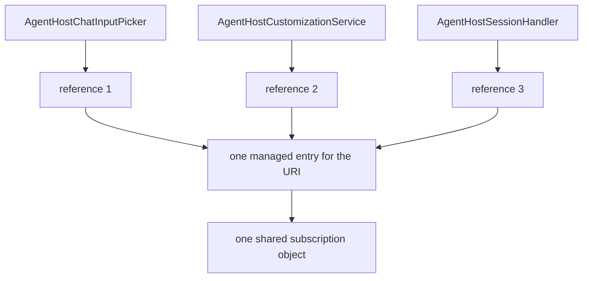
```mermaid
flowchart TD
    PICKER["AgentHostChatInputPicker"] --> REF1["reference 1"]
    CUSTOM["AgentHostCustomizationService"] --> REF2["reference 2"]
    HANDLER["AgentHostSessionHandler"] --> REF3["reference 3"]
    REF1 --> ENTRY["one managed entry for the URI"]
    REF2 --> ENTRY
    REF3 --> ENTRY
    ENTRY --> SUB["one shared subscription object"]
```

This sharing is useful because the server needs only one subscription for a resource even when several UI components consume it.

It is also why simply creating a second client subscription is not a good fix: existing holders would still point at the first object.

## 2. Normal subscription behavior before any folder change

The normal first-acquire path is `AgentSubscriptionManager.getSubscription`.

### 2.1 First holder

When no entry exists for a URI:

1. The manager creates a typed subscription object.
2. It stores the object in `_subscriptions`.
3. The object's `value` is initially `undefined`.
4. The manager sends a `subscribe` request.
5. The server returns a snapshot.
6. `handleSnapshot` installs the state.
7. `onDidChange` fires.

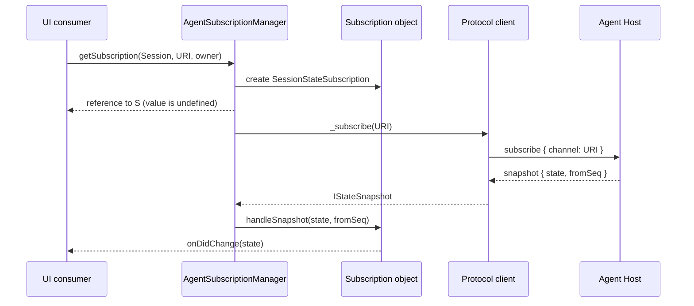
```mermaid
sequenceDiagram
    participant UI as UI consumer
    participant M as AgentSubscriptionManager
    participant S as Subscription object
    participant C as Protocol client
    participant H as Agent Host

    UI->>M: getSubscription(Session, URI, owner)
    M->>S: create SessionStateSubscription
    M-->>UI: reference to S (value is undefined)
    M->>C: _subscribe(URI)
    C->>H: subscribe { channel: URI }
    H-->>C: snapshot { state, fromSeq }
    C-->>M: IStateSnapshot
    M->>S: handleSnapshot(state, fromSeq)
    S-->>UI: onDidChange(state)
```

### 2.2 Additional holders

When the same URI is requested again:

1. The manager finds the existing entry.
2. It increments `refCount`.
3. It returns another reference to the same `entry.sub`.
4. It does not create another subscription or fetch another initial snapshot.

This is the exact behavior that later exposed the bug: URI equality correctly preserved the shared object, but the object's state was no longer the state of the newly recreated server session.

### 2.3 Normal incremental updates

The protocol client forwards every action envelope to the manager:

```ts
this.onDidAction(envelope => {
	this._subscriptionManager.receiveEnvelope(envelope);
});
```

The manager gives the envelope to all live subscription objects. Each subscription checks whether the envelope belongs to it.

For an initialized subscription:

1. `_isRelevantEnvelope` checks the action type and channel.
2. `_reconcile` applies the reducer.
3. `onDidChange` fires.

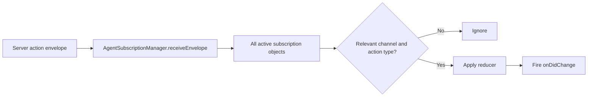
```mermaid
flowchart LR
    ENV["Server action envelope"] --> MANAGER["AgentSubscriptionManager.receiveEnvelope"]
    MANAGER --> ALL["All active subscription objects"]
    ALL --> FILTER{"Relevant channel and action type?"}
    FILTER -->|No| DROP["Ignore"]
    FILTER -->|Yes| REDUCER["Apply reducer"]
    REDUCER --> EVENT["Fire onDidChange"]
```

### 2.4 Optimistic state

Session and Chat subscriptions support write-ahead, or optimistic, updates.

Example: the user renames a session.

1. The client applies the rename immediately.
2. The action is stored in `_pendingActions` with a `clientSeq`.
3. `value` shows the optimistic title.
4. The action is sent to the server.
5. The server echoes the action in an envelope.
6. `_reconcile` matches the `clientSeq`, commits the action to confirmed state, and removes it from pending state.

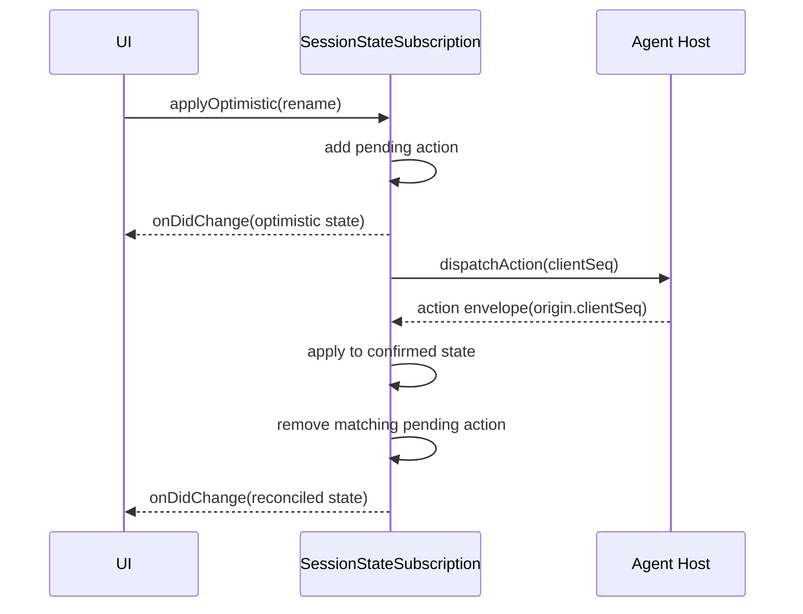
```mermaid
sequenceDiagram
    participant UI
    participant SUB as SessionStateSubscription
    participant HOST as Agent Host

    UI->>SUB: applyOptimistic(rename)
    SUB->>SUB: add pending action
    SUB-->>UI: onDidChange(optimistic state)
    SUB->>HOST: dispatchAction(clientSeq)
    HOST-->>SUB: action envelope(origin.clientSeq)
    SUB->>SUB: apply to confirmed state
    SUB->>SUB: remove matching pending action
    SUB-->>UI: onDidChange(reconciled state)
```

## 3. The folder-change flow

The affected UI is an untitled chat before its first message has been sent. The backend session is provisional.

The folder-change code does this:

1. Read the existing provisional entry.
2. Dispose its backend session.
3. Call `createSession` with:
   - the new working directory; and
   - `session: entry.backendSession`.
4. Because `entry.backendSession` is reused, the new server session has the same URI.

Source: [`AgentHostUntitledProvisionalSessionService._changeWorkingDirectory`](src/vs/workbench/contrib/chat/browser/agentSessions/agentHost/agentHostUntitledProvisionalSessionService.ts).

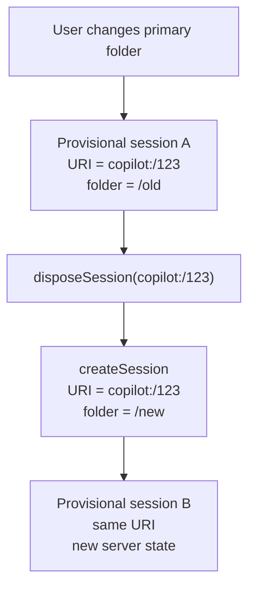
```mermaid
flowchart TD
    START["User changes primary folder"] --> OLD["Provisional session A<br/>URI = copilot:/123<br/>folder = /old"]
    OLD --> DISPOSE["disposeSession(copilot:/123)"]
    DISPOSE --> CREATE["createSession<br/>URI = copilot:/123<br/>folder = /new"]
    CREATE --> NEW["Provisional session B<br/>same URI<br/>new server state"]
```

## 4. Why the old code failed

### 4.1 The client had state A

Before the folder change, the managed client entry looked conceptually like:

```text
_subscriptions['copilot:/123'] = {
    sub: SubscriptionObjectX,
    refCount: 3
}

SubscriptionObjectX.verifiedValue = StateA
```

`StateA` contained the old working directory and old customization discovery result.

### 4.2 The server replaced A with B

The server deleted session A and then created session B under the same URI.

Session B contained:

```text
workingDirectories = ['/new']
customizations = customizations discovered for /new
```

The server seeded `state.customizations` directly while building B. It did not emit a `SessionCustomizationsChanged` action for this initial state.

That is correct for a new subscriber: the subscriber should receive B in its initial snapshot.

### 4.3 No new client subscribe occurred

Before this fix, `RemoteAgentHostProtocolClient.createSession` ended with:

```ts
}).then(() => session);
```

The promise resolved after the server's `createSession` request completed. It did not ask the subscription manager to refetch state.

The existing subscription object therefore stayed at A.

### 4.4 Same URI did not mean same server object

This is the central identity mismatch:

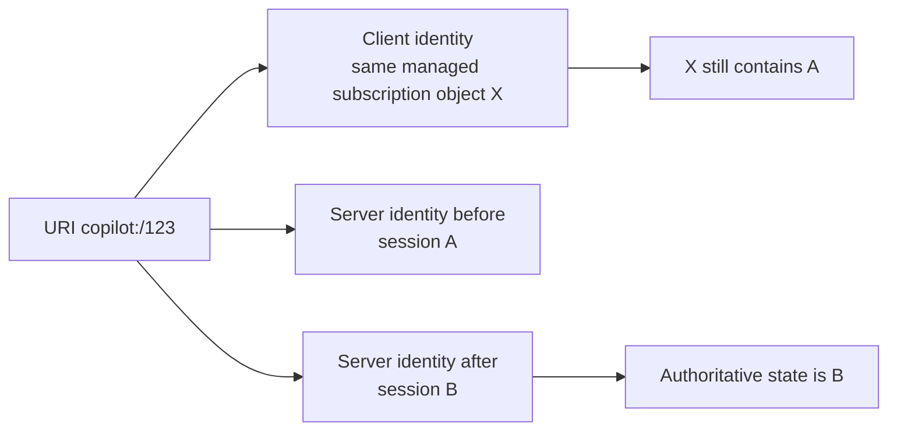
```mermaid
flowchart LR
    URI["URI copilot:/123"]
    URI --> CLIENT["Client identity<br/>same managed subscription object X"]
    URI --> SERVER_A["Server identity before<br/>session A"]
    URI --> SERVER_B["Server identity after<br/>session B"]

    CLIENT --> STALE["X still contains A"]
    SERVER_B --> FRESH["Authoritative state is B"]
```

The client manager uses URI identity because that is normally correct. The unusual part of this flow is that the server resource behind the URI was destroyed and recreated while the client object remained alive.

### 4.5 Why some fields appeared to update

The issue reported that Git metadata updated while customizations did not.

This difference follows from how the fields are published:

- Initial customizations are assigned directly to the new session state.
- Git state is refreshed asynchronously.
- `AgentHostGitStateService` calls `AgentHostStateManager.setSessionMeta`.
- `setSessionMeta` dispatches `SessionMetaChanged`.
- That action is broadcast as an envelope to live subscribers.

The old client subscription could therefore receive a later Git metadata envelope even though it never received B's replacement snapshot.

This created a mixed client view:

```text
old base snapshot A
    + later Git metadata action from B
    = partially updated but still stale client state
```

Sources:

- [`AgentService.subscribe`](src/vs/platform/agentHost/node/agentService.ts)
- [`AgentHostGitStateService.refreshSessionGitState`](src/vs/platform/agentHost/node/agentHostGitStateService.ts)
- [`AgentHostStateManager.setSessionMeta`](src/vs/platform/agentHost/node/agentHostStateManager.ts)

### 4.6 Old failing sequence

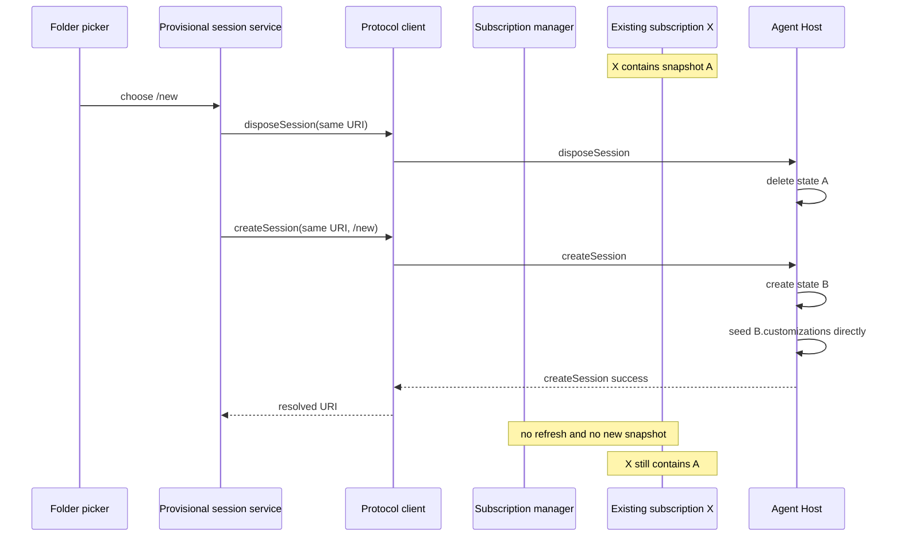
```mermaid
sequenceDiagram
    participant UI as Folder picker
    participant PS as Provisional session service
    participant C as Protocol client
    participant M as Subscription manager
    participant X as Existing subscription X
    participant H as Agent Host

    Note over X: X contains snapshot A
    UI->>PS: choose /new
    PS->>C: disposeSession(same URI)
    C->>H: disposeSession
    H->>H: delete state A
    PS->>C: createSession(same URI, /new)
    C->>H: createSession
    H->>H: create state B
    H->>H: seed B.customizations directly
    H-->>C: createSession success
    C-->>PS: resolved URI
    Note over M,X: no refresh and no new snapshot
    Note over X: X still contains A
```

## 5. The new fix at a glance

The client now treats successful same-URI creation as a possible replacement of the server resource.

`RemoteAgentHostProtocolClient.createSession` now waits for:

```ts
await this._subscriptionManager.refreshSubscription(session);
```

before its returned and tracked promise resolves.

The refresh:

1. Does nothing if there is no initialized subscription to refresh.
2. Serializes refreshes for the same URI.
3. Marks the live subscription as refreshing.
4. Fetches a fresh snapshot through the existing `subscribe` request.
5. Verifies the managed entry is still the same entry.
6. Clears stale optimistic actions when required.
7. Installs the fresh snapshot in the same subscription object.
8. Replays only envelopes newer than the snapshot.
9. Notifies existing consumers.

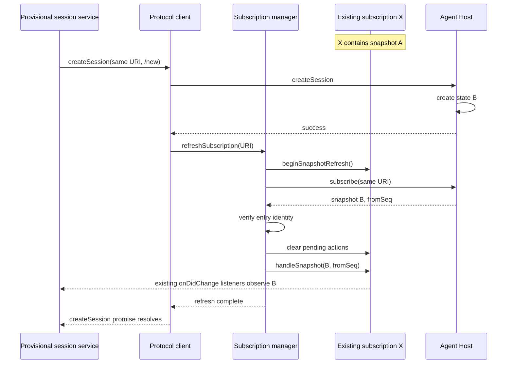
```mermaid
sequenceDiagram
    participant PS as Provisional session service
    participant C as Protocol client
    participant M as Subscription manager
    participant X as Existing subscription X
    participant H as Agent Host

    Note over X: X contains snapshot A
    PS->>C: createSession(same URI, /new)
    C->>H: createSession
    H->>H: create state B
    H-->>C: success
    C->>M: refreshSubscription(URI)
    M->>X: beginSnapshotRefresh()
    M->>H: subscribe(same URI)
    H-->>M: snapshot B, fromSeq
    M->>M: verify entry identity
    M->>X: clear pending actions
    M->>X: handleSnapshot(B, fromSeq)
    X-->>PS: existing onDidChange listeners observe B
    M-->>C: refresh complete
    C-->>PS: createSession promise resolves
```

## 6. Exact method-by-method explanation

## 6.1 `BaseAgentSubscription`

`BaseAgentSubscription<T>` owns the mechanics common to Root, Session, Chat, Terminal, Changeset, and Annotations subscriptions.

### `_confirmedState`

```ts
protected _confirmedState: T | undefined;
```

This is the latest state accepted from the server after applying accepted server envelopes.

### `_error`

```ts
private _error: Error | undefined;
```

When present, `value` returns this error instead of state.

### `_bufferedEnvelopes`

```ts
private _bufferedEnvelopes: ActionEnvelope[] | undefined;
```

This existed before the fix. It originally protected initial subscription hydration:

- an action can arrive before the first snapshot;
- applying that action is impossible because no base state exists yet;
- the action is held until the snapshot arrives;
- only actions newer than `fromSeq` are replayed.

The fix reuses this established mechanism during a replacement snapshot refresh.

### `_isRefreshingSnapshot`

```ts
private _isRefreshingSnapshot = false;
```

This is new.

It distinguishes:

- normal initialized operation, where envelopes are applied immediately; from
- a refresh window, where envelopes must wait for the replacement snapshot.

Without this flag, an envelope could update A while the refresh request is in flight, then be lost when B overwrites A.

### `beginSnapshotRefresh()`

```ts
beginSnapshotRefresh(): void {
	this._isRefreshingSnapshot = true;
	this._bufferedEnvelopes ??= [];
}
```

This method:

1. switches the subscription into refresh mode; and
2. ensures there is an envelope buffer.

It does **not**:

- send a network request;
- replace state;
- fire a change event; or
- create a new subscription object.

It only changes how `receiveEnvelope` treats incoming actions during the upcoming request.

If VS Code displays a link such as `entry.sub.#sym:beginSnapshotRefresh`, `#sym:` is navigation metadata from the UI. The TypeScript call is the ordinary method call:

```ts
entry.sub.beginSnapshotRefresh();
```

There is no JavaScript private `#beginSnapshotRefresh` field.

### `cancelSnapshotRefresh()`

```ts
cancelSnapshotRefresh(): void {
	this._isRefreshingSnapshot = false;
	this._bufferedEnvelopes = undefined;
}
```

This is the failure path.

If the fresh `subscribe` request fails:

- stop buffering;
- discard envelopes captured during that failed refresh; and
- leave the old confirmed and optimistic state unchanged.

The buffer is discarded deliberately. Those envelopes may describe the new server session B, while the client still has base state A. Applying them to A could create a hybrid state.

### `receiveEnvelope(envelope)`

The relevant condition changed from:

```ts
if (this._confirmedState === undefined)
```

to:

```ts
if (this._confirmedState === undefined || this._isRefreshingSnapshot)
```

The two buffering cases are now:

| Case | Why buffering is needed |
| --- | --- |
| First snapshot has not arrived | There is no base state to reduce onto. |
| Replacement snapshot is in flight | The existing base is about to be replaced, so applying now could lose the action. |

Outside those cases, envelopes continue through normal reconciliation immediately.

### `handleSnapshot(state, fromSeq)`

```ts
handleSnapshot(state: T, fromSeq: number): void {
	this._confirmedState = state;
	this._error = undefined;
	this._isRefreshingSnapshot = false;
	this._onSnapshotApplied(fromSeq);
	this._onDidChange.fire(this.value as T);
}
```

The method now does five things in this order:

1. Replace `_confirmedState` with the snapshot state.
2. Clear a previous subscription error.
3. Leave refresh mode.
4. Replay buffered envelopes newer than `fromSeq`.
5. Notify consumers.

The order matters. Replaying after installing B means newer actions are reduced onto B, not A.

### `_onSnapshotApplied(fromSeq)`

This existing hook is the sequence fence:

```ts
if (envelope.serverSeq > fromSeq) {
	this._reconcile(envelope, isOwnAction);
}
```

Example:

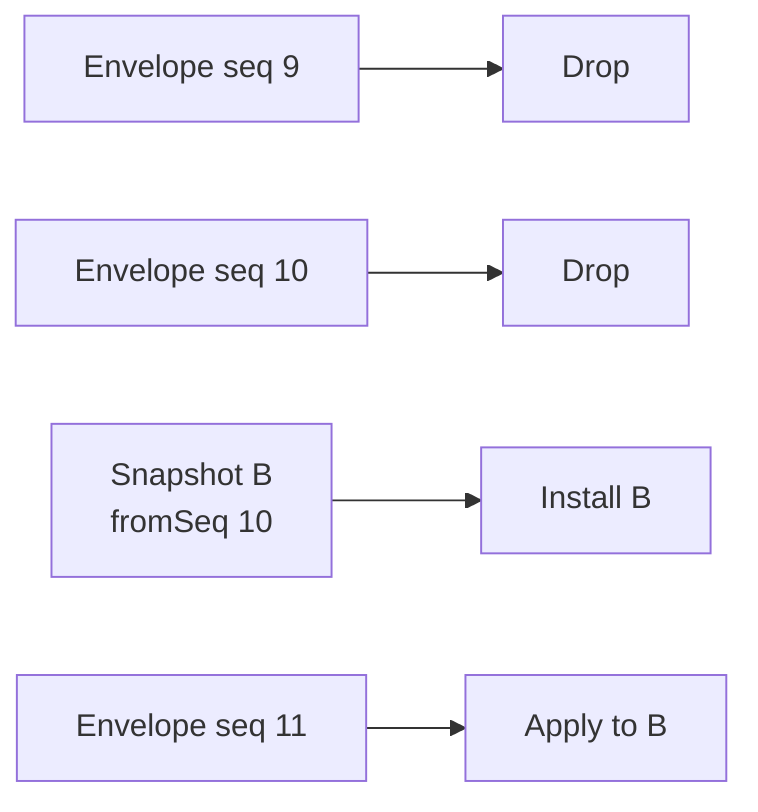
```mermaid
flowchart LR
    E9["Envelope seq 9"] --> DROP9["Drop"]
    E10["Envelope seq 10"] --> DROP10["Drop"]
    SNAP["Snapshot B<br/>fromSeq 10"] --> BASE["Install B"]
    E11["Envelope seq 11"] --> APPLY11["Apply to B"]
```

Sequence 9 and 10 are already represented in B. Reapplying them would double-apply actions. Sequence 11 happened after B was captured, so it must be applied.

## 6.2 `SessionStateSubscription`

The refresh uses several existing Session subscription behaviors.

### `clearPending()`

```ts
clearPending(): void {
	this._pendingActions.length = 0;
	this._optimisticState = undefined;
}
```

Pending optimistic actions were calculated against A. B is an authoritative replacement resource state.

Before B is installed, `_replaceSubscriptionSnapshot` clears:

- `_pendingActions`; and
- `_optimisticState`.

This prevents an old optimistic action from being automatically layered onto B.

The order is important:

```text
correct:   clear pending -> install B -> replay newer server envelopes
incorrect: install B -> reapply pending actions based on A -> clear later
```

### `_onSnapshotApplied(fromSeq)`

The Session override:

1. calls the base implementation to replay buffered server envelopes; then
2. recomputes optimistic state.

Because `_replaceSubscriptionSnapshot` cleared pending state first, recomputation falls through to the new confirmed state.

### `_reconcile(envelope, isOwnAction)`

Buffered envelopes are replayed through the same reconciliation path used during normal operation.

This preserves existing rules for:

- actions from this client;
- actions from other clients;
- accepted actions;
- rejected actions; and
- matching `clientSeq` values.

The refresh does not invent a second reducer path.

## 6.3 `AgentSubscriptionManager`

The manager coordinates subscription identity, references, network callbacks, refresh ordering, and replacement.

### `_subscriptionRefreshes`

```ts
private readonly _subscriptionRefreshes = new ResourceMap<Promise<void>>();
```

This map stores the current tail promise of the refresh queue for each URI.

It is a per-resource queue:

- refreshes for the same URI wait for each other;
- refreshes for different URIs can proceed independently.

### `refreshSubscription(resource)`

```ts
refreshSubscription(resource: URI): Promise<void>
```

This is the public orchestration method.

Its job is ordering, not network or state replacement.

For a URI:

1. Read the previous queued refresh promise.
2. Create a new promise.
3. Wait for the previous promise, if any.
4. Run `_refreshSubscription`.
5. Store the new promise as the queue tail.
6. Remove it from the map when it is still the current tail and has settled.

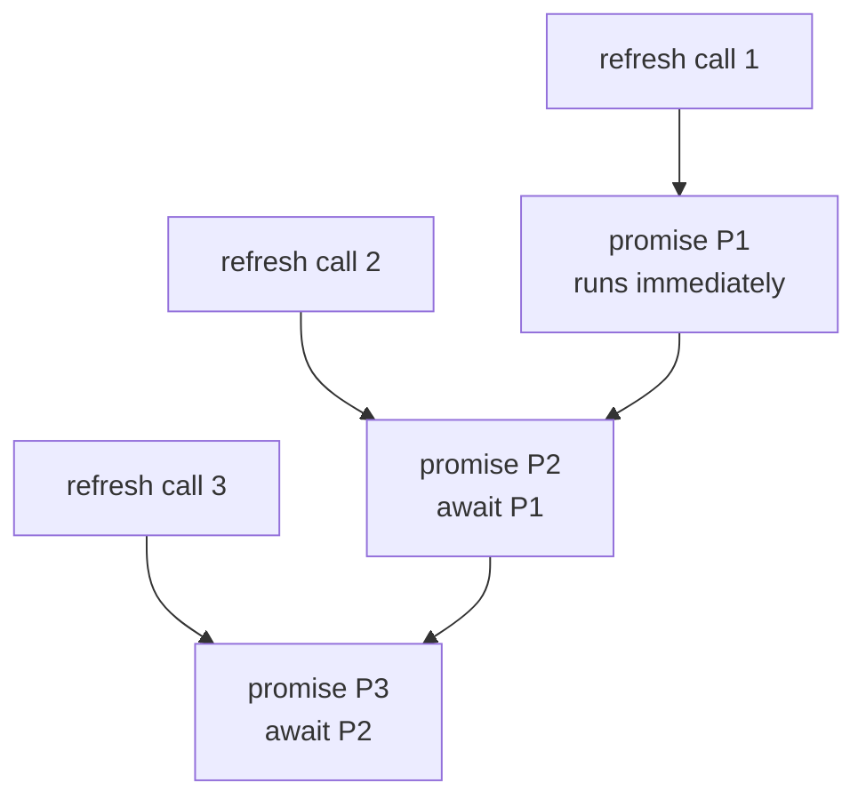
```mermaid
flowchart TD
    R1["refresh call 1"] --> P1["promise P1<br/>runs immediately"]
    R2["refresh call 2"] --> P2["promise P2<br/>await P1"]
    R3["refresh call 3"] --> P3["promise P3<br/>await P2"]
    P1 --> P2 --> P3
```

Why serialize instead of allowing parallel requests?

If two same-URI recreations overlap, two snapshot requests could return in the opposite order. Without serialization, an older snapshot could overwrite a newer one. Serial execution ensures each refresh fetches and applies its snapshot in call order.

### `_refreshSubscription(resource)`

This private method performs one refresh operation.

#### Step 1: read the current entry

```ts
const entry = this._subscriptions.get(resource);
```

The local `entry` variable is also an identity token. Later, the method checks that the map still contains this exact object.

#### Step 2: decide whether a refresh is needed

```ts
if (!entry || entry.sub.value === undefined) {
	return;
}
```

There are three important cases:

| State | Result | Reason |
| --- | --- | --- |
| No managed entry | No-op | Nobody is holding a client subscription that could be stale. |
| Entry exists but `value === undefined` | No-op | Its first snapshot is still pending and already waits for session creation. |
| Entry has state or an `Error` | Refresh | It has an installed/stale view or can recover from a previous failure. |

An errored subscription is refreshed because `Error !== undefined`. A successful `handleSnapshot` clears the error.

#### Step 3: begin buffering

```ts
entry.sub.beginSnapshotRefresh();
```

Relevant server envelopes now wait in the subscription instead of mutating A.

#### Step 4: fetch a snapshot

```ts
snapshot = await this._subscribe(resource);
```

`_subscribe` is injected by `RemoteAgentHostProtocolClient` as:

```ts
resource => this.subscribe(resource)
```

It uses the existing wire-level `subscribe` request. No protocol method was added.

The server's subscriber collection is a `Set`, so adding the same `clientId` again does not duplicate that ID. The server then returns its current snapshot.

#### Step 5a: handle request failure

If `_subscribe` throws and the same entry is still active:

1. call `cancelSnapshotRefresh`;
2. log the resource-specific failure; and
3. resolve the refresh method without throwing.

The successful `createSession` therefore remains successful even if this best-effort client refresh fails.

The previous client state remains available.

#### Step 5b: guard entry identity

```ts
if (this._subscriptions.get(resource) === entry)
```

The reference can be disposed while the network request is in flight. The last holder may remove the entry, and another caller may create a new entry for the same URI.

URI equality is not enough here. The code checks object identity:

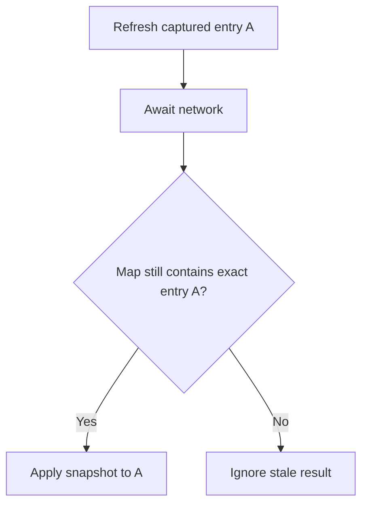
```mermaid
flowchart TD
    START["Refresh captured entry A"] --> WAIT["Await network"]
    WAIT --> CHECK{"Map still contains exact entry A?"}
    CHECK -->|Yes| APPLY["Apply snapshot to A"]
    CHECK -->|No| IGNORE["Ignore stale result"]
```

This prevents an old request from mutating a newly created replacement subscription object.

#### Step 6: replace the snapshot

The method calls:

```ts
this._replaceSubscriptionSnapshot(entry, snapshot.state, snapshot.fromSeq);
```

### `_deleteSubscriptionRefresh(resource, promise)`

This cleans the per-resource queue map after a refresh settles.

It deletes only when the supplied promise is still the current map value.

Example:

1. P1 is stored.
2. P2 is stored before P1 completes.
3. P1 completes.
4. P1 must not delete P2 from the map.
5. The identity check prevents that deletion.

### `_replaceSubscriptionSnapshot(entry, state, fromSeq)`

This helper performs the authoritative in-place replacement.

Despite the method name, it does **not** replace `entry.sub`.

It replaces the state held **inside** `entry.sub`.

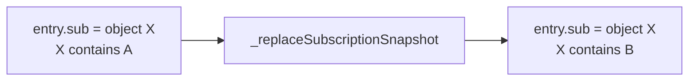
```mermaid
flowchart LR
    BEFORE["entry.sub = object X<br/>X contains A"] --> HELPER["_replaceSubscriptionSnapshot"]
    HELPER --> AFTER["entry.sub = object X<br/>X contains B"]
```

The method:

1. Clears pending optimistic actions for Session and Chat subscriptions.
2. Calls `entry.sub.handleSnapshot(state, fromSeq)`.

It is also used by `applyReconnectSnapshot`, so reconnect replacement and same-URI refresh use one ordering rule.

### `applyReconnectSnapshot(resource, state, fromSeq)`

This existing method handles a reconnect response that contains a fresh snapshot instead of replayable actions.

The change replaces duplicated inline logic with:

```ts
this._replaceSubscriptionSnapshot(entry, state, fromSeq);
```

This is a refactoring for consistency: both reconnect and explicit refresh now clear pending state before installing an authoritative snapshot.

### `dispose()`

The manager now also clears `_subscriptionRefreshes`.

This removes queue bookkeeping when the whole manager is disposed. The existing subscription disposal still handles the actual subscription objects.

## 6.4 `RemoteAgentHostProtocolClient.createSession`

Before the fix:

```ts
const promise = this._sendRequest('createSession', params)
	.then(() => session);
```

After the fix:

```ts
const promise = this._sendRequest('createSession', params)
	.then(async () => {
		await this._subscriptionManager.refreshSubscription(session);
		return session;
	});
```

This changes the meaning of successful completion:

| Before | After |
| --- | --- |
| Server creation request completed. | Server creation completed and any existing initialized client subscription attempted to refresh. |

The same composed promise is:

- stored by `trackSessionCreate`; and
- returned to the caller.

This matters because other code uses `getInflightSessionCreate` to wait for session creation. Direct callers and in-flight waiters now cross the same refresh boundary.

## 7. Complete successful data flow

Assume:

```text
URI = copilot:/123
State A:
    workingDirectories = ['/old']
    customizations = ['old-plugin']

State B:
    workingDirectories = ['/new']
    customizations = ['new-plugin']
```

### Before refresh

```text
server: B
client subscription object X: A
UI holders: X, X, X
```

### During refresh

```text
X._isRefreshingSnapshot = true
X._bufferedEnvelopes = []
subscribe request is in flight
```

### Snapshot response

```text
snapshot.state = B
snapshot.fromSeq = 10
```

### Replacement

```text
clear stale pending actions
X._confirmedState = B
replay buffered envelopes with serverSeq > 10
fire onDidChange
```

### After refresh

```text
server: B
client subscription object X: B
UI holders: X, X, X
```

No holder was replaced. Every holder observes B because every holder already points to X.

## 8. Why refresh-window buffering is necessary

Consider this timing:

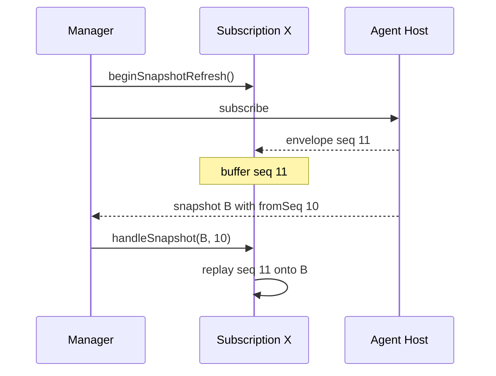
```mermaid
sequenceDiagram
    participant M as Manager
    participant X as Subscription X
    participant H as Agent Host

    M->>X: beginSnapshotRefresh()
    M->>H: subscribe
    H-->>X: envelope seq 11
    Note over X: buffer seq 11
    H-->>M: snapshot B with fromSeq 10
    M->>X: handleSnapshot(B, 10)
    X->>X: replay seq 11 onto B
```

Without buffering:

1. sequence 11 would be applied to A;
2. B would then overwrite A;
3. sequence 11 would disappear from client state.

With buffering:

1. sequence 11 waits;
2. B becomes the base;
3. sequence 11 is applied to B.

## 9. Why pending subscriptions are not refreshed

A subscription can be acquired while `createSession` is still in flight.

At that moment:

```text
entry exists
entry.sub.value === undefined
```

`getSubscription` already does this:

1. find the tracked create promise;
2. await it;
3. send the initial `subscribe` request.

If `refreshSubscription` also sent a request, the client could perform redundant subscribes and could create a wait cycle.

The new method therefore no-ops for `value === undefined`.

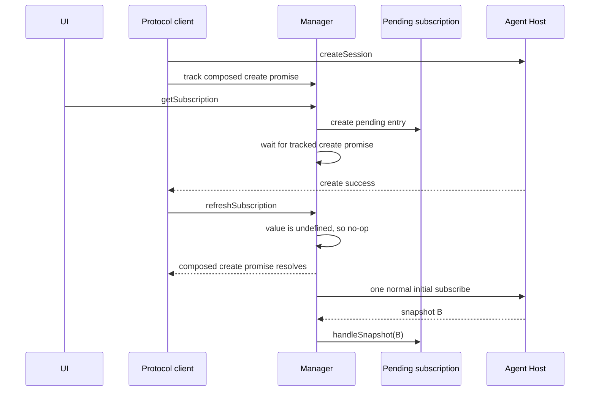
```mermaid
sequenceDiagram
    participant UI
    participant C as Protocol client
    participant M as Manager
    participant X as Pending subscription
    participant H as Agent Host

    C->>H: createSession
    C->>M: track composed create promise
    UI->>M: getSubscription
    M->>X: create pending entry
    M->>M: wait for tracked create promise
    H-->>C: create success
    C->>M: refreshSubscription
    M->>M: value is undefined, so no-op
    M-->>C: composed create promise resolves
    M->>H: one normal initial subscribe
    H-->>M: snapshot B
    M->>X: handleSnapshot(B)
```

The result is one post-create snapshot request, not two.

## 10. Concurrent refreshes

Rapid changes can trigger multiple same-URI recreations.

The per-resource promise queue gives this ordering:

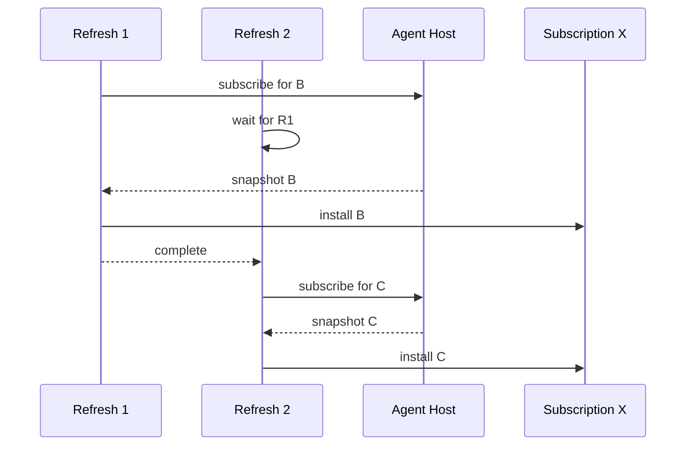
```mermaid
sequenceDiagram
    participant R1 as Refresh 1
    participant R2 as Refresh 2
    participant H as Agent Host
    participant X as Subscription X

    R1->>H: subscribe for B
    R2->>R2: wait for R1
    H-->>R1: snapshot B
    R1->>X: install B
    R1-->>R2: complete
    R2->>H: subscribe for C
    H-->>R2: snapshot C
    R2->>X: install C
```

The final state is C.

No older in-flight request can finish after the C request and overwrite C because the requests are not run in parallel for the same URI.

## 11. Failure behavior

There are two distinct failures.

### 11.1 `createSession` fails

The `.then` callback is not run. No refresh occurs. The original creation error is returned to the caller.

### 11.2 Creation succeeds but refresh `subscribe` fails

The manager:

- cancels refresh mode;
- drops refresh-window envelopes;
- logs a warning;
- retains the old state; and
- resolves the refresh promise.

The outer `createSession` promise still resolves because the server successfully created the session.

This is a best-effort fallback. It avoids reporting that session creation failed when only the client refresh failed.

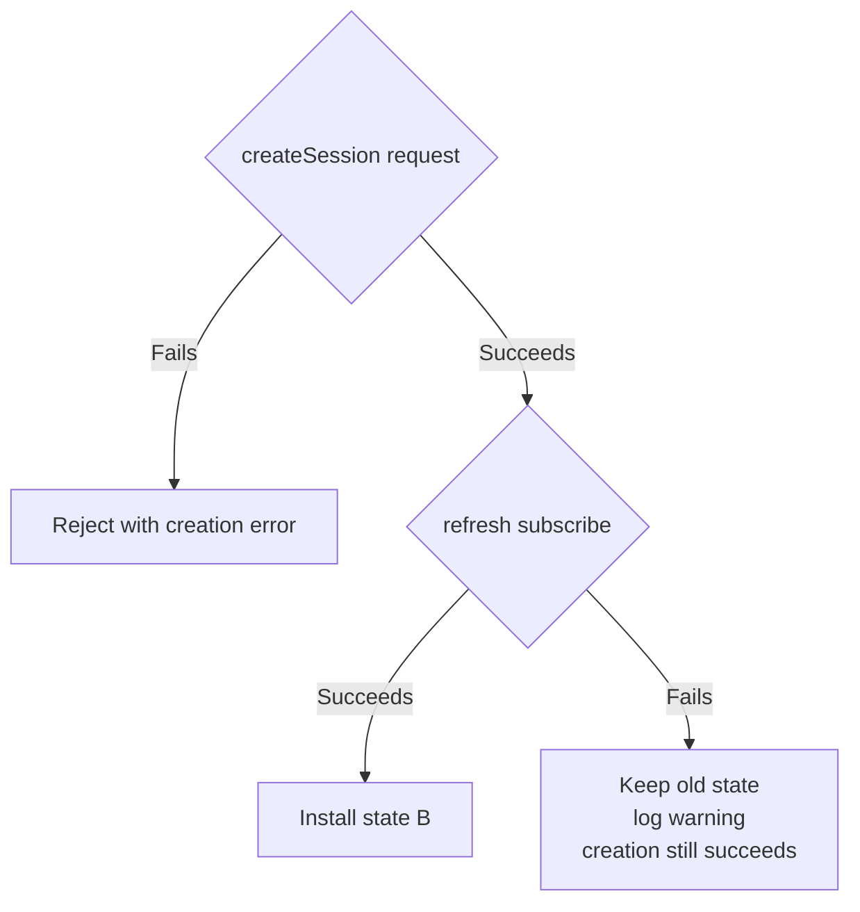
```mermaid
flowchart TD
    CREATE{"createSession request"}
    CREATE -->|Fails| ERROR["Reject with creation error"]
    CREATE -->|Succeeds| REFRESH{"refresh subscribe"}
    REFRESH -->|Succeeds| B["Install state B"]
    REFRESH -->|Fails| OLD["Keep old state<br/>log warning<br/>creation still succeeds"]
```

## 12. Object identity: what changes and what does not

| Item | Before refresh | After refresh |
| --- | --- | --- |
| Resource URI | `copilot:/123` | `copilot:/123` |
| Managed entry object | Entry X | Entry X |
| Subscription object | Subscription X | Subscription X |
| Reference holders | Existing holders | Same holders |
| `refCount` | N | N |
| Confirmed state | A | B plus newer envelopes |
| Previous error | Possible | Cleared on successful snapshot |
| Pending Session/Chat actions | Possible | Cleared before authoritative replacement |
| Change event | Not fired by recreation alone | Fired by `handleSnapshot` and replay |

The core fix can be summarized as:

```text
preserve the container; replace the contents
```

## 13. Scope and non-goals

### The refresh targets one resource

`createSession` refreshes the Session URI passed to it.

It does not automatically refresh:

- Chat subscriptions;
- Changeset subscriptions;
- Annotations subscriptions; or
- the Root subscription.

This issue concerns a pre-first-send provisional session. Its default chat has no conversation history to replace, and effective working directory/customization context comes from the Session state.

### No protocol change

The fix reuses:

```text
subscribe { channel: existing URI }
```

There is no new request type or payload field.

### No old Git metadata merge

The replacement snapshot is authoritative. Old `_meta.git` belongs to the old folder and is not copied into B. The server's existing asynchronous Git refresh can publish the correct new metadata afterward.

## 14. State machine

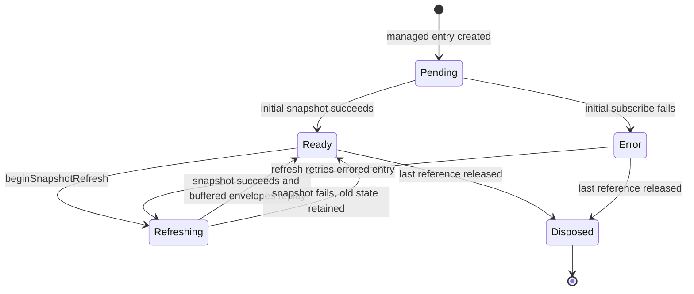
```mermaid
stateDiagram-v2
    [*] --> Pending: managed entry created
    Pending --> Ready: initial snapshot succeeds
    Pending --> Error: initial subscribe fails
    Ready --> Refreshing: beginSnapshotRefresh
    Error --> Refreshing: refresh retries errored entry
    Refreshing --> Ready: snapshot succeeds and buffered envelopes replay
    Refreshing --> Ready: snapshot fails, old state retained
    Ready --> Disposed: last reference released
    Error --> Disposed: last reference released
    Disposed --> [*]
```

`Refreshing` is represented by `_isRefreshingSnapshot`. It is not exposed as a public `IActiveSubscriptionInfo.status`; externally, the subscription continues to hold its previous value until replacement succeeds.

## 15. Tests that pin the behavior

The manager tests cover:

- no refresh without an initialized subscription;
- in-place refresh with multiple holders;
- `fromSeq` fencing and replay;
- failure preserving old state;
- error recovery;
- same-URI refresh serialization;
- ignoring a stale result after entry replacement; and
- not mutating a separate Chat subscription.

Source: [`agentSubscription.test.ts`](src/vs/platform/agentHost/test/common/agentSubscription.test.ts).

The protocol-client tests cover:

- creation waiting for snapshot B;
- returned and tracked create promise identity;
- no duplicate subscribe for a subscription acquired during creation;
- refresh failure not rejecting successful creation; and
- overlapping creates using serialized refreshes.

Source: [`remoteAgentHostProtocolClient.test.ts`](src/vs/platform/agentHost/test/electron-browser/remoteAgentHostProtocolClient.test.ts).

The two targeted suites pass:

```text
128 passing
```

## 16. Short answers to the method-name questions

### What does `refreshSubscription` do?

It serializes refresh requests for one URI and returns the promise representing this refresh's place in that queue.

It does not directly send the request or replace state.

### What does `_refreshSubscription` do?

It performs one refresh:

1. find the active entry;
2. skip absent or pending entries;
3. begin envelope buffering;
4. fetch a fresh snapshot;
5. cancel safely on failure;
6. verify entry identity; and
7. replace the state in place.

### What does `entry.sub.beginSnapshotRefresh()` do?

It tells the existing subscription object to buffer relevant incoming envelopes until the fresh snapshot arrives.

It does not create a subscription or make a network call.

### What does `_replaceSubscriptionSnapshot` do?

It clears stale optimistic Session/Chat state, then calls `handleSnapshot` on the existing subscription object.

That installs the new confirmed state, replays newer buffered envelopes, clears errors, and notifies existing consumers.

### Why not dispose and recreate the client subscription?

Because multiple components already hold references to the existing object. Replacing the object would leave those holders pointing at the stale object.

Updating the existing object lets every holder observe the fix through the existing `onDidChange` event.

## 17. One-sentence root cause and fix

**Root cause:** the server recreated a provisional session behind the same URI, but the client preserved its URI-keyed subscription object and never fetched the recreated session's initial snapshot.

**Fix:** after successful session creation, refetch the snapshot and install it into that same subscription object while safely buffering concurrent action envelopes.
