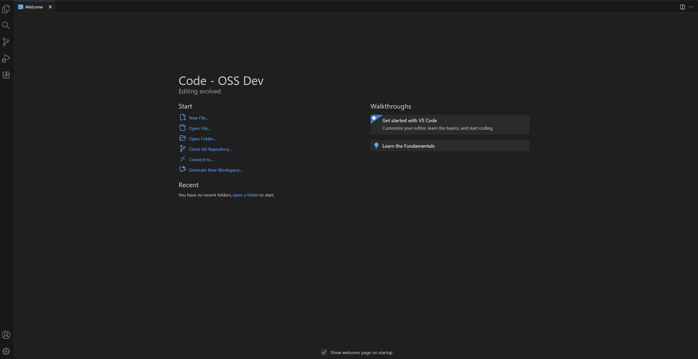

# Inline Completions Sample

This sample demonstrates usage of the inline completions API.
It also demonstrates some proposed API of the inline completions feature that is not yet finalized.

## Running the Sample

- Run `npm install` in terminal to install dependencies
- A `postinstall` script would download latest version of `vscode.proposed.*.d.ts`
- Run the `Run Extension` target in the Debug View. This will:
	- Start a task `npm: watch` to compile the code
	- Run the extension in a new VS Code window
