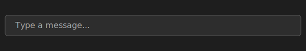

# Visual Studio Code

## Overview
Visual Studio Code is a lightweight yet powerful source code editor built with web technologies. It now includes an integrated chat bar to help you explore and modify code using natural language.

## Features
- Syntax highlighting and IntelliSense for many languages
- Debugging for Node.js, JavaScript, and TypeScript
- Integrated Git support
- Extensive extension marketplace
- Customizable themes and settings
- Built-in chat assistance

## Setup
1. **Install dependencies**
   ```
   npm install
   ```
2. **Set environment variables**
   - `OPENAI_API_KEY` for local desktop builds
   - `VITE_OPENAI_API_KEY` for web builds (if applicable)
   
   For troubleshooting environment configuration, see [chat debugging guidance](docs/chat/debugging.md).
3. **Compile and watch for changes**
   ```
   npm run watch
   ```
4. **Launch the editor**
   - Desktop:
     ```
     npm run start
     ```
   - Browser:
     ```
     npm run web
     ```

## Chat Usage
Use the chat bar at the bottom of the editor to ask questions, run commands, or get code suggestions.



### Verify chat
Run the chat-focused unit tests to confirm the integration works:
- `node --test src/chat/test/promptProcessor.test.ts`
- `node --test src/services/openai/client.test.ts`

## Manual Test
1. Open the chat view from the Activity Bar.
2. Ask **"Summarize open file"**.
3. Ensure the assistant responds with a summary of the active file.
4. If something goes wrong, please file an issue with logs and reproduction steps.

## Future Work
Planned enhancements include:
- Slash commands for quick actions
- Multi-file summarization
- Plug-in API for custom chat providers
