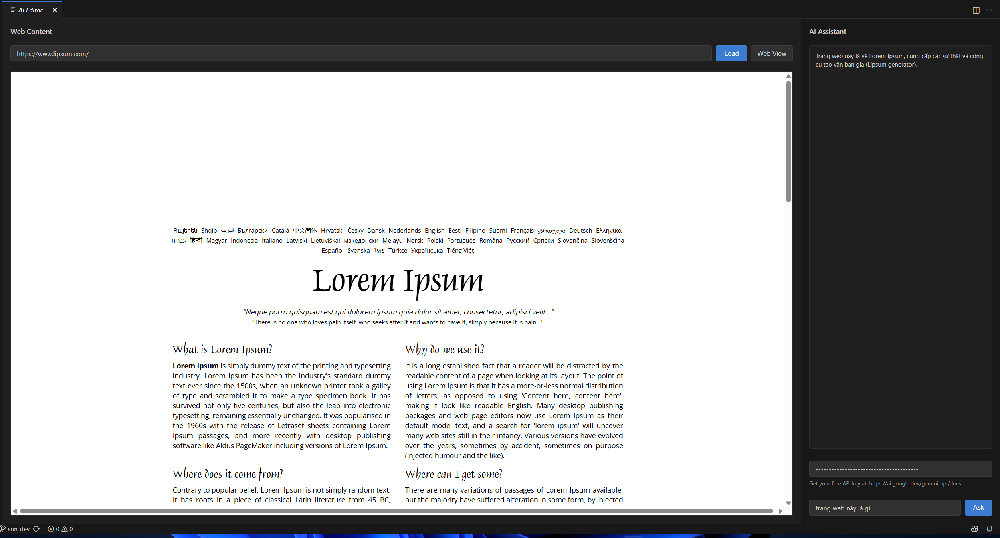

# VSCode AI App - Browser and Chat Integration

This is a modified version of VSCode that replaces the main editor area with an AI-powered web browser and chat interface. The application allows users to browse websites and ask questions about the content using an AI assistant.

## Features

- **Embedded Browser (80% width)**: Load and view websites with a URL input field
- **AI Chat Interface (20% width)**: Ask questions about website content using OpenAI's API
- **Seamless Integration**: The chat interface automatically analyzes the current website content
- **Modern UI**: Clean, responsive design that matches VSCode's theme

## Screenshots

### Main Interface

*The main interface showing the browser on the left (80%) and chat interface on the right (20%)*

### URL Input

*Enter any website URL to load it in the embedded browser*

### AI Chat

*Ask questions about the website content using the AI chat interface*

### API Key Configuration

*Configure your OpenAI API key to enable AI functionality*

## Setup Instructions

### Prerequisites

1. **Node.js**: Version 18 or higher
2. **Visual Studio Build Tools**: Required for native dependencies on Windows
3. **Git**: For cloning and version control
4. **OpenAI API Key**: For AI chat functionality

### Installation

1. **Clone the repository**:
   ```bash
   git clone <repository-url>
   cd vscode-ai-app
   ```

2. **Install dependencies**:
   ```bash
   npm install
   ```
   
   **Note**: On Windows, you may need to install Visual Studio Build Tools if you encounter build errors. Download from: https://visualstudio.microsoft.com/downloads/

3. **Compile the project**:
   ```bash
   npm run compile
   ```

4. **Run the application**:
   ```bash
   npm run watch
   ```
   
   Or for development:
   ```bash
   npm run watch-client
   ```

### Configuration

1. **OpenAI API Key**: 
   - Get your API key from https://platform.openai.com/api-keys
   - Enter it in the API Key field in the chat interface
   - The key is stored securely in VSCode's user settings

2. **Browser Settings**:
   - The browser supports most modern websites
   - Some websites may have CORS restrictions
   - HTTPS is recommended for security

## Usage

1. **Load a Website**:
   - Enter a URL in the address bar (e.g., https://vnexpress.net)
   - Click "Go" or press Enter
   - The website will load in the embedded browser

2. **Ask Questions**:
   - Type your question in the chat input
   - Press Ctrl+Enter or click "Send"
   - The AI will analyze the website content and respond

3. **Example Questions**:
   - "What is this website about?"
   - "Summarize the main content"
   - "What are the key features mentioned?"
   - "Translate this content to English"

## Technical Details

### Architecture

- **BrowserComponent**: Handles web content loading and display
- **ChatboxComponent**: Manages AI chat interface and API communication
- **AIAppComponent**: Orchestrates the layout and communication between components
- **EditorPart**: Modified to use AIAppComponent instead of traditional editor grid

### File Structure

```
src/vs/workbench/contrib/aiApp/
├── browser/
│   ├── aiAppComponent.ts      # Main container component
│   ├── browserComponent.ts    # Web browser functionality
│   ├── chatboxComponent.ts    # AI chat interface
│   └── index.ts              # Exports
```

### Key Features

- **Responsive Layout**: 80/20 split between browser and chat
- **Theme Integration**: Uses VSCode's theme variables
- **Error Handling**: Graceful error handling for network issues
- **Security**: Sandboxed iframe for web content
- **API Integration**: OpenAI GPT-3.5-turbo for chat responses

## Development

### Building

```bash
# Compile TypeScript
npm run compile

# Watch for changes
npm run watch

# Run tests
npm test
```

### Contributing

1. Fork the repository
2. Create a feature branch
3. Make your changes
4. Test thoroughly
5. Submit a pull request

## Troubleshooting

### Common Issues

1. **Build Errors on Windows**:
   - Install Visual Studio Build Tools
   - Ensure Python is installed
   - Run as Administrator if needed

2. **API Key Issues**:
   - Verify the API key is correct
   - Check your OpenAI account has credits
   - Ensure network connectivity

3. **Website Loading Issues**:
   - Check if the website allows iframe embedding
   - Try HTTPS instead of HTTP
   - Some websites block iframe embedding for security

### Getting Help

- Check the GitHub Issues page
- Review the VSCode documentation
- Contact the maintainers

## License

This project is based on VSCode and follows the same MIT License. See the original VSCode license for details.

## Acknowledgments

- Microsoft VSCode team for the excellent base
- OpenAI for the AI API
- The open-source community for various dependencies
