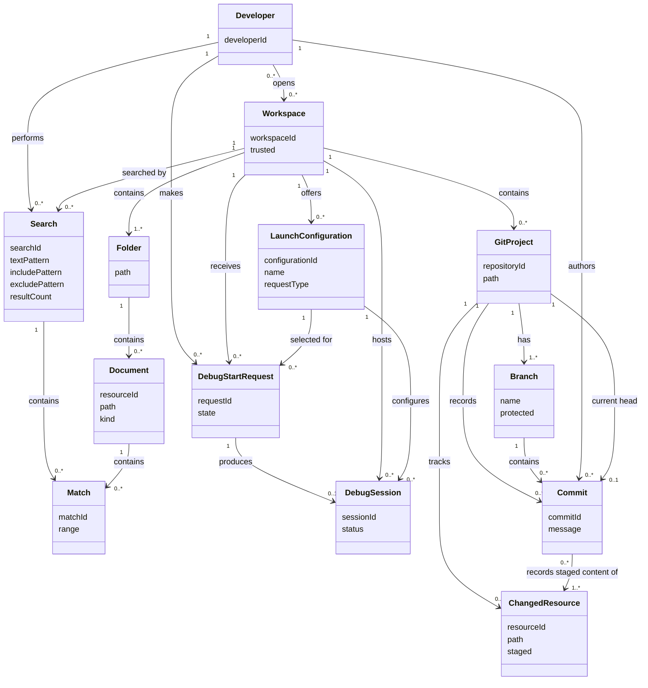
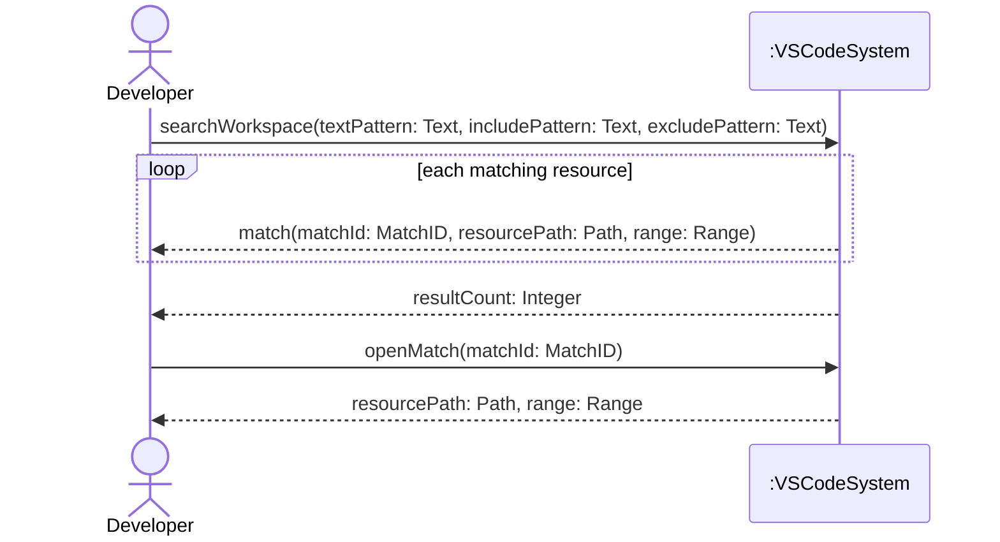
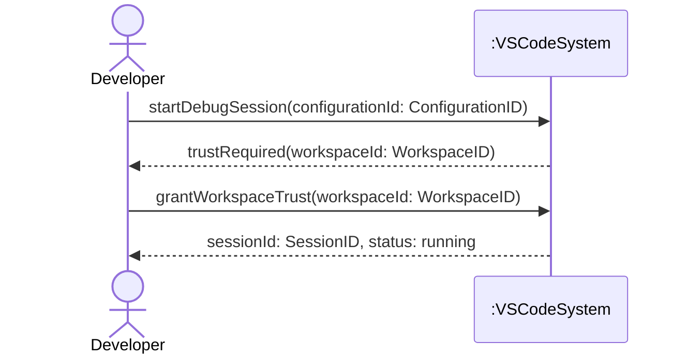
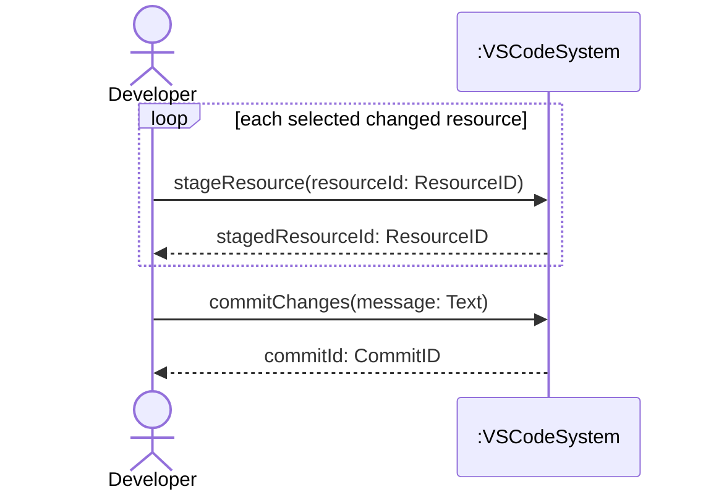

# SSDs and Operation Contracts

This page refines the three fully dressed use cases in [Requirements and Use Cases](https://github.com/bolanosmanny/vscode/blob/csci360-a2b-2026-09-24/docs/requirements-and-use-cases.md). The domain model and each SSD are also committed as editable Mermaid sources in `/docs`.

## 1. Noun phrase analysis

Repeated forms of the same concept are grouped in one row. “Step” refers to the main success scenario; extension references are marked “Ext.” A path, identifier, range, status, pattern, or message is a value of the class named in the decision column.

| Noun phrase | Found in | Decision | Why |
| --- | --- | --- | --- |
| Developer | All three, primary actor | Conceptual class `Developer` | Person who searches, debugs, and commits. |
| repository maintainer/reviewer | All three, stakeholders | Neither | Offstage stakeholder, not an entity whose state these use cases change. |
| workspace / open workspace | Search precondition, steps 3–4; Debug precondition, steps 2–3; Commit precondition | Conceptual class `Workspace` | Distinct collection of folders and project context. |
| workspace folder / search folder | Search steps 3–4, Ext. 3b | Conceptual class `Folder` | Distinct location belonging to a workspace. |
| folder path / missing path | Search Ext. 3b | Attribute `Folder.path` | Location value of a folder. |
| code / workspace file / open editor content / notebook content / matching resource | Search steps 4, 6–7 | Conceptual class `Document` | Searchable content with an identity and location; `kind` distinguishes file and notebook content. |
| resource path | Search steps 5–7 | Attribute `Document.path` | Location value of a document. |
| search / text query / valid query | Search steps 2–4 | Conceptual class `Search` | One search occurrence has criteria and results. |
| text pattern | Search steps 1–3, Ext. 3a | Attribute `Search.textPattern` | Search criterion expressed as text. |
| include pattern | Search step 2, Ext. 3a | Attribute `Search.includePattern` | Search criterion expressed as text. |
| exclude pattern | Search step 2, Ext. 3a | Attribute `Search.excludePattern` | Search criterion expressed as text. |
| search options / ignore-file behavior / maximum-results limit | Search steps 3, 5; special requirements | Neither | Configuration governing a search, outside the state changed by these operations. |
| file match / matching location / selected match | Search steps 4–7 | Conceptual class `Match` | Individually selectable result associated with a document. |
| selected range | Search step 7 | Attribute `Match.range` | Position within a matched document. |
| result count | Search step 5 | Attribute `Search.resultCount` | Number describing one search result set. |
| Search view / search input / result model / ARIA status / cancellation token | Search steps 1, 4–5, extensions, special requirements | Neither | Interface or implementation detail, not domain state. |
| validation error / “Search path not found” | Search extensions | Neither | Feedback for a failed attempt, not an entity in the successful domain state. |
| launch configuration / selected configuration / resolved configuration / compound | Debug steps 1, 5–6, Ext. 5a–5b | Conceptual class `LaunchConfiguration` | Named configuration selected for a debug run. |
| configuration name / configuration ID | Debug steps 1, 5 | Attribute `LaunchConfiguration.name` / `configurationId` | Values identifying the configuration. |
| debugger extension / debugger contribution / installed extension | Debug precondition, steps 4–6 | Neither | Software used to execute the use case. |
| workspace trust | Debug steps 2–3, special requirements | Attribute `Workspace.trusted` | State of the workspace. |
| debug start request | Implied by Debug steps 1–3 | Conceptual class `DebugStartRequest` | Retains the selected configuration while trust is requested. |
| debug session / active session / compound’s debug sessions | Debug steps 6–7, Ext. 3a and 5b | Conceptual class `DebugSession` | Distinct running or attached investigation. |
| session state / initializing state | Debug step 7, extensions | Attribute `DebugSession.status` for an actual session; otherwise neither | A session has status; temporary UI progress is not domain state. |
| program / program code / build task | Debug precondition, steps 2, 6 | Neither | Execution targets or steps; no separate state is needed by these contracts. |
| Run and Debug UI / Debug command / editors / notification service / `launch.json` | Debug steps 1, 4, 7, extensions | Neither | Interface, file format, or implementation mechanism. |
| Git repository / current repository / repository state | Commit precondition, steps 2, 7 | Conceptual class `GitProject` | A versioned project has its own identity, tracked resources, branches, and commits. |
| changed resource / selected resource / staged index resource / intended change | Commit steps 1–2, 5 | Conceptual class `ChangedResource` | Individually staged item tracked by a repository. |
| staged state | Commit steps 1–2, 5 | Attribute `ChangedResource.staged` | Whether that resource is in the staged set. |
| current branch / protected branch / new branch | Commit Ext. 4a | Conceptual class `Branch` | Distinct line of commits with a name and protection state. |
| branch name / branch-protection state | Commit Ext. 4a | Attribute `Branch.name` / `protected` | Values describing a branch. |
| commit / new commit / commit history | Commit steps 3, 5–6 | Conceptual class `Commit` | Durable record of a set of staged changes. |
| commit message / commit input | Commit steps 3–5, Ext. 3a | Attribute `Commit.message` for the message; otherwise neither | Message belongs to a commit; input is UI. |
| Git executable / Git extension / Git hook | Commit stakeholders, precondition, steps 2, 5–6, Ext. 5a | Neither | External software that performs or affects the action. |
| Git index / source-control groups | Commit steps 2, 5 | Neither | Implementation representation of staged state, modeled here by `ChangedResource.staged`. |
| Source Control view / diff editor / input template / prompt | Commit steps 1, 3–4, 7, extensions | Neither | Interface and presentation details. |
| Git user identity | Commit stakeholders, Ext. 5a | Neither | Git configuration required to execute the operation; no identity change is modeled. |

The earlier model contained `Developer`, `Workspace`, `Folder`, and `Document`, plus software-oriented `Extension` and `Command`. I kept the four domain concepts, removed the software-oriented concepts, and added `Search`, `Match`, `LaunchConfiguration`, `DebugStartRequest`, `DebugSession`, `GitProject`, `Branch`, `ChangedResource`, and `Commit`. I also added the attributes and associations needed to state the three contracts precisely. `DebugStartRequest` makes the pause for workspace trust explicit; without it, the later trust grant would have no modeled connection to the configuration selected earlier.

## Updated domain model

Editable source: [vscode-domain-model.mmd](https://github.com/bolanosmanny/vscode/blob/csci360-a2b-2026-09-24/docs/vscode-domain-model.mmd).

## 2. System sequence diagrams

Only the primary actor and VS Code as one black-box system appear. Dashed arrows are returned information. The repeated results and staging steps use loop boxes.

### Search Workspace

The search operation covers use case steps 1–5; `openMatch` covers steps 6–7. Source: [search-workspace-ssd.mmd](https://github.com/bolanosmanny/vscode/blob/csci360-a2b-2026-09-24/docs/search-workspace-ssd.mmd).

### Start Debug Session

The start request covers step 1; the system requests trust in step 2; the grant covers step 3; and the final return represents steps 4–7. Source: [start-debug-session-ssd.mmd](https://github.com/bolanosmanny/vscode/blob/csci360-a2b-2026-09-24/docs/start-debug-session-ssd.mmd).

### Commit Source Changes

Staging covers steps 1–2 and repeats for each selected resource. The commit request covers steps 3–7. Source: [commit-source-changes-ssd.mmd](https://github.com/bolanosmanny/vscode/blob/csci360-a2b-2026-09-24/docs/commit-source-changes-ssd.mmd).

## 3. Operation contracts

### Search Workspace

**Operation:** `searchWorkspace(textPattern: Text, includePattern: Text, excludePattern: Text)`  
**Cross-references:** Use case Search Workspace, main success steps 1–5.

**Preconditions:**

- A `Developer` has an open `Workspace` containing at least one `Folder`.
- `textPattern` is nonempty and all three supplied patterns are valid.

**Postconditions:**

- A `Search` instance was created.
- `Search.textPattern`, `Search.includePattern`, and `Search.excludePattern` were set to the supplied values.
- The `Search` was associated with the `Developer` and the open `Workspace`.
- For each reported location, a `Match` instance was created and `Match.range` was set to its location in a `Document`.
- Each `Match` was associated with the `Search` and its `Document`.
- `Search.resultCount` was set to the number of created `Match` instances, subject to the configured result limit.

### Start Debug Session

**Operation:** `grantWorkspaceTrust(workspaceId: WorkspaceID)`  
**Cross-references:** Use case Start Debug Session, main success steps 2–7.

**Preconditions:**

- A `Workspace` with `workspaceId` exists and `Workspace.trusted` is false.
- The `Developer` has a `DebugStartRequest` in the `pendingTrust` state associated with that `Workspace` and an available `LaunchConfiguration`.

**Postconditions:**

- `Workspace.trusted` was set to true.
- `DebugStartRequest.state` was set to `started`.
- A `DebugSession` instance was created.
- `DebugSession.sessionId` was set to the new session identifier and `DebugSession.status` was set to `running`.
- The `DebugSession` was associated with the `DebugStartRequest`, `Workspace`, and selected `LaunchConfiguration`.

### Commit Source Changes

**Operation:** `commitChanges(message: Text)`  
**Cross-references:** Use case Commit Source Changes, main success steps 3–7.

**Preconditions:**

- A `Developer` has an open `Workspace` containing a `GitProject` with a current `Branch`.
- At least one `ChangedResource` associated with that `GitProject` has `staged` set to true.
- `message` is nonempty and Git has the identity and conditions required to create the commit.

**Postconditions:**

- A `Commit` instance was created.
- `Commit.commitId` was set to the identifier returned by Git and `Commit.message` was set to `message`.
- The `Commit` was associated with the `GitProject`, its current `Branch`, and the `Developer` as author.
- The `Commit` was associated with each `ChangedResource` that was staged when the operation began.
- Each committed `ChangedResource.staged` was set to false.
- The former current-head association between the `GitProject` and a `Commit`, if one existed, was broken.
- A current-head association was formed between the `GitProject` and the new `Commit`.

## 4. Two-minute class walkthrough

Open this page before class. Walk through the Commit Source Changes SSD: `stageResource(resourceId: ResourceID)` repeats and returns the staged resource ID; `commitChanges(message: Text)` returns a commit ID. Then show the `commitChanges` contract. Trace `Commit`, `GitProject`, `Branch`, `Developer`, and `ChangedResource`, plus `commitId`, `message`, and `staged`, to the domain model above. Explain that the new commit records exactly the resources that were staged at the start of the commit operation.
