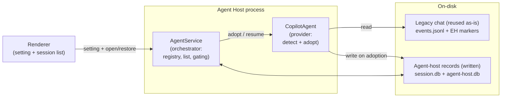
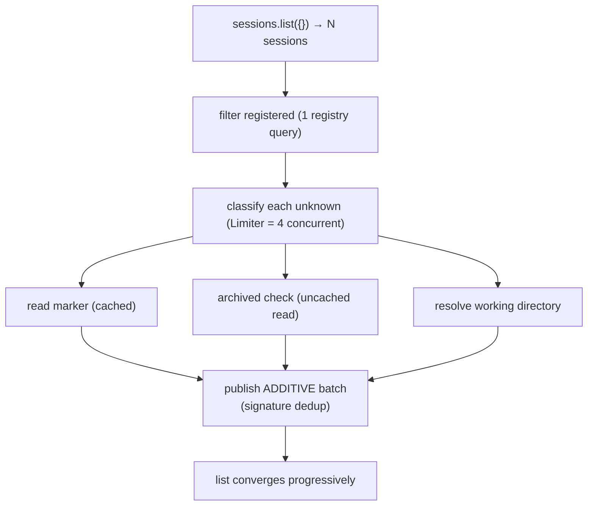
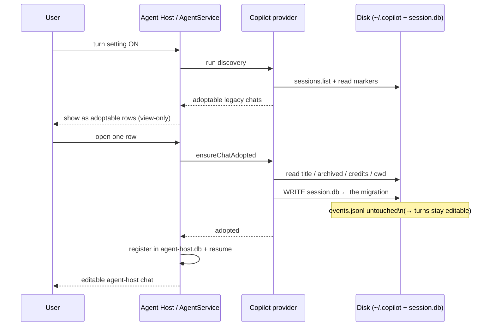

# Extension‑Host Copilot CLI → Agent‑Host Session Migration

How legacy **extension‑host Copilot CLI** chat sessions are surfaced and migrated
"in place" into **agent‑host Copilot CLI** sessions, so their history becomes
editable.

This is controlled by the setting **`chat.agentSessions.migrateLegacyCopilotCli`**
(*Migrate Legacy Copilot CLI*, experimental). It is **OFF by default**; the flows
below assume the user turns it **ON at runtime**, after VS Code has already started.

> Renderer setting `chat.agentSessions.migrateLegacyCopilotCli` is forwarded to the
> agent‑host process as the root config key `migrateLegacyCopilotCliEnabled`
> (`AgentHostMigrateLegacyCopilotCliEnabledConfigKey`).

---

## 1. Vocabulary

| Term | Meaning |
| --- | --- |
| **Legacy / extension‑host (EH) CLI session** | A Copilot CLI chat created by the old *extension host* code path. Identified on disk by a `vscode.metadata.json` marker whose `origin` is `vscode`. |
| **Adoptable** | A legacy EH session that Agent Host does not yet own and *could* migrate. Carried in session metadata via the `ehcliAdopted`/`adoptable` marker (`readSessionEhcliAdoptable`). |
| **Adoption / migration** | Writing an agent‑host‑owned `session.db` for the session so it becomes a first‑class, editable agent‑host session. Happens **on open**, not during discovery. |
| **Surfacing** | Showing an adoptable row in the agent‑host session list *before* it is migrated. View‑only until opened. |
| **External session** | A non‑adoptable Copilot session that some other client (standalone CLI, GitHub app) owns. Different code path; not covered here except where it interacts. |

---

## 2. Component architecture

Three layers, four boxes. The renderer forwards the setting; inside the host the
**orchestrator** decides *when* to migrate and the **provider** knows *how*; disk holds
the old chat's data (reused) and the new ownership record (written).



**Reading it:** migration only ever **reads** the left disk box (the old conversation and
the extension host's leftover marker files) and **writes** the right one (`session.db` +
the `agent-host.db` registry). §3 breaks those stores out individually.


---

## 3. State and DB touched by migration

| Store | Path | Read | Written | Notes |
| --- | --- | --- | --- | --- |
| **SDK event log** | `~/.copilot/session-state/<id>/events.jsonl` | ✅ (on resume) | ❌ | Reused **in place**. This is what makes turns editable — `mapSessionEvents` reconstructs real `Turn`s with SDK event ids. Never rewritten by migration. |
| **EH marker** | `<id>/vscode.metadata.json` | ✅ | ❌ (written by the EH extension) | Source of `origin` (only `vscode` adopts), `customTitle`, `archived`, `worktreeProperties`, recorded `workingDirectory`. |
| **Usage sidecar** | `<id>/vscode.requests.metadata.json` | ✅ | ❌ | Per‑turn credits → copied into `turn_usage` rows so the "credits used" gauge survives. Best‑effort. |
| **Agent‑host session DB** (per session) | `agentSessionData/<sanitizedId>/session.db` | ✅ (existence/metadata probe) | ✅ **on adoption** | Writing this is the act of migration. Stores `workingDirectory`, project, `isolation: 'folder'`, `customTitle`, `isRead`, `archived`, and the `ehcliAdopted` marker (`AH_META_EHCLI_ADOPTED_DB_KEY`), plus `turn_usage` rows. Its existence is **what stops the EH list from showing the session** (EH dedups against agent‑host‑owned ids). |
| **Session registry** (`agent-host.db`) | one central DB next to the root config (`joinPath(dirname(rootConfigResource), 'agent-host.db')`) | ✅ | ✅ | The single orchestrator‑owned index (`AgentHostDatabase` → `AgentSessionRegistry`). One row per session: identity (`provider`, `startTime`, `external`, `source`), per‑provider **backfill** markers, and **tombstones** (deleted sessions never resurrected). Durable provenance authority. |

> ⚠️ **One‑way, no rollback.** Adoption is durable. Turning the setting back OFF
> retracts *un‑opened* surfaced rows but does **not** un‑migrate sessions whose
> `session.db` was already written.

---

## 4. Startup + large catalogs (1000+ legacy sessions)

### How discovery starts

- Discovery is **lazy**: it kicks off on the first list listener
  (`onDidAddFirstListener → _startCopilotChatDiscovery`).
- If the SDK isn't ready yet, it retries with backoff `[250 ms, 1 000 ms, 5 000 ms]`.
- A separate one‑time per‑provider **backfill** (`_migrateLegacyProviderChats`) walks
  the whole provider catalog once, guarded by a durable per‑provider backfill marker
  (`isProviderBackfilled`) so it does not repeat on every launch.

### What scales with catalog size

`_discoverCopilotChats` enumerates the **entire** `~/.copilot` catalog via
`sessions.list({})`. For every session Agent Host doesn't already know it performs
per‑row I/O:



Implications at **1000+** sessions:

- **Throttled disk I/O.** Marker + archived + working‑dir reads run at most **4 at a
  time** (`metadataLimiter` / `projectLimiter`). With thousands of sessions this is
  many thousands of small file reads, so the full list takes noticeable wall‑clock
  time to populate.
- **Progressive rendering, not all‑or‑nothing.** Batches are published additively and
  deduped by a JSON `signature`, so adoptable rows appear incrementally instead of the
  UI blocking until the whole scan finishes. A single unreadable session is logged and
  skipped rather than failing the whole pass.
- **Catalog‑warm is deferred on the open path.** Warming the whole catalogue is
  `O(catalogue)` — noted as ~48 s on a large `~/.copilot` (issue #331648) — so a
  single session open resolves from its own per‑session lookup and only pays for the
  full catalog when a metadata miss must be proven authoritative.
- **Toggle ON = a full fresh pass.** Turning the setting on re‑runs discovery over the
  whole catalog **and** `_resurfaceAdoptableSessions()` re‑scans `listSessions()`, so
  the same `O(catalog)` cost is paid again on toggle.
- **Migration cost is amortized.** Because adoption is **on open**, populating the list
  never writes `session.db`; the expensive per‑session writes happen one at a time as
  the user actually opens sessions.
- **Memory.** `_extensionHostCliMarkerCache` retains one entry per successfully‑read
  marker and `_discoveredChats` one signature per discovered chat, so both maps grow
  roughly linearly with catalog size for the process lifetime.

### The bigger cost: `listSessions` itself is O(catalog)

Discovery is only half the story. **Building the session list** (`_computeSessions`) is
what dominates on a large catalog, and it is separate from discovery:

- It reads **every registered session** from `agent-host.db`, then for each one **opens
  that session's `session.db`** (throttled to 4 concurrent) to overlay title / read /
  archived / git metadata.
- Historically it also resolved **per‑session git/project info** (`git rev-parse`),
  which on a big catalog means hundreds of git subprocess calls per pass.
- So one list pass is `O(registered sessions)` of database opens (+ git), and on a large
  `~/.copilot` a single pass can take **tens of seconds to over a minute**.

Two amplifiers make this user‑visible:

- **Invalidation restarts the pass.** Any registry mutation calls
  `_invalidateSessionList()`, which bumps `_registryEpoch`; an in‑flight compute that
  sees a newer epoch **throws away its work and restarts**
  (`if (epoch !== this._registryEpoch) return this.listSessions(mode)`). During the
  migrate storm (discovery + adoption + external reconciliation all mutating the
  registry) the ~1‑minute compute can keep restarting and **never settle for minutes**.
- **Turning the setting on flips the whole adoptable set visible at once.** While OFF,
  adoptable‑legacy sessions are excluded from the agent‑host list; flipping ON makes all
  of them eligible in one step, forcing a full recompute *and* a handoff from the fast
  extension‑host provider to the slow agent‑host list.

> 💡 The list path should stay cheap: defer git/project resolution to open, batch/cache
> the per‑session DB reads, and coalesce invalidations so a burst of registry mutations
> doesn't restart a minute‑long compute repeatedly.

### Practical guidance for very large catalogs

- Expect the adoptable rows to trickle in after enabling the setting rather than
  appearing instantly.
- Archived EH sessions are intentionally suppressed (they'd otherwise resurface
  everything filed away), reducing the surfaced count.
- Non‑adoptable/external and sessions older than 7 days are filtered early, further
  trimming the working set.

---

## 5. A worked walkthrough: what's going on, step by step

A narrative trace of one legacy chat going from "old, read‑only" to "migrated,
editable", in the order things actually happen.

### Turning the setting on

- **The user turns on `chat.agentSessions.migrateLegacyCopilotCli`** in settings.
- **The renderer forwards it to the agent‑host process** as the root config
  `migrateLegacyCopilotCliEnabled`.
- **Two listeners wake up:** the Copilot provider (`CopilotAgent`) and the orchestrator
  (`AgentService`). Nothing is migrated yet — this only *unlocks* surfacing.

### Discovering the old chats

- **The provider enumerates the shared Copilot catalog** (`~/.copilot`) via the SDK's
  `sessions.list`.
- **For each chat the agent host doesn't already own, it reads a tiny marker file**
  (`vscode.metadata.json`) sitting next to that chat.
- **It checks one thing: is this a VS Code legacy chat?** (marker `origin` = `vscode`).
  Only those are "adoptable"; standalone CLI / GitHub‑app chats are left alone.
- **Archived or directory‑less chats are skipped**, so the user isn't shown rows that
  would just error or resurface things they filed away.

### Showing them as adoptable rows

- **The orchestrator surfaces each adoptable chat as a row in the session list.**
- **These rows are view‑only.** No conversation data has moved; no `session.db` has been
  written. The list is just *advertising* that these old chats can be adopted.
- Discovery runs in throttled batches, so on a big catalog the rows fill in
  progressively rather than all at once.

### Migrating one — on open

This is the moment migration actually happens, and it happens **per chat, only when the
user opens one**:

- **The user clicks an adoptable row.** VS Code asks the agent host to open (restore) it.
  (If migration is OFF at this moment, the host does **not** adopt: `ensureChatAdopted`
  isn't called and an unregistered adoptable chat is refused with `AHP_SESSION_NOT_FOUND`.
  A previously‑deleted (tombstoned) session also fails fast here.)
- **The orchestrator confirms the setting is still on**, then asks the provider to
  "adopt" the chat (`ensureChatAdopted`).
- **The provider gathers what it needs from disk:** the working directory (from the SDK
  or the marker, recreating a deleted worktree if needed), the chat's title, its archived
  state, and its per‑turn credit history.
- **It writes one small per‑session record — `agentSessionData/<id>/session.db`.**
  *This single write is the migration.* It stamps the chat as agent‑host‑owned
  (`ehcliAdopted`), pins it in place (`isolation: folder`), and carries over title,
  read/archived state, and credits.
- **The old conversation log (`events.jsonl`) is never touched** — it's reused exactly
  as‑is. That untouched log is what makes every turn fully editable again.
- **Writing `session.db` also makes the old extension‑host list drop the chat**, because
  that list hides anything the agent host now owns. So the chat moves lists rather than
  appearing in both.
- **The orchestrator registers the now‑owned chat in `agent-host.db`** and resumes it.
  The chat opens as a first‑class, editable agent‑host session.

### Afterwards

- **Migration is one‑way.** If the user later turns the setting off
  (`_onMigrateLegacySettingChanged`), only *un‑opened* adoptable rows are **retracted**
  from the list (`retractSurfacedSession`) — no data is deleted. Chats already opened
  stay migrated; there is **no rollback** of a written `session.db`.
- **While OFF, adoptable‑legacy rows stay hidden.** `_shouldIncludeSession` excludes them
  so a refresh can't re‑surface an unopenable row; re‑enabling recovers them by
  re‑scanning the catalog (`_resurfaceAdoptableSessions`).



**Takeaway:** migration is **discover → surface → claim on open**. The heavy
conversation data is never moved; a single small `session.db` write is what turns an old
extension‑host chat into an editable agent‑host one.

---

## 6. Issues at a glance (summary)

What users hit on a large legacy catalog, and why. Details in **Appendix A**.

- **Sessions disappear for minutes, then come back.** Enabling the setting makes the
  agent host claim ~all legacy sessions at once, but building the list is `O(catalog)`
  (opens every `session.db` + per‑session git) — **37–87 s per pass in the logs**. On top
  of that, **every migration write invalidates the in‑flight pass and makes it start
  over.** The "side‑effects" are the registry mutations migration produces continuously:
  discovery registering a newly‑found adoptable session, adoption writing a `session.db`
  and registering the owned twin, external‑session reconciliation (restored → external),
  deletes/tombstones, and read/archive/title updates. Each of these calls
  `_invalidateSessionList()`, which bumps a monotonic `_registryEpoch` counter. A
  `listSessions`/`_computeSessions` pass captures the epoch when it starts and re‑checks it
  after each async step; on a mismatch it **discards all work done so far and re‑invokes
  `listSessions` from scratch** (`if (epoch !== this._registryEpoch) return
  this.listSessions(mode)`). During the migrate storm those writes arrive back‑to‑back, so
  the minute‑long pass keeps getting a newer epoch and **never settles** — and in that gap
  sessions fall out of *both* the extension‑host and agent‑host lists.
- **Opening a session spins, drops, then opens late.** Adoption clears the row before the
  migrated twin has surfaced (the slow list), so the ~10 s open probe times out; it opens
  minutes later when the catalog finally settles.
- **Migrated title carries injected context** (e.g. `"hi"` + `"IMPORTANT: this context…"`).
  When no extension‑host `customTitle` was carried, the title falls back to the SDK
  event's `transformedContent` (which embeds `<system_reminder>` blocks) instead of clean
  `content`. Independent, small bug.
- **Aggravator, now fixed:** a spurious SDK client restart at startup
  (`CAPI proxy configuration changed ((none) -> (none))`) — seen in the logs — is fixed
  by #332306 / #332256, but does **not** address the list‑cost or title issues above.

**Two distinct root causes (updated after further investigation).**

1. **The mass‑vanish is a *client‑side* list‑merge bug.** The renderer's
   `AgentSessionsModel.doResolveProvider` rebuilds its session map whenever *any* provider
   refreshes, and it only preserves *other* providers' rows if that provider is built‑in
   or a static contribution. `agent-host-copilotcli` is **neither** (it registers
   dynamically), so a partial refresh of the sibling extension‑host `copilotcli` provider
   **purged every agent‑host row** — that is the mass‑vanish. It is a correctness bug in
   the merge, independent of how fast the host builds its list.
2. **The host‑side list build is `O(catalog)`.** `listSessions` re‑derives display data
   from per‑session databases every pass and restarts on every mutation. This makes the
   list **slow to warm** on a large catalog, but — because migration is a one‑time event —
   a one‑time warm is acceptable; it is *not* what makes sessions absent from both lists.

The originally‑proposed durable projection (Appendix B) targeted (2). The **shipped fix
targets (1)** — a few lines in the client merge — and accepts (2) as by‑design. See §7.

---

## 7. Solution at a glance (implemented)

> **Principle (revised):** fix the mass‑vanish **client‑side**, where it actually happens —
> the renderer's session‑list merge must preserve a *live‑registered* provider's rows
> across a sibling provider's refresh. The host‑side `O(catalog)` list cost is accepted as
> a one‑time warm (migration is a one‑off), **not** re‑architected.

Five targeted, independently‑shippable changes replaced the earlier durable‑projection
plan (retained in **Appendix B** as *considered‑and‑rejected*):

1. **Provider‑preservation — the core fix.** `AgentSessionsModel.doResolveProvider`
   (renderer) now preserves a session across a sibling provider's partial refresh when its
   provider is **live‑registered** (`getRegisteredChatSessionItemProviders()`), not only
   when it is built‑in or a static contribution. Because `agent-host-copilotcli` registers
   dynamically, the old condition dropped all of its rows whenever the extension‑host
   `copilotcli` provider refreshed mid‑migration. *This is what stops sessions
   disappearing.*
2. **Surface‑before‑retract.** On adoption (`AgentService._doRestoreSession`), the adopted
   agent‑host row is announced **before** the slow `_restoreSessionState`, so the twin is
   visible before the extension‑host row drops.
3. **Title scaffolding strip.** `mapSessionEvents.stripPromptScaffolding` removes
   `<system-reminder>` / reminder / attachments / context / `<userRequest>` wrappers from
   the SDK message, so a migrated title never leaks injected context (implemented as a
   sanitizer in the mapper rather than a `content` vs `transformedContent` choice).
4. **Seamless interactive open.** Migration is invisible to the user, so an explicit open
   runs adoption under a subtle status‑bar progress hint with a longer budget
   (`LEGACY_MIGRATION_OPEN_TIMEOUT_MS = 60 s`, replacing the old 10 s/30 s cutoff): the
   *same* session opens in place once adopted, rather than briefly falling back to the
   pre‑migration read‑only view. A declined/external session still resolves fast, so only a
   genuinely still‑warming host waits; the fallback is a rare last resort and carries no
   internal‑concept labelling. (`resolveMigratedSessionForOpen` in `agentSessionsOpener.ts`;
   the startup restore path keeps its 60 s `LEGACY_MIGRATION_RESTORE_TIMEOUT_MS`.)
5. **Never‑drop fallback label.** `copilotcliSessionService._getAllSessions` gives an
   *on‑disk* session that passed `shouldShowSession` a cwd/generic label instead of hiding
   it when the title can't be resolved. A freshly‑created, still‑empty session is a live
   wrapper (handled by the in‑progress path), so the fallback is gated to non‑live sessions
   and never surfaces an empty new session.

Plus a **trace diagnostic**: `doResolveProvider` logs `preserved N live-registered
session(s) …` when the preservation branch saves rows the old code would have dropped —
the support‑bundle signal that the fix engaged (trace level; lands in the "Agent
Sessions" output channel, which is file‑backed and included in exported debug logs).

**Why not the projection?** The `O(catalog)` warm only makes the list *slow*, not *empty
on both sides*, and migration is one‑time — so a one‑time warm is acceptable. The vanish
was a correctness bug in the client merge, fixable in a few lines with no schema change.
The projection (Appendix B) remains a valid *performance* option if list latency later
becomes a goal in its own right.

---

## Appendix A. Known failure modes — details (from user logs)

These are the real‑world symptoms users hit when the catalog is large, together with the
mechanism behind each. They all trace back to the same root: **the session list is
`O(catalog)` and gets repeatedly invalidated during migration** (see §4), plus one
separate title bug.

### Symptom → mechanism

| What the user sees | What's actually happening |
| --- | --- |
| Opening an adoptable session **spins for several seconds, then the row vanishes without opening** | Adoption starts and clears the `ehcliAdoptable` marker (row leaves the list), but the agent‑host twin hasn't surfaced yet because the list recompute is still running. The client‑side probe has only a ~10s interactive budget, so it times out and the row is just gone. |
| The session **randomly opens minutes later** | The slow catalog/compute finally settles and the twin surfaces — long after the probe budget gave up, so the open lands late. |
| After going back, **almost all legacy sessions are missing**, and stay missing across reloads / restarts, then **return after a few minutes** | Enabling the setting flips the whole adoptable set from "hidden (shown by the extension‑host provider)" to "eligible in the agent‑host list" at once. The agent‑host list takes tens of seconds–minutes to compute and keeps getting invalidated, so during the gap the sessions fall out of **both** lists. Each restart re‑runs the slow compute, so they reappear only once it finally finishes. |
| The migrated session's **title has injected context** appended (e.g. `"hi"` + `"IMPORTANT: this context may or may not be relevant…"`) | No extension‑host `customTitle` was carried (`customTitle=false` in the adoption log), so the title falls back to the SDK event's `transformedContent` — which wraps the clean message in injected `<system_reminder>` / context blocks — instead of the clean `content`. A separate bug from the list churn. |

### What the logs looked like

A representative bundle (706 registered / 848 SDK sessions) showed the list path, not
discovery, as the bottleneck:

```
listSessions computed  84 of 706 ... in 64181ms
listSessions computed  84 of 706 ... in 37371ms
listSessions computed 706 of 706 ... in 53578ms   ← after setting ON + adopt
listSessions computed 706 of 706 ... in 87210ms
```

— i.e. **37–87 s per list pass**, alongside **hundreds of per‑session `git rev-parse`
calls** in the same window, and the visible count jumping (`84 → 706`) as the adoptable
set flipped in. The `X of Y` line (`_computeSessions`) is the fastest way to spot this
class of issue: a large `Y` with a multi‑second duration means the list path is the
problem.

### Additional field evidence (more users, larger catalogs)

Three further user bundles confirmed the same root cause at up to **6× the scale**, and
made two effects explicit:

| Bundle | Catalog | List pass | git fails | `(none)→(none)` restart |
| --- | --- | --- | --- | --- |
| user A | 4312 SDK / 3846 known (2 adoptable) | — (none captured) | 0 | ✅ |
| user B (waited before opening) | **4395 registered** | **6–40 s** | 0 | ✅ |
| user C | 841 SDK / 857 registered | **39–59 s ×5 passes** | **481** | ✅ |

- **The invalidation churn is directly visible** in user C: five consecutive
  `listSessions computed 694 of 857 … in 39–59s` passes — the epoch‑restart loop
  recomputing the whole list repeatedly. This is the strongest evidence for the
  **incremental‑deltas** part of the fix (§7 / Appendix B).
- **Waiting is not a workaround.** User B waited before opening, yet early passes were
  still **37–40 s** and only warmed to **6–7 s** later, still showing **1101 of 4395**.
  The `O(catalog)` cost persists regardless of timing.
- **Scale reinforces the projection fix:** the cost is driven by the non‑external
  registered set (1101 of 4395; 694 of 857), which is exactly what a query‑only list
  from the projection eliminates.
- **One minor, separate edge** (not the list issue): a rare deleted‑worktree restore
  failure — `subscribe failed … working directory no longer exists: …\vscode.worktrees\…`
  (1 occurrence). Worth separate hardening (recover/clarify), not part of the list fix.

### Registry‑state bundle: the backfill invalidates the list *per session*

A later user shared a **registry snapshot** (not just logs): `agent-host.db` plus the
workspace list caches. It pinned a concrete, previously‑unnamed churn source and cleared
two hypotheses.

- **878 sessions on disk, 753 registered** (746 copilotcli, 7 claude), of which **635 are
  `registration_source = 'restore'`** — i.e. registered by the one‑time **backfill**
  (`_migrateLegacyProviderChats`), not adopted on open (99 `explicit`) or discovered (19).
- **The backfill invalidates the session list *once per session*.** Its loop calls
  `_invalidateSessionList()` on every registered row (unlike the discovery path
  `_registerDiscoveredChats`, which invalidates once *per batch*). So her first enable
  fired on the order of **~635 invalidations**, each able to discard an in‑flight
  `O(catalog)` `listSessions` pass — the clearest concrete driver of the epoch‑restart
  storm.
- **This is general agent‑host infrastructure, not the migration feature.** The backfill
  registers *provider‑native* chats for **all** providers (her bundle shows
  `sessionRegistryBackfilled` = true for copilotcli, codex, **and** claude) and was
  introduced in #330665 ("agentHost: discover provider‑native chats"), independent of the
  Copilot CLI EH→AH migration. Any large provider‑native catalog hits it — flag or not.
- **Two hypotheses cleared.** The list cache is **healthy, not depleted**
  (`agentSessions.model.cache` ≈ 785 KB in her main workspace), and the registry is clean
  (82 tombstones, **none** still registered). Both reinforce that the user‑visible vanish
  is the **client‑side merge bug** (§6/§7); this backfill churn is purely the host‑side
  *duration* amplifier.
- **Simple targeted fix:** batch the backfill's invalidation — invalidate **once after the
  loop**, matching `_registerDiscoveredChats`. Turns ~N first‑run invalidations into ~1
  with no schema change. It's a general agent‑host perf fix, best filed against the
  session‑listing area rather than the migration PR.

### How to recognize it in a log bundle

- **`agenthost.log`:** look for `listSessions computed X of Y ... in <ms>` — large `Y`
  and/or multi‑second `<ms>` is the signature; a flood of
  `git rev-parse --show-toplevel failed` in the same window confirms per‑session git
  cost.
- **Adoption title:** `Adopted legacy session <id>: … customTitle=false` means the title
  will be SDK‑derived (watch for `transformedContent` leakage).
- **`events.jsonl`:** the `user.message` event carries both `content` (clean) and
  `transformedContent` (with injected `<system_reminder>` blocks) — the title should use
  the former.

### Related: SDK client restarts during startup (fixed separately)

The repro logs also show a **spurious Copilot SDK client restart at startup**, in both
windows, right as the initial catalog warm / first `listSessions` began:

```
14:21:53  Restarting CopilotClient (CAPI proxy configuration changed ((none) -> (none)))
15:46:07  Restarting CopilotClient (CAPI proxy configuration changed ((none) -> (none)))
```

The `(none) -> (none)` restart is an empty‑Kerberos‑SPN‑vs‑`undefined` mismatch tearing
down a healthy client. Two merged PRs address this **client‑restart** class:

- **#332306** normalizes the empty SPN (`_readKerberosSpn`) so the spurious
  `(none) -> (none)` restart no longer fires.
- **#332256** makes `_ensureClient` self‑heal a transient
  `CopilotClientStartupConfigChangedError`, so a restore/open that races a restart
  recovers instead of showing a sticky "Couldn't open session".

Both are already in this workspace's `main` (the user's repro build predates them). They
remove a genuine **aggravator** — the startup restart landed exactly as the catalog work
began, resetting it and widening the unavailable/partial window — and stop some sticky
open failures. **They do not address the O(catalog) list cost, the invalidation churn,
the handoff gap, or the title bug**, which are what make hundreds of sessions vanish for
minutes; those remain for the §7 / Appendix B work.

### Fix directions

- Keep the list path cheap: defer git/project resolution to open; batch/cache per‑session
  DB reads; coalesce invalidations so a burst of registry mutations doesn't restart a
  minute‑long compute.
- **Surface‑before‑retract** on the cross‑provider handoff so a session never leaves both
  lists at once.
- Prefer the extension‑host `customTitle`, then fall back to `content` — never
  `transformedContent` — for the adopted session's title.

Appendix B turns these directions into one coherent design rather than a set of
point patches.

---

## Appendix B. Considered‑and‑rejected: a durable list projection

> **Status: not implemented.** This was the original plan when the mass‑vanish was
> attributed to the host‑side `O(catalog)` list build. Further investigation showed the
> vanish is a *client‑side* merge bug (see §6 / §7), which the shipped fix addresses in a
> few lines with no schema change. The projection below is a genuine **performance**
> redesign — it would make the list warm instantly on huge catalogs — but it was **not
> pursued**, because migration is a one‑time event and the `O(catalog)` warm is an
> accepted one‑time cost, not the cause of sessions disappearing. It is kept here as the
> reference design should list *latency* become a goal in its own right. All scaffolding
> for it (a `list_metadata` projection column, registry threading) was reverted.

### The performance cost, stated once

`listSessions` is slow **because it re‑derives display data on every pass** (a latency
concern, not the vanish). Today
`_computeSessions` reads the registry for identity, then for **every** registered session
**opens that session's `session.db`** to overlay title / read / archived / git metadata
(and resolves project/git), throttled 4 at a time. That makes listing
`O(registered sessions)` of file opens plus git work — 37–87 s at 706 sessions in the
logs. Anything that mutates the registry then **invalidates the whole pass** via
`_invalidateSessionList()` (epoch bump), so under migration churn it restarts and never
settles.


### Design principle

> **The session list must be answerable from one durable, indexed projection — without
> opening any per‑session `session.db` and without touching git.** Per‑session databases
> and git become *open‑time* concerns only.

This is a natural evolution of the existing design: `agent-host.db` is already the
"durable provenance authority" and already stores `{ provider, startTime, external,
source }` per session. We extend that row into a full **list projection**.

### The change, in four parts

**1. Extend the registry row into a list projection.**
Add the columns the list actually renders — the same fields `_computeSessions` currently
digs out of each `session.db`:

| Projection column | Sourced from today | Written on |
| --- | --- | --- |
| `title` (custom or summary) | `session.db` `customTitle` / SDK summary | title generation, adoption |
| `isRead`, `isArchived` | `AH_META_IS_READ_DB_KEY` / `AH_META_IS_ARCHIVED_DB_KEY` | read/archive toggle, adoption |
| `external`, `ehcliAdopted` | registry / `session.db` markers | discovery, adoption |
| `modifiedTime` | provider metadata | turn complete, adoption |
| `project` (resolved) | `git rev-parse` / worktree root | open / adoption (resolve **once**, persist) |

These are all values the mutation sites **already compute**; the change is to
**write them through to the registry row** at those points instead of re‑reading them at
list time. `session.db` remains the source of truth for the *conversation*; the registry
becomes the source of truth for the *list row*.

**2. `listSessions` becomes a single indexed query.**
`_computeSessions` collapses to: read the projection rows for the requested
external‑sessions mode, filter, return. **Zero `session.db` opens, zero git.** The
per‑session overlay loop and the per‑session `git rev-parse` (the 482 failures in the
logs) disappear from the hot path. Target: milliseconds regardless of catalog size.

**3. Incremental deltas replace the full‑recompute + epoch‑restart.**
Because every mutation already writes exactly the row that changed, the service can emit
a **per‑row delta** (`added` / `updated` / `removed`) instead of rebuilding the whole
snapshot and invalidating in‑flight passes. This structurally removes the churn: there is
no minute‑long compute to restart, so a burst of migration mutations produces a burst of
cheap row updates. `_invalidateSessionList()` / `_registryEpoch` are no longer the
coordination primitive for correctness — the projection is.

**4. Surface‑before‑retract for the cross‑provider handoff.**
Adoption must **insert the agent‑host projection row before clearing the `ehcliAdoptable`
marker** (and before the extension‑host provider drops its row). Ordering the write so
the twin exists first means a session is never absent from *both* lists — closing the
"vanishes for minutes" window at the source rather than papering over it with client‑side
retention.

### Backfilling the projection (existing large catalogs)

Existing users already have hundreds of sessions with no projection columns. Populate
them **once**, lazily and bounded, reusing the existing per‑provider backfill marker
(`isProviderBackfilled`) so it never repeats:

- On first run, stream the catalog and fill projection rows in bounded batches
  (the existing `Limiter` pattern), writing each row as it resolves.
- **The list is served from whatever projection rows exist already** — a half‑filled
  projection returns a smaller *but correct* list immediately and grows as backfill
  completes, instead of blocking on an all‑or‑nothing `O(catalog)` pass. This is the key
  difference from today, where the first list *is* the O(catalog) pass.
- Project/git is resolved once during backfill (or on first open) and persisted, so it is
  never recomputed on a list pass again.

### The title fix (small, independent)

Orthogonal to the list work, and cheap: when adopting, use the extension‑host
`customTitle` if present, else the SDK **`content`** — **never `transformedContent`**,
which embeds the injected `<system_reminder>` / context blocks seen in `events.jsonl`.
The adoption log already records `customTitle=false`, so this path is easy to detect and
verify.

### Why this is clean

> **Reader's note (post‑hoc):** this table reflects the *projection proposal's* reasoning
> at the time, when the vanish was still attributed to host latency. It frames
> "client‑side" handling as merely *papering over* the cost. That framing turned out to be
> wrong for the vanish specifically: the shipped client‑side **provider‑preservation** fix
> is not "keep the last snapshot longer" — it corrects a real bug where the renderer's
> merge *discards* a live provider's rows on a sibling refresh. It is a correctness fix at
> the true source, not latency masking. The rows below about `O(catalog)` *latency* still
> stand as the (unbuilt) performance case.

| Problem (grounded in log/code) | Workaround fix | This proposal |
| --- | --- | --- |
| 37–87 s list passes opening 706 `session.db` + git | Cache reads / defer git (still `O(catalog)`) | List is one indexed query on the projection; per‑session I/O leaves the hot path entirely |
| Pass restarts on every registry mutation (epoch bump) | Debounce invalidations | Per‑row deltas — nothing to restart |
| Sessions vanish from both lists during handoff | Client keeps last snapshot longer | Surface‑before‑retract — the twin row exists before the old one is dropped |
| First list on a big catalog blocks for a minute | Longer client timeouts | Serve from existing projection rows; backfill fills in the rest incrementally |
| Injected context in title | Strip markers from the title string | Use `customTitle` / `content` at the source |

### Rollout order (had this alternative been pursued)

> For the plan that **shipped**, see §7. The order below applied only to the
> projection redesign, which was not implemented.

1. **Title fix** — smallest, isolated, immediate user win. *(Shipped — see §7, as a
   scaffolding strip in the mapper.)*
2. **Surface‑before‑retract** — closes the worst "disappears from both lists" window.
   *(Shipped — see §7.)*
3. **Registry projection + query‑only `listSessions`** — removes the `O(catalog)` cost;
   the structural core. *(Not implemented — accepted as a by‑design one‑time warm.)*
4. **Incremental deltas** — retires the epoch‑restart model once the projection is
   authoritative. *(Not implemented.)*


