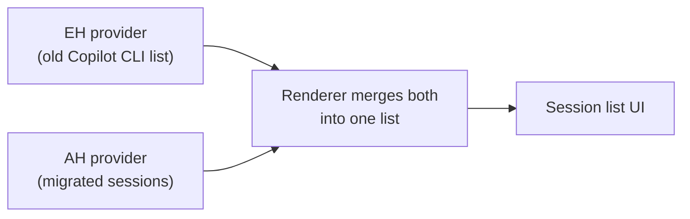
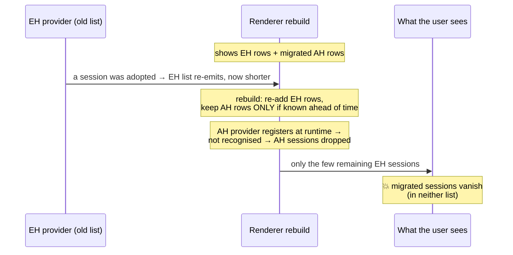
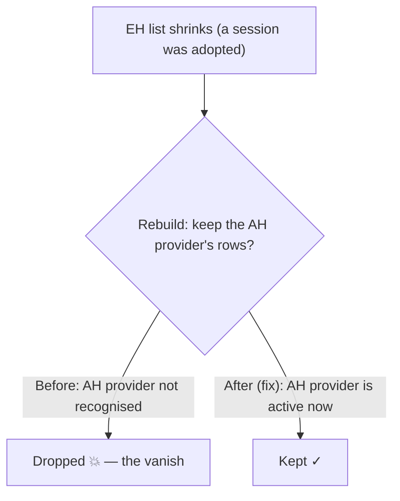

# Copilot CLI → Agent‑Host Migration

---

## 1. What migration does (today)

Legacy **extension‑host (EH) Copilot CLI** chats are moved "in place" into first‑class,
editable **agent‑host** sessions. Controlled by
`chat.agentSessions.migrateLegacyCopilotCli` (experimental, off by default).

The flow is **discover → surface → adopt on open**:

- **Discover** — the agent host enumerates `~/.copilot` and finds legacy chats it doesn't
  own yet.
- **Surface** — each shows as a view‑only row in the session list.
- **Adopt (on open)** — opening a row writes a small `session.db` (the migration); the old
  `events.jsonl` is reused untouched, so history stays editable.

Two providers feed **one** session list in the UI — the **EH provider** (extension‑host,
the *old* Copilot CLI list) and the **AH provider** (agent‑host, the *migrated* sessions):

On adoption, a chat **hands off**: its EH row drops and its AH row takes its place.

---

## 2. Why migration is inherently tricky

Several properties make it involved:

- **Two independent lists must stay in sync.** The old (EH) and new (AH) providers each
  refresh on their own schedule; a chat must appear in exactly one and never fall out of
  *both*.
- **It's one‑way and effectively irreversible.** Adoption writes ownership; there is no
  rollback. So it must be idempotent, provenance‑checked, and safe to retry.
- **Data is reused in place.** The conversation log is never copied — ownership moves while
  `events.jsonl` stays put — so history must stay intact and editable throughout.
- **Adoption is lazy (on open).** "Shown as adoptable", "adopting", and "owned" are
  decoupled states, which opens timing gaps the UI can fall into.
- **Large catalogs amplify everything.** Thousands of sessions make list‑building expensive
  and widen every race between discovery, adoption, and list refresh.
- **It must be invisible.** Users have no concept of "legacy" vs "agent‑host". They must
  never see a session vanish, a duplicate, or a read‑only fallback — migration has to feel
  like nothing happened.
- **Two surfaces, one model.** The chat editor and the Agents window share the same session
  model, so every fix has to hold for both.

---

## 3. The primary scenario & symptom

The scenario we care about: **the user opens VS Code (or the Agents window), then turns on
the migration flag.** Turning it on kicks off discovery + adoption across the whole
catalog. On a real catalog this makes **most of their sessions disappear from the list for
minutes**, then slowly reappear. During the gap the sessions are in **neither** the old nor
the new list.

---

## 4. Why it happens

Two things combine: one **removes** the sessions, the other makes the removal **last
minutes**.

### 4a. What removes the sessions (the correctness bug)

With the flag on, the agent host starts **adopting** legacy chats (writing the small
`session.db` that turns each one into a first‑class agent‑host session). Adoption is a
**hand‑off**: once a chat is adopted, the *old* Copilot CLI list stops showing it, because
the new agent‑host session now owns it.

So as adoption proceeds, **the old list keeps shrinking** — it re‑reports itself with fewer
and fewer entries, because adopted sessions have dropped out of it. *(This is the "partial
refresh": the old provider re‑emits its session list, and each new list is a subset of the
previous one.)*

Every time the old list changes, the UI rebuilds the **single combined list** the user sees
(this is what runs `doResolveProvider`). The rebuild re‑adds the old list's entries and is
*supposed* to keep the other list's entries — the migrated **AH** sessions. **The bug:** the
rebuild kept the **EH** provider's rows but dropped the **AH** provider's. It only kept rows
from providers VS Code knows about **ahead of time** (the EH provider is one — it's declared
in the extension's manifest); the **AH** provider instead **registers itself while running**,
so it wasn't on that list — and **every rebuild threw away all the migrated AH sessions.**

### 4b. What makes it last for minutes?

The `O(catalog)` cost is **not what removes the sessions** — it's what makes the
removal *last*:

- The **correctness bug (4a)** *ejects* migrated sessions from a list that was already
  showing them.
- The **`O(catalog)` cost** makes them *slow to come back*: once ejected, they only
  reappear on the next agent‑host list pass, which takes tens of seconds and keeps
  restarting under migration churn.

**making the list fast would only make the vanish _shorter_ — a
sub‑second flicker instead of minutes — by repopulating quickly. It would _mask_ the bug,
not fix it**, because the sessions would still be ejected on every rebuild. Fixing the merge
(4a) removes the ejection at the source, so migrated sessions are never dropped and never
need repopulating.

So `O(catalog)` is the **amplifier**, not the **trigger** — it doesn't remove sessions, but
it stretches the unsettled window, which is itself a reliability problem (slow settle plus
on‑open timeouts), not merely cosmetic latency. Both parts are worth fixing.

| | Trigger: merge bug (4a) | Amplifier: `O(catalog)` (4b) |
| --- | --- | --- |
| Alone | Migrated sessions blink out and back — a **brief flicker** | Sessions appear **late**, but don't vanish after appearing |
| **Together** | **The minutes‑long mass disappearance users reported** | |

> **Field‑validated at scale (user registry snapshot).** A real bundle showed 878 sessions
> on disk / 753 registered, **635** of them registered by the one‑time **backfill**. That
> backfill invalidates the list **once per session** (its loop calls
> `_invalidateSessionList()` per row, unlike the discovery path which invalidates once per
> batch) — so first enable fired ~635 invalidations, each discarding an in‑flight list pass,
> and the list keeps restarting and takes far longer to settle. **This is a reliability
> issue, not just speed:** the longer the list churns, the more likely an on‑open adoption
> exceeds its budget and falls back — so cutting the churn makes large‑catalog migration
> **settle faster *and* avoid timeouts**. **Fix:** batch the backfill invalidation (once
> after the loop). It registers provider‑native chats for copilotcli, codex *and* claude,
> so it's an agent‑host‑layer change that hardens migration for any large catalog. (The same
> bundle showed the list cache healthy and the registry clean, confirming the vanish itself
> is the client‑side merge bug (4a).)

---

## 5. How our solution mitigates it

One core fix + four supporting fixes.

**Core — provider‑preservation.** On each rebuild the renderer kept the **EH** provider's
rows but dropped the **AH** provider's, because it only recognised providers known **ahead
of time** (like the EH provider, declared in a manifest) and the **AH** provider only
**registers itself while running**. The fix widens the rule: also keep a provider's rows if
it is **active right now** — so the AH sessions survive.

**Supporting fixes:**

| Fix | What it does |
| --- | --- |
| Surface‑before‑retract | Announce the adopted agent‑host row **before** the slow restore, so the twin exists before the EH row drops. |
| Title scaffolding strip | Remove injected `<system-reminder>` / context blocks from migrated titles. |
| Seamless open | Open the user's session under a subtle progress hint instead of ever showing a read‑only copy (see §6). |
| Never‑drop fallback label | Show a cwd/generic label instead of hiding a session whose title can't resolve. |

**Before → after, in one line:** each time the old list shrank during adoption, the rebuild
used to *purge* the migrated sessions; now it *keeps* them — so sessions stay put instead of
blinking out.

---

## 6. Seamless open (the user never sees "migration")

The user has no concept of "legacy" vs "agent‑host" — they just open **their chat**. So
clicking a session must never swap in a different (read‑only) view while the backend
catches up.

- **What the user does:** clicks a session in the list.
- **What happens:** behind the scenes the session is adopted; the user sees only a subtle
  status‑bar "Opening chat…" hint, then their chat opens — fully editable.
- **On a still‑warming large catalog:** the open waits for the session to   be ready, rather than briefly showing an older read‑only copy. A session that genuinely
  can't be adopted (e.g. an external/non‑owned one) resolves quickly and just opens as‑is —
  no long wait.
