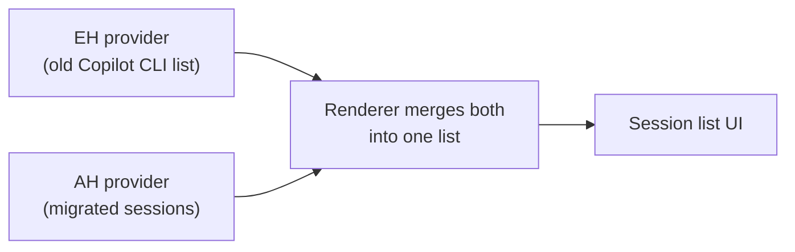
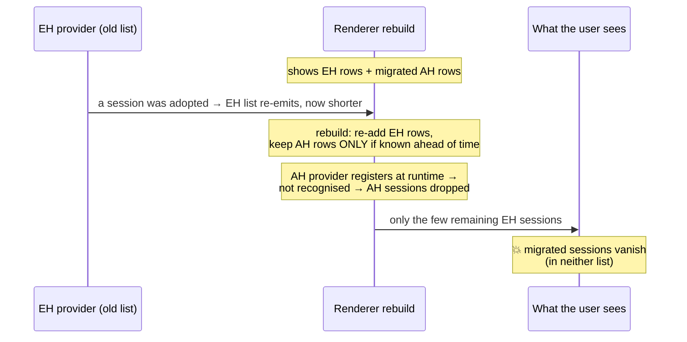
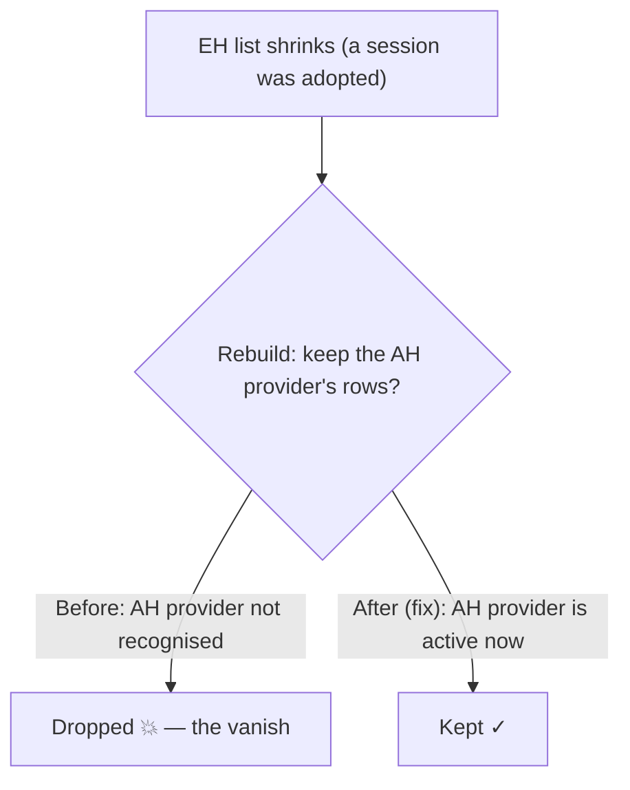

# Copilot CLI → Agent‑Host Migration — Review Brief

*15‑minute read. Companion to the full design doc
([copilotcli-legacy-session-migration.md](copilotcli-legacy-session-migration.md)).*

---

## 1. What migration does (today)

Legacy **extension‑host (EH) Copilot CLI** chats are moved "in place" into first‑class,
editable **agent‑host** sessions. Controlled by
`chat.agentSessions.migrateLegacyCopilotCli` (experimental, off by default).

The flow is **discover → surface → adopt on open**:

- **Discover** — the agent host enumerates `~/.copilot` and finds legacy chats it doesn't
  own yet.
- **Surface** — each shows as a view‑only row in the session list.
- **Adopt (on open)** — opening a row writes a small `session.db` (the migration); the old
  `events.jsonl` is reused untouched, so history stays editable.

Two providers feed **one** session list in the UI — the **EH provider** (extension‑host,
the *old* Copilot CLI list) and the **AH provider** (agent‑host, the *migrated* sessions):

On adoption, a chat **hands off**: its EH row drops and its AH row takes its place.

---

## 2. The primary scenario & symptom

The scenario we care about: **the user opens VS Code (or the Agents window), then turns on
the migration flag.** Turning it on kicks off discovery + adoption across the whole
catalog. On a real catalog this makes **most of their sessions disappear from the list for
minutes**, then slowly reappear. During the gap the sessions are in **neither** the old nor
the new list.

---

## 3. Why it happens

Two things combine: one **removes** the sessions, the other makes the removal **last
minutes**.

### 3a. What removes the sessions (the correctness bug)

With the flag on, the agent host starts **adopting** legacy chats (writing the small
`session.db` that turns each one into a first‑class agent‑host session). Adoption is a
**hand‑off**: once a chat is adopted, the *old* Copilot CLI list stops showing it, because
the new agent‑host session now owns it.

So as adoption proceeds, **the old list keeps shrinking** — it re‑reports itself with fewer
and fewer entries, because adopted sessions have dropped out of it. *(This is the "partial
refresh": the old provider re‑emits its session list, and each new list is a subset of the
previous one.)*

Every time the old list changes, the UI rebuilds the **single combined list** the user sees
(this is what runs `doResolveProvider`). The rebuild re‑adds the old list's entries and is
*supposed* to keep the other list's entries — the migrated **AH** sessions. **The bug:** the
rebuild kept the **EH** provider's rows but dropped the **AH** provider's. It only kept rows
from providers VS Code knows about **ahead of time** (the EH provider is one — it's declared
in the extension's manifest); the **AH** provider instead **registers itself while running**,
so it wasn't on that list — and **every rebuild threw away all the migrated AH sessions.**

### 3b. What makes it last for minutes — and did the diagnosis change?

**Yes — the diagnosis was refined, and this is worth being explicit about.**

*Originally* the vanish was attributed to the **host‑side cost of building the agent‑host
list**: `listSessions` re‑derives every row from per‑session databases (plus git) on each
pass — **`O(catalog)`, 37–87 s per pass in user logs** — and any migration write restarts
the pass. The proposed fix was to make that list fast (a durable index/projection).

Deeper analysis showed that cost is **not what removes the sessions** — it's what makes the
removal *last*:

- The **correctness bug (3a)** *ejects* migrated sessions from a list that was already
  showing them.
- The **`O(catalog)` cost** makes them *slow to come back*: once ejected, they only
  reappear on the next agent‑host list pass, which takes tens of seconds and keeps
  restarting under migration churn.

The decisive tell: **making the list fast would only make the vanish _shorter_ — a
sub‑second flicker instead of minutes — by repopulating quickly. It would _mask_ the bug,
not fix it**, because the sessions would still be ejected on every rebuild. Fixing the merge
(3a) removes the ejection at the source, so migrated sessions are never dropped and never
need repopulating.

So `O(catalog)` is **not unimportant** — it's a real, separately‑valid list *latency*
concern — but in the **causal chain of the disappearance** it is the **amplifier
(duration)**, not the **trigger**.

| | Trigger: merge bug (3a) | Amplifier: `O(catalog)` (3b) |
| --- | --- | --- |
| Alone | Migrated sessions blink out and back — a **brief flicker** | Sessions appear **late**, but don't vanish after appearing |
| **Together** | **The minutes‑long mass disappearance users reported** | |

---

## 4. How our solution mitigates it

One core fix + four supporting fixes.

**Core — provider‑preservation.** On each rebuild the renderer kept the **EH** provider's
rows but dropped the **AH** provider's, because it only recognised providers known **ahead
of time** (like the EH provider, declared in a manifest) and the **AH** provider only
**registers itself while running**. The fix widens the rule: also keep a provider's rows if
it is **active right now** — so the AH sessions survive.

**Supporting fixes:**

| Fix | What it does |
| --- | --- |
| Surface‑before‑retract | Announce the adopted agent‑host row **before** the slow restore, so the twin exists before the EH row drops. |
| Title scaffolding strip | Remove injected `<system-reminder>` / context blocks from migrated titles. |
| Open budget 10 s → 30 s | Don't drop a row that's about to surface during a slow warm. |
| Never‑drop fallback label | Show a cwd/generic label instead of hiding a session whose title can't resolve. |
| Trace diagnostic | Logs when preservation saved rows the old code would have dropped (support‑bundle signal). |

**Before → after, in one line:** each time the old list shrank during adoption, the rebuild
used to *purge* the migrated sessions; now it *keeps* them — so sessions stay put instead of
blinking out.

---

## 5. Why this over the alternative

The original plan was the host‑side **durable list projection** (index the list so building
it is fast regardless of catalog size). We **did not** pursue it *for this bug*, because —
per §3b — a fast list would only make the vanish *shorter*, not *gone*: the migrated rows
would still be ejected on every rebuild, just repopulated quickly. That **masks** the
symptom rather than fixing it.

The merge fix removes the ejection at the source, in a few lines, with **no schema change**.
The projection remains a genuinely useful **performance** option — worth doing on its own
merits if list *latency* on huge catalogs becomes a goal — but it is a separate concern
from the disappearance.

**Validation:** the vanish is a timing‑sensitive race → the authoritative proof is a unit
test that deterministically reproduces the shrinking‑list rebuild and asserts the migrated
rows survive. An end‑to‑end run confirmed catalog safety and list stability.
