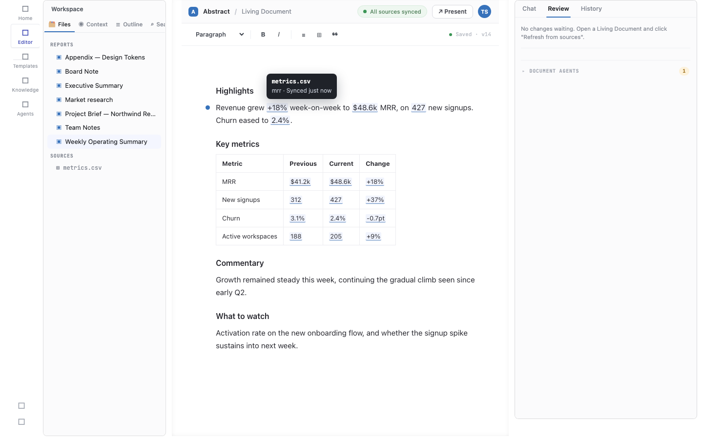

# Plan 29 iter 3 - hover provenance on a bound figure: live verification

Web build on `:8080` (the sample folder mounted via `@vscode/test-web`), driven headlessly. The Weekly
Operating Summary living document was opened in the ProseMirror editor and its first bound figure hovered.



The document renders 16 bound figures (the underlined blue values + the KPI-table cells). Hovering the
`+18%` figure (`bind:metrics.mrr.delta`) floats a quiet provenance card:

```
metrics.csv
mrr · Synced just now
```

- **source** = `metrics.csv` (the file the value came from),
- **location** = `mrr` (the cell within the source the delta is derived from),
- **synced** = a truthful relative time from the lock (`Synced just now` here - this session had just synced).

The tooltip is `position:fixed` + `pointer-events:none`, so it floats over the prose without shifting
layout and never intercepts the click that opens the source drawer (click behaviour unchanged). The same
tooltip fires on the provenance gutter dot (it resolves the same bind key from the figure inside its block).

## Stale (amber) line

The amber "Source changed since last sync" line renders when a binding is in the document's
`staleBindings` set (`fresh:false`). This branch is covered by the unit tests in
`livingDocPmDecorations.test.ts` ("a binding in the stale set reports fresh:false so the tooltip shows the
amber line") - the tooltip DOM builds the `.tip-stale` node directly from that `fresh` flag. It could not be
forced through this particular live harness because the mounted sample folder is served read-only and the
editor re-syncs the lock on open (so an externally edited source is reconciled to fresh before the tooltip
reads it); the amber path is therefore verified at the unit level + by the shared render code, not in this
screenshot. In a desktop/writable-folder session, editing a source after the document is open (the
on-open-freshness path) flips the same flag and the amber line shows.
