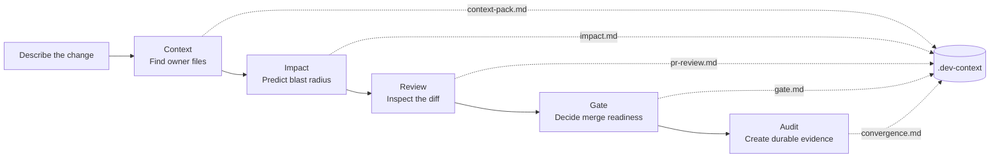
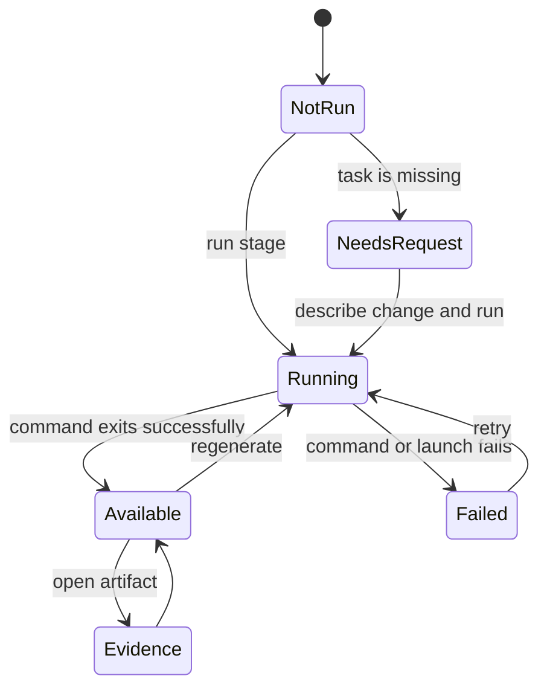

# Repoctx IDE trust workflow

This is the visual contract for transforming Code OSS into the Repoctx evidence workbench. The editor stays familiar while repository understanding, change impact, review readiness, and durable audit evidence become a visible path.

## Product flow



## Native secondary sidebar

```text
┌─ REPOCTX: TRUST ───────────────────┐
│ REPOSITORY TRUST                   │
│ repoctx-ide                        │
│ 1 of 5 evidence stages available  │
│                                    │
│ Change request                     │
│ ┌────────────────────────────────┐ │
│ │ Add safe refund handling       │ │
│ └────────────────────────────────┘ │
│                                    │
│  ✓  Context         Evidence ready │
│  │  Owner files and structure     │
│  │  Open evidence                 │
│  │                                 │
│  ◉  Impact                 Running │
│  │  Predicted files, tests, risk  │
│  │  Running in terminal…          │
│  │                                 │
│  ○  Review                   Ready │
│  │  Changed-file validation       │
│  │  Run Review                    │
│  │                                 │
│  ◇  Gate           Needs request │
│  │  ○ Tieline  contracts    Ready │
│  │  ○ Bouncer  compliance   Ready │
│  │  ○ Aiglare  governance   Ready │
│  │  Run Gate                      │
│  │                                 │
│  ◇  Audit          Needs request │
│     Recomputable receipt           │
│     Run Audit                      │
└────────────────────────────────────┘
```

## State model



## Interaction rules

- Repoctx lives beside agent chat in the right secondary sidebar, leaving Explorer and Source Control available on the left.
- When Context evidence exists, Repoctx automatically attaches a concise repository summary to every IDE agent request. Chat shows this as a read-only `Repoctx · N evidence files` attachment before and after sending. Full `.dev-context` artifacts stay on demand and are referenced by exact path instead of being copied into every prompt.
- `repoctx.agentContext.enabled` defaults to `true` and lets a user disable this automatic handoff without removing their evidence.
- The current state is always expressed with text and an icon, never color alone.
- Missing task text is shown as `Needs request`; typing a change request immediately unlocks the task-dependent stages.
- Failed stages retain a visible `Failed` state and a one-click retry action instead of returning to an ambiguous idle state.
- The bundled Repoctx CLI is launched through Repoctx IDE's own runtime as a direct integrated-terminal process with structured arguments. Users do not need a separate global install, task text is never composed into a shell command, and Electron archive handling is disabled for repository scans so ordinary `.asar` fixture files stay quiet.
- A successful stage writes a named artifact into `.dev-context` and the rail refreshes from the filesystem.
- Gate runs the bundled Tieline contract, Bouncer compliance, and Aiglare AI-governance checks. Each tool remains visible while it is checking and resolves to `Pass`, `Warning`, `Fail`, or `Not configured` from `gate.md`; status is never inferred from process activity alone.
- A failed stage points to the visible Repoctx terminal output.
- Context, Impact, Gate, and Audit require a change request. Review can inspect the current diff without one.
- The next useful action stays beside the evidence it creates.

## Repoctx engine updates

Repoctx IDE bundles a tested Repoctx engine version. Dependency automation is configured to watch registry-backed `@nugehs/repoctx` releases and open a focused update pull request. CI must validate that update before it ships in an IDE release. An installed IDE never changes its trust engine silently between application releases.

The current foundation pins the public Repoctx `2.4.0` source commit because `2.4.0` is not yet available from npm. After that version is published, switch this dependency once to the npm package; later npm bumps will flow through the automated update pull requests.
