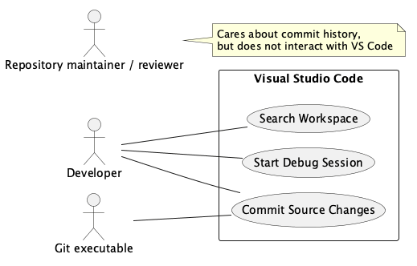

# Requirements and Use Cases

This document describes the real behavior of the Visual Studio Code workbench in this repository. File paths below are repository-relative and are evidence for the stated requirement or use case.

## Part 1: FURPS+ requirements

| Category | Requirement | Evidence in this project |
| --- | --- | --- |
| Functional | The workbench shall let a developer search the folders in the open workspace for text, apply include/exclude patterns and ignore-file rules, and show the matching files and locations. | `src/vs/workbench/contrib/search/browser/searchView.ts` builds and validates a text query and displays results; `src/vs/workbench/contrib/search/browser/search.common.contribution.ts` defines `search.useIgnoreFiles`; `src/vs/workbench/contrib/search/test/browser/searchConfiguration.test.ts` tests the search configuration. |
| Usability | The Search view shall announce the number of results and files to assistive technology, and provide keyboard-oriented accessibility help. | `src/vs/workbench/contrib/search/browser/searchView.ts` sends the localized ARIA status “Search returned {0} results in {1} files”; `src/vs/workbench/contrib/search/browser/searchAccessibilityHelp.ts` documents the Search accessibility commands and settings. |
| Reliability | A newly started workspace search shall cancel an older in-progress search so stale work does not continue to populate the current results; cancellation must terminate a spawned ripgrep process. | `src/vs/workbench/contrib/search/browser/searchTreeModel/searchModel.ts` calls `cancelSearch(true)` before each search and uses a cancellation token; `src/vs/workbench/services/search/test/node/fileSearch.test.ts` tests that cancellation kills the spawned process and that a missing ripgrep executable’s spawn error is handled. |
| Performance | Search-as-you-type shall be debounced, with a configurable default delay of 300 ms, and the search engine shall stream results while recording first-render and completion durations. | `src/vs/workbench/contrib/search/browser/search.common.contribution.ts` defines `search.searchOnTypeDebouncePeriod` with default `300`; `src/vs/workbench/contrib/search/browser/searchWidget.ts` applies that delay; `src/vs/workbench/contrib/search/browser/searchTreeModel/searchModel.ts` records `searchResultsFirstRender` and `searchResultsFinished` timing. |
| Supportability | Search behavior shall be configurable through VS Code settings, including ignore-file behavior, maximum results, sort order, case handling, and ripgrep thread use. The ignore-file setting is resource-scoped. | `src/vs/workbench/contrib/search/browser/search.common.contribution.ts` registers these settings, defaults, and the `ConfigurationScope.RESOURCE` scope for `search.useIgnoreFiles`; `src/vs/workbench/contrib/search/test/browser/searchConfiguration.test.ts` verifies configuration mapping. |
| Plus (interfaces/constraints) | Desktop VS Code shall integrate with the installed Git command-line executable for source control and with contributed Debug Adapter Protocol implementations for debugging; it is packaged using Electron. | `extensions/git/src/git.ts` implements Git process operations including `stage` and `commit`; `src/vs/workbench/contrib/debug/common/debugProtocol.d.ts` declares Debug Adapter Protocol requests; `build/gulpfile.scan.ts` packages Electron artifacts. |

## Part 2: Actors

- **Primary actor — Developer:** a person using VS Code to locate code, diagnose a running program, and record source changes.
- **Supporting actor — Git executable:** the locally installed Git command-line program that the built-in Git extension invokes to stage and commit repository changes.
- **Offstage actor — Repository maintainer/reviewer:** a person who relies on accurate, attributable commits when later reviewing the repository history, but does not operate VS Code during these use cases.

## Part 3: Brief use cases

### Search Workspace

A Developer searches an open workspace for a text pattern to find the code relevant to a task. In the **Search view**, the developer enters a pattern and may supply include/exclude patterns or use the configured ignore-file behavior; VS Code validates the query, searches workspace folders, and presents matching files and locations that the developer can open. Implemented in `src/vs/workbench/contrib/search/browser/searchView.ts` (`SearchView`) and `src/vs/workbench/contrib/search/browser/searchTreeModel/searchModel.ts` (`SearchModelImpl`).

### Start Debug Session

A Developer starts a configured debug session to investigate a workspace program. From the **Run and Debug** UI/Debug command, VS Code requests workspace trust, saves applicable editors, resolves the selected launch configuration and any required debugger contribution, then creates the debug session and presents its state to the developer. Implemented in `src/vs/workbench/contrib/debug/browser/debugCommands.ts` and `src/vs/workbench/contrib/debug/browser/debugService.ts` (`DebugService`).

### Commit Source Changes

A Developer records a coherent set of source changes in the current Git repository. In the **Source Control** view, the developer stages desired resources, enters a commit message, and invokes Commit; the built-in Git extension runs Git to create the commit, refreshes source-control state, clears the input template, and closes relevant diff editors. Implemented in `extensions/git/src/commands.ts` (`CommandCenter`) and `extensions/git/src/repository.ts` (`Repository`).

## Part 4: Fully-dressed use cases

### Use Case: Search Workspace

**Primary Actor:** Developer

**Stakeholders and Interests:** The Developer wants to find relevant code quickly and accurately. The Repository maintainer/reviewer benefits when the developer can locate existing behavior instead of making duplicate or inconsistent changes.

**Preconditions:** A workspace is open and the Search view is available.

**Success Guarantee:** VS Code displays the matching files and locations returned for the valid query, subject to the configured maximum-results limit.

**Main Success Scenario:**

1. The Developer opens the Search view and enters a nonempty text pattern.
2. The Developer optionally enters include and exclude patterns and submits the search.
3. VS Code builds a text query using the current workspace folders and configured search options.
4. VS Code searches open editors, workspace files, and applicable notebook content and streams file matches into the result model.
5. VS Code shows the result count and matching files/locations in the Search view.
6. The Developer selects a match.
7. VS Code opens the matching resource at the selected range.

**Extensions:**

3a. The text pattern or include/exclude pattern is invalid:

1. VS Code displays the validation error in the search input and clears the current result model.

3b. Every specified search folder does not exist:

1. VS Code reports “Search path not found” for the first missing path instead of running the query.

4a. The Developer starts another search while this search is in progress:

1. VS Code cancels the earlier search through its cancellation token and starts the new search.

**Special Requirements:** Search-on-type is debounced by the `search.searchOnTypeDebouncePeriod` setting (300 ms by default); the Search view provides localized ARIA status for result counts.

**Implemented in:** `src/vs/workbench/contrib/search/browser/searchView.ts` (`SearchView._onQueryChanged`, `validateQuery`, `doSearch`); `src/vs/workbench/contrib/search/browser/searchTreeModel/searchModel.ts` (`SearchModelImpl.search`, `cancelSearch`); `src/vs/workbench/contrib/search/browser/searchResultsView.ts`.

### Use Case: Start Debug Session

**Primary Actor:** Developer

**Stakeholders and Interests:** The Developer wants a predictable debugging environment with the intended launch configuration. The Repository maintainer/reviewer benefits because defects can be investigated before source changes are committed.

**Preconditions:** A workspace is open; a compatible debugger extension/configuration is available for the program the Developer intends to debug.

**Success Guarantee:** VS Code creates and initializes a debug session using the selected configuration.

**Main Success Scenario:**

1. The Developer selects a launch configuration and invokes **Start Debugging**.
2. VS Code requests trust to execute the workspace’s build tasks and program code.
3. The Developer grants workspace trust.
4. VS Code activates debug extensions, saves editors according to the debug configuration, and waits for installed extensions to register.
5. VS Code resolves the selected launch configuration and its debugger contribution.
6. VS Code creates the debug session and launches or attaches through the resolved debugger configuration.
7. VS Code updates the Run and Debug user interface with the active session.

**Extensions:**

3a. The Developer does not grant workspace trust:

1. VS Code does not start debugging and returns without creating a session.

5a. The selected launch configuration is missing from `launch.json`:

1. VS Code reports that the configuration is missing and ends the initializing state.

5b. The selected configuration is a compound whose pre-launch task fails:

1. VS Code ends the initializing state and does not create the compound’s debug sessions.

**Special Requirements:** Starting a debug session must request workspace trust before executing workspace code; failures are surfaced through the notification service and the initializing state is ended.

**Implemented in:** `src/vs/workbench/contrib/debug/browser/debugCommands.ts` (`workbench.action.debug.start`); `src/vs/workbench/contrib/debug/browser/debugService.ts` (`DebugService.startDebugging`, `createSession`); `src/vs/workbench/contrib/debug/common/debug.ts` (`IDebugService`).

### Use Case: Commit Source Changes

**Primary Actor:** Developer

**Stakeholders and Interests:** The Developer wants a durable local Git commit containing the intended changes and message. The Repository maintainer/reviewer needs a clear commit history to review and audit later. The Git executable needs a valid repository, index, user identity when required, and commit input.

**Preconditions:** The open workspace contains a discovered Git repository with changes the Developer intends to commit, and Git is available to the built-in Git extension.

**Success Guarantee:** Git records a new commit with the Developer’s message and intended staged changes, and VS Code refreshes its source-control presentation.

**Main Success Scenario:**

1. The Developer opens the Source Control view and stages the desired changed resources.
2. VS Code invokes the Git executable to stage each selected resource and refreshes the repository’s source-control groups.
3. The Developer enters a nonempty commit message and invokes **Commit**.
4. VS Code obtains the message from the Source Control input and chooses the configured commit behavior.
5. VS Code invokes the Git executable to create the commit using the message and staged index resources.
6. Git creates the commit and returns control to VS Code.
7. VS Code refreshes repository state, restores the commit-input template, and closes relevant diff editors.

**Extensions:**

3a. The Source Control input has no message and `git.useEditorAsCommitInput` is disabled:

1. VS Code prompts the Developer to provide a commit message.

4a. The current branch is protected and the configured branch-protection behavior selects **Commit to a New Branch**:

1. VS Code prompts the Developer for a branch name and creates and checks out that branch before committing.

5a. The Git commit operation fails, for example because required Git user configuration is absent or a Git hook fails:

1. VS Code does not run the post-commit cleanup, updates its repository model in the operation’s error path, and propagates the failed Git operation.

**Special Requirements:** The Git integration invokes Git rather than implementing repository storage itself; user-visible command labels and prompts are localized through `l10n.t`.

**Implemented in:** `extensions/git/src/commands.ts` (`CommandCenter.stage`, `CommandCenter.commit`, `commitWithAnyInput`, `smartCommit`); `extensions/git/src/repository.ts` (`Repository.stage`, `Repository.commit`, `commitOperationCleanup`); `extensions/git/src/git.ts` (`Repository.stage`, `Repository.commit`).

## Part 5: Use case diagram

The editable PlantUML source is [vscode-requirements-use-cases.puml](vscode-requirements-use-cases.puml). Render it to PNG for the wiki page using PlantUML; it includes the system boundary, all three actor types, and all three use cases.

## Evidence checked

I checked the actual control flow, rather than relying on feature names: `SearchView._onQueryChanged` constructs/validates queries and `SearchModelImpl.search` cancels prior searches; `DebugService.startDebugging` requests trust, saves/activates extensions, resolves configurations, and handles errors; and `CommandCenter.commit`/`Repository.commit` collect commit input and call the Git wrapper. I also checked the named search configuration and cancellation tests.
