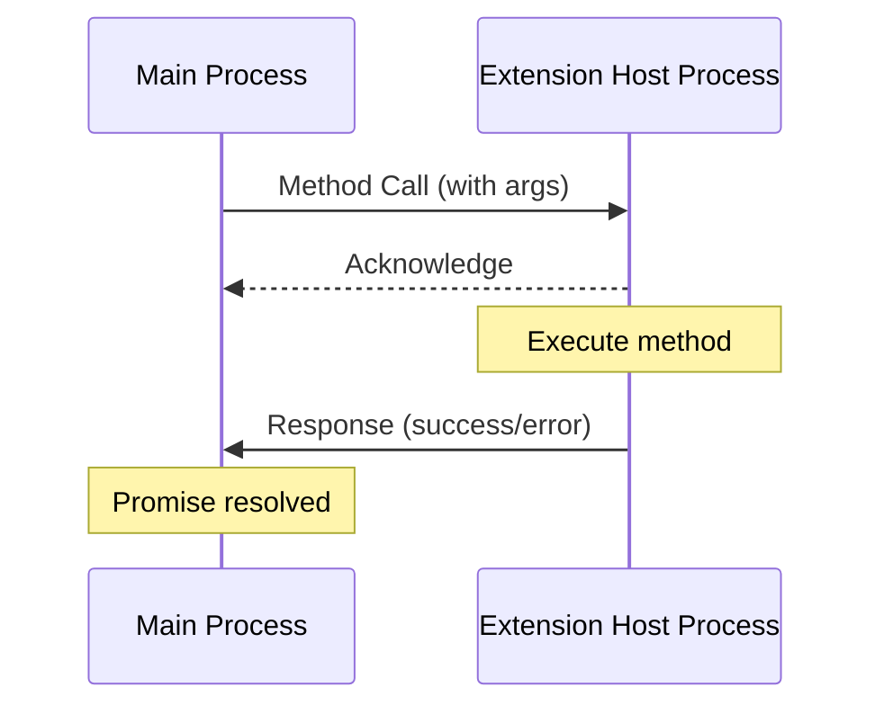
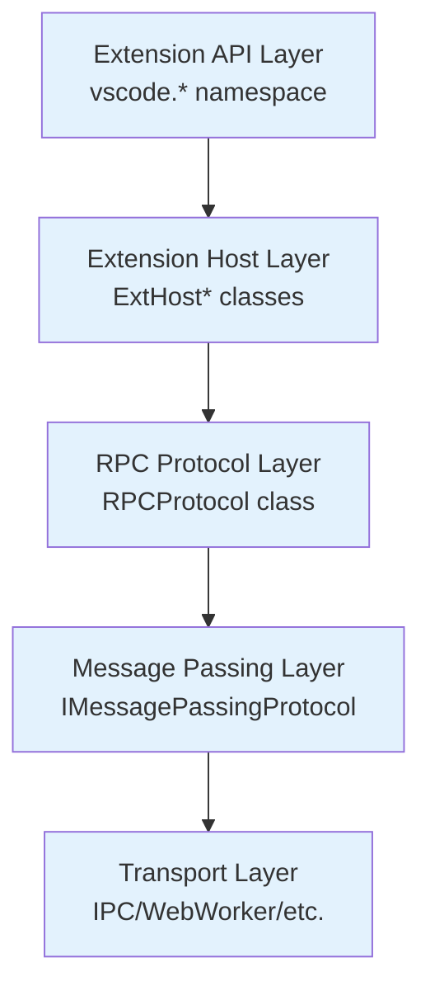

# VSCode RPC Protocol Documentation

This directory contains comprehensive documentation for Visual Studio Code's Remote Procedure Call (RPC) protocol, which enables communication between the main workbench process and extension host processes.

## Table of Contents

- [Overview](overview.md) - High-level architecture and concepts
- [Message Format](message-format.md) - Binary protocol specification and serialization
- [Proxy System](proxy-system.md) - Type-safe proxy objects and identifiers
- [Extension Host Communication](extension-host-communication.md) - Main thread ↔ extension host patterns
- [Usage Examples](usage-examples.md) - Common patterns and implementation examples
- [API Reference](api-reference.md) - Complete interface documentation
- [Lazy Promises](lazy-promises.md) - Deferred promise implementation for performance optimization
- [Marshalling System](marshalling-system.md) - Object serialization and type preservation
- [Security Considerations](security-considerations.md) - Security measures and threat protection

## Quick Start

The VSCode RPC protocol is a binary message-passing system that provides:

- **Type-safe communication** between processes via proxy objects
- **Bidirectional method calls** with Promise-based responses
- **Cancellation support** for long-running operations
- **Efficient serialization** for complex data types including buffers
- **Error handling** with stack trace preservation
- **Responsiveness monitoring** to detect unresponsive extension hosts

## Key Files

The RPC protocol implementation is located in:

- `src/vs/workbench/services/extensions/common/rpcProtocol.ts` - Core protocol implementation
- `src/vs/workbench/services/extensions/common/proxyIdentifier.ts` - Proxy system and identifiers
- `src/vs/workbench/api/common/extHost.protocol.ts` - Extension host protocol definitions
- `src/vs/base/parts/ipc/common/ipc.ts` - Underlying message passing interface

## Protocol Flow

1. **Proxy Creation**: Type-safe proxies are created for remote objects
2. **Method Invocation**: Methods on proxies become RPC calls
3. **Serialization**: Arguments are serialized with buffer reference handling
4. **Acknowledgment**: Immediate ack to track responsiveness
5. **Execution**: Method executed on remote side with error handling
6. **Response**: Result serialized and returned via Promise

## Architecture

The RPC system follows a layered architecture:

Each layer provides specific abstractions and capabilities for robust inter-process communication.