# Extension Host Communication

## Overview

VSCode's extension system relies on the RPC protocol to enable secure, isolated communication between the main workbench and extension host processes. This document explains the communication patterns, lifecycle management, and architectural decisions that make VSCode's extension system robust and performant.

## Architecture

### Process Separation

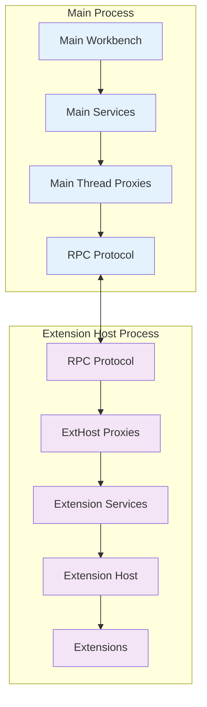

### Communication Channels

VSCode supports multiple extension host types with different communication mechanisms:

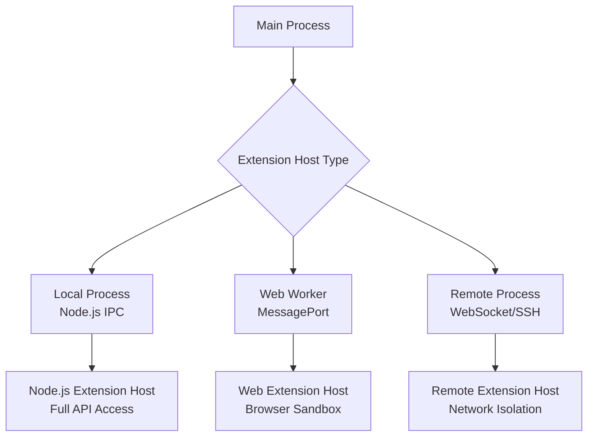

## Extension Host Lifecycle

### Startup Sequence

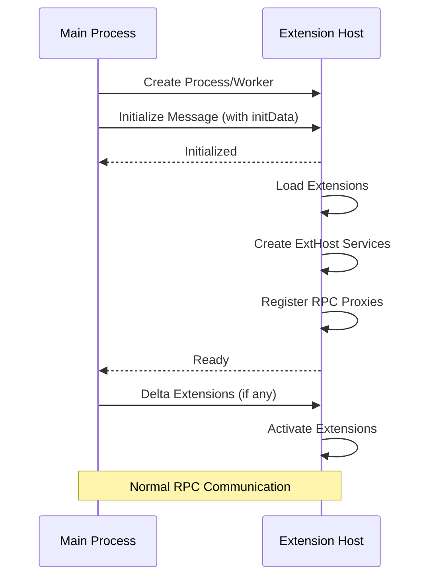

### Initialization Data

The extension host receives comprehensive initialization data:

```typescript
interface IExtensionHostInitData {
  extensions: IExtensionDescription[];           // Extension manifests
  resolvedExtensions: ExtensionIdentifier[];     // Resolved extension IDs
  hostExtensions: ExtensionIdentifier[];         // Host-provided extensions
  environment: IEnvironment;                     // Paths, settings, etc.
  logLevel: LogLevel;                           // Logging configuration
  logsLocation: URI;                            // Log file location
  autoStart: boolean;                           // Auto-activation flag
  remote: IRemoteAgentEnvironment | null;       // Remote connection info
  uiKind: UIKind;                              // Desktop vs Web
}
```

### Extension Loading

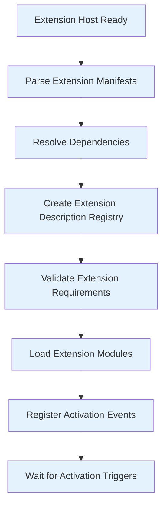

## RPC Service Registration

### Main Thread Services

Main thread services are registered during workbench startup:

```typescript
// In ExtensionHostManager
const extHostContext: IExtHostContext = {
  getProxy: <T>(identifier: ProxyIdentifier<T>): Proxied<T> => 
    this._rpcProtocol!.getProxy(identifier),
  set: <T, R extends T>(identifier: ProxyIdentifier<T>, instance: R): R => 
    this._rpcProtocol!.set(identifier, instance),
  // ... other methods
};

// Register main thread services
for (const [id, ctor] of getMainThreadAPIs()) {
  const instance = this._instantiationService.createInstance(ctor, extHostContext);
  this._rpcProtocol.set(id, instance);
}
```

### Extension Host Services

Extension host services are registered during extension host initialization:

```typescript
// In extHost.api.impl.ts
export function createApiFactoryAndRegisterActors(accessor: ServicesAccessor): IExtensionApiFactory {
  const rpcProtocol = accessor.get(IExtHostRpcService);
  
  // Register all extension host services
  rpcProtocol.set(ExtHostContext.ExtHostCommands, extHostCommands);
  rpcProtocol.set(ExtHostContext.ExtHostDocuments, extHostDocuments);
  rpcProtocol.set(ExtHostContext.ExtHostLanguageFeatures, extHostLanguageFeatures);
  // ... 40+ more service registrations
  
  // Ensure all required services are registered
  rpcProtocol.assertRegistered(extensionHostExpectedProxies);
}
```

## Communication Patterns

### Command Execution

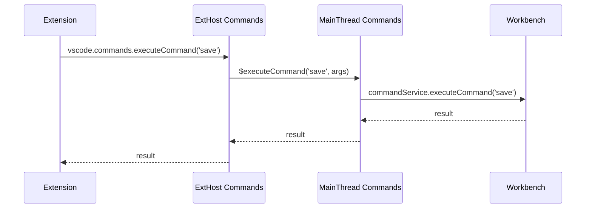

### Document Synchronization

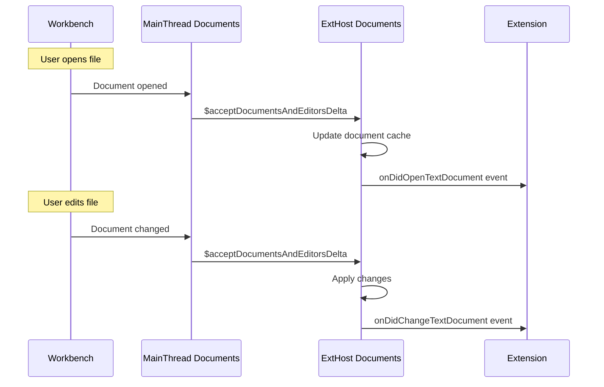

### Language Features

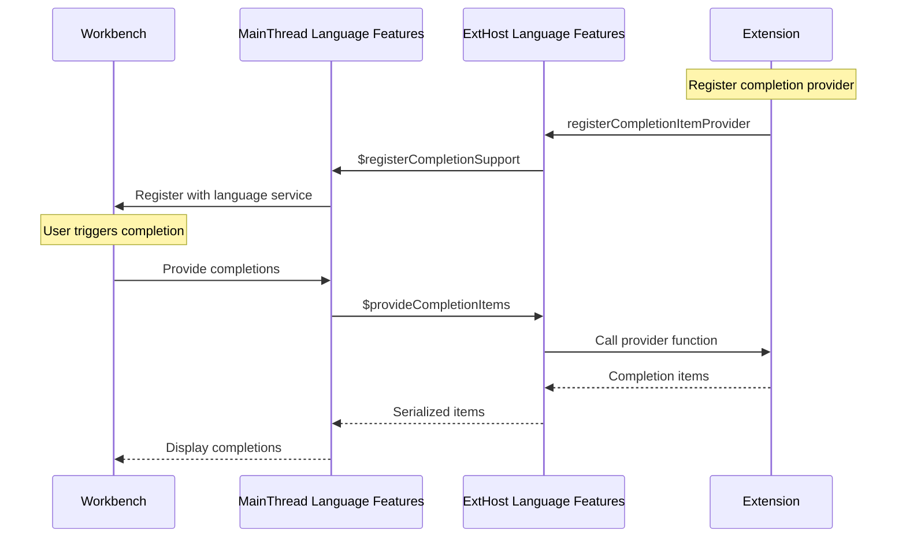

## Error Handling and Recovery

### Extension Host Crash Recovery

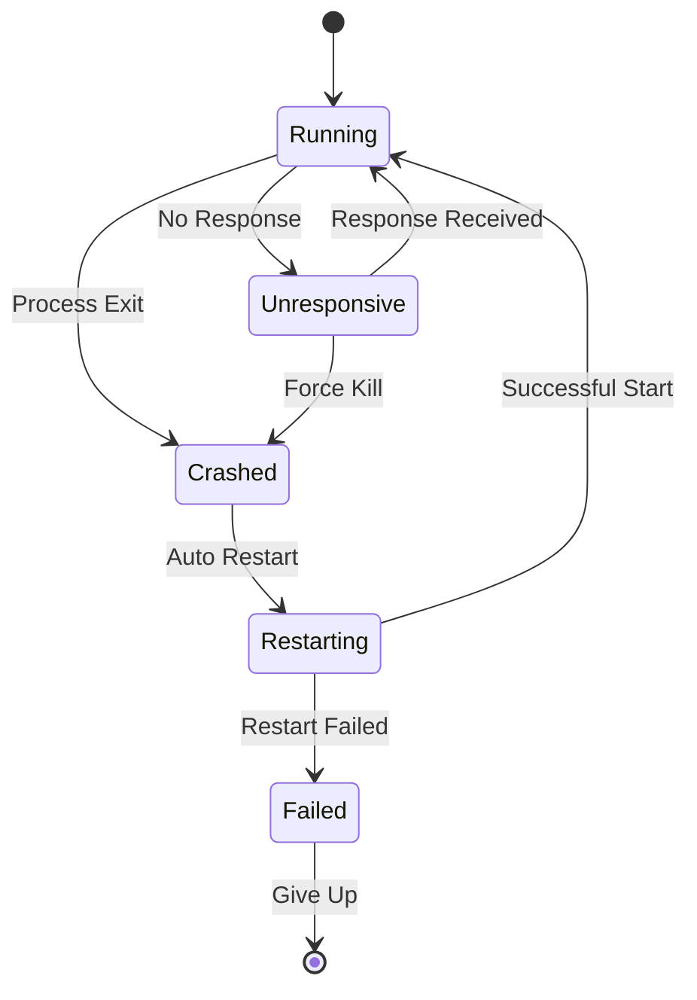

### Error Propagation

Errors are carefully preserved across process boundaries:

```typescript
// Original extension error
function extensionFunction() {
  throw new Error("Extension failed");
}

// Error serialization (automatic)
const serializedError = {
  $isError: true,
  name: "Error",
  message: "Extension failed",
  stack: "Error: Extension failed\n    at extensionFunction..."
};

// Error reconstruction in main thread
const reconstructedError = new Error();
reconstructedError.name = serializedError.name; 
reconstructedError.message = serializedError.message;
reconstructedError.stack = serializedError.stack;
```

### Graceful Degradation

When the extension host becomes unresponsive:

1. **Detection**: 3-second timeout without acknowledgment
2. **User Notification**: "Extension host unresponsive" warning
3. **Partial Functionality**: Core editor features continue working
4. **Recovery Options**: Restart extension host or disable problematic extensions

## Performance Optimizations

### Batched Operations

Related operations are batched to reduce RPC overhead:

```typescript
// Document changes are batched
interface IDocumentsAndEditorsDelta {
  removedDocuments?: URI[];
  addedDocuments?: IModelAddedData[];
  removedEditors?: string[];
  addedEditors?: ITextEditorAddData[];
}

// Single RPC call for multiple changes
mainThreadDocuments.$acceptDocumentsAndEditorsDelta(delta);
```

### Lazy Initialization

Services are initialized only when needed:

```typescript
// Extension services created on demand
private _getOrCreateExtHostService<T>(identifier: ProxyIdentifier<T>): T {
  if (!this._services.has(identifier.nid)) {
    const service = this._createService(identifier);
    this._services.set(identifier.nid, service);
  }
  return this._services.get(identifier.nid);
}
```

### Event Throttling

High-frequency events are throttled:

```typescript
// Text change events are debounced
private _textChangeEventThrottle = new Throttler();

private _onDidChangeTextDocument(e: vscode.TextDocumentChangeEvent): void {
  this._textChangeEventThrottle.queue(() => {
    this._onDidChangeTextDocumentEmitter.fire(e);
  });
}
```

## Security Considerations

### Process Isolation

- **Separate processes**: Extensions run in isolated address space
- **Limited system access**: Restricted file system and network access
- **API boundaries**: Only approved APIs accessible via RPC

### Input Validation

All RPC inputs are validated:

```typescript
// Example validation in MainThread service
$executeCommand(id: string, args: any[]): Promise<any> {
  if (typeof id !== 'string') {
    throw new Error('Command ID must be a string');
  }
  if (!Array.isArray(args)) {
    throw new Error('Arguments must be an array');
  }
  return this._commandService.executeCommand(id, ...args);
}
```

### Sandboxing

Different extension host types provide different sandboxing levels:

- **Local Process**: OS-level process isolation
- **Web Worker**: JavaScript execution context isolation  
- **Remote Process**: Network and machine-level isolation

## Debugging and Monitoring

### Extension Host Inspector

Enable debugging with `--inspect-extensions` flag:

```bash
code --inspect-extensions=9229
```

### RPC Communication Logging

Enable detailed RPC logging:

```typescript
// Set environment variable
process.env.VSCODE_LOG_LEVEL = 'trace';

// Or enable in code
const LOG_EXTENSION_HOST_COMMUNICATION = true;
```

### Performance Monitoring

Built-in metrics track extension host performance:

```typescript
interface ExtensionHostMetrics {
  startup: number;              // Startup time
  activationTime: number;       // Extension activation time
  rpcCallCount: number;        // Total RPC calls
  averageResponseTime: number; // Average RPC response time
  memoryUsage: number;         // Memory consumption
}
```

## Extension Activation

### Activation Events

Extensions activate based on events:

```typescript
// From extension manifest
"activationEvents": [
  "onLanguage:typescript",
  "onCommand:extension.sayHello",
  "workspaceContains:**/.eslintrc.*",
  "onFileSystem:sftp"
]
```

### Activation Flow

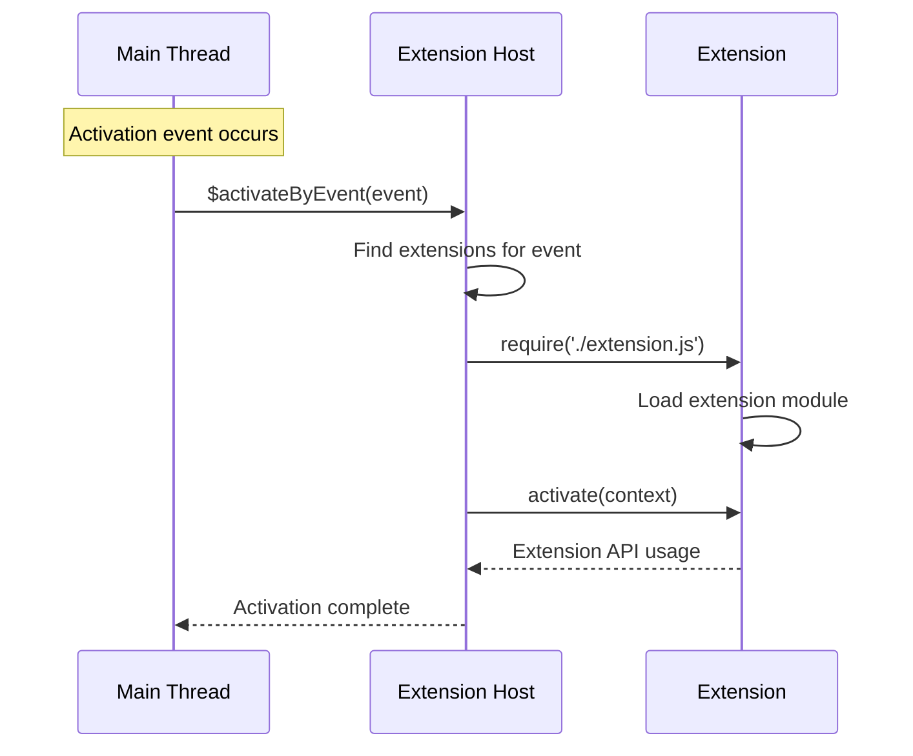

### Lazy Activation

Extensions are activated only when needed:

- **Language activation**: When files of specific language are opened
- **Command activation**: When specific commands are invoked
- **Workspace activation**: When workspace contains specific files
- **Manual activation**: Via extension manager or API calls

## Advanced Topics

### Multi-Extension Host Support

VSCode can run multiple extension hosts simultaneously:

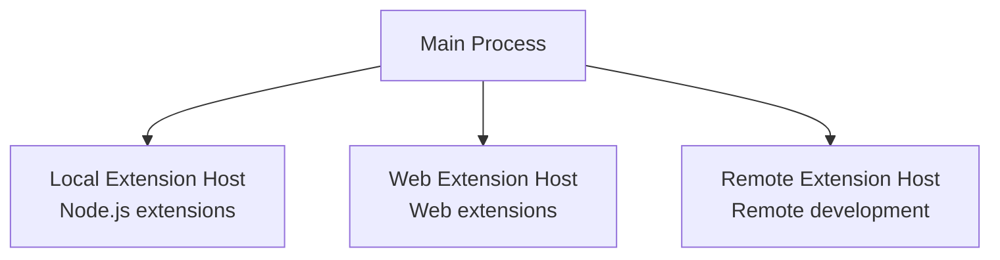

### Extension Host Kinds

Different extension host types for different scenarios:

```typescript
enum ExtensionHostKind {
  LocalProcess = 1,    // Node.js process (full API access)
  LocalWebWorker = 2,  // Web Worker (limited API access)  
  Remote = 3           // Remote machine (full API access)
}
```

### Custom Extension Hosts

Third-party tools can create custom extension hosts:

```typescript
interface IExtensionHost {
  readonly pid: number | null;
  readonly runningLocation: ExtensionRunningLocation;
  readonly startup: ExtensionHostStartup;
  
  start(): Promise<IMessagePassingProtocol>;
  getInspectPort(): number | undefined;
  enableInspectPort(): Promise<boolean>;
  dispose(): Promise<void>;
}
```

## Web Worker Extension Host Specifics

### Web Worker Communication

Web Workers provide a sandboxed environment for extensions running in browser contexts:

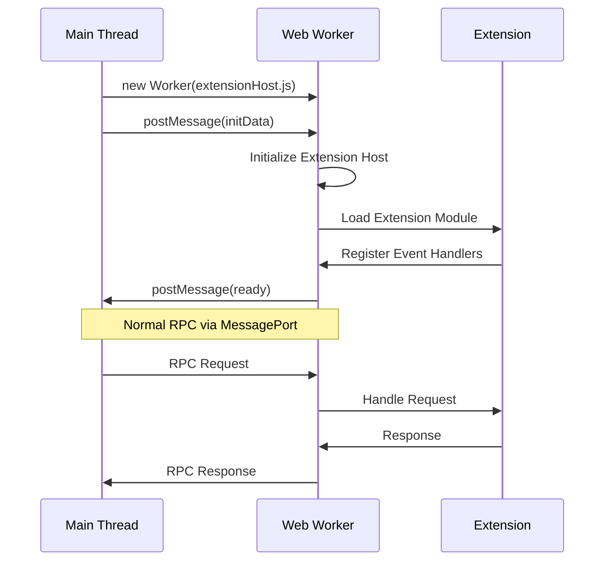

### MessagePort Transport

Web Worker extension hosts use MessagePort for RPC communication:

```typescript
// Main thread side
class WebWorkerExtensionHostManager {
  private _worker: Worker;
  private _messagePort: MessagePort;
  
  private _createExtensionHost(): void {
    this._worker = new Worker('./extensionHost.js');
    
    // Create message channel for RPC
    const { port1, port2 } = new MessageChannel();
    this._messagePort = port1;
    
    // Send port to worker
    this._worker.postMessage({ port: port2 }, [port2]);
    
    // Setup RPC protocol
    const protocol = new MessagePortProtocol(this._messagePort);
    this._rpcProtocol = new RPCProtocol(protocol);
  }
}

// Worker side
class MessagePortProtocol implements IMessagePassingProtocol {
  private _port: MessagePort;
  private _onMessage = new Emitter<VSBuffer>();
  
  constructor(port: MessagePort) {
    this._port = port;
    this._port.onmessage = (event) => {
      const buffer = VSBuffer.wrap(new Uint8Array(event.data));
      this._onMessage.fire(buffer);
    };
  }
  
  send(buffer: VSBuffer): void {
    this._port.postMessage(buffer.buffer.slice(buffer.byteOffset, buffer.byteOffset + buffer.byteLength));
  }
  
  get onMessage(): Event<VSBuffer> {
    return this._onMessage.event;
  }
}
```

### Browser Sandbox Limitations

Web Worker extension hosts have limited capabilities compared to Node.js hosts:

**Restricted APIs:**
- No file system access (except virtual file systems)
- No native module loading
- No child process spawning
- Limited network access (same-origin policy)
- No direct DOM manipulation

**Available APIs:**
- Core VS Code extension API
- Web-compatible Node.js APIs (polyfilled)
- Browser APIs (fetch, WebAssembly, etc.)
- Virtual file system providers

**Adaptation Strategies:**
```typescript
// File system operations via virtual providers
export class WebFileSystemProvider implements vscode.FileSystemProvider {
  async readFile(uri: vscode.Uri): Promise<Uint8Array> {
    // Use fetch or IndexedDB instead of fs.readFile
    const response = await fetch(uri.toString());
    return new Uint8Array(await response.arrayBuffer());
  }
  
  async writeFile(uri: vscode.Uri, content: Uint8Array): Promise<void> {
    // Store in IndexedDB or send to server
    await this.storeInIndexedDB(uri.path, content);
  }
}

// Network requests via extension host proxy
export class WebNetworkService {
  constructor(private proxy: MainThreadNetworkShape) {}
  
  async makeRequest(url: string): Promise<string> {
    // Proxy through main thread to bypass CORS
    return this.proxy.$makeRequest(url);
  }
}
```

### Performance Considerations

Web Worker extension hosts have different performance characteristics:

**Advantages:**
- True parallelism without blocking main thread
- Efficient message passing via structured cloning
- Automatic memory management via browser GC
- No IPC overhead (direct memory sharing)

**Disadvantages:**
- Structured cloning overhead for complex objects
- Limited to single core execution
- Higher memory usage due to browser overhead
- Slower cold startup compared to Node.js

**Optimization Techniques:**
```typescript
// Minimize data transfer between main thread and worker
class OptimizedWebWorkerCommunication {
  // Use Transferable objects for large data
  sendLargeData(data: ArrayBuffer): void {
    this._port.postMessage({ type: 'largeData', data }, [data]);
  }
  
  // Batch small operations
  private _pendingOperations: Operation[] = [];
  
  queueOperation(op: Operation): void {
    this._pendingOperations.push(op);
    
    // Batch operations every 16ms (60fps)
    if (this._pendingOperations.length === 1) {
      setTimeout(() => this.flushOperations(), 16);
    }
  }
  
  private flushOperations(): void {
    if (this._pendingOperations.length > 0) {
      this._port.postMessage({
        type: 'batchOperations',
        operations: this._pendingOperations.splice(0)
      });
    }
  }
}
```

### Debugging Web Worker Extension Hosts

**Chrome DevTools Integration:**
```typescript
// Enable debugging in worker
if (typeof importScripts === 'function') {
  // Running in Web Worker
  console.log('Extension Host Worker started');
  
  // Expose debugging utilities
  (globalThis as any).debugExtensionHost = {
    getRPCStats: () => this._rpcProtocol.getStats(),
    getLoadedExtensions: () => this._extensionRegistry.getAllExtensions(),
    getMemoryUsage: () => performance.memory
  };
}
```

**Worker Communication Debugging:**
```typescript
class DebugMessagePortProtocol extends MessagePortProtocol {
  send(buffer: VSBuffer): void {
    console.log(`[Worker→Main] Sending ${buffer.byteLength} bytes`);
    super.send(buffer);
  }
  
  protected handleMessage(event: MessageEvent): void {
    console.log(`[Main→Worker] Received ${event.data.byteLength} bytes`);
    super.handleMessage(event);
  }
}
```

This communication system enables VSCode's rich extension ecosystem while maintaining security, performance, and reliability across different execution environments.