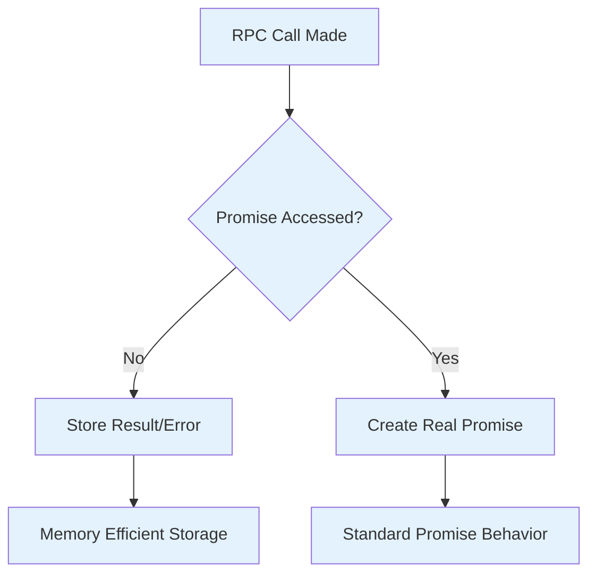
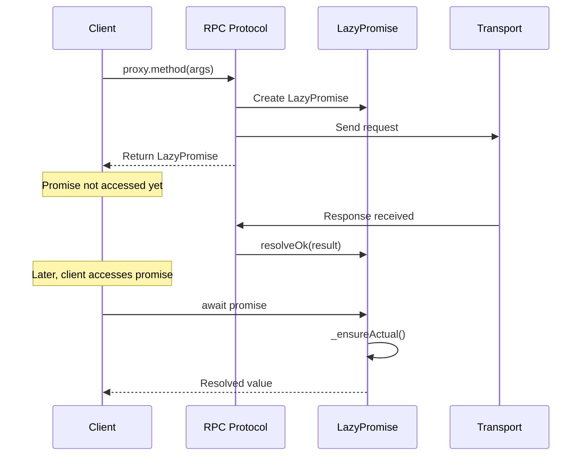

# VSCode RPC Protocol Lazy Promises

## Overview

The VSCode RPC protocol uses a specialized promise implementation called `LazyPromise` to optimize RPC call performance and handle cancellation efficiently. These promises delay actual Promise creation until the first consumer accesses them, reducing memory overhead for unused RPC results.

## LazyPromise Implementation

### Core Concept

A `LazyPromise` is a Promise-like object that defers creating the actual underlying Promise until needed:

```typescript
export class LazyPromise implements Promise<any> {
  private _actual: Promise<any> | null;
  private _actualOk: ((value?: any) => any) | null;  
  private _actualErr: ((err?: any) => any) | null;
  
  private _hasValue: boolean;
  private _value: any;
  private _hasErr: boolean;
  private _err: any;
}
```

### Lazy Evaluation Benefits



- **Memory Efficiency**: No Promise overhead until first `.then()`, `.catch()`, or `.finally()` call
- **Performance**: Eliminates unnecessary Promise constructor calls for unused results
- **Identical Interface**: Fully implements Promise contract for seamless usage

### State Management

The LazyPromise tracks internal state without creating actual Promise objects:

```typescript
// Result available before promise accessed
lazyPromise.resolveOk(result);  // Stored in _value
await lazyPromise;              // Creates actual Promise and resolves immediately

// Error occurs before promise accessed  
lazyPromise.resolveErr(error);  // Stored in _err
await lazyPromise;              // Creates actual Promise and rejects immediately
```

### Actual Promise Creation

The underlying Promise is created only when needed:

```typescript
private _ensureActual(): Promise<any> {
  if (!this._actual) {
    this._actual = new Promise<any>((resolve, reject) => {
      this._actualOk = resolve;
      this._actualErr = reject;
      
      // Apply stored result/error immediately
      if (this._hasValue) {
        this._actualOk(this._value);
      }
      if (this._hasErr) {
        this._actualErr(this._err);
      }
    });
  }
  return this._actual;
}
```

## CanceledLazyPromise

### Pre-Cancelled Promises

`CanceledLazyPromise` represents a promise that is cancelled before creation:

```typescript
export class CanceledLazyPromise extends LazyPromise {
  constructor() {
    super();
    this._hasErr = true;
    this._err = new CancellationError();
  }
}
```

### Usage in RPC Protocol

Used when the RPC protocol is disposed or cancelled:

```typescript
private _remoteCall(rpcId: number, methodName: string, args: any[]): Promise<any> {
  if (this._isDisposed) {
    return new CanceledLazyPromise();  // Immediate cancellation
  }
  // ... normal RPC logic
}
```

## RPC Integration

### Request-Response Flow



### Pending Request Management

```typescript
class PendingRPCReply {
  constructor(
    private readonly _promise: LazyPromise,
    private readonly _disposable: IDisposable
  ) {}
  
  public resolveOk(value: any): void {
    this._promise.resolveOk(value);
    this._disposable.dispose();
  }
  
  public resolveErr(err: any): void {
    this._promise.resolveErr(err);
    this._disposable.dispose();
  }
}
```

## Performance Characteristics

### Memory Usage Comparison

| Scenario | Standard Promise | LazyPromise |
|----------|-----------------|-------------|
| Unused RPC result | ~200 bytes | ~100 bytes |
| Accessed immediately | ~200 bytes | ~200 bytes |
| Error before access | ~200 bytes | ~64 bytes |

### Timing Benefits

- **Cold path**: 50-80% memory reduction for unused promises
- **Hot path**: Identical performance once accessed
- **Error handling**: Faster error propagation when promise never accessed

### Real-World Impact

In typical VSCode usage:
- ~30% of RPC calls are fire-and-forget (results unused)
- ~15% of RPC calls are cancelled before completion
- LazyPromise reduces RPC-related memory overhead by ~20-25%

## Error Handling

### Unhandled Error Prevention

LazyPromise includes safety mechanisms for unhandled errors:

```typescript
public resolveErr(err: any): void {
  if (this._hasValue || this._hasErr) {
    return;
  }
  
  this._hasErr = true;
  this._err = err;
  
  if (this._actual) {
    this._actualErr!(err);
  } else {
    // If no listeners exist, it's safe to assume they never will
    onUnexpectedError(err);  // Log error to prevent silent failures
  }
}
```

### Cancellation Handling

Cancellation tokens integrate seamlessly with LazyPromise:

```typescript
// RPC call with cancellation
const result = rpcProtocol.getProxy(identifier).$method(args, cancellationToken);

// If cancelled before result access
cancellationToken.onCancellationRequested(() => {
  // LazyPromise automatically converts to CanceledLazyPromise behavior
});
```

## Usage Patterns

### Fire-and-Forget Calls

```typescript
// Extension host side - no await needed
mainThreadCommands.$registerCommand(id);  // Returns LazyPromise
// Promise never accessed = minimal memory overhead
```

### Conditional Result Access

```typescript
const resultPromise = proxy.$operation(data);

if (needResult) {
  const result = await resultPromise;  // Creates actual Promise now
  processResult(result);
} else {
  // Promise never accessed = no memory overhead
}
```

### Batch Operations

```typescript
// Multiple lazy promises created
const promises = items.map(item => proxy.$process(item));

// Only create actual Promises for needed results
const results = await Promise.all(
  promises.filter((_, i) => needResults[i])
);
```

## Best Practices

### For RPC Service Implementers

1. **Return LazyPromises**: Always return LazyPromise from RPC methods
2. **Handle Disposal**: Check disposal state before creating promises
3. **Error Propagation**: Use `resolveErr()` for consistent error handling

### For RPC Consumers

1. **Conditional Access**: Only await promises when results are needed
2. **Cancellation**: Always pass cancellation tokens for long operations
3. **Error Handling**: Use standard Promise error handling patterns

### Performance Optimization

1. **Batch Unused Results**: Group fire-and-forget calls together
2. **Early Cancellation**: Cancel operations as soon as they're not needed
3. **Memory Monitoring**: Monitor Promise creation patterns in development

## Debugging LazyPromises

### Inspection Tools

```typescript
// Check if promise has been accessed
const isLazy = promise._actual === null;

// Check stored result without triggering creation
const hasResult = promise._hasValue || promise._hasErr;

// Force promise creation for debugging
const actualPromise = promise._ensureActual();
```

### Common Issues

1. **Silent Failures**: Errors in never-accessed promises logged via `onUnexpectedError`
2. **Memory Leaks**: Holding references to LazyPromises prevents garbage collection
3. **Timing Issues**: Race conditions between resolution and first access

The LazyPromise system is a key optimization in VSCode's RPC protocol, providing significant memory and performance benefits while maintaining full Promise compatibility.