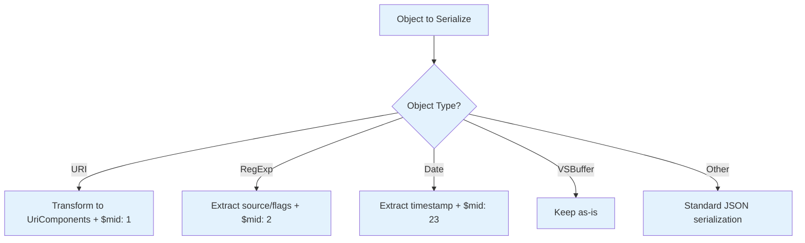

# VSCode RPC Protocol Marshalling System

## Overview

The VSCode RPC protocol includes a sophisticated marshalling system that automatically serializes and deserializes complex objects across process boundaries. This system ensures that special objects like URIs, RegExp, and VSCode-specific types are properly preserved during RPC communication.

## Core Concepts

### MarshalledObject Interface

All marshalled objects include a `$mid` (Marshalled ID) property for type identification:

```typescript
interface MarshalledObject {
  $mid: MarshalledId;
}
```

### MarshalledId Enum

The system uses numeric IDs to identify object types during serialization:

```typescript
export const enum MarshalledId {
  Uri = 1,
  Regexp = 2,
  ScmResource = 3,
  ScmResourceGroup = 4,
  ScmProvider = 5,
  CommentController = 6,
  CommentThread = 7,
  // ... 25+ more specialized types
  Date = 23,
  // VSCode-specific context types
  ChatViewContext = 25,
  LanguageModelToolResult = 26,
  // ... additional types
}
```

## Serialization Process

### Automatic Object Detection

The marshalling system automatically detects and transforms specific object types:



### Replacer Function

The marshalling replacer handles specific object types during JSON.stringify:

```typescript
function replacer(key: string, value: any): any {
  // URI is handled via toJSON() method automatically
  if (value instanceof RegExp) {
    return {
      $mid: MarshalledId.Regexp,
      source: value.source,
      flags: value.flags,
    };
  }
  return value;  // Default JSON serialization
}
```

### Example Serialization

```typescript
// Original objects
const data = {
  file: URI.file('/path/to/file'),
  pattern: /test.*$/gi,
  timestamp: new Date('2024-01-01'),
  buffer: VSBuffer.fromString('binary data')
};

// Serialized representation
{
  "file": {
    "$mid": 1,
    "scheme": "file", 
    "path": "/path/to/file"
  },
  "pattern": {
    "$mid": 2,
    "source": "test.*$",
    "flags": "gi"
  },
  "timestamp": {
    "$mid": 23,
    "source": 1704067200000
  },
  "buffer": "<VSBuffer handled separately>"
}
```

## Deserialization Process

### Type-Safe Revival

The `revive` function reconstructs objects based on their `$mid` values:

```typescript
export function revive<T = any>(obj: any, depth = 0): Revived<T> {
  if (!obj || depth > 200) {  // Prevent infinite recursion
    return obj;
  }
  
  if (typeof obj === 'object') {
    switch ((<MarshalledObject>obj).$mid) {
      case MarshalledId.Uri: 
        return <any>URI.revive(obj);
      case MarshalledId.Regexp: 
        return <any>new RegExp(obj.source, obj.flags);
      case MarshalledId.Date: 
        return <any>new Date(obj.source);
    }
    
    // Handle VSBuffer and Uint8Array
    if (obj instanceof VSBuffer || obj instanceof Uint8Array) {
      return <any>obj;
    }
    
    // Recursively revive arrays and objects
    if (Array.isArray(obj)) {
      for (let i = 0; i < obj.length; ++i) {
        obj[i] = revive(obj[i], depth + 1);
      }
    } else {
      for (const key in obj) {
        if (Object.hasOwnProperty.call(obj, key)) {
          obj[key] = revive(obj[key], depth + 1);
        }
      }
    }
  }
  
  return obj;
}
```

### Revived Type System

TypeScript type definitions ensure type safety after revival:

```typescript
type Deserialize<T> = T extends UriComponents ? URI
  : T extends VSBuffer ? VSBuffer
  : T extends object ? Revived<T>
  : T;

export type Revived<T> = { [K in keyof T]: Deserialize<T[K]> };
```

## URI Transformation

### Special URI Handling

URIs receive special treatment for remote development scenarios:

```typescript
// Original URI
const uri = URI.file('/local/path/file.ts');

// Serialized with path transformation
{
  "$mid": 1,
  "scheme": "vscode-remote",
  "authority": "ssh-remote+server",
  "path": "/remote/path/file.ts"
}

// Revived back to URI
const revivedUri = URI.revive(serializedUri);
```

### URI Transformer Integration

The RPC protocol integrates with URI transformers for path mapping:

```typescript
class RPCProtocol {
  constructor(
    protocol: IMessagePassingProtocol,
    logger: IRPCProtocolLogger | null = null,
    transformer: IURITransformer | null = null  // Handles URI path mapping
  ) {
    this._uriTransformer = transformer;
  }
  
  transformIncomingURIs<T>(obj: T): T {
    return transformIncomingURIs(obj, this._uriTransformer);
  }
}
```

## Security Considerations

### Depth Protection

The revive function includes protection against malicious deep object graphs:

```typescript
export function revive<T = any>(obj: any, depth = 0): Revived<T> {
  if (!obj || depth > 200) {  // Maximum depth limit
    return obj;
  }
  // ... revival logic
}
```

### Controlled Type Revival

Only known, safe types are revived based on `MarshalledId`:

- **Allowed Types**: URI, RegExp, Date, VSCode-specific contexts
- **Prevented**: Function objects, DOM nodes, other potentially dangerous types
- **Validation**: Each type has specific validation during revival

### Buffer Reference Safety

VSBuffer objects are handled through the separate buffer reference system to prevent:

- **Memory exhaustion**: Large buffers handled efficiently
- **Prototype pollution**: Buffer objects are validated
- **Data corruption**: Binary data integrity maintained

## Performance Characteristics

### Serialization Performance

| Object Type | Serialization Cost | Memory Overhead |
|-------------|-------------------|-----------------|
| URI | ~0.1ms | +32 bytes ($mid + components) |
| RegExp | ~0.05ms | +24 bytes ($mid + source/flags) |
| Date | ~0.02ms | +16 bytes ($mid + timestamp) |
| VSBuffer | ~0ms | 0 bytes (reference system) |

### Memory Usage

- **Marshalled Overhead**: ~16-32 bytes per marshalled object
- **Deep Object Revival**: O(n) where n = total properties
- **Circular Reference Prevention**: Depth limiting prevents stack overflow

### Optimization Features

1. **Type-specific Handlers**: Optimized paths for common types
2. **Lazy Revival**: Objects revived only when accessed (in some contexts)
3. **Reference Preservation**: VSBuffer uses reference system for efficiency
4. **Depth Limiting**: Prevents expensive deep recursion

## Integration with RPC Protocol

### Automatic Marshalling

RPC method arguments and return values are automatically marshalled:

```typescript
// Extension host call
const result = await mainThreadDocuments.$trySaveDocument(
  URI.file('/path/to/file')  // Automatically marshalled
);

// Main thread receives:
// { $mid: 1, scheme: "file", path: "/path/to/file" }
// And automatically revives back to URI instance
```

### Error Marshalling

Errors are also marshalled to preserve stack traces:

```typescript
// Original error in extension host
throw new Error("Something failed");

// Marshalled error
{
  $isError: true,  // Special marker for errors
  name: "Error",
  message: "Something failed",
  stack: "Error: Something failed\n    at ..."
}

// Revived error in main thread maintains stack trace
```

## VSCode-Specific Types

### Context Objects

Many VSCode-specific context objects are marshalled for menu commands and actions:

```typescript
// Chat view context
{
  "$mid": MarshalledId.ChatViewContext,
  "sessionId": "session123",
  "requestId": "req456"
}

// Test item context  
{
  "$mid": MarshalledId.TestItemContext,
  "tests": [testId1, testId2],
  "profile": profileId
}
```

### Language Model Objects

AI/ML related objects for language model integration:

```typescript
// Tool result
{
  "$mid": MarshalledId.LanguageModelToolResult,
  "content": [/* tool output */],
  "metadata": { /* execution details */ }
}
```

## Debugging Marshalling

### Inspection Tools

```typescript
// Check if object is marshalled
function isMarshalled(obj: any): boolean {
  return obj && typeof obj === 'object' && typeof obj.$mid === 'number';
}

// Get marshalled type name
function getMarshalledType(obj: any): string {
  if (!isMarshalled(obj)) return 'not-marshalled';
  return MarshalledId[obj.$mid] || 'unknown';
}

// Debug revival process
const original = { uri: URI.file('/test'), pattern: /abc/g };
const serialized = JSON.stringify(original, replacer);
const revived = revive(JSON.parse(serialized));
console.log('Revival successful:', revived.uri instanceof URI);
```

### Common Issues

1. **Missing Revival**: Objects with `$mid` not properly revived
2. **Type Mismatches**: Expecting specific type after revival
3. **Deep Object Performance**: Slow revival of deeply nested objects
4. **URI Transformation**: Path mapping issues in remote scenarios

## Best Practices

### For Service Implementers

1. **Use Standard Types**: Prefer URI, RegExp, Date over custom objects
2. **Validate Revival**: Check types after receiving marshalled objects
3. **Handle Errors**: Properly catch and handle marshalling errors

### For Extension Developers

1. **Type Safety**: Use TypeScript types that account for marshalling
2. **Object Design**: Design serializable data structures
3. **Performance**: Avoid deeply nested objects in RPC calls

### Testing Marshalling

```typescript
// Deep equality comparison utility
function deepEquals(a: any, b: any): boolean {
  if (a === b) return true;
  if (a == null || b == null) return false;
  if (typeof a !== typeof b) return false;
  
  if (typeof a === 'object') {
    // Handle special objects
    if (a instanceof URI && b instanceof URI) {
      return a.toString() === b.toString();
    }
    if (a instanceof RegExp && b instanceof RegExp) {
      return a.source === b.source && a.flags === b.flags;
    }
    if (a instanceof Date && b instanceof Date) {
      return a.getTime() === b.getTime();
    }
    
    // Handle arrays
    if (Array.isArray(a) !== Array.isArray(b)) return false;
    if (Array.isArray(a)) {
      if (a.length !== b.length) return false;
      for (let i = 0; i < a.length; i++) {
        if (!deepEquals(a[i], b[i])) return false;
      }
      return true;
    }
    
    // Handle objects
    const keysA = Object.keys(a);
    const keysB = Object.keys(b);
    if (keysA.length !== keysB.length) return false;
    
    for (const key of keysA) {
      if (!keysB.includes(key)) return false;
      if (!deepEquals(a[key], b[key])) return false;
    }
    return true;
  }
  
  return false;
}

// Test round-trip marshalling
function testMarshalling<T>(obj: T): boolean {
  const serialized = JSON.stringify(obj, replacer);
  const revived = revive<T>(JSON.parse(serialized));
  return deepEquals(obj, revived);
}

// Verify specific types
import { URI } from 'vs/base/common/uri';
import * as assert from 'assert';

assert(testMarshalling({ uri: URI.file('/test') }));
assert(testMarshalling({ pattern: /test/gi }));
assert(testMarshalling({ date: new Date() }));
```

The marshalling system is essential for maintaining object fidelity across VSCode's RPC boundaries, enabling seamless communication while preserving complex object types and their behaviors.