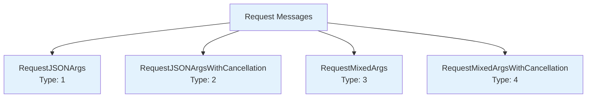
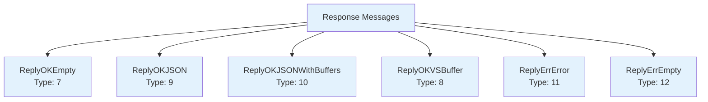
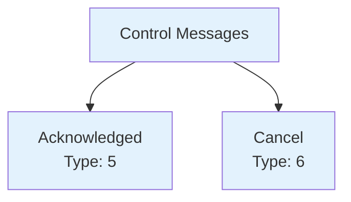
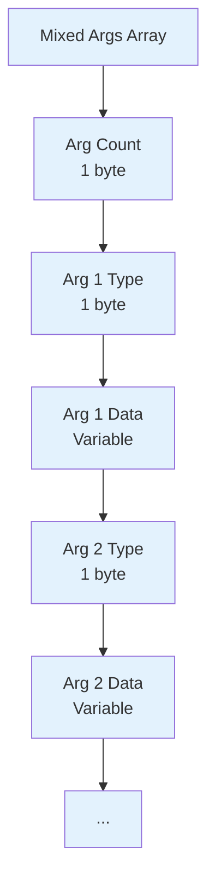
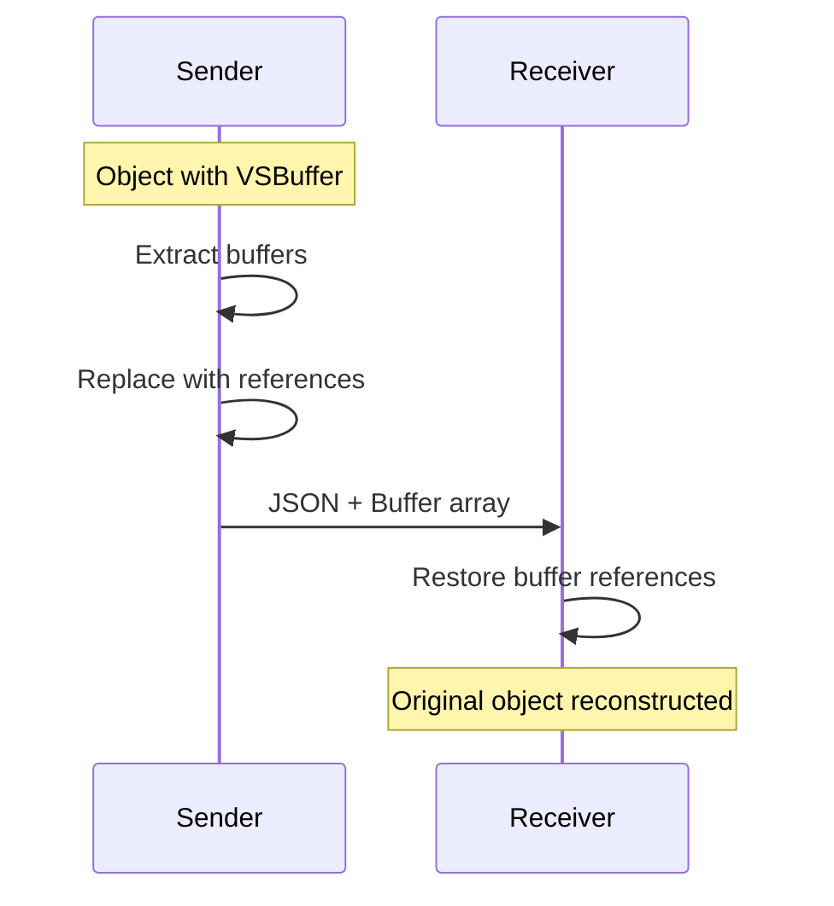
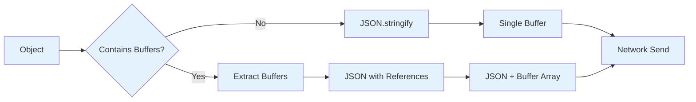

# VSCode RPC Protocol Message Format

## Overview

The VSCode RPC protocol uses a binary message format for efficient communication between processes. Messages are serialized as `VSBuffer` objects with a structured header and payload format. The protocol supports 12 distinct message types for various communication scenarios including requests, responses, acknowledgments, and cancellations.

## Message Structure

All RPC messages follow this basic structure:


### Message Header

| Field | Size | Type | Description |
|-------|------|------|-------------|
| Message Type | 1 byte | uint8 | Identifies the message type |
| Request ID | 4 bytes | uint32 (big-endian) | Unique identifier for request/response correlation |
| Payload | Variable | Mixed | Message-specific data |

## Message Types

The protocol defines 12 distinct message types (`src/vs/workbench/services/extensions/common/rpcProtocol.ts`):

### Request Messages



#### RequestJSONArgs (Type: 1)
Simple method call with JSON-serializable arguments.

**Payload Format:**
```
[RPC ID: 1 byte][Method Name Length: 1 byte][Method Name: string][Args Length: 4 bytes][Args JSON: string]
```

#### RequestJSONArgsWithCancellation (Type: 2)
Method call with JSON arguments and cancellation token support.

**Payload Format:** Same as RequestJSONArgs, but cancellation token is automatically appended to arguments.

#### RequestMixedArgs (Type: 3)
Method call with mixed argument types (JSON + VSBuffers + undefined values).

**Payload Format:**
```
[RPC ID: 1 byte][Method Name Length: 1 byte][Method Name: string][Mixed Args Array]
```

#### RequestMixedArgsWithCancellation (Type: 4)
Mixed arguments with cancellation support.

### Response Messages



#### ReplyOKEmpty (Type: 7)
Successful response with no return value (void methods).

**Payload Format:** None (header only)

#### ReplyOKJSON (Type: 9)
Successful response with JSON-serializable return value.

**Payload Format:**
```
[Response Length: 4 bytes][Response JSON: string]
```

#### ReplyOKJSONWithBuffers (Type: 10)
Successful response with JSON containing buffer references.

**Payload Format:**
```
[Buffer Count: 4 bytes][JSON Length: 4 bytes][JSON: string][Buffer 1 Length: 4 bytes][Buffer 1: bytes]...
```

#### ReplyOKVSBuffer (Type: 8)
Successful response returning a single VSBuffer.

**Payload Format:**
```
[Buffer Length: 4 bytes][Buffer Data: bytes]
```

#### ReplyErrError (Type: 11)
Error response with error details.

**Payload Format:**
```
[Error JSON Length: 4 bytes][Error JSON: string]
```

#### ReplyErrEmpty (Type: 12)
Error response without details.

**Payload Format:** None (header only)

### Control Messages



#### Acknowledged (Type: 5)
Immediate acknowledgment for responsiveness monitoring.

**Payload Format:** None (header only)

#### Cancel (Type: 6)
Cancellation notification for ongoing requests.

**Payload Format:** None (header only)

## Argument Serialization

### Simple JSON Arguments

For `RequestJSONArgs` messages, arguments are serialized as a JSON array:

```typescript
// Input
const args = ["hello", 42, { key: "value" }];

// Serialized
const jsonString = JSON.stringify(args);
// "[\"hello\",42,{\"key\":\"value\"}]"
```

### Mixed Arguments

For `RequestMixedArgs` messages, each argument is typed and serialized individually:



#### Argument Types

| Type | Value | Description | Data Format |
|------|-------|-------------|-------------|
| String | 1 | JSON-serialized value | `[Length: 4 bytes][JSON String: bytes]` |
| VSBuffer | 2 | Binary buffer | `[Length: 4 bytes][Buffer Data: bytes]` |
| SerializedObjectWithBuffers | 3 | Object with buffer refs | `[Buffer Count: 4 bytes][JSON Length: 4 bytes][JSON: string][Buffers...]` |
| Undefined | 4 | Undefined value | None |

### Buffer Reference System

For efficient handling of binary data, the protocol uses a buffer reference system:



#### Example: Object with Buffers

```typescript
// Original object
const obj = {
  text: "hello",
  data: VSBuffer.fromString("binary"),
  nested: {
    buffer: VSBuffer.fromString("more binary")
  }
};

// Serialized JSON (buffers become references)
{
  "text": "hello", 
  "data": { "$$ref$$": 0 },
  "nested": {
    "buffer": { "$$ref$$": 1 }
  }
}

// Separate buffer array
[
  VSBuffer.fromString("binary"),      // index 0
  VSBuffer.fromString("more binary")  // index 1
]
```

## URI Transformation

URIs are automatically transformed during serialization/deserialization:

```typescript
// Original URI
const uri = URI.file("/path/to/file");

// Serialized (after transformation)
{
  "$mid": 1,  // MarshalledId.Uri
  "scheme": "file",
  "path": "/transformed/path/to/file"
}
```

The `IURITransformer` handles:
- **Path translation** (local ↔ remote file systems)
- **Scheme transformation** (file ↔ vscode-remote)
- **Authority mapping** (for remote development scenarios)

## Special Value Handling

### Undefined Values

Since JSON.stringify converts `undefined` to `null`, the protocol preserves undefined:

```typescript
// Special undefined marker
const undefinedRef = { "$$ref$$": -1 };

// During serialization
if (typeof value === 'undefined') {
  return undefinedRef;
}
```

### Error Objects

Errors are serialized with full stack trace information:

```typescript
interface SerializedError {
  $isError: true;
  name: string;
  message: string;
  stack: string;
}
```

## Message Size Optimization

The protocol includes several optimizations for message size:

### Size Calculation

Before serialization, the protocol calculates exact buffer sizes:

```typescript
// Calculate total message size
let messageSize = 0;
messageSize += 1; // message type
messageSize += 4; // request ID
messageSize += payloadSize; // calculated payload

// Allocate exact buffer
const buffer = VSBuffer.alloc(messageSize);
```

### String Encoding

Strings use different encoding strategies based on length:

- **Short strings** (≤255 bytes): 1-byte length prefix
- **Long strings** (>255 bytes): 4-byte length prefix

### Buffer Reuse

The `MessageBuffer` class manages efficient buffer operations:

```typescript
class MessageBuffer {
  private _buff: VSBuffer;
  private _offset: number;
  
  writeUInt32(value: number): void {
    this._buff.writeUInt32BE(value, this._offset);
    this._offset += 4;
  }
  
  readUInt32(): number {
    const value = this._buff.readUInt32BE(this._offset);
    this._offset += 4;
    return value;
  }
}
```

## Performance Characteristics

### Serialization Performance



- **JSON serialization**: ~1-2ms for typical objects
- **Buffer extraction**: ~0.1ms per buffer
- **Total overhead**: ~5-10% of message processing time

### Memory Usage

- **Zero-copy buffers**: VSBuffers shared between serializer and transport
- **Reference counting**: Automatic buffer cleanup
- **Pooled allocations**: Message buffers reused when possible

## Debugging Message Format

### Message Logging

Enable detailed message logging:

```typescript
const LOG_EXTENSION_HOST_COMMUNICATION = true;

// Example log output:
// [Main→ExtHost] req#123: MainThreadCommands.executeCommand(["workbench.action.files.save"])
// [ExtHost→Main] ack#123
// [ExtHost→Main] reply#123: null
```

### Binary Inspection

For low-level debugging, inspect message buffers:

```typescript
function debugMessage(buffer: VSBuffer): void {
  const messageType = buffer.readUInt8(0);
  const requestId = buffer.readUInt32BE(1);
  console.log(`Type: ${messageType}, ID: ${requestId}`);
  console.log(`Hex:`, buffer.toString('hex'));
}
```

## Error Handling

### Malformed Messages

The protocol includes robust error handling for malformed messages:

```typescript
try {
  const messageType = buffer.readUInt8(0);
  if (messageType < 1 || messageType > 12) {
    throw new Error(`Invalid message type: ${messageType}`);
  }
  // Process message...
} catch (error) {
  console.error('Failed to parse message:', error);
  // Connection recovery logic...
}
```

### Size Limits

Built-in protection against oversized messages:

- **Maximum message size**: Configurable limit (default: ~100MB)
- **Argument count limits**: Prevents excessive argument arrays  
- **String length limits**: Prevents memory exhaustion attacks

This binary message format provides the foundation for efficient, type-safe communication in VSCode's extension system while maintaining compatibility across different transport mechanisms.