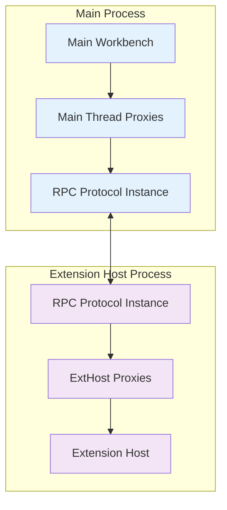
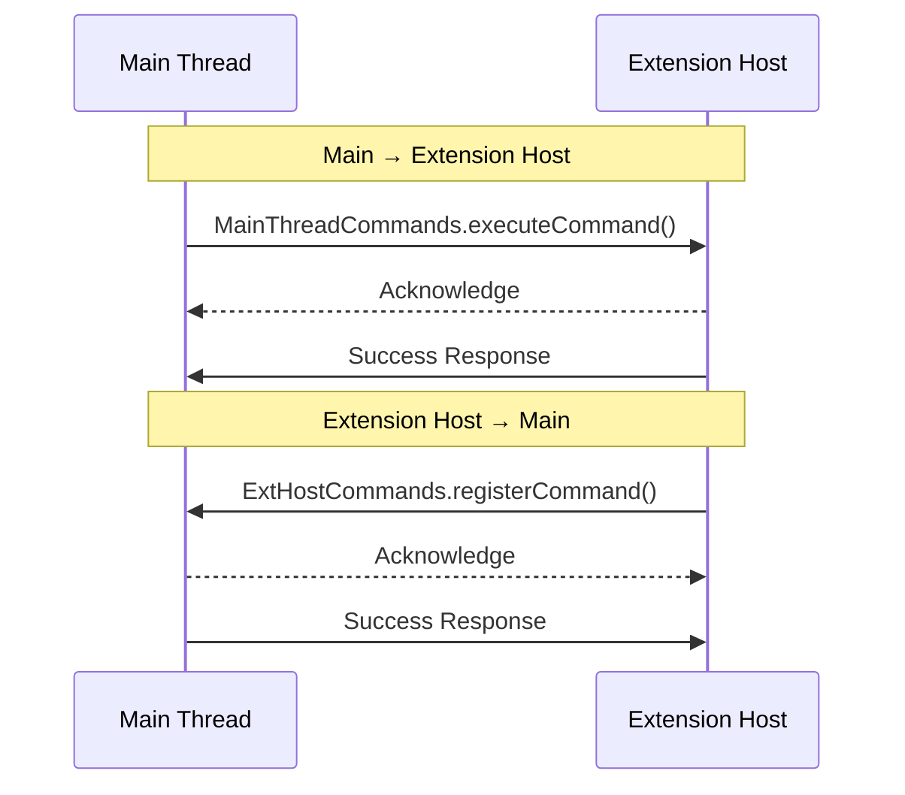
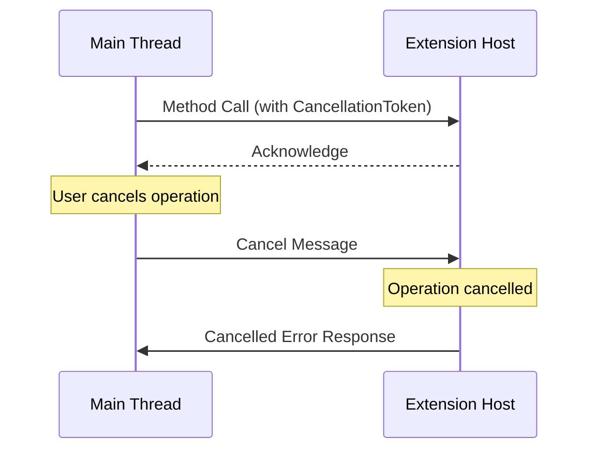
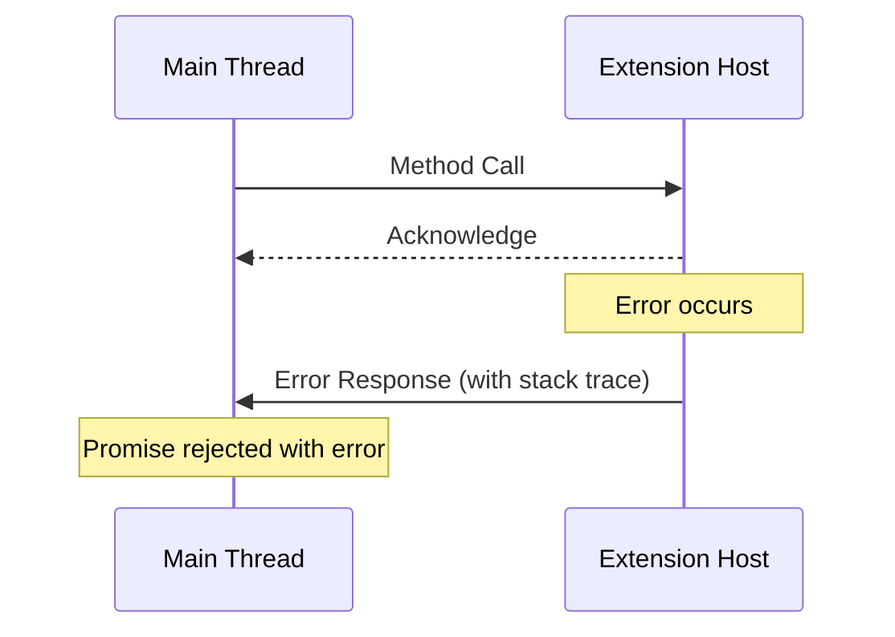
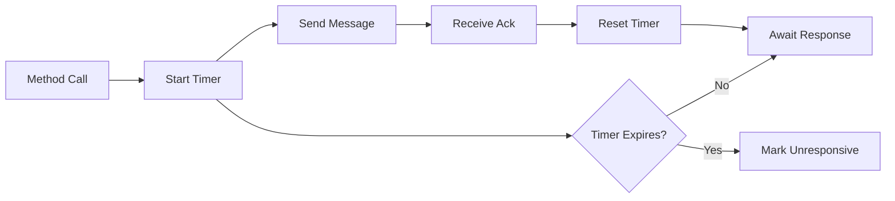

# VSCode RPC Protocol Overview

## Introduction

The VSCode RPC (Remote Procedure Call) protocol is a sophisticated communication system that enables type-safe, bidirectional communication between the main VSCode workbench process and extension host processes. It abstracts the complexity of inter-process communication while providing robust error handling, cancellation support, and performance monitoring.

## Design Goals

- **Type Safety**: Maintain TypeScript type information across process boundaries
- **Performance**: Efficient binary serialization with minimal overhead
- **Reliability**: Built-in error handling and responsiveness monitoring
- **Flexibility**: Support various transport mechanisms (IPC, WebWorkers, etc.)
- **Developer Experience**: Simple proxy-based API for extension developers
- **Security**: Process isolation and comprehensive input validation
- **Resource Efficiency**: Lazy promise evaluation and memory optimization

## Architecture Overview



## Key Components

### 1. RPCProtocol Class

The core `RPCProtocol` class (`src/vs/workbench/services/extensions/common/rpcProtocol.ts`) manages:

- **Message Serialization/Deserialization**: Converting method calls to binary messages
- **Request/Response Correlation**: Tracking pending calls with unique IDs  
- **Cancellation Support**: Propagating cancellation tokens across processes
- **Responsiveness Monitoring**: Detecting unresponsive extension hosts  
- **Error Handling**: Preserving stack traces across process boundaries
- **Lazy Promise Management**: Optimized promise creation and memory usage
- **Object Marshalling**: Automatic serialization of complex types (URIs, RegExp, etc.)

### 2. Proxy System

The proxy system (`src/vs/workbench/services/extensions/common/proxyIdentifier.ts`) provides:

- **ProxyIdentifier**: Unique identifiers for remote objects
- **Type-safe Proxies**: Automatic conversion of method calls to RPC
- **Dto Types**: Serializable data transfer object types

### 3. Message Passing Protocol

The underlying transport (`src/vs/base/parts/ipc/common/ipc.ts`) defines:

- **IMessagePassingProtocol**: Abstract transport interface
- **VSBuffer**: Efficient binary buffer handling
- **Event-driven Communication**: Async message handling

## Communication Patterns

### Bidirectional Method Calls



### Cancellation Flow



### Error Handling



## Message Types

The protocol supports various message types for different scenarios:

### Request Messages
- `RequestJSONArgs`: Simple JSON serialized arguments
- `RequestJSONArgsWithCancellation`: JSON args with cancellation support
- `RequestMixedArgs`: Mixed args with buffers
- `RequestMixedArgsWithCancellation`: Mixed args with cancellation

### Response Messages
- `ReplyOKEmpty`: Empty successful response
- `ReplyOKJSON`: JSON serialized response
- `ReplyOKJSONWithBuffers`: Response with binary buffers
- `ReplyOKVSBuffer`: Pure buffer response
- `ReplyErrError`: Error with details
- `ReplyErrEmpty`: Empty error response

### Control Messages
- `Acknowledged`: Responsiveness acknowledgment
- `Cancel`: Cancellation notification

## Data Serialization

### JSON Serialization
Standard JavaScript objects are serialized as JSON with special handling for:
- **undefined values**: Preserved (normally lost in JSON)
- **URI objects**: Transformed via URI transformer
- **Error objects**: Stack traces preserved

### Buffer Handling
Binary data (VSBuffer) is handled efficiently:
- **Reference-based**: Buffers stored separately from JSON
- **Zero-copy**: Minimizes memory allocation
- **Mixed arguments**: Seamless integration with regular args

### Example Serialization

```typescript
// Input arguments
const args = [
  "hello",
  VSBuffer.fromString("binary data"),
  { uri: URI.file("/path"), count: 42 },
  undefined
];

// Serialized as mixed args:
// - String: "hello" 
// - VSBuffer: <binary reference>
// - Object: JSON with URI transformation
// - Undefined: special undefined marker
```

## Performance Characteristics

### Responsiveness Monitoring



- **Unresponsive Threshold**: 3 seconds without acknowledgment
- **Acknowledgment**: Immediate response to track aliveness
- **State Tracking**: Responsive/Unresponsive state events

### Optimization Features

- **Request Batching**: Multiple requests can be sent efficiently
- **Buffer Pooling**: Reuse of message buffers
- **Cancellation Propagation**: Early termination of expensive operations
- **Lazy Evaluation**: Deferred execution where possible

## Security Considerations

- **Process Isolation**: Extension host runs in separate process
- **Input Validation**: All incoming data is validated
- **Error Sanitization**: Stack traces are controlled
- **Transport Security**: Depends on underlying IPC mechanism

## Debugging and Monitoring

### Logging Support

The protocol includes comprehensive logging via `IRPCProtocolLogger`:

```typescript
interface IRPCProtocolLogger {
  logIncoming(msgLength: number, req: number, initiator: RequestInitiator, str: string, data?: any): void;
  logOutgoing(msgLength: number, req: number, initiator: RequestInitiator, str: string, data?: any): void;
}
```

### Development Tools

- **Message Tracing**: Enable `LOG_EXTENSION_HOST_COMMUNICATION` for detailed logs
- **Performance Metrics**: Built-in timing and responsiveness tracking
- **Error Reporting**: Structured error information with telemetry

## Extension Points

The RPC protocol is extensible through:

- **Custom Proxy Identifiers**: Define new remote object types
- **Transport Implementations**: Support different IPC mechanisms  
- **Serialization Extensions**: Handle custom data types
- **Logging Providers**: Custom monitoring and debugging

## Troubleshooting Common Issues

### Extension Host Connection Problems

**Symptoms**: Extension host fails to start or connect
```
Error: Extension host did not start in 10 seconds
```

**Debugging Steps**:
1. Check extension host process: `ps aux | grep extensionHost`
2. Verify port availability: `netstat -an | grep 5870`
3. Review extension host logs: `.vscode/logs/*/exthost/exthost.log`
4. Test with minimal extensions: `code --disable-extensions`

**Common Causes**:
- Port conflicts with other applications
- Firewall blocking IPC communication
- Corrupted extension causing startup hang
- Insufficient memory/disk space

### RPC Message Timeouts

**Symptoms**: Operations hang or timeout after 3 seconds
```
Error: Extension host is not responding
```

**Debugging Steps**:
1. Enable RPC logging: `VSCODE_LOG_LEVEL=trace`
2. Monitor pending requests: Check for excessive concurrent calls
3. Profile extension performance: Use `--inspect-extensions`
4. Check for infinite loops in extension code

**Prevention**:
- Implement proper cancellation handling
- Avoid blocking operations in main execution path
- Use timeouts for external service calls
- Batch related operations

### Memory Issues

**Symptoms**: High memory usage, out of memory errors
```
Error: Cannot allocate memory for RPC buffer
```

**Debugging Steps**:
1. Monitor heap usage: `process.memoryUsage()`
2. Check for memory leaks in extensions
3. Review buffer usage patterns
4. Analyze object retention

**Best Practices**:
- Dispose of event listeners properly
- Avoid large object graphs in RPC calls
- Use streaming for large data transfers
- Implement proper cleanup in extension deactivation

### Performance Degradation

**Symptoms**: Slow response times, UI freezing
```
Warning: RPC call took 5000ms to complete
```

**Optimization Strategies**:
- Minimize RPC call frequency
- Use batch operations where possible
- Implement lazy loading for heavy operations
- Cache frequently accessed data

## Performance Benchmarking

### Measuring RPC Performance

**Setup Benchmarking Environment**:
```typescript
interface RPCBenchmark {
  operation: string;
  iterations: number;
  averageTime: number;
  p95Time: number;
  errorsCount: number;
  memoryDelta: number;
}

class RPCBenchmarkRunner {
  async benchmarkOperation(
    operation: () => Promise<any>,
    iterations: number = 1000
  ): Promise<RPCBenchmark> {
    const times: number[] = [];
    let errors = 0;
    const startMemory = process.memoryUsage().heapUsed;
    
    for (let i = 0; i < iterations; i++) {
      const start = performance.now();
      try {
        await operation();
        times.push(performance.now() - start);
      } catch (error) {
        errors++;
      }
    }
    
    const endMemory = process.memoryUsage().heapUsed;
    times.sort((a, b) => a - b);
    
    return {
      operation: operation.name,
      iterations,
      averageTime: times.reduce((a, b) => a + b, 0) / times.length,
      p95Time: times[Math.floor(times.length * 0.95)],
      errorsCount: errors,
      memoryDelta: endMemory - startMemory
    };
  }
}
```

**Benchmark Common Operations**:
```typescript
// Benchmark different RPC patterns
const runner = new RPCBenchmarkRunner();

// Test simple command execution
const commandBenchmark = await runner.benchmarkOperation(
  () => vscode.commands.executeCommand('workbench.action.files.save')
);

// Test document operations
const documentBenchmark = await runner.benchmarkOperation(
  () => vscode.workspace.openTextDocument(uri)
);

// Test language features
const completionBenchmark = await runner.benchmarkOperation(
  () => vscode.languages.registerCompletionItemProvider('typescript', provider)
);
```

**Performance Targets**:
- **Simple RPC calls**: < 5ms average, < 20ms p95
- **Document operations**: < 50ms average, < 200ms p95
- **Language features**: < 100ms average, < 500ms p95
- **Memory overhead**: < 1MB per 1000 operations

### Continuous Performance Monitoring

**Integration with CI/CD**:
```typescript
// Performance regression detection
function detectRegressions(
  baseline: RPCBenchmark[], 
  current: RPCBenchmark[]
): boolean {
  for (const currentOp of current) {
    const baselineOp = baseline.find(b => b.operation === currentOp.operation);
    if (!baselineOp) continue;
    
    // Fail if average time increased by more than 50%
    if (currentOp.averageTime > baselineOp.averageTime * 1.5) {
      console.error(`Performance regression in ${currentOp.operation}`);
      return true;
    }
    
    // Fail if memory usage increased significantly
    if (currentOp.memoryDelta > baselineOp.memoryDelta * 2) {
      console.error(`Memory regression in ${currentOp.operation}`);
      return true;
    }
  }
  return false;
}
```

This protocol forms the foundation for VSCode's extension system, enabling thousands of extensions to interact safely and efficiently with the core editor functionality.