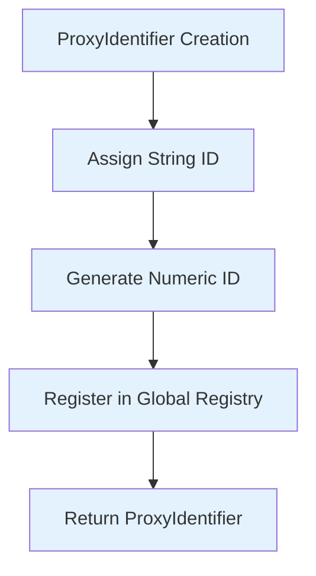
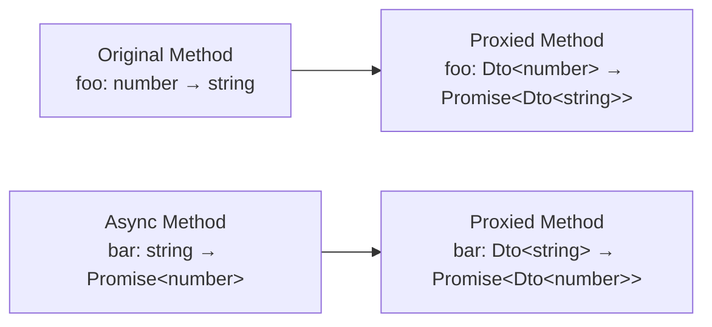
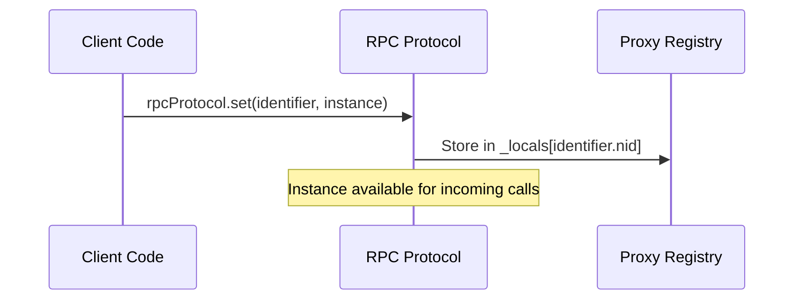
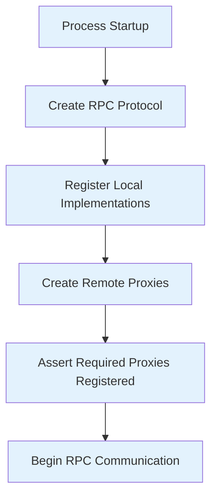
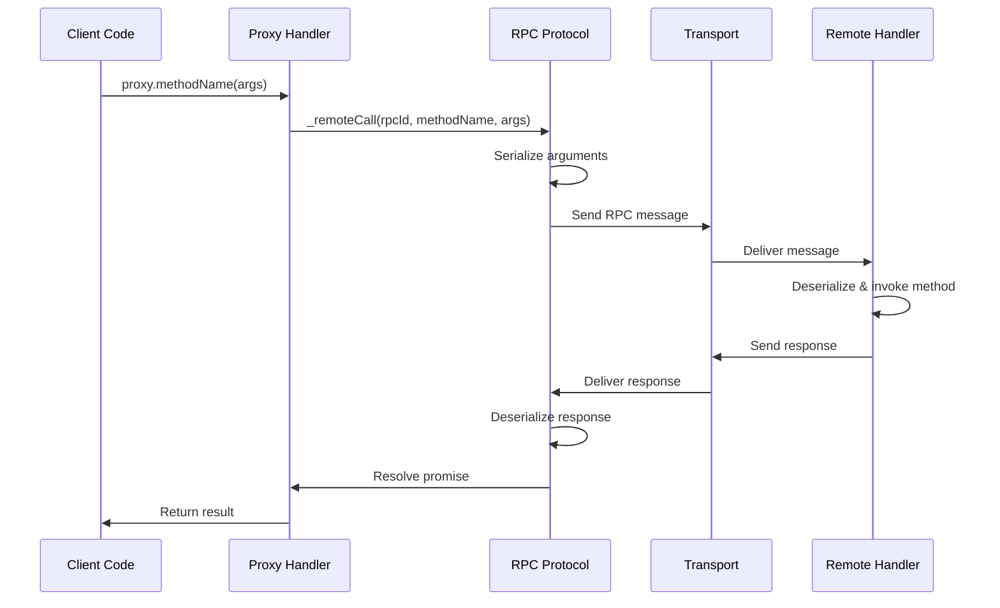

# VSCode RPC Protocol Proxy System

## Overview

The proxy system is the foundation of VSCode's RPC protocol, providing type-safe remote method calls through JavaScript proxies. It automatically converts method invocations on proxy objects into RPC messages, handling serialization, deserialization, and error propagation transparently.

## Core Concepts

### ProxyIdentifier

Each remote object type is identified by a unique `ProxyIdentifier` (`src/vs/workbench/services/extensions/common/proxyIdentifier.ts`):

```typescript
class ProxyIdentifier<T> {
  public readonly sid: string;    // String identifier
  public readonly nid: number;    // Numeric identifier  
  
  constructor(sid: string) {
    this.sid = sid;
    this.nid = (++ProxyIdentifier.count);
  }
}
```



### Proxy Creation

Proxies are created dynamically using JavaScript's `Proxy` API:

```typescript
function createProxy<T>(rpcId: number, debugName: string): T {
  const handler = {
    get: (target: any, name: PropertyKey) => {
      if (typeof name === 'string' && name.charCodeAt(0) === CharCode.DollarSign) {
        // Methods starting with '$' become RPC calls
        target[name] = (...args: any[]) => {
          return this._remoteCall(rpcId, name, args);
        };
      }
      return target[name];
    }
  };
  return new Proxy(Object.create(null), handler);
}
```

## Type System

### Dto Type Transformation

The `Dto<T>` type ensures only serializable data crosses process boundaries:

```typescript
type Dto<T> = T extends { toJSON(): infer U }
  ? U  // Use toJSON() result
  : T extends VSBuffer
  ? T  // VSBuffer is understood by RPC logic
  : T extends CancellationToken
  ? T  // CancellationToken is understood by RPC logic  
  : T extends Function
  ? never  // Functions are dropped during JSON-stringify
  : T extends object
  ? { [K in keyof T]: Dto<T[K]> }  // Recurse into objects
  : T;  // Primitive types pass through
```

### Proxied Type Transformation

The `Proxied<T>` type converts method signatures for RPC calls:

```typescript
type Proxied<T> = {
  [K in keyof T]: T[K] extends (...args: infer A) => infer R
    ? (...args: { [K in keyof A]: Dto<A[K]> }) => Promise<Dto<Awaited<R>>>
    : never
};
```



## Proxy Registration System

### Main Thread Registration



### Extension Host Registration

The extension host registers implementations for main thread proxies:

```typescript
// In extension host initialization
const rpcProtocol = accessor.get(IExtHostRpcService);

// Register all extension host implementations
rpcProtocol.set(ExtHostContext.ExtHostCommands, extHostCommands);
rpcProtocol.set(ExtHostContext.ExtHostDocuments, extHostDocuments);
rpcProtocol.set(ExtHostContext.ExtHostLanguageFeatures, extHostLanguageFeatures);
// ... more registrations
```

## Proxy Identifiers Registry

### Main Thread Identifiers

Main thread services exposed to extension host (`src/vs/workbench/api/common/extHost.protocol.ts`):

```typescript
export const MainContext = {
  MainThreadCommands: createProxyIdentifier<MainThreadCommandsShape>('MainThreadCommands'),
  MainThreadConfiguration: createProxyIdentifier<MainThreadConfigurationShape>('MainThreadConfiguration'),
  MainThreadDiagnostics: createProxyIdentifier<MainThreadDiagnosticsShape>('MainThreadDiagnostics'),
  MainThreadDocuments: createProxyIdentifier<MainThreadDocumentsShape>('MainThreadDocuments'),
  MainThreadEditors: createProxyIdentifier<MainThreadEditorsShape>('MainThreadEditors'),
  MainThreadFileSystem: createProxyIdentifier<MainThreadFileSystemShape>('MainThreadFileSystem'),
  // ... 50+ more identifiers
};
```

### Extension Host Identifiers

Extension host services exposed to main thread:

```typescript
export const ExtHostContext = {
  ExtHostCommands: createProxyIdentifier<ExtHostCommandsShape>('ExtHostCommands'),
  ExtHostConfiguration: createProxyIdentifier<ExtHostConfigurationShape>('ExtHostConfiguration'), 
  ExtHostDiagnostics: createProxyIdentifier<ExtHostDiagnosticsShape>('ExtHostDiagnostics'),
  ExtHostDocuments: createProxyIdentifier<ExtHostDocumentsShape>('ExtHostDocuments'),
  ExtHostEditors: createProxyIdentifier<ExtHostEditorsShape>('ExtHostEditors'),
  // ... 40+ more identifiers
};
```

## Proxy Lifecycle

### Creation and Initialization



### Method Invocation Flow



### Error Propagation

Errors are preserved across the proxy boundary:

```typescript
// Original error in extension host
throw new Error("Something went wrong");

// Serialized error
const serializedError = {
  $isError: true,
  name: "Error",
  message: "Something went wrong", 
  stack: "Error: Something went wrong\n    at ExtHostCommands.foo ..."
};

// Reconstructed error in main thread
const error = new Error();
error.name = serializedError.name;
error.message = serializedError.message;
error.stack = serializedError.stack;
```

## SerializableObjectWithBuffers

For objects containing binary data, the `SerializableObjectWithBuffers` wrapper provides efficient serialization:

```typescript
class SerializableObjectWithBuffers<T> {
  constructor(public readonly value: T) {}
}

// Usage example
const dataWithBuffers = new SerializableObjectWithBuffers({
  text: "Hello",
  image: VSBuffer.fromString("image data"),
  metadata: { size: 1024 }
});

// Automatic buffer extraction during serialization
const { jsonString, referencedBuffers } = stringifyJsonWithBufferRefs(dataWithBuffers.value);
```

## Proxy Method Naming Convention

Only methods starting with `$` are treated as RPC methods:

```typescript
interface SampleProxy {
  $remoteMethod(arg: string): Promise<number>;  // ✓ RPC method
  localProperty: string;                        // ✗ Not an RPC method  
  regularMethod(): void;                        // ✗ Not an RPC method
}
```

This convention allows proxies to have local properties and methods alongside remote ones.

## Advanced Proxy Features

### Cancellation Token Support

Methods can accept cancellation tokens that are automatically handled:

```typescript
interface ExtHostCommandsShape {
  $executeCommand<T>(
    id: string,
    args: any[],
    cancellationToken?: CancellationToken  // Automatically extracted and handled
  ): Promise<T>;
}

// Usage
const result = await extHostCommands.$executeCommand(
  'my.command',
  ['arg1', 'arg2'],
  cancellationToken  // Propagated across process boundary
);
```

### Disposable Handling

Disposables can be returned from RPC methods and are handled specially:

```typescript
// Extension host method returns disposable
$registerTextDocumentContentProvider(scheme: string): Promise<IDisposable> {
  const disposable = vscode.workspace.registerTextDocumentContentProvider(/* ... */);
  return Promise.resolve(disposable);
}

// Main thread receives disposable and can call dispose()
const disposable = await extHost.$registerTextDocumentContentProvider('custom');
// ... later
disposable.dispose(); // Properly disposed across process boundary
```

### Batch Operations

Multiple proxy calls can be batched for efficiency:

```typescript
// These calls are automatically batched
const promises = [
  mainThreadDocuments.$trySaveDocument(uri1),
  mainThreadDocuments.$trySaveDocument(uri2), 
  mainThreadDocuments.$trySaveDocument(uri3)
];

const results = await Promise.all(promises);
```

## Debugging Proxy Calls

### Enable RPC Logging

```typescript
// In development, enable detailed logging
const LOG_EXTENSION_HOST_COMMUNICATION = true;

// Example output:
// [Main→ExtHost] req#42: ExtHostCommands.$executeCommand(['workbench.action.files.save'])
// [ExtHost→Main] ack#42
// [ExtHost→Main] reply#42: null
```

### Proxy Introspection

Proxies include debugging information:

```typescript
const proxyDebugName = proxy[Symbol.for('rpcProxy')];
console.log('Proxy name:', proxyDebugName); // "MainThreadCommands"
```

### Common Issues

1. **Method not starting with $**: Won't be treated as RPC method
2. **Non-serializable arguments**: Will cause serialization errors
3. **Missing proxy registration**: Throws "Missing proxy instance" error
4. **Type mismatches**: TypeScript will catch these at compile time

## Performance Considerations

### Proxy Creation Cost

- **Proxy creation**: ~0.01ms per proxy (one-time cost)
- **Method lookup**: ~0.001ms per call (cached after first access)
- **Serialization overhead**: ~1-5ms depending on argument complexity

### Memory Usage

- **Proxy objects**: Minimal memory footprint (empty objects with handlers)
- **Method caching**: Methods cached on first access
- **Disposal**: Proxies are garbage collected with their RPC protocol instance

### Best Practices

1. **Batch related calls** when possible
2. **Use appropriate data types** (avoid complex object graphs)
3. **Implement cancellation** for long-running operations
4. **Handle errors gracefully** (network issues, process crashes)
5. **Avoid chatty APIs** (multiple small calls vs. fewer large calls)

The proxy system enables seamless, type-safe communication between VSCode processes while maintaining excellent performance and developer experience.