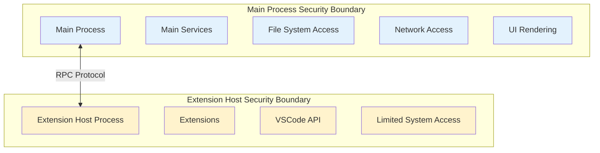

# VSCode RPC Protocol Security Considerations

## Overview

The VSCode RPC protocol implements multiple layers of security to protect against malicious extensions and ensure safe inter-process communication. This document outlines the security measures, potential threats, and defensive strategies employed by the protocol.

## Process Isolation

### Address Space Separation

The fundamental security boundary is process isolation:



**Benefits:**
- **Memory Isolation**: Extensions cannot directly access main process memory
- **Crash Containment**: Extension crashes don't affect main VSCode
- **Resource Limits**: OS-level limits on extension host resources
- **Signal Isolation**: Extensions cannot send arbitrary signals to main process

### Extension Host Types and Sandboxing

Different extension host types provide varying security levels:

| Type | Security Level | Capabilities | Use Case |
|------|---------------|--------------|----------|
| Local Process | Medium | Full Node.js API | Desktop development |
| Web Worker | High | Limited browser APIs | Web/untrusted environments |
| Remote Process | Medium+ | Network isolated | Remote development |

## Input Validation and Sanitization

### RPC Message Validation

All incoming RPC messages undergo strict validation:

```typescript
// Message structure validation
function validateMessage(buffer: VSBuffer): boolean {
  if (buffer.byteLength < 5) return false;  // Minimum header size
  
  const messageType = buffer.readUInt8(0);
  if (messageType < 1 || messageType > 12) return false;  // Valid message types
  
  const requestId = buffer.readUInt32BE(1);
  if (requestId < 0 || requestId > 0x7FFFFFFF) return false;  // Valid request ID
  
  return true;
}
```

### Argument Validation

Method arguments are validated before execution:

```typescript
// Example: Command execution validation
$executeCommand(id: string, args: any[]): Promise<any> {
  // Input validation
  if (typeof id !== 'string' || id.length === 0) {
    throw new Error('Invalid command ID');
  }
  
  if (!Array.isArray(args)) {
    throw new Error('Arguments must be an array');
  }
  
  if (args.length > 100) {  // Prevent excessive arguments
    throw new Error('Too many arguments');
  }
  
  return this._commandService.executeCommand(id, ...args);
}
```

### URI Validation and Transformation

URIs are validated and transformed to prevent path traversal attacks:

```typescript
interface IURITransformer {
  transformIncoming(uri: UriComponents): UriComponents;
  transformOutgoing(uri: UriComponents): UriComponents;
}

// Example: Path traversal prevention
class SecureURITransformer implements IURITransformer {
  transformIncoming(uri: UriComponents): UriComponents {
    // Prevent path traversal
    if (uri.path && uri.path.includes('..')) {
      throw new Error('Path traversal not allowed');
    }
    
    // Validate scheme
    if (!['file', 'vscode-remote', 'untitled'].includes(uri.scheme)) {
      throw new Error('Invalid URI scheme');
    }
    
    return uri;
  }
}
```

## Buffer Reference System Security

### Memory Exhaustion Protection

The buffer reference system includes protections against memory attacks:

```typescript
class BufferReferenceManager {
  private static readonly MAX_BUFFER_SIZE = 100 * 1024 * 1024;  // 100MB
  private static readonly MAX_BUFFER_COUNT = 1000;  // Max buffers per message
  
  validateBuffer(buffer: VSBuffer): void {
    if (buffer.byteLength > BufferReferenceManager.MAX_BUFFER_SIZE) {
      throw new Error('Buffer exceeds maximum size');
    }
  }
  
  validateBufferCount(count: number): void {
    if (count > BufferReferenceManager.MAX_BUFFER_COUNT) {
      throw new Error('Too many buffers in message');
    }
  }
}
```

### Buffer Content Validation

Binary buffer contents are validated for known file types:

```typescript
function validateBufferContent(buffer: VSBuffer, expectedType?: string): boolean {
  // Check for malicious patterns
  const content = buffer.toString();
  
  // Prevent script injection in buffers
  if (content.includes('<script>') || content.includes('javascript:')) {
    throw new Error('Potentially malicious buffer content');
  }
  
  // Validate file headers for binary files
  if (expectedType === 'image' && !isValidImageHeader(buffer)) {
    throw new Error('Invalid image file header');
  }
  
  return true;
}
```

## Marshalling Security

### Type Safety Enforcement

The marshalling system only allows known, safe types:

```typescript
function secureRevive(obj: any, depth = 0): any {
  // Prevent excessive depth (DoS protection)
  if (depth > 200) {
    throw new Error('Object depth limit exceeded');
  }
  
  if (typeof obj === 'object' && obj !== null) {
    const mid = obj.$mid;
    
    // Only allow known, safe marshalled types
    switch (mid) {
      case MarshalledId.Uri:
        return secureURIRevival(obj);
      case MarshalledId.Regexp:
        return secureRegexpRevival(obj);
      case MarshalledId.Date:
        return secureDateRevival(obj);
      default:
        if (mid !== undefined) {
          throw new Error(`Unknown marshalled type: ${mid}`);
        }
    }
  }
  
  return obj;
}
```

### Prototype Pollution Prevention

The marshalling system prevents prototype pollution attacks:

```typescript
function secureObjectAssignment(target: any, key: string, value: any): void {
  // Prevent prototype pollution
  if (key === '__proto__' || key === 'constructor' || key === 'prototype') {
    throw new Error('Attempt to modify object prototype');
  }
  
  // Use safe property assignment
  Object.defineProperty(target, key, {
    value: value,
    writable: true,
    enumerable: true,
    configurable: true
  });
}
```

## Error Handling Security

### Stack Trace Sanitization

Error stack traces are sanitized before transmission:

```typescript
function sanitizeError(error: Error): SerializedError {
  return {
    $isError: true,
    name: error.name,
    message: sanitizeErrorMessage(error.message),
    stack: sanitizeStackTrace(error.stack)
  };
}

function sanitizeStackTrace(stack?: string): string {
  if (!stack) return '';
  
  // Remove absolute file paths that might reveal system information
  return stack.replace(/\/[^:\s]+/g, '<path>');
}

function sanitizeErrorMessage(message: string): string {
  // Remove potentially sensitive information
  return message.replace(/\/[^:\s]+/g, '<path>')
                .replace(/[a-zA-Z0-9._%+-]+@[a-zA-Z0-9.-]+\.[a-zA-Z]{2,}/g, '<email>');
}
```

### Information Disclosure Prevention

Errors are filtered to prevent information leakage:

```typescript
class SecureErrorHandler {
  static handleRPCError(error: any): SerializedError {
    // Don't expose internal implementation details
    if (error.code === 'ENOENT') {
      return this.createGenericError('File not found');
    }
    
    if (error.code === 'EACCES') {
      return this.createGenericError('Access denied');
    }
    
    // Generic error for unknown issues
    return this.createGenericError('Operation failed');
  }
  
  private static createGenericError(message: string): SerializedError {
    return {
      $isError: true,
      name: 'Error',
      message,
      stack: ''  // No stack trace for security
    };
  }
}
```

## Rate Limiting and DoS Protection

### Message Rate Limiting

The protocol implements rate limiting to prevent DoS attacks:

```typescript
class RPCRateLimiter {
  private readonly _messageCount = new Map<string, number>();
  private readonly _messageTimestamps = new Map<string, number[]>();
  
  private static readonly MAX_MESSAGES_PER_SECOND = 1000;
  private static readonly MAX_MESSAGES_PER_MINUTE = 10000;
  
  validateMessageRate(source: string): boolean {
    const now = Date.now();
    const timestamps = this._messageTimestamps.get(source) || [];
    
    // Remove old timestamps (older than 1 minute)
    const recentTimestamps = timestamps.filter(ts => now - ts < 60000);
    
    // Check per-second limit
    const lastSecond = recentTimestamps.filter(ts => now - ts < 1000);
    if (lastSecond.length >= RPCRateLimiter.MAX_MESSAGES_PER_SECOND) {
      throw new Error('Message rate limit exceeded (per second)');
    }
    
    // Check per-minute limit
    if (recentTimestamps.length >= RPCRateLimiter.MAX_MESSAGES_PER_MINUTE) {
      throw new Error('Message rate limit exceeded (per minute)');
    }
    
    // Update tracking
    recentTimestamps.push(now);
    this._messageTimestamps.set(source, recentTimestamps);
    
    return true;
  }
}
```

### Resource Consumption Limits

Protection against resource exhaustion:

```typescript
class ResourceLimiter {
  private static readonly MAX_PENDING_REQUESTS = 1000;
  private static readonly MAX_MESSAGE_SIZE = 50 * 1024 * 1024;  // 50MB
  private static readonly REQUEST_TIMEOUT = 60 * 1000;  // 60 seconds
  
  validateRequest(messageSize: number, pendingCount: number): void {
    if (messageSize > ResourceLimiter.MAX_MESSAGE_SIZE) {
      throw new Error('Message size exceeds limit');
    }
    
    if (pendingCount >= ResourceLimiter.MAX_PENDING_REQUESTS) {
      throw new Error('Too many pending requests');
    }
  }
}
```

## Authentication and Authorization

### Extension Identity Verification

Extensions are identified and their permissions validated:

```typescript
interface ExtensionSecurityContext {
  readonly extensionId: string;
  readonly allowedAPIs: string[];
  readonly trustedUris: string[];
  readonly networkAccess: boolean;
}

class ExtensionSecurityManager {
  validateAPIAccess(context: ExtensionSecurityContext, apiCall: string): boolean {
    // Check if extension is allowed to call this API
    if (!context.allowedAPIs.includes(apiCall)) {
      throw new Error(`Extension ${context.extensionId} not authorized for ${apiCall}`);
    }
    
    return true;
  }
  
  validateUriAccess(context: ExtensionSecurityContext, uri: string): boolean {
    // Check if extension can access this URI
    const allowed = context.trustedUris.some(trusted => uri.startsWith(trusted));
    if (!allowed) {
      throw new Error(`Extension ${context.extensionId} not authorized for URI ${uri}`);
    }
    
    return true;
  }
}
```

### Command Execution Security

Command execution includes authorization checks:

```typescript
class SecureCommandService {
  async executeCommand(command: string, context: ExtensionSecurityContext, ...args: any[]): Promise<any> {
    // Validate command authorization
    if (!this.isCommandAllowed(command, context)) {
      throw new Error(`Command ${command} not allowed for extension ${context.extensionId}`);
    }
    
    // Validate arguments for dangerous patterns
    this.validateCommandArguments(command, args);
    
    return this._commandService.executeCommand(command, ...args);
  }
  
  private validateCommandArguments(command: string, args: any[]): void {
    // Check for dangerous commands
    if (command.startsWith('workbench.action.terminal')) {
      // Extra validation for terminal commands
      for (const arg of args) {
        if (typeof arg === 'string' && arg.includes('rm -rf')) {
          throw new Error('Dangerous terminal command blocked');
        }
      }
    }
  }
}
```

## Transport Security

### IPC Channel Security

For local IPC communication:

```typescript
class SecureIPCChannel {
  validateConnection(connection: any): boolean {
    // Verify the connection is from expected process
    const pid = connection.pid;
    const expectedPid = this._extensionHostPid;
    
    if (pid !== expectedPid) {
      throw new Error('Invalid connection: PID mismatch');
    }
    
    return true;
  }
}
```

### WebSocket Security (Remote)

For remote connections:

```typescript
class SecureWebSocketTransport {
  constructor(private _connectionToken: string) {}
  
  validateConnection(ws: WebSocket, request: any): boolean {
    // Validate connection token
    const token = request.headers['authorization'];
    if (token !== `Bearer ${this._connectionToken}`) {
      throw new Error('Invalid authorization token');
    }
    
    // Validate origin
    const origin = request.headers['origin'];
    if (!this.isAllowedOrigin(origin)) {
      throw new Error('Invalid origin');
    }
    
    return true;
  }
}
```

## Monitoring and Auditing

### Security Event Logging

Critical security events are logged for monitoring:

```typescript
interface SecurityEvent {
  timestamp: number;
  type: 'validation_failure' | 'rate_limit' | 'auth_failure' | 'suspicious_activity';
  source: string;
  details: string;
  severity: 'low' | 'medium' | 'high' | 'critical';
}

class SecurityLogger {
  logEvent(event: SecurityEvent): void {
    // Log to security audit trail
    console.warn(`[SECURITY] ${event.type} from ${event.source}: ${event.details}`);
    
    // High severity events trigger immediate alerts
    if (event.severity === 'critical') {
      this.triggerSecurityAlert(event);
    }
  }
  
  private triggerSecurityAlert(event: SecurityEvent): void {
    // Could integrate with security monitoring systems
    // For now, ensure the event is prominently logged
    console.error(`[CRITICAL SECURITY EVENT]`, event);
  }
}
```

### Anomaly Detection

Basic anomaly detection for unusual patterns:

```typescript
class AnomalyDetector {
  private readonly _baselineMetrics = new Map<string, number>();
  
  detectAnomalies(extensionId: string, metrics: any): boolean {
    // Check for unusual message volume
    const messageRate = metrics.messagesPerSecond;
    const baseline = this._baselineMetrics.get(`${extensionId}:messageRate`) || 10;
    
    if (messageRate > baseline * 10) {  // 10x normal rate
      this.reportAnomaly(extensionId, 'Unusual message rate', { messageRate, baseline });
      return true;
    }
    
    // Check for unusual buffer usage
    const bufferSize = metrics.totalBufferSize;
    const bufferBaseline = this._baselineMetrics.get(`${extensionId}:bufferSize`) || 1024;
    
    if (bufferSize > bufferBaseline * 100) {  // 100x normal buffer usage
      this.reportAnomaly(extensionId, 'Unusual buffer usage', { bufferSize, bufferBaseline });
      return true;
    }
    
    return false;
  }
}
```

## Best Practices for Secure RPC

### For VSCode Core Developers

1. **Input Validation**: Always validate all RPC inputs before processing
2. **Error Sanitization**: Never expose internal details in error messages
3. **Resource Limits**: Implement appropriate limits for all operations
4. **Audit Logging**: Log security-relevant events for monitoring

### For Extension Developers

1. **Minimal Permissions**: Request only necessary API access
2. **Input Sanitization**: Validate all user inputs before RPC calls
3. **Error Handling**: Handle RPC errors gracefully without exposing details
4. **Resource Awareness**: Be mindful of message size and frequency

### Security Testing

```typescript
// Example security test
function testRPCSecurityValidation() {
  const mockRPC = new MockRPCProtocol();
  
  // Test oversized message rejection
  try {
    const largeBuffer = VSBuffer.alloc(200 * 1024 * 1024);  // 200MB
    mockRPC.send(createMessage(largeBuffer));
    assert.fail('Should reject oversized message');
  } catch (error) {
    assert(error.message.includes('exceeds limit'));
  }
  
  // Test malicious URI rejection
  try {
    const maliciousUri = { scheme: 'file', path: '../../../etc/passwd' };
    mockRPC.transformIncomingURIs(maliciousUri);
    assert.fail('Should reject path traversal');
  } catch (error) {
    assert(error.message.includes('traversal'));
  }
}
```

The security considerations outlined above work together to create a defense-in-depth approach, protecting VSCode users from malicious extensions while maintaining the flexibility needed for legitimate extension functionality.