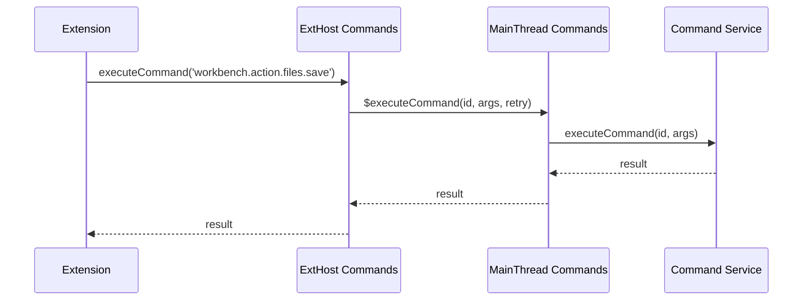

# VSCode RPC Protocol Usage Examples

## Overview

This document provides practical examples of how to use the VSCode RPC protocol for extension development and internal service communication. All examples are based on the actual VSCode codebase and demonstrate real-world usage patterns.

## Basic RPC Setup

### Creating a New RPC Service

Here's how to create a new RPC service pair for main thread and extension host communication:

```typescript
// 1. Define the service interfaces
interface MainThreadMyServiceShape {
  $doSomething(param: string): Promise<number>;
  $handleData(data: MyData[]): Promise<void>;
}

interface ExtHostMyServiceShape {
  $onSomethingHappened(event: MyEvent): void;
  $requestData(): Promise<MyData[]>;
}

// 2. Create proxy identifiers
const MainContext = {
  MainThreadMyService: createProxyIdentifier<MainThreadMyServiceShape>('MainThreadMyService')
};

const ExtHostContext = {
  ExtHostMyService: createProxyIdentifier<ExtHostMyServiceShape>('ExtHostMyService')
};
```

### Implementing the Main Thread Service

```typescript
export class MainThreadMyService implements MainThreadMyServiceShape {
  private readonly _proxy: ExtHostMyServiceShape;

  constructor(
    extHostContext: IExtHostContext,
    @IMyService private readonly _myService: IMyService
  ) {
    this._proxy = extHostContext.getProxy(ExtHostContext.ExtHostMyService);
  }

  async $doSomething(param: string): Promise<number> {
    try {
      const result = await this._myService.processParameter(param);
      
      // Notify extension host of the result
      this._proxy.$onSomethingHappened({ type: 'processed', value: result });
      
      return result;
    } catch (error) {
      throw new Error(`Failed to process: ${error.message}`);
    }
  }

  async $handleData(data: MyData[]): Promise<void> {
    for (const item of data) {
      await this._myService.store(item);
    }
  }
}
```

### Implementing the Extension Host Service

```typescript
export class ExtHostMyService implements ExtHostMyServiceShape {
  private readonly _proxy: MainThreadMyServiceShape;
  private readonly _onSomethingHappened = new Emitter<MyEvent>();
  
  readonly onSomethingHappened: Event<MyEvent> = this._onSomethingHappened.event;

  constructor(rpcProtocol: IRPCProtocol) {
    this._proxy = rpcProtocol.getProxy(MainContext.MainThreadMyService);
  }

  $onSomethingHappened(event: MyEvent): void {
    this._onSomethingHappened.fire(event);
  }

  async $requestData(): Promise<MyData[]> {
    // Implementation specific logic
    return await this.gatherLocalData();
  }

  // Public API for extensions
  public async doSomething(param: string): Promise<number> {
    return this._proxy.$doSomething(param);
  }

  public async sendData(data: MyData[]): Promise<void> {
    return this._proxy.$handleData(data);
  }
}
```

## Real-World Examples

### 1. Command Execution



**Extension Host Implementation:**
```typescript
// In ExtHostCommands
export class ExtHostCommands {
  private readonly _proxy: MainThreadCommandsShape;

  async executeCommand<T>(id: string, ...args: any[]): Promise<T> {
    try {
      return await this._proxy.$executeCommand(id, args, true);
    } catch (error) {
      // Handle command not found, etc.
      throw new Error(`Command '${id}' not found: ${error.message}`);
    }
  }

  registerCommand(id: string, command: <T>(...args: any[]) => T | Promise<T>): Disposable {
    // Register command locally for execution by other extensions
    this._commands.set(id, command);
    
    // Notify main thread about the new command
    this._proxy.$registerCommand(id);
    
    return toDisposable(() => {
      this._commands.delete(id);
      this._proxy.$unregisterCommand(id);
    });
  }
}
```

**Main Thread Implementation:**
```typescript
// In MainThreadCommands  
export class MainThreadCommands {
  async $executeCommand<T>(id: string, args: any[], retry: boolean): Promise<T> {
    try {
      return await this._commandService.executeCommand(id, ...args);
    } catch (error) {
      if (retry && error.message.includes('not found')) {
        // Maybe the extension hasn't activated yet
        await this._extensionService.activateByEvent(`onCommand:${id}`);
        return this._commandService.executeCommand(id, ...args);
      }
      throw error;
    }
  }

  $registerCommand(id: string): void {
    const disposable = this._commandService.registerCommand(id, (...args) => {
      // Delegate to extension host
      return this._proxy.$executeContributedCommand(id, args);
    });
    this._commands.set(id, disposable);
  }
}
```

### 2. Document Synchronization

**Document Change Propagation:**
```typescript
// In MainThreadDocuments
export class MainThreadDocuments {
  private _modelTrackers = new Map<string, ModelTracker>();

  constructor(extHostContext: IExtHostContext) {
    this._proxy = extHostContext.getProxy(ExtHostContext.ExtHostDocuments);
    
    // Listen for document changes
    this._modelService.onModelAdded(model => this._onModelAdded(model));
    this._modelService.onModelRemoved(model => this._onModelRemoved(model));
  }

  private _onModelAdded(model: ITextModel): void {
    const uri = model.uri;
    const tracker = new ModelTracker(model, (changes) => {
      // Send changes to extension host
      this._proxy.$acceptModelChanged(uri, changes);
    });
    
    this._modelTrackers.set(uri.toString(), tracker);
    
    // Notify extension host of new document
    this._proxy.$acceptDocumentsAndEditorsDelta({
      addedDocuments: [{
        uri: uri,
        versionId: model.getVersionId(),
        lines: model.getLinesContent(),
        EOL: model.getEOL(),
        modeId: model.getLanguageId(),
        isDirty: this._textFileService.isDirty(uri)
      }]
    });
  }
}
```

**Extension Host Document Management:**
```typescript
// In ExtHostDocuments
export class ExtHostDocuments {
  private _documents = new Map<string, ExtHostTextDocument>();
  private _onDidOpenDocument = new Emitter<vscode.TextDocument>();
  private _onDidChangeDocument = new Emitter<vscode.TextDocumentChangeEvent>();

  readonly onDidOpenTextDocument: Event<vscode.TextDocument> = this._onDidOpenDocument.event;
  readonly onDidChangeTextDocument: Event<vscode.TextDocumentChangeEvent> = this._onDidChangeDocument.event;

  $acceptDocumentsAndEditorsDelta(delta: IDocumentsAndEditorsDelta): void {
    // Handle added documents
    if (delta.addedDocuments) {
      for (const data of delta.addedDocuments) {
        const document = new ExtHostTextDocument(
          this._proxy,
          data.uri,
          data.lines,
          data.EOL,
          data.modeId,
          data.versionId,
          data.isDirty
        );
        
        this._documents.set(data.uri.toString(), document);
        this._onDidOpenDocument.fire(document.document);
      }
    }

    // Handle removed documents  
    if (delta.removedDocuments) {
      for (const uri of delta.removedDocuments) {
        const document = this._documents.get(uri.toString());
        if (document) {
          this._documents.delete(uri.toString());
          this._onDidCloseDocument.fire(document.document);
        }
      }
    }
  }

  $acceptModelChanged(uri: URI, changes: IModelChangedEvent): void {
    const document = this._documents.get(uri.toString());
    if (document) {
      document._acceptChanges(changes);
      this._onDidChangeDocument.fire({
        document: document.document,
        contentChanges: changes.changes.map(change => ({
          range: new Range(/* ... */),
          rangeOffset: change.rangeOffset,
          rangeLength: change.rangeLength,
          text: change.text
        }))
      });
    }
  }
}
```

### 3. Language Features

**Completion Provider Registration:**
```typescript
// Extension code
const provider: vscode.CompletionItemProvider = {
  provideCompletionItems(document, position, cancellationToken) {
    return [
      new vscode.CompletionItem('hello', vscode.CompletionItemKind.Text),
      new vscode.CompletionItem('world', vscode.CompletionItemKind.Text)
    ];
  }
};

vscode.languages.registerCompletionItemProvider('typescript', provider);
```

**Extension Host Implementation:**
```typescript
// In ExtHostLanguageFeatures
export class ExtHostLanguageFeatures {
  registerCompletionItemProvider(
    selector: vscode.DocumentSelector,
    provider: vscode.CompletionItemProvider,
    ...triggerCharacters: string[]
  ): vscode.Disposable {
    
    const handle = this._nextHandle();
    this._completionProviders.set(handle, provider);
    
    // Register with main thread
    this._proxy.$registerCompletionSupport(
      handle,
      selector,
      triggerCharacters,
      provider.resolveCompletionItem ? true : false
    );

    return toDisposable(() => {
      this._completionProviders.delete(handle);
      this._proxy.$unregisterCompletionSupport(handle);
    });
  }

  async $provideCompletionItems(
    handle: number,
    resource: URI,
    position: IPosition,
    context: CompletionContext,
    cancellationToken: CancellationToken
  ): Promise<CompletionList> {
    
    const provider = this._completionProviders.get(handle);
    if (!provider) return { suggestions: [] };

    const document = this._documents.getDocument(resource);
    const pos = new Position(position.lineNumber - 1, position.column - 1);

    const result = await provider.provideCompletionItems(document, pos, cancellationToken, context);
    
    if (!result) return { suggestions: [] };

    return {
      suggestions: Array.isArray(result) ? result.map(this._convertCompletionItem) : result.items.map(this._convertCompletionItem),
      incomplete: Array.isArray(result) ? false : result.isIncomplete
    };
  }
}
```

## Error Handling Patterns

### Graceful Error Recovery

```typescript
import { CancellationError } from 'vs/base/common/errors';
import { ILogService } from 'vs/platform/log/common/log';

export class ExtHostMyService {
  constructor(
    private readonly _proxy: MainThreadMyServiceShape,
    private readonly _logService: ILogService
  ) {}

  async callMainThread(data: string): Promise<number> {
    try {
      return await this._proxy.$processData(data);
    } catch (error) {
      if (error.message.includes('Extension host not responding')) {
        // Extension host is unresponsive, use fallback
        return this._fallbackProcessing(data);
      }
      
      if (error instanceof CancellationError) {
        // Operation was cancelled, don't treat as error
        return 0;
      }
      
      // Log error and re-throw
      this._logService.error('Failed to process data:', error);
      throw new Error(`Data processing failed: ${error.message}`);
    }
  }

  private _fallbackProcessing(data: string): number {
    // Local processing when main thread is unavailable
    return data.length;
  }
}
```

### Timeout Handling

```typescript
export class ExtHostServiceWithTimeout {
  async callWithTimeout<T>(operation: () => Promise<T>, timeoutMs: number = 5000): Promise<T> {
    const timeoutPromise = new Promise<never>((_, reject) => {
      setTimeout(() => reject(new Error('Operation timed out')), timeoutMs);
    });

    return Promise.race([operation(), timeoutPromise]);
  }

  async safeCall(): Promise<string> {
    try {
      return await this.callWithTimeout(() => this._proxy.$longRunningOperation(), 10000);
    } catch (error) {
      if (error.message.includes('timed out')) {
        this._logService.warn('Operation timed out, using cached result');
        return this._getCachedResult();
      }
      throw error;
    }
  }
}
```

## Performance Optimization Patterns

### Batching RPC Calls

```typescript
export class ExtHostBatchedService {
  private _pendingItems: MyItem[] = [];
  private _batchTimeout: NodeJS.Timeout | undefined;

  addItem(item: MyItem): void {
    this._pendingItems.push(item);
    
    // Batch items and send after delay
    if (this._batchTimeout) {
      clearTimeout(this._batchTimeout);
    }
    
    this._batchTimeout = setTimeout(() => {
      this._flushBatch();
    }, 100); // 100ms batching window
  }

  private _flushBatch(): void {
    if (this._pendingItems.length === 0) return;
    
    const items = this._pendingItems.splice(0);
    this._batchTimeout = undefined;
    
    // Single RPC call for multiple items
    this._proxy.$processBatch(items).catch(error => {
      this._logService.error('Batch processing failed:', error);
    });
  }
}
```

### Caching with Invalidation

```typescript
export class ExtHostCachedService {
  private _cache = new Map<string, CacheEntry>();
  private _cacheTimeout = 30000; // 30 seconds

  async getData(key: string): Promise<MyData> {
    const cached = this._cache.get(key);
    if (cached && Date.now() - cached.timestamp < this._cacheTimeout) {
      return cached.data;
    }

    // Cache miss or expired, fetch from main thread
    const data = await this._proxy.$fetchData(key);
    this._cache.set(key, { data, timestamp: Date.now() });
    return data;
  }

  invalidateCache(key?: string): void {
    if (key) {
      this._cache.delete(key);
    } else {
      this._cache.clear();
    }
  }

  // Main thread can invalidate cache entries
  $invalidateCache(keys: string[]): void {
    for (const key of keys) {
      this._cache.delete(key);
    }
  }
}
```

## Testing RPC Services

### Mock RPC Protocol

```typescript
class MockRPCProtocol implements IRPCProtocol {
  private _proxies = new Map<number, any>();
  private _locals = new Map<number, any>();

  getProxy<T>(identifier: ProxyIdentifier<T>): Proxied<T> {
    if (!this._proxies.has(identifier.nid)) {
      // Create mock proxy that records calls
      const calls: any[] = [];
      const proxy = new Proxy({}, {
        get: (target, prop) => {
          if (typeof prop === 'string' && prop.startsWith('$')) {
            return (...args: any[]) => {
              calls.push({ method: prop, args });
              return Promise.resolve();
            };
          }
          if (prop === '__calls') return calls;
          return target[prop];
        }
      });
      this._proxies.set(identifier.nid, proxy);
    }
    return this._proxies.get(identifier.nid);
  }

  set<T, R extends T>(identifier: ProxyIdentifier<T>, instance: R): R {
    this._locals.set(identifier.nid, instance);
    return instance;
  }

  // ... other methods
}
```

### Unit Test Example

```typescript
suite('ExtHostMyService', () => {
  let mockRpc: MockRPCProtocol;
  let service: ExtHostMyService;

  setup(() => {
    mockRpc = new MockRPCProtocol();
    service = new ExtHostMyService(mockRpc);
  });

  test('should call main thread when processing data', async () => {
    const proxy = mockRpc.getProxy(MainContext.MainThreadMyService) as any;
    
    await service.processData('test');
    
    const calls = proxy.__calls;
    assert.strictEqual(calls.length, 1);
    assert.strictEqual(calls[0].method, '$processData');
    assert.deepStrictEqual(calls[0].args, ['test']);
  });

  test('should handle errors gracefully', async () => {
    const proxy = mockRpc.getProxy(MainContext.MainThreadMyService) as any;
    proxy.$processData = () => Promise.reject(new Error('Test error'));
    
    try {
      await service.processData('test');
      assert.fail('Should have thrown');
    } catch (error) {
      assert.strictEqual(error.message, 'Data processing failed: Test error');
    }
  });
});
```

## Debugging Tips

### RPC Call Tracing

```typescript
// Enable detailed RPC logging
process.env.VSCODE_LOG_LEVEL = 'trace';

// Or in extension host startup
const LOG_EXTENSION_HOST_COMMUNICATION = true;

// Enable specific RPC protocol logging
process.env.VSCODE_EXTHOST_LOGFILE = '/path/to/exthost.log';

// Custom logging wrapper
export class TracingRPCWrapper {
  constructor(private _underlying: IRPCProtocol, private _logService: ILogService) {}

  getProxy<T>(identifier: ProxyIdentifier<T>): Proxied<T> {
    const proxy = this._underlying.getProxy(identifier);
    
    return new Proxy(proxy, {
      get: (target, prop) => {
        if (typeof prop === 'string' && prop.startsWith('$')) {
          return (...args: any[]) => {
            this._logService.trace(`RPC Call: ${identifier.sid}.${prop}`, args);
            const start = Date.now();
            
            return target[prop](...args).then(
              result => {
                this._logService.trace(`RPC Success: ${identifier.sid}.${prop} (${Date.now() - start}ms)`, result);
                return result;
              },
              error => {
                this._logService.error(`RPC Error: ${identifier.sid}.${prop} (${Date.now() - start}ms)`, error);
                throw error;
              }
            );
          };
        }
        return target[prop];
      }
    });
  }
}
```

### Performance Monitoring

```typescript
export class PerformanceTrackingService {
  private _callMetrics = new Map<string, { count: number; totalTime: number; errors: number }>();
  private _memoryBaseline = process.memoryUsage().heapUsed;

  private _trackCall<T>(methodName: string, call: () => Promise<T>): Promise<T> {
    const start = performance.now();
    const memStart = process.memoryUsage().heapUsed;
    const metrics = this._callMetrics.get(methodName) || { count: 0, totalTime: 0, errors: 0 };
    
    return call().then(
      result => {
        const duration = performance.now() - start;
        const memDelta = process.memoryUsage().heapUsed - memStart;
        
        metrics.count++;
        metrics.totalTime += duration;
        this._callMetrics.set(methodName, metrics);
        
        // Log slow calls
        if (duration > 1000) {  // >1 second
          console.warn(`Slow RPC call: ${methodName} took ${duration}ms, memory delta: ${memDelta} bytes`);
        }
        
        return result;
      },
      error => {
        metrics.count++;
        metrics.errors++;
        metrics.totalTime += performance.now() - start;
        this._callMetrics.set(methodName, metrics);
        throw error;
      }
    );
  }

  getMetrics(): Record<string, { avgTime: number; errorRate: number; callCount: number }> {
    const result: any = {};
    for (const [method, metrics] of this._callMetrics) {
      result[method] = {
        avgTime: Math.round(metrics.totalTime / metrics.count * 100) / 100,
        errorRate: Math.round(metrics.errors / metrics.count * 100) / 100,
        callCount: metrics.count
      };
    }
    return result;
  }
  
  getTopSlowMethods(limit = 10): Array<{ method: string; avgTime: number }> {
    const metrics = this.getMetrics();
    return Object.entries(metrics)
      .map(([method, data]) => ({ method, avgTime: data.avgTime }))
      .sort((a, b) => b.avgTime - a.avgTime)
      .slice(0, limit);
  }
  
  detectMemoryLeaks(): boolean {
    const current = process.memoryUsage().heapUsed;
    const growth = current - this._memoryBaseline;
    const threshold = 50 * 1024 * 1024; // 50MB
    
    if (growth > threshold) {
      console.error(`Potential memory leak detected: ${growth} bytes growth`);
      return true;
    }
    return false;
  }
}

// Example usage with VSCode's built-in performance API
class VSCodeRPCProfiler {
  static profile<T>(operation: string, rpcCall: () => Promise<T>): Promise<T> {
    const mark = `rpc-${operation}-start`;
    const measure = `rpc-${operation}`;
    
    performance.mark(mark);
    
    return rpcCall().finally(() => {
      performance.measure(measure, mark);
      const entries = performance.getEntriesByName(measure);
      const duration = entries[entries.length - 1]?.duration;
      
      if (duration && duration > 100) {  // Log calls >100ms
        console.log(`RPC Profile: ${operation} = ${duration.toFixed(2)}ms`);
      }
    });
  }
}
```

## Common Debugging Scenarios

### Debugging Extension Host Startup Issues

```typescript
// Monitor extension host initialization
class ExtensionHostDebugger {
  static monitorStartup() {
    const startTime = Date.now();
    
    // Log each initialization phase
    console.log('[ExtHost] Starting extension host...');
    
    // Monitor service registration
    const originalSet = rpcProtocol.set;
    rpcProtocol.set = function(id, instance) {
      console.log(`[ExtHost] Registered service: ${id.sid}`);
      return originalSet.call(this, id, instance);
    };
    
    // Monitor extension activation
    process.on('message', (msg) => {
      if (msg.type === 'EXTENSION_ACTIVATED') {
        const elapsed = Date.now() - startTime;
        console.log(`[ExtHost] Extension ${msg.extensionId} activated after ${elapsed}ms`);
      }
    });
  }
}
```

### Debugging RPC Message Flow

```typescript
// Intercept and log all RPC messages
class RPCMessageInterceptor {
  static intercept(protocol: IMessagePassingProtocol) {
    const originalSend = protocol.send;
    protocol.send = function(buffer: VSBuffer) {
      const messageType = buffer.readUInt8(0);
      const requestId = buffer.readUInt32BE(1);
      console.log(`[RPC OUT] Type: ${messageType}, ID: ${requestId}, Size: ${buffer.byteLength}`);
      return originalSend.call(this, buffer);
    };
    
    const originalOnMessage = protocol.onMessage;
    protocol.onMessage = Event.filter(originalOnMessage, buffer => {
      const messageType = buffer.readUInt8(0);
      const requestId = buffer.readUInt32BE(1);
      console.log(`[RPC IN] Type: ${messageType}, ID: ${requestId}, Size: ${buffer.byteLength}`);
      return true;
    });
  }
}
```

### Memory Leak Detection

```typescript
// Track RPC-related memory usage
class RPCMemoryTracker {
  private _heapSnapshots: number[] = [];
  private _pendingRequests = new Set<number>();
  
  trackRequest(requestId: number): void {
    this._pendingRequests.add(requestId);
    
    // Take heap snapshot every 100 requests
    if (this._pendingRequests.size % 100 === 0) {
      const heapUsed = process.memoryUsage().heapUsed;
      this._heapSnapshots.push(heapUsed);
      
      // Check for growing heap with pending requests
      if (this._heapSnapshots.length > 10) {
        const recent = this._heapSnapshots.slice(-5);
        const growing = recent.every((size, i) => i === 0 || size > recent[i - 1]);
        
        if (growing && this._pendingRequests.size > 1000) {
          console.error(`Memory leak warning: ${this._pendingRequests.size} pending requests, heap growing`);
        }
      }
    }
  }
  
  completeRequest(requestId: number): void {
    this._pendingRequests.delete(requestId);
  }
}
```

These examples demonstrate the patterns and practices used throughout VSCode's codebase for robust, performant RPC communication between the main workbench and extension host processes.