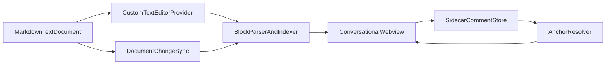

# Conversational Markdown MVP

## Exact MVP Recommendation

Build an **optional conversational Markdown custom editor** backed by a real `TextDocument`, with the normal raw `.md` editor always available. The custom surface should render Markdown as **structured blocks** and support **block-level comment threads** with reply, resolve, and reopen.

Why this is the right wedge:

- It keeps Markdown as the canonical file on disk.
- It makes the rendered experience first-class without forcing WYSIWYG editing.
- It is much simpler and more stable than arbitrary text-range comments.
- It maps cleanly to VS Code's text-backed custom editor model described in [src/vscode-dts/vscode.d.ts](src/vscode-dts/vscode.d.ts) and the existing Markdown preview pattern in [extensions/markdown-language-features/src/preview/previewManager.ts](extensions/markdown-language-features/src/preview/previewManager.ts).

## MVP Definition

### Smallest useful version

- Open any `.md` file in a **Conversational Preview**.
- Render the document as a sequence of semantic blocks: headings, paragraphs, list items, blockquotes, code fences, tables.
- Allow users to attach a thread to a block.
- Support thread lifecycle: create, reply, resolve, reopen.
- Persist threads in a **file-based sidecar JSON** stored alongside the Markdown file.
- Refresh the preview automatically when the raw Markdown changes.
- Let users switch back to the raw source instantly.

### What v1 should include

- Command: `Open Conversational Preview` for the active Markdown document.
- Optional `Open With...` custom editor entry, but **not** the default editor for all `.md` files.
- Inline block affordances: hover state, comment count badge, `Add Comment` action.
- In-context thread UI below the block or in a lightweight adjacent thread pane.
- File-level metadata kept out of the Markdown body.
- Basic anchor reconciliation after edits using block fingerprints plus line fallback.
- Open/resolved filtering.

### Explicitly out of scope

- Real-time collaboration, presence, shared cursors.
- Arbitrary text-selection comments.
- Rich suggestion mode / track changes.
- Editing Markdown directly inside the preview.
- Full Google Docs margin comment layout.
- Syncing with a server or database.
- AI summarization, auto-thread generation, or semantic rewrite features.
- Perfect anchor stability across major document rewrites.

## UX Proposal

### User flow

1. User opens a normal `.md` file in the raw editor.
2. User runs `Forge: Open Conversational Preview` or chooses `Open With > Conversational Markdown`.
3. The preview opens beside or in place of the source, rendering the doc as readable blocks instead of a flat wall of Markdown.
4. Hovering a block reveals `Comment` and shows existing thread count.
5. Clicking `Comment` opens a thread composer anchored to that block.
6. Replies and resolve/reopen actions stay attached to that block in the rendered surface.
7. A top toolbar or header includes `Show Source`, `Refresh`, and `Show Resolved`.

### What "conversational Markdown" means in UI terms

- The document is presented as a **discussion-friendly reading surface**, not as plain rendered HTML.
- Each block is a first-class unit with clear spacing, type treatment, and discussion affordances.
- Threads are attached to blocks, so discussion follows document structure.
- The UI emphasizes review and planning: readable sections, visible thread state, low-friction replies.
- The Markdown source remains untouched except for normal user edits in the source editor.

### v1 UI recommendation

- Main column: rendered block list.
- Per block: subtle border/card treatment, hover tools, thread count badge.
- Thread display: inline expandable thread region directly under the block.
- Top controls: `Show Source`, `Collapse Resolved`, `Refresh`.

This is simpler than Google Docs-style floating margins and still clearly communicates "discussion attached to document structure."

## Technical Architecture

### Recommended architecture

Use a **`CustomTextEditorProvider` + webview UI** as the target architecture, following the same overall pattern as [extensions/markdown-language-features/src/preview/previewManager.ts](extensions/markdown-language-features/src/preview/previewManager.ts) and the webview update model in [extensions/markdown-language-features/preview-src/index.ts](extensions/markdown-language-features/preview-src/index.ts).

Why this is best for v1:

- `TextDocument` stays authoritative.
- Undo/save/dirty handling stays with the text editor model.
- The custom surface can feel primary without introducing a separate document model.
- It is cleaner than extending the stock Markdown preview, which is optimized for traditional rendering, not discussion UX.

### Why not the alternatives

- **Extending Markdown preview**: too constrained for a discussion-first UI and likely to create brittle coupling to preview internals.
- **`CustomEditorProvider` with `CustomDocument`**: unnecessary complexity because the source is still a normal text document.
- **VS Code comment API as the primary UX**: useful later, but for v1 it does not give the custom in-webview block discussion experience you want. You would still need your own persistence and anchoring.

### Comment anchor strategy

Use **block-based anchors** in v1.

Recommended anchor shape:

- `kind: 'block'`
- `startLine`, `endLine`
- `blockType`
- `headingPath` as an array of ancestor heading text
- `ordinal` among sibling blocks
- `textFingerprint` from normalized block text
- optional `previewText`

Why block-based is best:

- More stable than raw line anchors.
- Much simpler than arbitrary range anchoring.
- Matches planning/spec discussion better than character-level review comments.

### How comments should be stored

Persist to a sidecar file next to the Markdown file, for example:

- `spec.md`
- `spec.md.forge-comments.json`

Why this is the simplest credible choice:

- File-based, inspectable, and easy to commit.
- No hidden database.
- Easy to prototype and migrate later.

### How to keep comments stable after edits

On each preview refresh:

1. Re-parse the Markdown into blocks.
2. For each stored thread, try to match by `thread.anchor.textFingerprint` plus nearby `headingPath` and `ordinal`.
3. If no confident match exists, fall back to `startLine/endLine` proximity.
4. If still unmatched, keep the thread but mark it as `outdated` or `needsRelink`.

This mirrors the spirit of comment applicability in the core model from [src/vscode-dts/vscode.d.ts](src/vscode-dts/vscode.d.ts) and [src/vs/editor/common/languages.ts](src/vs/editor/common/languages.ts) without needing full diff-based remapping.

### How preview rendering should work

Use a small Markdown pipeline in the extension/webview boundary:

- Parse Markdown into tokens/blocks.
- Produce a `RenderableBlock[]` model.
- Render each block independently inside the webview.
- Include `data-block-id` and line metadata for navigation and comment creation.

Recommended rendering approach:

- Use `markdown-it` for parsing/rendering.
- Build a lightweight block indexer on top of token `map` ranges.
- Render block HTML inside a custom conversational shell.

This is simpler than trying to post-process one giant HTML blob later.



## File/Folder Structure

Recommended built-in extension layout:

- [extensions/forge-conversational-markdown/package.json](extensions/forge-conversational-markdown/package.json): commands, custom editor contribution, activation events.
- [extensions/forge-conversational-markdown/src/extension.ts](extensions/forge-conversational-markdown/src/extension.ts): activation and registration.
- [extensions/forge-conversational-markdown/src/editor/ConversationalMarkdownEditorProvider.ts](extensions/forge-conversational-markdown/src/editor/ConversationalMarkdownEditorProvider.ts): `CustomTextEditorProvider`, document/webview lifecycle.
- [extensions/forge-conversational-markdown/src/commands/openConversationalPreview.ts](extensions/forge-conversational-markdown/src/commands/openConversationalPreview.ts): open current doc in custom preview.
- [extensions/forge-conversational-markdown/src/markdown/BlockParser.ts](extensions/forge-conversational-markdown/src/markdown/BlockParser.ts): markdown-it token to block model conversion.
- [extensions/forge-conversational-markdown/src/markdown/RenderableBlock.ts](extensions/forge-conversational-markdown/src/markdown/RenderableBlock.ts): block types and serialized payloads.
- [extensions/forge-conversational-markdown/src/comments/CommentStore.ts](extensions/forge-conversational-markdown/src/comments/CommentStore.ts): sidecar read/write.
- [extensions/forge-conversational-markdown/src/comments/AnchorResolver.ts](extensions/forge-conversational-markdown/src/comments/AnchorResolver.ts): remap stored anchors after edits.
- [extensions/forge-conversational-markdown/src/comments/ThreadModel.ts](extensions/forge-conversational-markdown/src/comments/ThreadModel.ts): thread/comment data model.
- [extensions/forge-conversational-markdown/src/protocol/messages.ts](extensions/forge-conversational-markdown/src/protocol/messages.ts): typed webview messages.
- [extensions/forge-conversational-markdown/webview-src/index.tsx](extensions/forge-conversational-markdown/webview-src/index.tsx): webview entrypoint.
- [extensions/forge-conversational-markdown/webview-src/App.tsx](extensions/forge-conversational-markdown/webview-src/App.tsx): top-level app shell.
- [extensions/forge-conversational-markdown/webview-src/components/BlockView.tsx](extensions/forge-conversational-markdown/webview-src/components/BlockView.tsx): block rendering and actions.
- [extensions/forge-conversational-markdown/webview-src/components/ThreadView.tsx](extensions/forge-conversational-markdown/webview-src/components/ThreadView.tsx): thread UI.
- [extensions/forge-conversational-markdown/media/main.css](extensions/forge-conversational-markdown/media/main.css): VS Code-theme-aware styling.

## Main Modules and Responsibilities

- `ConversationalMarkdownEditorProvider`: own webview lifecycle, document listeners, message routing.
- `BlockParser`: turn raw Markdown into stable block records.
- `AnchorResolver`: match persisted threads back to current blocks after edits.
- `CommentStore`: persist/load sidecar JSON.
- `Webview App`: render block list, thread UI, toolbar state.
- `Message Protocol`: isolate UI state changes from extension host operations.

## Implementation Plan

### Phase 0: Fast spike

- Start as a plain `WebviewPanel` command for the active Markdown file.
- Render blocks and show fake in-memory comments.
- Validate the block model and UX before committing to editor registration.

### Phase 1: Working MVP

- Promote the same webview to a `CustomTextEditorProvider`.
- Add sidecar persistence.
- Add create/reply/resolve/reopen.
- Sync preview when source changes.
- Add `Show Source` command.

### Phase 2: Make anchors reliable enough

- Add heading-path plus fingerprint matching.
- Mark unmatched threads as outdated instead of silently losing them.
- Add minimal resolved/open filtering and reveal navigation.

### What can be faked or simplified first

- Use a single local author identity like `You`.
- Keep timestamps as ISO strings with no fancy formatting.
- Use inline threads rather than margin layout.
- Ignore file rename/move handling in the first milestone.
- Skip cross-window sync and multi-editor thread state.

## Risks and Tradeoffs

### Likely to become complex

- Arbitrary range anchoring after edits.
- Margin comment positioning and overlap handling.
- Keeping source and preview editable at the same time.
- Renames/moves if sidecar files live next to Markdown files.
- Trying to reuse the built-in Comments Panel too early.

### Best decisions to keep v1 easy

- Make comments block-based, not range-based.
- Make the preview primarily read/review, not an editor.
- Store comments in a simple sidecar JSON file.
- Keep the raw Markdown editor as the fallback and source of truth.
- Treat unresolved anchor matches as visible `outdated` threads instead of trying to be perfect.

## Concrete Output

### Recommended stack

- Extension host: TypeScript + VS Code extension API.
- Editor surface: `CustomTextEditorProvider` with `WebviewPanel` semantics.
- Webview UI: Preact + TypeScript.
- Build: esbuild, mirroring the split used by [extensions/markdown-language-features/package.json](extensions/markdown-language-features/package.json).
- Markdown parsing/rendering: `markdown-it`.
- Storage: sidecar JSON file beside the `.md` file.
- Styling: CSS using VS Code theme variables.

### Minimal data model

```ts
interface CommentStoreFile {
  version: 1;
  documentPath: string;
  threads: CommentThreadRecord[];
}

interface CommentThreadRecord {
  id: string;
  status: 'open' | 'resolved' | 'outdated';
  anchor: BlockAnchor;
  comments: CommentMessage[];
  createdAt: string;
  updatedAt: string;
}

interface BlockAnchor {
  kind: 'block';
  blockType: string;
  startLine: number;
  endLine: number;
  headingPath: string[];
  ordinal: number;
  textFingerprint: string;
  previewText?: string;
}

interface CommentMessage {
  id: string;
  authorName: string;
  bodyMd: string;
  createdAt: string;
}
```

### First milestone checklist

- Command opens conversational preview for current `.md` file.
- Preview renders stable block list from source Markdown.
- Source edits trigger preview refresh.
- Hovering a block exposes `Add Comment`.
- New threads persist to sidecar JSON.
- Existing threads render under their blocks.
- Reply, resolve, reopen all work.
- `Show Source` returns the user to raw Markdown.
- Unmatched anchors are shown as outdated, not lost.

### Commands/features to implement first

- `forgeMarkdown.openConversationalPreview`
- `forgeMarkdown.showSource`
- `forgeMarkdown.refreshPreview`
- `forgeMarkdown.addBlockComment`
- `forgeMarkdown.toggleResolvedThreads`
- `forgeMarkdown.revealNextOpenThread`

## Fastest Implementation Path

- Day 1: build a `WebviewPanel` prototype that parses Markdown into blocks and renders a discussion-friendly surface.
- Day 2: add in-memory thread creation/reply/resolve.
- Day 3: persist threads to `*.md.forge-comments.json`.
- Day 4: add anchor rematching and outdated-thread handling.
- Day 5: move the same UI into a `CustomTextEditorProvider` and add `Show Source` / `Open With`.

## Biggest Mistake to Avoid

Do **not** start with arbitrary line/range comments or a custom non-text document model. That pushes the MVP into anchor-reconciliation, undo, and editor-synchronization complexity before you have validated the actual product value: **discussion attached to Markdown structure**.
