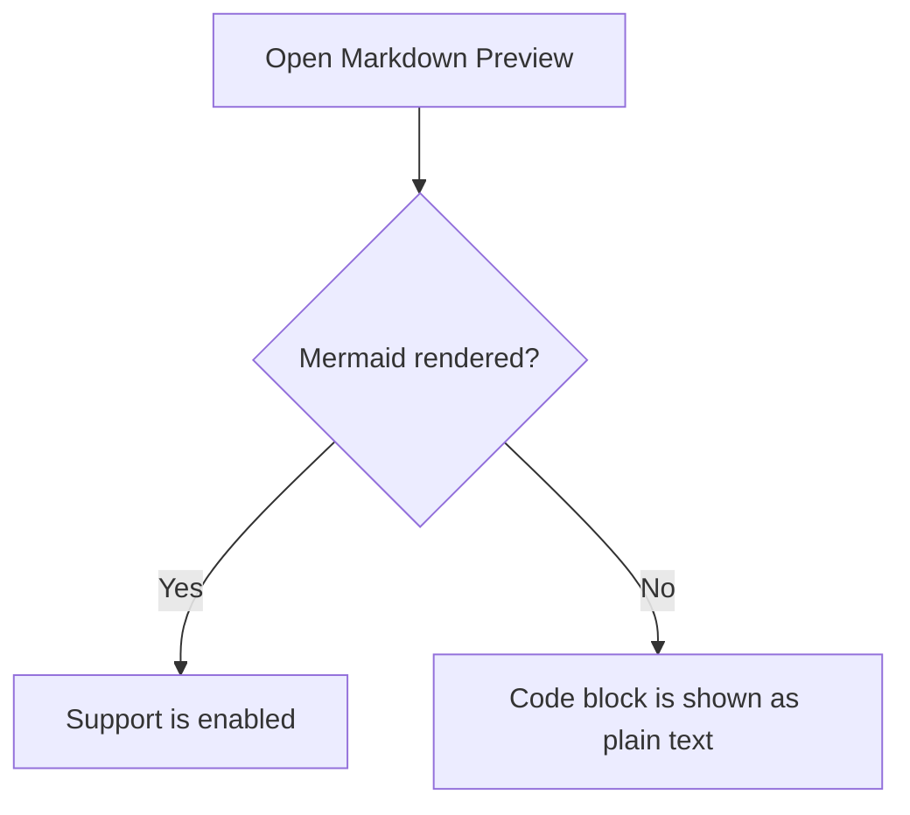

# Markdown Mermaid Test

This file is a small rendering test for Markdown previews in Forge.

## Plain Markdown

- Item one
- Item two
- Item three

## Mermaid

## Expected Result

If Mermaid support is wired into the preview path, the diagram above should render as a flowchart.
Otherwise, it should appear as a normal fenced code block.
