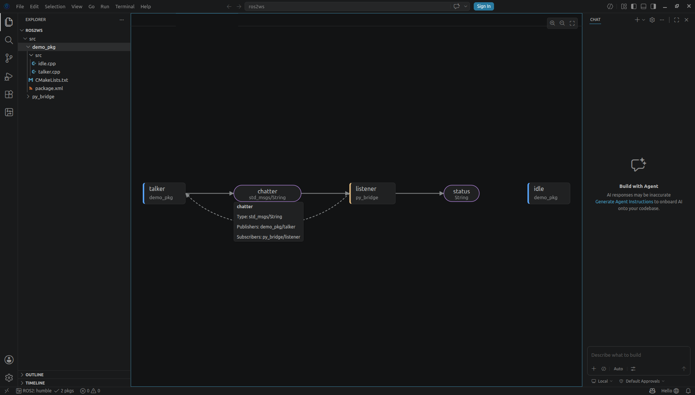
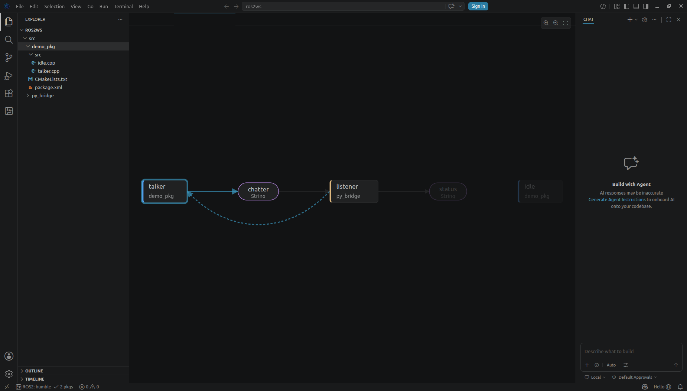
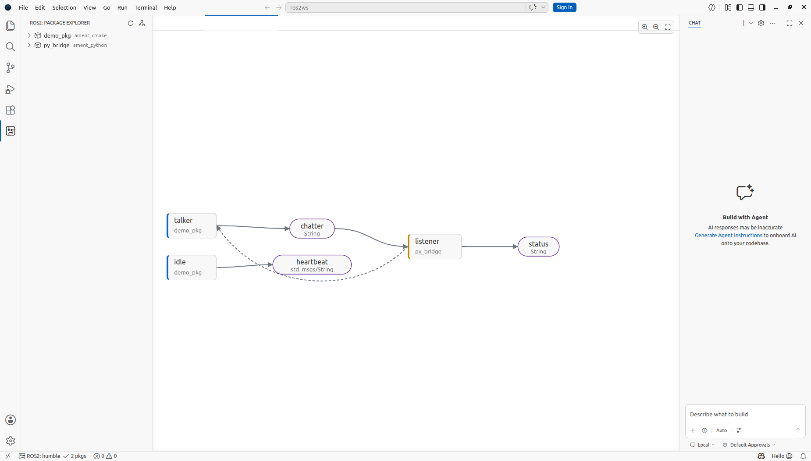
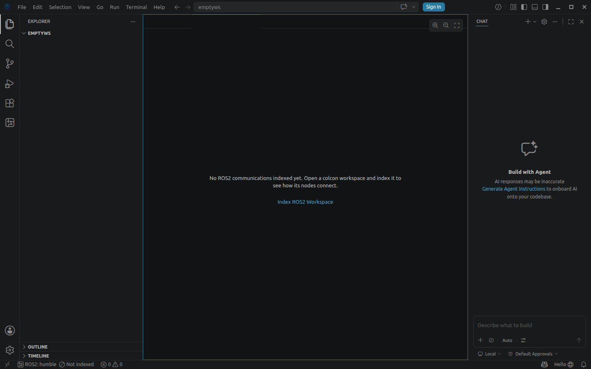

# RoboAgent — Finalized Features

Website-ready feature writeups. A feature is appended here only after it has been
implemented, reviewed, and verified end-to-end in the running app.

---

## ROS2 Node Graph — see your robot's architecture before anything runs

*Shipped: 2026-07-18 · Requirement: REQ-5 · Surfaces: editor pane, Package Explorer, walkthrough*

**Your robot's data flow, one keystroke away.** RoboAgent statically scans your colcon
workspace — every `rclcpp` and `rclpy` node, publisher, subscriber, service and action — and
draws the communication graph right inside the IDE. No sourced environment, no running
system, no `rqt_graph`: open the folder and see how your nodes connect.

- **Left-to-right data flow.** Publishers feed topics feed subscribers in a deterministic
  layered layout; service and action links render as dashed arcs between client and server.
  Nodes are color-accented by language (C++ blue, Python yellow); topics carry their message
  type.
- **Interactive.** Pan by dragging, zoom with the wheel or toolbar, click any node or topic
  to spotlight its connections and dim the rest. Hover for details — package, language,
  endpoint counts, or a topic's full publisher/subscriber list.
- **Always current.** The graph re-renders live as the Workspace Knowledge Graph re-indexes:
  save a source file that adds a publisher and watch the new topic appear — your viewport
  stays where you left it. It even reopens with your workspace after a restart.
- **Everywhere you'd look for it.** `RoboAgent: Show ROS2 Node Graph` in the command
  palette, the graph icon on the Package Explorer, and the "Get started with ROS2"
  walkthrough.

| | |
|---|---|
|  |  |
|  |  |

**Verified end-to-end** (2026-07-18, fixture workspace with C++ talker + Python listener +
service pair): palette & title-icon open a singleton editor; pub→topic→sub chain and dashed
service arc render correctly; click-highlight, background-clear, wheel zoom, hover cards,
live re-render on re-index, restart restore, empty state with working Index link, and
light/dark legibility all confirmed against the running dev build. Layout engine covered by
7 unit tests (layering, determinism, cycles, service edges, filtering, isolated nodes).
