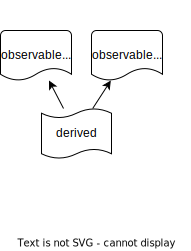
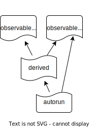
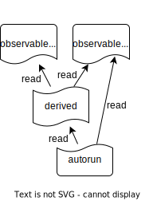
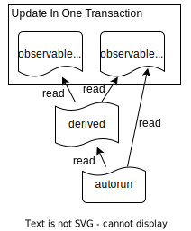

<style>
  h1 {
    font-size: 60px;
  }
</style>

# VS Code Observables

<style scoped>
  section { background-image: none !important; }
</style>

Reactive Programming in
VS Code's Codebase


---
<style scoped>
  section { padding-right: 0px; overflow: visible; }
</style>

# What are VS Code Observables?


---
<style scoped>
  section { padding-right: 0px; overflow: visible; }
</style>

# What are VS Code Observables?


- Observable = Value + Event -​ `observableValue`

---
<style scoped>
  section { padding-right: 0px; }
</style>

# What are VS Code Observables?


- Observable = Value + Event -​ `observableValue`
	- \+ Lazy Derived Observables​ - `derived`

---

<style scoped>
  section { padding-right: 0px; }
</style>

# What are VS Code Observables?


- Observable = Value + Event -​ `observableValue`
	- \+ Lazy Derived Observables​ - `derived`
	- \+ Reactions​ - `autorun`
---

<style scoped>
  section { padding-right: 0px; }
</style>

# What are VS Code Observables?


- Observable = Value + Event -​ `observableValue`
	- \+ Lazy Derived Observables​ - `derived`
	- \+ Reactions​ - `autorun`
	- \+ Automatic Subscription Handling - `.read(r)`
---

<style scoped>
  section { padding-right: 0px; }
</style>

# What are VS Code Observables?


- Observable = Value + Event -​ `observableValue`
	- \+ Lazy Derived Observables​ - `derived`
	- \+ Reactions​ - `autorun`
	- \+ Automatic Subscription Handling - `.read(r)`
	- \+ Glitch Free Batched Updates - `transaction`
	* \+ `Event.fromObservable` / `observableFromEvent`
	* **= 90% most used Observable API**
---

# Why Observables?

<style scoped>
  section h1 { font-size: 50px; }
  section { font-size: 26px; padding-top: 0; }
</style>

---

# Why Observables?

<style scoped>
  section h1 { font-size: 50px; }
  section { font-size: 26px; padding-top: 0; }
</style>

- ##### Convenient: Bundling value + event enables many utilities

---

# Why Observables?

<style scoped>
  section h1 { font-size: 50px; }
  section { font-size: 26px; padding-top: 0; }
</style>

- ##### Convenient: Bundling value + event enables many utilities
- ##### Prevent certain classes of bugs, real world example:

---

# Why Observables?

<style scoped>
  section h1 { font-size: 50px; }
  section { font-size: 26px; padding-top: 0; }
</style>

- ##### Convenient: Bundling value + event enables many utilities
- ##### Prevent certain classes of bugs, real world example:

```ts
if (repository.provider.historyProvider) {
	repositoryDisposables.add(repository.provider.historyProvider.onDidChangeCurrentHistoryItemGroup(() => {
		this.updateChildren(repository);
	}));
}
```

---


# Why Observables?

<style scoped>
  section h1 { font-size: 50px; }
  section { font-size: 26px; padding-top: 0; }
</style>

- ##### Convenient: Bundling value + event enables many utilities
- ##### Prevent certain classes of bugs, real world example:

```ts
if (repository.provider.historyProvider) {
	repositoryDisposables.add(repository.provider.historyProvider.onDidChangeCurrentHistoryItemGroup(() => {
		this.updateChildren(repository);
	}));
}
```


- Bug fix ([f57cd826](https://github.com/microsoft/vscode/commit/1f57cd8267e146bbedc1d7a00d9c09baadb6a4f1)):
```ts
const onDidChangeHistoryProvider = () => {
	if (!repository.provider.historyProvider) { return; }
	this._register(repository.provider.historyProvider.onDidChangeCurrentHistoryItemGroup(() => {
		this.updateChildren(repository);
	}));
};
this._register(repository.provider.onDidChangeHistoryProvider(onDidChangeHistoryProvider));
onDidChangeHistoryProvider();
```

---

# Why Observables?

<style scoped>
  section h1 { font-size: 50px; }
  section { font-size: 26px; padding-top: 0; }
</style>

- ##### Convenient: Bundling value + event enables many utilities
- ##### Prevent certain classes of bugs, real world example:
- Bug fix ([f57cd826](https://github.com/microsoft/vscode/commit/1f57cd8267e146bbedc1d7a00d9c09baadb6a4f1)):
```ts
const onDidChangeHistoryProvider = () => {
	if (!repository.provider.historyProvider) { return; }
	this._register(repository.provider.historyProvider.onDidChangeCurrentHistoryItemGroup(() =>
		this.updateChildren(repository)));
};
this._register(repository.provider.onDidChangeHistoryProvider(onDidChangeHistoryProvider));
onDidChangeHistoryProvider();
```

---

# Why Observables?

<style scoped>
  section h1 { font-size: 50px; }
  section { font-size: 26px; padding-top: 0; }
</style>

- ##### Convenient: Bundling value + event enables many utilities
- ##### Prevent certain classes of bugs, real world example:
- Bug fix ([f57cd826](https://github.com/microsoft/vscode/commit/1f57cd8267e146bbedc1d7a00d9c09baadb6a4f1)):
```ts
const onDidChangeHistoryProvider = () => {
	if (!repository.provider.historyProvider) { return; }
	this._register(repository.provider.historyProvider.onDidChangeCurrentHistoryItemGroup(() =>
		this.updateChildren(repository)));
};
this._register(repository.provider.onDidChangeHistoryProvider(onDidChangeHistoryProvider));
onDidChangeHistoryProvider();
```

- With observable `historyProvider`:
```ts
this._register(autorunWithStore((reader, store) => { /** @description updateChildren */
	const historyProvider = repository.provider.historyProvider.read(reader);
	if (!historyProvider) { return; }
	store.add(repository.provider.historyProvider.onDidChangeCurrentHistoryItemGroup(() =>
		this.updateChildren(repository)));
}));
```

---

# Why Observables?

<style scoped>
  section h1 { font-size: 50px; }
  section { font-size: 26px; padding-top: 0; }
</style>

- ##### Convenient: Bundling value + event enables many utilities
- ##### Prevent certain classes of bugs, real world example:

- With observable `historyProvider`:
```ts
this._register(autorunWithStore((reader, store) => { /** @description updateChildren */
	const historyProvider = repository.provider.historyProvider.read(reader);
	if (!historyProvider) { return; }
	store.add(repository.provider.historyProvider.onDidChangeCurrentHistoryItemGroup(() =>
		this.updateChildren(repository)));
}));
```

---

# Why Observables?

<style scoped>
  section h1 { font-size: 50px; }
  section { font-size: 26px; padding-top: 0; }
</style>

- ##### Convenient: Bundling value + event enables many utilities
- ##### Prevent certain classes of bugs, real world example:

- With observable `historyProvider`:
```ts
this._register(autorunWithStore((reader, store) => { /** @description updateChildren */
	const historyProvider = repository.provider.historyProvider.read(reader);
	if (!historyProvider) { return; }
	store.add(repository.provider.historyProvider.onDidChangeCurrentHistoryItemGroup(() =>
		this.updateChildren(repository)));
}));
```

- How to make `historyProvider` observable?

---

# Why Observables?

<style scoped>
  section h1 { font-size: 50px; }
  section { font-size: 26px; padding-top: 0; }
</style>

- ##### Convenient: Bundling value + event enables many utilities
- ##### Prevent certain classes of bugs, real world example:

- With observable `historyProvider`:
```ts
this._register(autorunWithStore((reader, store) => { /** @description updateChildren */
	const historyProvider = repository.provider.historyProvider.read(reader);
	if (!historyProvider) { return; }
	store.add(repository.provider.historyProvider.onDidChangeCurrentHistoryItemGroup(() =>
		this.updateChildren(repository)));
}));
```

- How to make `historyProvider` observable? With `observableFromEvent`!

```ts
class SCMProvider {
	...
	readonly historyProviderObs = observableFromEvent(this.onDidChangeHistoryProvider, () => this.historyProvider);
	...
}
```

---

# Why Observables?

<style scoped>
  section h1 { font-size: 50px; }
  section { font-size: 26px; padding-top: 0; }
</style>

- ##### Convenient: Bundling value + event enables many utilities
- ##### Prevent certain classes of bugs, real world example:

- With observable `historyProvider` and `currentHistoryItemGroup`:
```ts
this._register(autorun(reader => { /** @description updateChildren */
	const historyProvider = repository.provider.historyProvider.read(reader);
	if (!historyProvider) { return; }
	const historyItemGroup = repository.provider.historyProvider.currentHistoryItemGroup.read(reader);
	this.updateChildren(repository, historyItemGroup);
}));
```

---

# Why Observables?

<style scoped>
  section h1 { font-size: 50px; }
  section { font-size: 26px; padding-top: 0; }
</style>

- ##### Convenient: Bundling value + event enables many utilities
- ##### Prevent certain classes of bugs

---

# Why Observables?

<style scoped>
  section h1 { font-size: 50px; }
  section { font-size: 26px; padding-top: 0; }
</style>

- ##### Convenient: Bundling value + event enables many utilities
- ##### Prevent certain classes of bugs
- ##### Lazy `derived`s: fullName?

---

# Why Observables?

<style scoped>
  section h1 { font-size: 50px; }
  section { font-size: 26px; padding-top: 0; }
</style>

- ##### Convenient: Bundling value + event enables many utilities
- ##### Prevent certain classes of bugs
- ##### Lazy `derived`s: fullName?
- ##### Transactions: setFullName?

---

# Why Observables?

<style scoped>
  section h1 { font-size: 50px; }
  section { font-size: 26px; padding-top: 0; }
</style>

- ##### Convenient: Bundling value + event enables many utilities
- ##### Prevent certain classes of bugs
- ##### Lazy `derived`s: fullName?
- ##### Transactions: setFullName?
- ##### More descriptive code: Derive, don't update!

---

# Why Observables?

<style scoped>
  section h1 { font-size: 50px; }
  section { font-size: 26px; padding-top: 0; }
</style>

- ##### Convenient: Bundling value + event enables many utilities
- ##### Prevent certain classes of bugs
- ##### Lazy `derived`s: fullName?
- ##### Transactions: setFullName?
- ##### More descriptive code: Derive, don't update!
- ##### Established concept (implementation heavily inspired by MobX 2015)

---

# Debugging

- Set `const enableLogging = true;` in `src/vs/base/common/observable.ts`

---

# Best Practices

* Avoid `autorun` that sets `observableValue`, prefer `derived`
* Use `@description` in `autorun` and `derived` to make debugging easier
* Observables are not the solution to everything
	* Don't go too crazy (with complexity and number of observables)
* In your model, add a required `transaction: ITransaction | undefined` to your write methods
* ... and a required `reader: IReader | undefined` to your read methods

---

# Utilities

* `derivedOpts({ equalityComparer: deepEquals })`
* `derivedWithStore` / `autorunWithStore`
* `derivedWithCancellationToken`
* `waitForState` / `ObservablePromise`
* `Event.fromObservable` / `observableFromEvent`
* `observableSignal`: No `.set`, just `.trigger`
* ... and many more

---

# Deep Dive: derived

```ts
const myDerived = derived(reader => ... mySource.read(reader) ...);
```

* Lazy: Only re-computed when absolutely needed (stale cache)
	* Either on request (*pull*)
	* ... or, if it is a critical dependency, to check if it changed (*push*)

---

# Deep Dive: derived

```ts
const myDerived = derived(reader => ... mySource.read(reader) ...);
```

- Lazy: Only re-computed when absolutely needed (stale cache)
	- Either on request (*pull*)
	- ... or, if it is a critical dependency, to check if it changed (*push*)
	```ts
	const isActive = observableValue('isActive', true);
	const myDerived2 = derived(reader => isActive.read(reader) ? myDerived.read(reader) : null);
	transaction(tx => {
		isActive.set(false, tx);
		mySource.set(mySource.get() + 1, tx);
	});
	```

---

# Deep Dive: derived

```ts
const myDerived = derived(reader => ... mySource.read(reader) ...);
```

- Lazy: Only re-computed when absolutely needed (stale cache)
	- Either on request (*pull*)
	- ... or, if it is a critical dependency, to check if it changed (*push*)
	- Make eager: `myDerived.recomputeInitiallyAndOnChange(store)` (yep, this is the definition of an `autorun`)
* Cache is only alive when there is an observer
	* `myDerived.keepObserved(store)` to keep cache alive (still lazy!)

---

# Advanced Deep Dive: Change Summary

<style scoped>
  section { font-size: 28px; }
</style>

- New observable concept, not present in other libraries (e.g. MobX)

```ts
const myText = observableValue<string, TextEdits>('myText', 'Hello');

this._register(autorunHandleChanges({
	createEmptyChangeSummary: () => ({ edits: [] }),
	handleChange: (ctx, summary) => {
		if (ctx.didChange(myText)) { summary.edits.push(ctx.change); }
		return true;
	}
}, (reader, summary) => {
	const text = myText.read(reader);
	console.log(summary.edits);
}));

transaction(tx => {
	myText.set('Hello World', [{ start: 5, length: 0, newText: ' World' }]);
	myText.set('Hello World!', [{ start: 11, length: 0, newText: '!' }]);
});
```

---

# Advanced Deep Dive: Change Summary

<style scoped>
  section { font-size: 28px; }
</style>

- New observable concept, not present in other libraries (e.g. MobX)
- Also good for explaining why something changed (e.g. changed by extension, changed by user)

---

# Questions?
