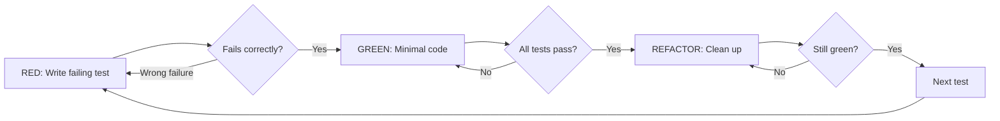

# Phase 1: TDD Iron Law

## Context

- Superpowers enforces strict TDD: "NO PRODUCTION CODE WITHOUT A FAILING TEST FIRST"
- Delete code written before tests, no exceptions
- CKE's `test` skill runs tests but doesn't enforce TDD ordering
- CKE serves general-purpose users — TDD must be opt-in, not default

## Overview

Add TDD enforcement as optional mode to `cook` skill (`--tdd` flag) and create a new `references/tdd-enforcement.md` in the `cook` skill.

## Files to Modify

- `.claude/skills/cook/SKILL.md` — add `--tdd` flag to modes table + intent detection
- `.claude/skills/cook/references/tdd-enforcement.md` — **NEW** TDD enforcement reference

## Implementation Steps

### 1. Create `cook/references/tdd-enforcement.md`

New reference file with TDD protocol adapted from Superpowers:

```markdown
---
name: tdd-enforcement
description: TDD Iron Law enforcement for cook --tdd mode. RED-GREEN-REFACTOR cycle.
---

# TDD Enforcement Mode

Activated via `--tdd` flag on cook skill.

## The Iron Law

NO PRODUCTION CODE WITHOUT A FAILING TEST FIRST.

Code written before test? Delete it. Start over. No exceptions.

## RED-GREEN-REFACTOR Cycle



## Per-Task Flow

For each implementation task:

1. **Write failing test** — one behavior, clear name, real code (no mocks unless unavoidable)
2. **Run test** — MUST fail. If passes → wrong test, fix it
3. **Write minimal code** — just enough to pass, no extras
4. **Run test** — MUST pass. All other tests still green
5. **Refactor** — clean up, stay green
6. **Commit** — after each green cycle

## Verification Checklist

Before marking task complete:
- [ ] Every new function has a test
- [ ] Watched each test fail before implementing
- [ ] Wrote minimal code to pass
- [ ] All tests pass with clean output
- [ ] Edge cases covered

## Anti-Rationalization

| Excuse | Reality |
|--------|---------|
| "Too simple to test" | Simple code breaks. 30 seconds. |
| "I'll test after" | Tests passing immediately prove nothing. |
| "Need to explore first" | Fine. Throw away, start with TDD. |
| "Test hard = design unclear" | Hard to test = hard to use. Fix design. |
| "TDD slows me down" | TDD faster than debugging. |
| "Manual test faster" | Can't re-run. Can't prove edge cases. |
```

### 2. Update `cook/SKILL.md`

**Add to Smart Intent Detection table:**

```markdown
| Contains "tdd", "test first", "test driven" | tdd | TDD-enforced implementation |
```

**Add to mode table:**

```markdown
| tdd | ✓ | ✓ (TDD) | **User approval at each step** | RED-GREEN per task |
```

**Add to flags list:**

```markdown
- `--tdd`: TDD-enforced implementation (RED-GREEN-REFACTOR per task)
```

**Add reference:**

```markdown
- `references/tdd-enforcement.md` - TDD Iron Law protocol for --tdd mode
```

## Todo

- [ ] Create `references/tdd-enforcement.md` with TDD protocol + Mermaid flow
- [ ] Add `--tdd` flag to cook SKILL.md (intent detection, modes table, flags list, references)
- [ ] Verify --tdd doesn't conflict with --auto or --fast

## Success Criteria

- `/ck:cook "implement feature" --tdd` enforces RED-GREEN-REFACTOR
- Default cook behavior unchanged (no TDD enforcement)
- Anti-rationalization table prevents common TDD skip excuses
- TDD mode works with all other cook modes (--tdd --auto = auto TDD)
