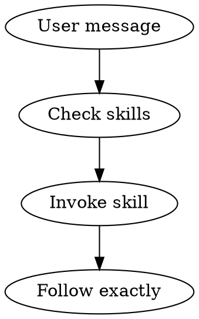

# Superpowers vs ClaudeKit Engineer (CKE) — Comparative Analysis

## Executive Summary

**Superpowers** (by Jesse Vincent / @obra) is an opinionated workflow-enforcement framework focused on disciplined software development via ~14 tightly-coupled skills. **ClaudeKit Engineer (CKE)** is a comprehensive productivity framework with 70+ skills, 14 agents, extensive hooks, and multi-platform support (Claude Code, OpenCode).

| Dimension | Superpowers | CKE |
|-----------|-------------|-----|
| **Philosophy** | Discipline-first, TDD-enforced, minimal | Productivity-first, breadth-oriented, extensible |
| **Skills count** | 14 | 70+ |
| **Agents** | 1 (code-reviewer) | 14 specialized |
| **Hooks** | 1 (SessionStart) | 15+ (SessionStart, SubagentStart/Stop, privacy, etc.) |
| **Commands** | 3 (deprecated) | Multiple active |
| **Platform support** | Claude Code, Codex, OpenCode, Gemini CLI, Cursor | Claude Code, OpenCode |
| **Version** | v5.0.2 | v2.14.0-beta.16 |
| **Tests** | Extensive (skill-triggering, integration, e2e) | Hook unit tests |
| **License** | MIT (open-source) | Commercial |

---

## 1. Architecture Comparison

### 1.1 Superpowers Architecture

```
hooks/
  hooks.json          → SessionStart only (injects using-superpowers skill)
  session-start       → Bash script, JSON output, cross-platform polyglot
  run-hook.cmd        → Windows/Unix polyglot wrapper

skills/               → 14 skills, each with SKILL.md + optional references/scripts
agents/               → 1 agent (code-reviewer)
commands/             → 3 commands (all deprecated)
tests/                → 5 test suites (brainstorm-server, claude-code, explicit-skill-requests, opencode, subagent-driven-dev)
docs/                 → Platform docs + testing guide
```

**Key insight:** Superpowers injects ONE skill (`using-superpowers`) at session start, which acts as a meta-skill that forces the agent to check/invoke other skills before ANY action. This is a "skill router" pattern.

### 1.2 CKE Architecture

```
.claude/
  settings.json       → Multiple hooks (SessionStart, SubagentStart/Stop, etc.)
  hooks/              → 15+ JavaScript hooks (CJS modules)
  agents/             → 14 specialized agent definitions
  commands/           → Grouped commands (docs/, git/)
  skills/             → 70+ skills with install scripts, shared modules
  rules/              → Workflow rules (primary-workflow, development-rules, etc.)
  scripts/            → Utility scripts (catalog generation, etc.)
  statusline.cjs      → Custom status line
```

**Key insight:** CKE uses a more complex orchestration with multiple hooks at different lifecycle stages, dedicated agents for each concern, and rules files as persistent instructions.

### 1.3 Architectural Differences

| Aspect | Superpowers | CKE |
|--------|-------------|-----|
| **Skill routing** | Single meta-skill forces invocation | Hook-injected rules + skill catalog generation |
| **Agent model** | Subagent per task (fresh context) | Named agents with defined roles |
| **Hook lifecycle** | SessionStart only | SessionStart, SubagentStart, SubagentStop, privacy, task completion |
| **Config format** | Bash scripts + JSON | Node.js CJS modules |
| **State management** | TodoWrite for checklists | Tasks API + plans + memory system |
| **Plan storage** | `docs/superpowers/plans/` | `plans/{date-slug}/` with phases |

---

## 2. What Superpowers Does Better (CKE Should Learn)

### 2.1 **DOT Flowcharts as Executable Specs** ⭐⭐⭐

Superpowers uses GraphViz DOT diagrams embedded in skills as the AUTHORITATIVE process definition. The model follows the graph, not prose.



**Why it matters:** Models follow structured graphs more reliably than prose. Superpowers discovered "The Description Trap" — models would follow short descriptions over detailed flowcharts.

**CKE action:** Add DOT/Mermaid process flows to key skills (brainstorm, cook, fix, plan) as authoritative specs.

### 2.2 **Hard Gates & Anti-Rationalization Tables** ⭐⭐⭐

Superpowers has explicit `<HARD-GATE>` blocks and comprehensive rationalization prevention tables:

```
| Excuse | Reality |
| "Too simple to test" | Simple code breaks. Test takes 30 seconds. |
| "I'll test after" | Tests passing immediately prove nothing. |
```

**Why it matters:** LLMs rationalize skipping workflows. Explicit anti-rationalization tables catch these patterns.

**CKE action:** Add `<HARD-GATE>` blocks to `cook`, `fix`, `brainstorm` skills. Add rationalization prevention tables to TDD-related skills.

### 2.3 **Verification Before Completion** ⭐⭐⭐

Dedicated skill that enforces "evidence before claims." No "should work" or "looks correct" — must run actual verification command and show output.

**Why it matters:** Prevents false completion claims, a common LLM failure mode.

**CKE action:** Integrate verification-before-completion principles into `code-review` and `test` skills. Add to the `code-reviewer` agent prompt.

### 2.4 **Two-Stage Code Review (Spec + Quality)** ⭐⭐

Superpowers separates review into:
1. **Spec compliance review** — Does code match what was requested?
2. **Code quality review** — Is the code well-written?

**Why it matters:** Catches the common failure where code is well-written but doesn't match requirements.

**CKE action:** Split `code-review` skill into spec-compliance and quality passes.

### 2.5 **Git Worktree as First-Class Citizen** ⭐⭐

Worktree setup is REQUIRED before any implementation, with:
- Automatic directory detection
- .gitignore verification
- Project setup auto-detection
- Clean test baseline verification

**CKE status:** CKE has a `worktree` skill but it's not mandatory in the workflow.

**CKE action:** Make worktree setup a recommended step in `cook` skill workflow.

### 2.6 **Subagent Context Isolation Principle** ⭐⭐

> "Subagents receive only the context they need, preventing context window pollution."

Each subagent gets precisely crafted prompts — never session history. This preserves context for coordination.

**CKE status:** CKE has SubagentStart hooks for context injection, but doesn't enforce minimal context.

**CKE action:** Add context isolation guidelines to orchestration protocol.

### 2.7 **Implementer Status Protocol** ⭐⭐

Subagents report structured statuses: `DONE`, `DONE_WITH_CONCERNS`, `BLOCKED`, `NEEDS_CONTEXT`. Controller handles each appropriately.

**CKE status:** No standardized status protocol for subagents.

**CKE action:** Define status protocol for agent communication.

### 2.8 **Test Infrastructure for Skills** ⭐⭐

Superpowers has 5 test suites validating skill behavior:
- Skill-triggering tests (do skills activate from naive prompts?)
- Integration tests using `claude -p` headless mode
- Token usage analysis script
- End-to-end workflow tests with real projects

**CKE status:** Hook unit tests exist but no skill behavior tests.

**CKE action:** Build skill-triggering test suite.

### 2.9 **Scope Assessment in Brainstorming** ⭐

Brainstorming assesses whether a project is too large for a single spec. Multi-subsystem requests are decomposed into sub-projects.

**CKE action:** Add scope assessment step to `brainstorm` and `plan` skills.

### 2.10 **Instruction Priority Hierarchy** ⭐

Explicit ordering: User instructions > Skills > System prompt.

**CKE action:** Already somewhat addressed by CLAUDE.md priority, but could be more explicit in skill meta-instructions.

---

## 3. What CKE Does Better (Superpowers Should Learn)

### 3.1 **Massive Skill Ecosystem** ⭐⭐⭐

CKE has 70+ specialized skills covering:
- **Frontend:** React, Vue, Svelte, Three.js, shaders, Remotion
- **Backend:** Node.js, Python, Go, NestJS, FastAPI
- **Mobile:** React Native, Flutter, SwiftUI, Kotlin
- **DevOps:** Docker, K8s, Cloudflare, GCP
- **AI/ML:** Gemini multimodal, Claude API, Google ADK
- **Design:** UI/UX, Mermaid diagrams, copywriting, brand design
- **Payments:** Stripe, Paddle, SePay
- **Databases:** PostgreSQL, MongoDB
- **Testing:** Playwright, Vitest, k6
- **Docs:** Mintlify, llms.txt generation

**Superpowers has:** 14 workflow-focused skills, zero domain-specific skills.

### 3.2 **14 Specialized Agents** ⭐⭐⭐

CKE defines dedicated agents with specific roles:
- `planner`, `researcher`, `tester`, `debugger`
- `fullstack-developer`, `ui-ux-designer`
- `code-reviewer`, `code-simplifier`
- `docs-manager`, `project-manager`
- `git-manager`, `journal-writer`
- `brainstormer`, `mcp-manager`

**Superpowers has:** 1 agent (code-reviewer). All other roles handled by generic subagents with prompt templates.

### 3.3 **Rich Hook System** ⭐⭐⭐

CKE hooks cover the full lifecycle:

| Hook | Purpose |
|------|---------|
| `session-init` | Initialize session state |
| `session-state` | Inject plan context, naming patterns |
| `subagent-init` | Configure subagent context |
| `team-context-inject` | Team coordination |
| `cook-after-plan-reminder` | Workflow enforcement |
| `privacy-block` | Sensitive file protection |
| `scout-block` | Prevent duplicate scouting |
| `skill-dedup` | Prevent duplicate skill activation |
| `descriptive-name` | Enforce naming conventions |
| `dev-rules-reminder` | Remind development rules |
| `post-edit-simplify-reminder` | Code simplification |
| `task-completed-handler` | Task lifecycle management |
| `teammate-idle-handler` | Team coordination |
| `plan-format-kanban` | Plan visualization |

**Superpowers has:** 1 hook (SessionStart). All enforcement done via skill prose.

### 3.4 **Agent Team Orchestration** ⭐⭐⭐

CKE supports multi-agent teams with:
- File ownership rules (glob patterns)
- Communication protocol (message, broadcast)
- Task claiming system
- Plan approval flow
- Conflict resolution
- Shutdown protocol
- Git worktree per teammate

**Superpowers has:** Parallel agent dispatch skill, but no team coordination framework.

### 3.5 **Plan Management System** ⭐⭐

CKE plans are structured with:
- Timestamped directories (`plans/260315-1144-slug/`)
- Phase files (`phase-01-setup.md`, `phase-02-impl.md`)
- Research subdirectories
- Plan-scoped reports
- Kanban visualization
- Progress tracking

**Superpowers:** Single plan file at `docs/superpowers/plans/YYYY-MM-DD-feature.md`.

### 3.6 **Memory System** ⭐⭐

CKE has persistent file-based memory:
- `user` memories (role, preferences)
- `feedback` memories (corrections, guidelines)
- `project` memories (ongoing work, deadlines)
- `reference` memories (external resources)
- Indexed via `MEMORY.md`

**Superpowers:** No memory system. Each session starts fresh.

### 3.7 **MCP Integration** ⭐⭐

CKE integrates with MCP servers (browser automation, external tools), with a dedicated `mcp-manager` agent and `use-mcp` skill.

**Superpowers:** No MCP support.

### 3.8 **Visual Preview System** ⭐⭐

CKE's `preview` skill generates visual explanations, slides, diagrams, and ASCII art. `markdown-novel-viewer` serves content in browser.

**Superpowers:** Has brainstorm visual companion (WebSocket server for showing mockups during brainstorming), but limited to brainstorming context.

### 3.9 **Custom Status Line** ⭐

CKE has a custom status line showing plan context, session info.

### 3.10 **Security Features** ⭐

CKE has:
- `privacy-block` hook for sensitive files
- `security-scan` skill
- Pre-commit secret detection in `git` skill

**Superpowers:** No security-specific features.

### 3.11 **Documentation Management** ⭐

CKE has structured docs management:
- `docs-manager` agent
- `docs` skill for init/update/summarize
- Automatic changelog and roadmap updates
- Project overview PDR

**Superpowers:** Minimal — specs and plans saved to docs/superpowers/.

### 3.12 **Coding Level Adaptation** ⭐

CKE's `coding-level` skill adapts explanations to user experience level (0-5).

---

## 4. Feature-by-Feature Comparison

| Feature | Superpowers | CKE | Winner |
|---------|-------------|-----|--------|
| **Brainstorming** | Excellent — Socratic, visual companion, spec review loop, hard gates | Good — question-driven, agent delegation | Superpowers |
| **Planning** | Good — bite-sized tasks, chunk review, TDD-enforced | Better — multi-phase, structured directories, kanban view | CKE |
| **TDD enforcement** | Excellent — Iron Law, delete-code-first, rationalization tables | Basic — mentioned in rules, not enforced | Superpowers |
| **Code review** | Better — two-stage (spec + quality), loop-based | Good — dedicated agent, but single-pass | Superpowers |
| **Debugging** | Excellent — 4-phase systematic, root-cause tracing, 3-fix architecture rule | Good — dedicated debugger agent | Superpowers |
| **Git workflow** | Better — worktree-first, branch finishing skill | Good — git-manager agent, conventional commits | Superpowers |
| **Domain skills** | None | Extensive (70+ covering full-stack) | CKE |
| **Agent orchestration** | Basic — subagent dispatch, fresh-per-task | Advanced — 14 agents, team coordination, parallel execution | CKE |
| **Hook system** | Minimal (1 hook) | Comprehensive (15+ hooks) | CKE |
| **Multi-platform** | Excellent — CC, Codex, OpenCode, Gemini, Cursor | Good — CC, OpenCode | Superpowers |
| **Testing infrastructure** | Excellent — 5 test suites, token analysis | Basic — hook tests | Superpowers |
| **Memory/persistence** | None | Good — file-based memory system | CKE |
| **Visual tools** | Brainstorm companion only | Preview, diagrams, slides, markdown viewer | CKE |
| **Security** | None | Privacy block, security scan, secret detection | CKE |
| **Documentation** | Minimal | Full management system | CKE |
| **Community/ecosystem** | Open-source, marketplace, contributions | Commercial, extensive marketplace | Tie |
| **Cross-platform hooks** | Excellent — polyglot wrappers, Windows/Linux tested | Good — Node.js CJS, Windows-aware | Superpowers |

---

## 5. Key Learnings for CKE

### Priority 1 — Workflow Discipline (High Impact, Medium Effort)

1. **Add DOT/Mermaid process flows to core skills** — `cook`, `fix`, `brainstorm`, `plan` should have authoritative flowcharts
2. **Add `<HARD-GATE>` blocks** — Prevent implementation before design approval
3. **Add anti-rationalization tables** — To `cook`, `fix`, `test` skills
4. **Add verification-before-completion** — Integrate into `code-review` and `test` skills

### Priority 2 — Quality Gates (High Impact, High Effort)

5. **Two-stage code review** — Split into spec-compliance + quality passes
6. **Implementer status protocol** — `DONE`, `DONE_WITH_CONCERNS`, `BLOCKED`, `NEEDS_CONTEXT`
7. **Subagent context isolation** — Enforce minimal context in orchestration protocol
8. **Scope assessment** — Add to brainstorm/plan to detect over-scoped projects

### Priority 3 — Testing & Quality (Medium Impact, High Effort)

9. **Skill-triggering tests** — Validate skills activate from naive prompts
10. **End-to-end workflow tests** — Test full brainstorm → plan → implement → review cycle
11. **Token usage tracking** — Analyze cost per skill/workflow

### Priority 4 — Nice-to-Have

12. **Gemini CLI support** — Extension format + tool mapping
13. **Cursor plugin support** — Plugin manifest
14. **Brainstorm visual companion** — WebSocket-based mockup viewer

---

## 6. Key Learnings for Superpowers (from CKE)

1. **Add domain-specific skills** — Frontend, backend, mobile, DevOps, databases
2. **Add dedicated agents** — Planner, researcher, tester beyond generic subagents
3. **Add rich hook system** — SubagentStart/Stop hooks for lifecycle management
4. **Add memory system** — Cross-session persistence for user preferences, feedback
5. **Add plan management** — Multi-phase plans with progress tracking
6. **Add security features** — File privacy, secret detection
7. **Add MCP integration** — External tool connections
8. **Add team orchestration** — Multi-agent team coordination

---

## 7. Philosophy Comparison

### Superpowers: "Discipline Through Enforcement"

- **Iron Laws** that cannot be violated
- **Delete code** written before tests
- Skills as **mandatory workflows**, not suggestions
- Every project goes through brainstorming, regardless of perceived simplicity
- "Violating the letter of the rules is violating the spirit"
- Heavy emphasis on preventing LLM rationalization

### CKE: "Productivity Through Breadth"

- **YAGNI/KISS/DRY** as guiding principles
- Skills as **specialized tools** for specific domains
- Agent orchestration for **parallel execution**
- Rich ecosystem covering **full software lifecycle**
- Hooks for **lifecycle management** at every stage
- Memory for **cross-session continuity**

### Synthesis

The ideal framework combines:
- Superpowers' **discipline enforcement** (hard gates, verification, anti-rationalization)
- CKE's **breadth and ecosystem** (70+ skills, 14 agents, rich hooks)
- Superpowers' **process rigor** (TDD iron law, two-stage review, systematic debugging)
- CKE's **orchestration power** (team coordination, plan management, memory)

---

## Unresolved Questions

1. How to integrate DOT flowcharts without bloating skill file sizes?
2. Should CKE enforce TDD as strictly as Superpowers, or keep it configurable?
3. Can Superpowers' skill-triggering test approach work with CKE's larger skill set?
4. What's the right balance between enforcement and flexibility for different user levels?
5. Should CKE adopt Superpowers' spec-then-plan two-document approach or keep single-plan?
