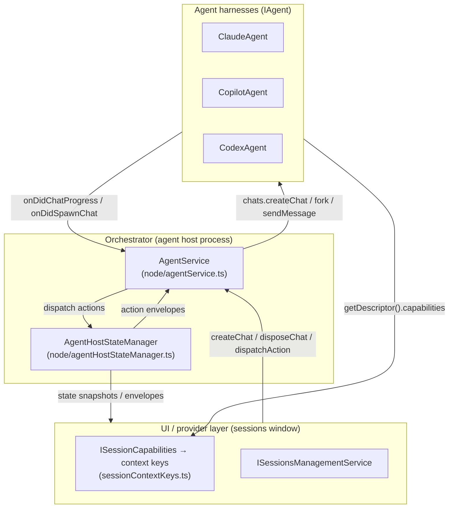
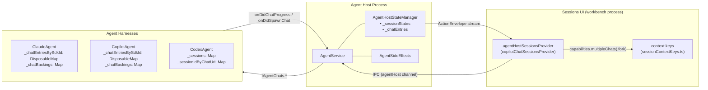
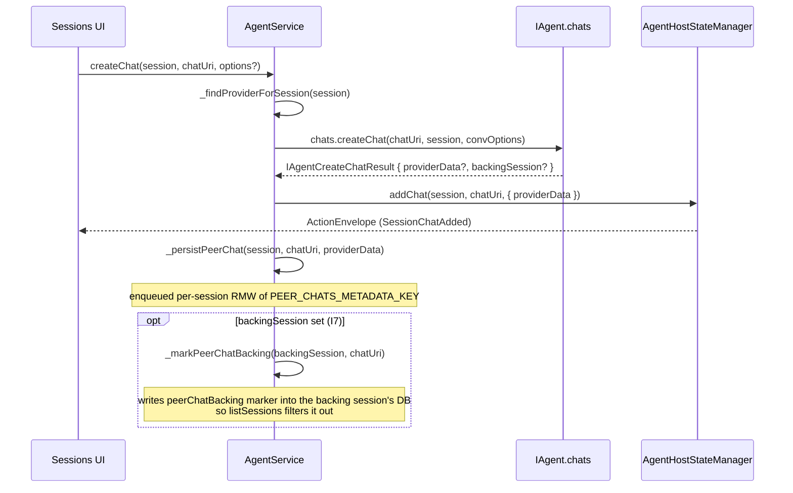
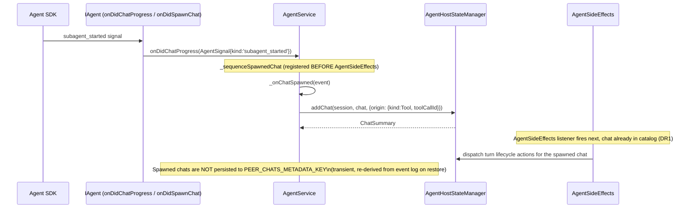
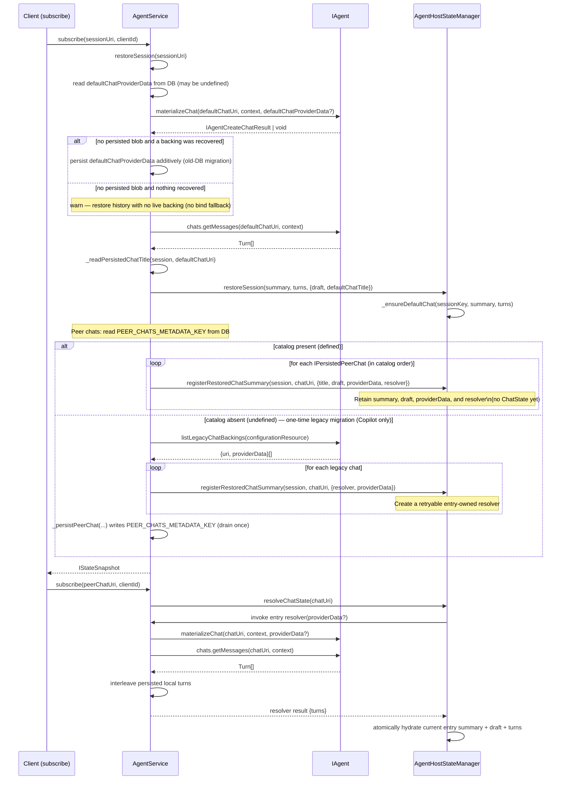
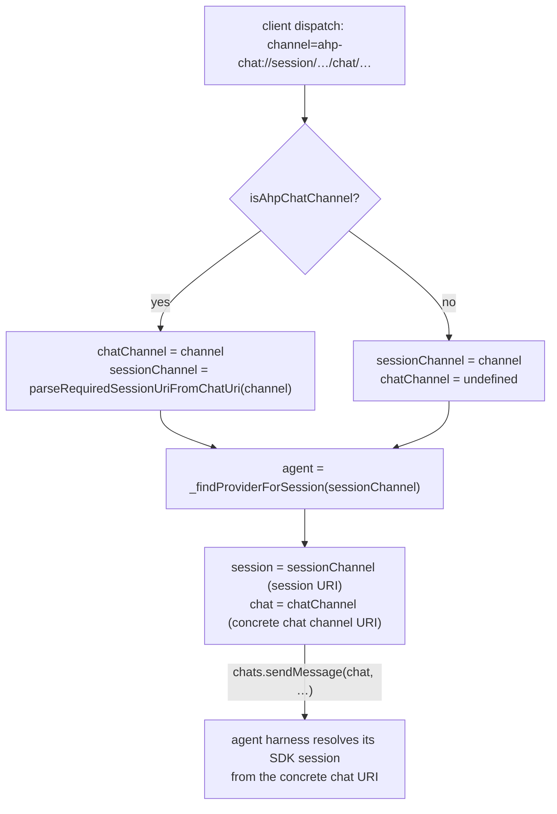

<!--
  AGENTS.md
  Living spec — keep in sync with code after each significant change.
  See: node/agentService.ts, node/agentHostStateManager.ts,
       node/claude/claudeAgent.ts, node/copilot/copilotAgent.ts,
       node/codex/codexAgent.ts, node/agentSideEffects.ts,
       common/agent.ts (IAgent, IAgentChats, IAgentCapabilities),
       common/agentService.ts (IAgentService, IAgentConnection).
-->

# Multi-Chat Architecture

> **Status: COMPLETE** (2026-07-01)
> All waves A–D and gates G-B1, G-C1, G-C2, G-D1 are done. Codex, Claude, and
> Copilot all use the unified orchestrator path.
>
> Codex advertises `multipleChats: { fork: true }`. Host-only capability checks
> and provider-independent conformance scenarios run in replay; model-backed
> Codex peer/fork parity remains gated by `supportsMultipleChatsE2E` /
> `supportsChatForkE2E` until the documented live-recording defect is fixed.
>
> The *operational* chat surface (send/abort/model/agent/history) is fully
> chat-addressed and uniform across harnesses. Session ownership lives in the
> orchestrator: it drives every harness through the chat-surface seam — see
> [§7 Session Ownership (T2/T4)](#7-session-ownership-t2t4--the-orchestrator-owns-the-session).

---

## 1. Mental Model

### Three distinct concepts

| Term | What it is | Owner |
|------|-----------|-------|
| **SDK conversation** | A provider-native conversation/thread with its own restore identity and runtime resources. | Agent harness |
| **Chat** | A thread of turns addressed by a chat channel URI. AH owns its URI and membership; the agent owns its SDK backing. | `AgentService` + agent harness |
| **Orchestrator session** | The protocol-visible entity that bundles a session with its chat catalog, state, and persistence. The orchestrator owns the catalog (which chats exist), the default-chat pointer, and all persistence. | `AgentService` + `AgentHostStateManager` |

### Guiding principles

- **"Represent, don't orchestrate."** The agent harness creates and drives SDK
  chats; the orchestrator records what exists and routes protocol
  actions. No agent-specific logic leaks into `AgentService` or
  `AgentHostStateManager`.
- **Composition over inheritance.** All harnesses share one membership path
  (`addChat`/`removeChat`), one persistence path (`PEER_CHATS_METADATA_KEY`),
  and one restore path (`registerRestoredChatSummary` + `resolveChatState`).
  Per-harness features are expressed
  through `IAgentCapabilities` flags, not `if (provider === 'claude') ...`
  branches.
- **Single catalog path.** Whether a chat is created by the user ("Add Chat")
  or spawned by the harness (subagent tool call), it enters the catalog through
  exactly one path (`AgentHostStateManager.addChat`). See invariant I4 below.

### Terminology convention: "session" is overloaded — read it by layer

The word **session** means two different things depending on which side of the
seam you are on. To avoid confusion, follow this convention:

| Where | What `session` means | Notes |
|-------|----------------------|-------|
| AHP wire protocol (`common/state/protocol/`) and the orchestrator (`AgentService`, `AgentHostStateManager`) | The **AH session** — the protocol-visible grouping of a default chat plus its peer chats. | This is the vocabulary the generated protocol types pin (`SessionState`, `SessionSummary`, `sessionAdded`, ...); it is immutable and authoritative. |
| Inside an agent harness (`node/claude`, `node/copilot`, `node/codex`) | The agent's **own SDK / provider session** — the provider's native concept (Codex calls it a *thread*). The agent has no notion of the AH grouping; it only ever deals in chats and its own SDK sessions. | Prefer the provider's native term where one exists (Codex "thread"); otherwise spell it out as "SDK session" / "provider session" in comments and local names wherever the two could be confused. |
| The `IAgent` seam (`chats.*` plus chat metadata/configuration events) | Operations receive an exact chat plus opaque persistence/configuration scopes. | Providers never receive AH ownership or chat-role fields. |

**Why we do not rename the agents' "SDK session" symbols:** the generated
protocol fixes "Session" = AH session across hundreds of references we cannot
change. Provider-internal SDK sessions remain native runtime concepts, while the
chat seam exposes no AH session ownership.

---

## 2. Ownership and Layering



### Agent layer (`common/agent.ts:IAgent`)

Responsible for:
- Creating and owning SDK chats (`chats.createChat`, with optional fork input).
- Reading history (`chats.getMessages`).
- Emitting progress signals (`onDidChatProgress`).
- Emitting membership events for harness-spawned chats (`onDidSpawnChat`, `onDidEndChat`).
- Re-attaching a chat's backing on restore (`materializeChat`) — including the session's default chat.
- Advertising static capability flags (`getDescriptor().capabilities`).

Agents do **not** maintain the chat catalog, persist membership, know whether a chat is the session or a peer, or inject `AgentHostStateManager`. Host facts they genuinely need (subagent origin, session customizations, prompt-cache metadata, session-title changes, active-client chat membership) arrive through typed seams — see §8.

**File organization rule:** `common/agent.ts` holds the *provider model* — `IAgent` and every type/helper/signal reachable from it (chat lifecycle, create/materialize/legacy-migration payloads, config-resolution parameters, `AgentSignal`/`AgentSession`). `common/agentService.ts` holds the *orchestrator-facing service surface* — `IAgentService`, `IAgentConnection`, `IAgentHostService`, settings/env constants, and diagnostics types. The dependency is one-directional: `agentService.ts` may import from `agent.ts`, but `agent.ts` must never import from `agentService.ts`. `agentService.ts` re-exports the public provider types from `agent.ts` for call-site compatibility; new provider code should import directly from `agent.ts`.

### Orchestrator layer

**`AgentService` (`node/agentService.ts`):**
- Owns the `(session, chat)` → `(agent, session URI, chat URI)` mapping.
- Owns `_providers`, `_sessionToProvider`, and `_findProviderForSession` (which falls back through the session URI's scheme when a session was restored without an `AgentService.createSession` call in this process lifetime).
- Owns `AgentSessionRegistry`, the durable source of truth for which sessions exist. `listSessions` enumerates the registry, hydrates each initial chat through `IAgent.getChatMetadata`, and applies the existing DB/state overlays.
- Dispatches user-driven chat lifecycle (`createChat`, `disposeChat`) to `chats.*`.
- Disposes every catalog chat in stable order (peers first, initial chat last); releases every catalog chat on idle eviction.
- Derives the exhaustive per-operation `IAgentChatContext` (persistence scope, opaque configuration scope, catalog origin, host customizations) via the single `createAgentChatContext` helper.
- Supplies complete resolved `IAgentCreateChatOptions` (`workingDirectories`, `project`, provider config, model/agent, active client, and fork/import/side-chat source) on every creation.
- Records side-chat provenance in the catalog but leaves hidden context injection and visible-history filtering to the provider. The source is a stable turn id; active-turn partial response and selected text are immutable creation-time snapshots.
- Passes the full ordered `workingDirectories` set and the initiating `AgentHostClientType` on each send while still supplying transient chat context. Providers launch in index 0, retain additional roots, and attribute usage/telemetry to the correct client surface.
- Persists and restores the orchestrator-owned peer-chat catalog (`PEER_CHATS_METADATA_KEY` in the session database, serialized per session via `_peerChatCatalogWrites`).
- Suppresses a peer chat's separately-enumerable backing SDK session (when `IAgentCreateChatResult.backingSession` is set): marks it via `_markPeerChatBacking` and filters it out of `listSessions` (invariant I7).
- Routes harness-spawned chats into the catalog (`_onChatSpawned`, `_onChatEnded`).
- Owns the restore flow (`restoreSession`, `_restorePeerChats`).

**`AgentHostStateManager` (`node/agentHostStateManager.ts`):**
- Holds the authoritative in-memory state tree:
  - `_sessionStates: Map<string, ISessionEntry>` — per-session `SessionState` + catalog timestamps.
  - `_chatEntries: Map<string, IChatEntry>` — one entry for every chat catalog
    item. An entry owns its current `ChatSummary`, optional hydrated
    `ChatState`, opaque `providerData`, and (for restored peers) resolver,
    in-flight promise, and invalidation state.
- Owns `_ensureDefaultChat`: creates the default `ChatState` (URI derived deterministically from the session URI via `buildDefaultChatUri`) at create/restore time.
- `addChat`/`registerRestoredChatSummary`/`removeChat`: the paths for live,
  restored, and removed catalog membership.
- `getChatState` is a synchronous, no-I/O peek for reducers and diagnostics.
  Interaction paths use `resolveChatState`, which coalesces one peer's
  materialization, retries failures, and atomically publishes complete state.
- `getChatOrigin` reads a chat's origin from its `ChatSummary`, so a restored
  chat's origin is available before its state is ever hydrated.
- Session-level active-turn tracking via `_sessionsWithActiveTurn` (a set of chat URIs per session, so multi-chat sessions running concurrent turns stay correct).

### UI/provider layer (`sessions/services/sessions/common/session.ts:ISessionCapabilities`)

- Protocol `AgentCapabilities` (`multipleChats?: { fork?: boolean }`) flows from `AgentInfo.capabilities` (protocol) through the provider adapter into `ISession.capabilities` (`ISessionCapabilities`), whose `supportsMultipleChats`/`supportsFork` flags derive from the presence of `multipleChats` and `multipleChats.fork`, and from there into VS Code context keys (`sessionContextKeys.ts:SessionSupportsMultipleChatsContext`, `SessionSupportsForkContext`).
- UI actions read context keys — no provider-id switches.

---

## 3. Key Invariants

**I1 — `providerData` is opaque.**
The state-manager-owned `IChatEntry` stores the blob returned by
`chats.createChat` verbatim. Neither `AgentService` nor
`AgentHostStateManager` parses, validates, or mutates it. It is round-tripped
to the agent verbatim on restore via
`materializeChat(chat, context, providerData)`.

Opaque to the host, but not arbitrary for the provider: whatever id the blob
carries is the *only* handle the provider gets back on the next process, so it
must name the provider's own durable runtime — the key that runtime is
registered and addressed under — and not a transient SDK handle that the
provider decouples from it. Codex's session-backing chat is the worked example:
its runtime keeps the host-minted session id and records its app-server thread
id in a metadata overlay, so a thread-keyed blob would restore the runtime under
an id nothing addresses it by (leaving every notification unroutable) and would
go stale the moment a rematerialization mints a new thread. Where the two
genuinely coincide — a Codex peer chat or fork, whose runtime *is* its thread —
recording the thread id is the same thing as recording the runtime id.
`IAgentCreateChatResult.backingSession` remains the place to name a separately
enumerable SDK conversation (I7); it is not a second id channel for the blob.

**I2 — `sessionUri` and `chatChannelUri` are never overloaded.**
A session URI (`ahp-copilot://`, `ahp-claude://`, …) identifies a session. A chat channel URI (`ahp-chat://…`) identifies a chat within a session. The two schemes are structurally distinct; `isAhpChatChannel` / `parseDefaultChatUri` / `buildDefaultChatUri` are the only crossing points. Passing a chat URI where a session URI is expected (or vice versa) is a bug.

**I3 — The default chat uses the same explicit backing contract as every chat.**
The default chat URI is derived from the AH session URI, but its provider identity is opaque `providerData`. Claude and Copilot mint independent SDK ids, return them from `createChat`, and restore them through `materializeChat`; equality with the AH session id is never assumed and there is no identity-reuse bind fallback. Codex persists its explicit thread mapping. AH never depends on provider identity reuse for ownership or enumeration.

**I4 — Single catalog path (spawn channel).**
Both user-driven chats (`AgentService.createChat` → `addChat`) and harness-spawned chats (`AgentService._onChatSpawned` → `addChat`) go through `AgentHostStateManager.addChat`. The spawn-channel listener is registered **before** `AgentSideEffects` during `registerProvider` (`node/agentService.ts:registerProvider`) to guarantee the chat exists in the catalog before any turn actions arrive for it (DR1 deterministic sequencing).

**I5 — Orchestrator peer-chat catalog is the restore source of truth (with one-time legacy migration).**
The orchestrator persists additional chats in `PEER_CHATS_METADATA_KEY` and the initial chat's opaque backing in `defaultChatProviderData`. Restore materializes both through the same provider-data contract — `materializeChat` is the *only* way a default chat is re-attached. When a legacy session has no persisted blob, whatever `materializeChat` recovers is persisted additively under `defaultChatProviderData` so later restores read it directly; an already-canonical blob is never rewritten. If neither a persisted nor a recovered backing exists, the host restores history and logs that the chat has no live backing rather than falling back to identity reuse. A missing additional-chat catalog triggers the one-time `listLegacyChatBackings` migration. Harness-spawned chats remain transient and are re-derived from tool-origin state. `_persistDefaultChatBacking`'s two writes — the `defaultChatProviderData` blob and the default chat's own `_markChatBacking` call (I7) — are independent: a failure persisting the blob is logged and swallowed rather than skipping the backing marker, since the marker is what keeps the default chat's backing session out of the top-level list and must not be held hostage to an unrelated write's success.

**I6 — `_findProviderForSession` not `_sessionToProvider`.**
The `_sessionToProvider` map is populated only by `AgentService.createSession`. A restored session (alive in the state manager after a host restart but never created in this process) is absent from it. `_findProviderForSession` (`node/agentService.ts:AgentService._findProviderForSession`) falls back to the session URI scheme, which is what makes restored sessions work.

**I7 — A peer chat's backing SDK session must never surface as a top-level session.**
Some agents store all SDK conversations in one catalog. `IAgentCreateChatResult.backingSession` lets the orchestrator mark any internal chat backing, including the default Claude backing, so one-time legacy discovery never registers it as a top-level AH session. Only `listLegacyChats` performs SDK discovery for one-time registry migration. Marking a backing session is a durable metadata write on the backing session's own DB (`_markChatBacking`); a transient failure is retried once, and if it keeps failing the session is suppressed from listing/backfill in-process (`_unpersistedChatBackings`) rather than failing the chat creation that triggered it — a chat is never orphaned from the catalog just because its own backing-marker write is unlucky. Restoring a peer chat goes through the same contract: `_materializeRestoredPeerChat` marks whatever `backingSession` `materializeChat` reports on first access, with the same retry/suppression semantics, so a peer chat restored on a fresh process cannot leak its backing session either. (The default chat's restore path does not yet mirror this — a `materializeChat` result there is only consumed for history, not backing-session marking — a narrower, pre-existing gap left out of this pass's scope.)

**I8 — Providers are given host facts; they must not re-derive them.**
Everything a provider needs about a chat and its owning session is published on
a typed seam at the call boundary (see §8). Providers do not inject
`AgentHostStateManager` or recover subagent origin or customizations by parsing
a chat URI. New provider code must consume the seams.

---

## 3a. Session Registry and Backfill

`AgentSessionRegistry` (`node/agentSessionRegistry.ts`) stores `{ sessionUri → { provider, startTime } }` in the orchestrator-owned `agent-host.db`. Its normalized `sessions` table supports atomic registration/deletion without serializing a metadata blob; the `metadata` table records completion of *per-provider* backfill (below) and durable unregistration tombstones. Registration is idempotent and preserves the first observed start time.

Two distinct registration entry points exist, and they must not be confused. `register` is reserved for genuinely **explicit** actions — a new `AgentService.createSession` — and clears any tombstone for that session URI, since reusing a previously-deleted URI there is an intentional, user-driven action. `registerIfNotTombstoned` is for paths that **revive** a session a provider or database still reports rather than explicitly creating one — provider backfill and session restore — and atomically declines to register (and never clears a tombstone) if the session is or concurrently becomes tombstoned; it returns whether the registration happened. `restoreSession` also tombstone-checks up front and rejects (`AHP_SESSION_NOT_FOUND`) before doing any work if the target is already deleted, so a stale restore request for a since-deleted session URI cannot resurrect it even before the atomic write is reached. The atomicity of `registerIfNotTombstoned` (a single `INSERT ... WHERE NOT EXISTS (tombstone) ... ON CONFLICT`, not a separate read-then-write) matters: backfill reads a provider's legacy chats, which takes time, so a plain upfront filter would still race a concurrent explicit delete landing in the window between the read and the write.

`AgentService` registers on successful create, `registerIfNotTombstoned`s on restore and backfill, unregisters on definitive delete, and enumerates the registry rather than unioning provider SDK catalogs. Per-session metadata still comes from the owning provider and then flows through the normal persisted/live overlays. Idle provisional sessions stay hidden until materialization or turn activity.

Backfill is tracked **per provider**, not by a single global marker: each provider registered at construction time (and any provider registered later, or that fires `onDidChangeChatList` before its own marker is set) gets its own durable sweep and its own `sessionRegistryBackfilled:<provider>` marker, so a provider that becomes available after other providers have already swept is never silently skipped. A provider's `listLegacyChats()` returning `undefined` means "cannot enumerate yet" (e.g. its SDK isn't downloaded) — the sweep leaves the provider unmarked and un-registered so a later trigger retries it; an empty array is a legitimate "no legacy chats" result and does mark it. `force` only ever originates from a provider's own live `onDidChangeChatList` signal — a late provider *registration* always runs a plain, non-forced first sweep like any other provider, never a forced one, so a late-registering provider on a database that only carries the legacy global marker (below) gets the same safe implicit-conversion treatment as any other provider rather than being forced into a real (riskier) sweep. A `force` re-sweep that arrives while a sweep for that provider is already in flight is never dropped: it chains a second forced attempt after the in-flight one settles. The queued-force flag is reset at the moment that chained attempt *starts* running (not when it is merely scheduled), so a further force arriving while the chained sweep is itself still in flight correctly chains its own follow-up rather than being coalesced away; a freshly-started entry (no attempt previously in flight for that provider) likewise always begins with the flag clear, even when that very first attempt is itself invoked with `force` — otherwise a fresh forced sweep would look like it already has a follow-up queued, and an overlapping second force arriving while it runs would be silently dropped instead of chaining its own follow-up. Force intent is thus preserved under arbitrarily repeated overlap, not just a single level of chaining. `listSessions` sweeps every not-yet-backfilled provider with `Promise.allSettled` and only warns on a per-provider failure — one provider's transient failure never hides another provider's already-registered sessions, and the failing provider is retried on the next call.

The legacy global `backfilled` marker (metadata key `sessionRegistryBackfilled`, no provider suffix) pre-dates per-provider tracking; it was only ever written by an intermediate development iteration of this migration, before per-provider markers existed, not by any long-shipped release. Current code never *writes* it (there is no reliable in-process signal for "every provider that will ever register has now registered," so mirroring it once some snapshot of providers looked backfilled would risk a late-registering provider being silently skipped by that older code re-opening the profile). It is, however, *read*: a database carrying only that global marker has no per-provider markers and, because tombstones did not exist at that point either, no protection against a fresh sweep resurrecting a session a user explicitly deleted back then. A non-forced per-provider backfill check therefore treats an already-`true` legacy marker as **implicit** completion for that provider — it durably converts to a real `sessionRegistryBackfilled:<provider>` marker without performing an additive sweep — so opening such a database never resurrects an old deletion. A `force` re-sweep (only ever a live `onDidChangeChatList` signal — never late registration itself, see above) still performs a real sweep despite the legacy marker; this is an accepted, deliberate tradeoff, not an oversight: it is what lets a provider whose legacy data genuinely was never migrated (e.g. Codex added after the old marker was already set) ever get discovered, at the cost of a narrow residual risk that a forced sweep specifically could re-surface a pre-tombstone-era deletion. Ordinary (non-forced) checks never carry that risk.

Durable unregistration tombstones (`markSessionTombstoned`/`isTombstoned`, cleared only by `register`'s explicit-create path) mean any backfill or restore registration — forced, repeated, or racing a concurrent delete — consults them and can never resurrect a session that was explicitly deleted, independent of whether the database predates per-provider tracking (see above for the one intentionally-accepted forced-sweep exception on legacy-marker-only databases).

**Ordinary downgrade (new database opened by pre-per-provider code).** Per-provider markers and tombstones are meaningless to that older code — it understands only the single global marker and its own one-time enumeration, and current code never sets that global marker. Opening a database written by current code therefore looks, to that older code, exactly like a database that was never backfilled: it globally re-enumerates every provider's legacy chats from scratch and registers what it finds, with no tombstone concept to filter against. The result is **additive and non-destructive** — it does not delete or corrupt anything current code registered — but **not reconciled**: a session a user explicitly deleted under current code (and which therefore has no analog the older code would skip) can be re-added to the registry by that sweep, since the older code has no way to know it was ever deleted. This is a one-directional compatibility gap, not a round-trip guarantee; it is scoped to the unsupported concurrent-old/new-process contract in the same way (see `agentSessionRegistry.ts`'s class doc comment).

---

## 4. Capabilities Gating

`AgentCapabilities` (`common/state/protocol/channels-root/state.ts:AgentCapabilities`) is the protocol-level contract:

```typescript
interface AgentCapabilities {
    // presence (`{}`) signals multi-chat support; absence = unsupported
    multipleChats?: {
        fork?: boolean;               // can fork a chat from a turn
        sideChat?: boolean;           // can branch hidden context without copied visible history
    };
    multipleWorkingDirectories?: {
        immutablePrimary?: boolean;   // index 0 remains the fixed process root
    };
}
```

The agent declares these in `getDescriptor().capabilities` (`common/agent.ts:IAgentDescriptor`). They flow to the UI as `ISessionCapabilities` (`sessions/services/sessions/common/session.ts`) and are bound to context keys (`sessions/services/sessions/common/sessionContextKeys.ts:SessionSupportsMultipleChatsContext`, `SessionSupportsForkContext`).

UI code gates "Add Chat" and "Fork" actions on those context keys. No code inside `AgentService` or `AgentHostStateManager` switches on provider id to gate features. `AgentService.createChat` throws synchronously when `!provider.chats` (the structural guard that replaces a capability check in the orchestrator).

Claude, Copilot, and Codex advertise `multipleChats: { fork: true }`. Codex does
not advertise `sideChat`; side-chat context/restore, subagent E2E, and native
streaming file-creation coverage remain independently disabled and must not be
inferred from its peer-chat/fork support.

---

## 5. Diagrams

### 5a. Ownership/Component



### 5b. Sequence: User-Driven Add Chat



### 5c. Sequence: Harness-Spawned Chat (Subagent via Spawn Channel)



On restart, AgentService discovers completed subagents from the already-restored
parent turns and registers metadata-only read-only chat summaries. Their
provider transcripts are resolved through `AgentHostStateManager.resolveChatState`
only when the child chat is subscribed, matching restored peer-chat laziness;
no provider-wide eager child enumeration remains.

### 5d. Sequence: Restore



Restored peer chats are catalog-only until their entry resolver succeeds. Their
provider backing and history are loaded before the state manager atomically
installs the entry's current summary, persisted draft, and returned turns.
`getChatState` remains a synchronous no-I/O peek; clients that need content use
`resolveChatState`. Failed resolution leaves the summary visible and retryable.
Resolves for one chat coalesce while different chats resolve independently.
Deletion, eviction, disposal, and URI reuse invalidate entries so stale async
work cannot publish state.

### 5e. The (session, chat) to (agent, session URI, chat URI) Mapping



The orchestrator resolves the owning **session** from the session URI for session-scoped work, but passes a concrete **chat channel URI** to `IAgentChats` operations. For the default chat, that is `buildDefaultChatUri(sessionUri)`, not the bare session URI. The provider resolves that concrete chat to its SDK backing; AH does not depend on the backing id matching the session id.

---

## 6. Per-Agent Notes

### Claude (`node/claude/claudeAgent.ts`)

Claude deliberately has no AH-session container and no membership/role concept of its own:
- `_chatEntriesBySdkId: DisposableMap<string, ClaudeChatEntry>` is the single disposable owner of every live SDK conversation and provides direct SDK-callback routing.
- `_chatBackings: Map<string, IClaudeChatBacking>` maps each exact host-supplied chat URI to only its provider-owned `{ sdkSessionId, model?, sideChat? }` backing data. It deliberately does **not** retain the owning AH session or a storage URI: AH supplies the owning session and persistence/config resource transiently on every operation (`IAgentChatContext`).
- `IClaudeChatBacking` is the source of truth for both live and released chats: releasing a chat drops its `_chatEntriesBySdkId` leaf but keeps the backing data so a later send can cold-resume the corresponding `ClaudeAgentSession`.

Every chat operation resolves exactly one backing and routes to exactly one live leaf; there is no default-vs-additional branch and no cascade between chats of the same session. An additional chat's send after restart resumes only that chat's `ClaudeAgentSession`. Capabilities remain `multipleChats: { fork: true }`.

Each additional chat is backed by a fresh top-level SDK session (`sdkSessionId = generateUuid()`) minted in the same global Claude project store that `listSessions` enumerates. `_createChat` therefore returns `backingSession: AgentSession.uri(this.id, sdkSessionId)` so the orchestrator can suppress that backing from the top-level session list (invariant I7); without it the additional chat would leak as a phantom session. The SDK exposes no delete-chat RPC, so `disposeChat` leaves the backing transcript on disk — the orchestrator-owned catalog simply drops the entry so it is never resumed again. (Claude writes no legacy `claude.chats` blob and has no legacy migration: Claude multi-chat shipped only with the orchestrator-owned catalog, so there is nothing to drain. Copilot keeps its own `copilot.chats` migration because `copilot.chats` predates the catalog.)


### Copilot (`node/copilot/copilotAgent.ts`)

Copilot also has no AH-session container:
- `_chatEntriesBySdkId: DisposableMap<string, CopilotChatEntry>` owns every live SDK conversation and its MCP/customization subscriptions.
- `_chatBackings: Map<string, IPersistedChat>` maps each concrete host chat URI to exactly one provider-owned SDK backing record; SDK callbacks route directly through `_chatEntriesBySdkId`.
- Fork/import provisioning binds the exact target chat inside `chats.createChat`, so a create result is never left waiting for a follow-up bind call.
- The backing records preserve the existing `providerData` codec and one-time `copilot.chats` migration.

No `CopilotSessionEntry`, `AgentSessionEntry`, default-chat URI helper, or sibling cascade remains. Send/history/model/agent/abort/tool/config/dispose/release operations resolve one leaf. Active-client state remains keyed by the owning SDK session where it is genuinely shared, while each live leaf owns its own SDK and MCP lifecycle. Capabilities remain `multipleChats: { fork: true }`.

### Codex (`node/codex/codexAgent.ts`)

Codex supports multiple chats per session. Each conversation — the session's
default chat and every additional chat — is a distinct top-level Codex thread,
explicitly bound to the concrete chat URI AH supplies:
- `_sessions: Map<string, ICodexSession>` owns provider-native thread/runtime state. `_sessionIdByChatUri` maps exact chat URIs to those runtime keys and is never used to recover AH membership.
- `_sessionIdByChatUri: Map<string, string>` is the exact chat-operation routing index; unbound chat URIs are rejected.
- `_sessionIdByThreadId` continues to route app-server callbacks by thread id.
- Initializing `chats.createChat` binds a thread to the exact host-supplied chat URI at provisioning time (including restored/forked threads); `materializeChat` re-attaches any chat's backing thread on restore.

An additional chat is backed by a **fresh top-level thread minted eagerly** in
`chats.createChat` (via `thread/start` or `thread/fork` at the
requested turn, reusing `_forkSession`). For these internal peer backings only,
the backing entry and URI are keyed by the app-server-assigned thread id. This
does not couple the parent AH session id to its default thread id; it gives the
peer-chat-backing marker a stable `codex:/<threadId>` database across restart.
`_createChat`/`fork` therefore return
`backingSession: AgentSession.uri(this.id, threadId)` so the orchestrator
suppresses that backing from the top-level session list (invariant I7), plus an
opaque `providerData` blob (the backing thread id + model) that `materializeChat`
decodes on restore. The additional chat inherits the parent session's working
directory, model, and permissions. Exact disposal/release affects only the
addressed chat's own thread — there is no cascade between chats of the same
session. The persisted `codex.threadId`, `codex.cwd`, and `codex.model` keys and
app-server protocol are unchanged, and Codex still never recognizes or derives a
default-chat URI. The orchestrator registry contains the parent AH session, not
these chat backing URIs; `listLegacyChats` is used only for one-time registry
backfill. Capabilities are `multipleChats: { fork: true }`.


---

## 7. Session Ownership (T2/T4) — the orchestrator owns the Session

**Status: implemented — AH owns identity, enumeration, lifecycle, and grouping.**

Agents expose exact-chat lifecycle and metadata methods for SDK backing data;
they are not the source of protocol-visible membership.
`AgentSessionRegistry` is the durable membership source, and
`AgentHostStateManager` owns each session's chat catalog and default-chat
pointer.

### The seam

- **Create.** `AgentService._createProviderSession` mints the AH session URI,
  derives its initial chat URI, resolves complete chat options, and calls
  `chats.createChat`, which
  provisions and binds that chat in one provider call for fresh, fork, and
  import creation. The result preserves provisional /
  `onDidMaterializeChat` / deferred-`sessionAdded` semantics.
- **Fork a session.** The AHP request identifies a source session and turn. The
  protocol adapter derives that session's exact default-chat URI and
  `IAgentCreateSessionConfig.fork.chat` is required at the provider boundary.
  Providers therefore resolve the source backing from the chat rather than
  assuming the Agent Host session id is an SDK conversation/thread id.
- **Add a chat.** `AgentService.createChat` also dispatches to `chats.createChat`,
  supplying the owning session's resolved roots, project, config, and optional
  fork/side-chat source so the agent never reads them back from another chat.
- **Dispose/release.** `AgentService` calls `chats.disposeChat` for every chat,
  peers first and the initial chat last. Providers release shared configuration
  resources when their final exact-chat reference disappears. Idle eviction
  calls `chats.releaseChat`, which remains non-destructive.
- **Config.** Live provider runtimes that react to session config subscribe to
  `IAgentConfigurationService.onDidSessionConfigChange` using their explicit
  config resource. `AgentSideEffects` does not enumerate chats or fan config
  values through provider hooks.
- **Active client.** `AgentSideEffects` calls `getOrCreateActiveClient` once per
  exact chat and client. Providers receive no sibling list (§8c).
- **Enumerate.** `AgentService.listSessions` enumerates
  `AgentSessionRegistry`, asks the registered provider for that exact session's
  metadata via `getChatMetadata`, and applies persisted and live state overlays.
  Provider `listLegacyChats` exists only for one-time registry backfill.

### No provider-side default-chat derivation

AH supplies the exact chat plus opaque persistence/configuration scopes. Claude
and Copilot record only `chat → SDK conversation`; Codex records only
`chat → thread runtime`. Session-versus-peer decisions remain in Agent Host.

Provider chat resolution has three valid states:

| State | Backing | Live runtime | Explicit context |
|---|---|---|---|
| Live exact chat | Present | Present | Optional for chat-only operations |
| Cold exact chat | Present | Absent | Required before operations needing AH owner/storage context |
| Fresh additional chat | Absent | Absent | Required; creation records the returned provider backing |

`IAgentChatContext.resource` is either the owning session (default-chat storage) or the addressed chat (additional-chat storage); unrelated resources are rejected. When Copilot has both an explicit owner and a live exact-chat runtime, they must agree. Claude and Codex deliberately do not retain AH ownership on provider backing records, so their cold backing resolution relies on the transient owner context instead of attempting to validate or reconstruct membership.

### Storage-preservation

All three harnesses use the single `createChat` operation for fresh, fork,
import, and additional-chat provisioning. There is no bind fallback: an initial
chat is re-attached only through `materializeChat`.
The change is storage-preserving: existing session URIs, provider stores,
`providerData`, and `PEER_CHATS_METADATA_KEY` formats are unchanged, and the
one-time `defaultChatProviderData` backfill for old databases is purely
additive. Registry adoption is a one-time backfill, not a provider-data
migration.

### Interface surface

Provider discovery is migration-only through `listLegacyChats`; direct metadata
lookup uses `getChatMetadata`. Conversation history, provisioning, restoration,
and teardown are all exact-chat-addressed.

---

## 8. Host Seams (what a provider is given, and what it must not read)

Providers are being made pure consumers of host facts. Agent Host derives each
fact once and hands it to the provider at the call boundary; the target is that
no provider injects `AgentHostStateManager` and no provider recovers a host fact
from URI shape. **Status:** the host side is complete — every seam below is
published on every boundary — while the Claude, Codex, and Copilot slices still
inject the state manager and are converted to the seams one at a time. Treat
this section as the contract new and converted provider code must follow.

### 8a. `IAgentChatContext` — the exhaustive per-operation context

`AgentService._chatContext` and `AgentSideEffects._chatContext` both delegate to
`node/agentChatContext.ts:createAgentChatContext`, the single derivation. Every
addressed chat operation (create, materialize, send, truncate, dispose, release,
model/agent change, history read, client tool completion) carries:

| Field | Meaning | Replaces |
|---|---|---|
| `resource` | The provider-owned persistence scope for this exact chat. | `resolveChatUri` in the provider. |
| `configurationResource` | An opaque scope for configuration and other provider resources shared across related chats. | Passing AH ownership into the provider. |
| `origin` | The catalog's `ChatOrigin`, exhaustive across every way a chat comes into existence: `User` for a plain user-created chat and the default chat, `Fork`/`SideChat` with the exact source chat and turn, `Tool` with the spawning chat and tool call for a subagent. | `stateManager.getChatState(chat)?.origin` and `sessionState.chats.find(...)`. |
| `customizations` | The owning session's **last host-published** customization snapshot, including user enablement toggles. Absent (not empty) when the host has published none yet. | `stateManager.getSessionState(session)?.customizations`. |

Origin is read from the chat's `ChatSummary`, not its `ChatState`: a restored
chat registers its summary before any state exists, so the summary is the one
source populated for restored and spawned chats alike. `addChat` /
`registerRestoredChatSummary` only override the default `User` origin when a
caller supplies one, so a chat is never registered without provenance.

For a client tool completion the context describes the chat the tool call was
*addressed* to, while the `chat` argument is the host-resolved routing target
(for a subagent, its ancestor chat). That is what makes
`resolveSubagentChatParent(context)` return the real spawn edge.

Providers read the facts they need through `resolveAgentChatOrigin`,
`resolveSubagentChatParent`, and `resolveAgentHostCustomizations`
(`common/agent.ts`). A subagent is identified by its `Tool` spawn edge,
not by a provider-side role enum or URI shape.

Fork remains a provider operation because only the provider can clone its
opaque SDK transcript, checkpoints, and event identifiers. Its contract names
only the exact source chat and turn; Agent Host owns source-session lookup and
never passes that membership to the provider.

### 8b. Session customizations at the update boundary

`getChatCustomizations(chat, context, hostCustomizations)` receives the host's
**last published snapshot** explicitly, from `AgentService` (create/restore),
`AgentSideEffects._publishSessionCustomizations` (republish), and
`AgentHostSkillCompletionProvider` (slash completions). It is a snapshot to
reconcile against, not a replacement: the provider keeps its own authoritative
view and reapplies the host's enablement decisions on top of it.

`undefined` means the host has published no snapshot for that session yet —
during creation, or for an unknown/evicted session. That is deliberately
distinct from an empty list, and the host passes `undefined` rather than a
meaningless `[]` so a provider cannot read "no snapshot" as "no
customizations" and clear its reconciled state.

The contract for provider-internal work that has no host call of its own (a
plugin controller reacting to `onDidRootConfigChange`, an MCP enablement
reconcile) is: **retain the last supplied value and refresh it at the next
boundary**. Every host trigger that can change the list — `RootConfigChanged`,
`SessionCustomizationsChanged`/`Toggled`, an active-client update, a send —
re-enters the provider through one of the seams above, so the retained value is
never more than one host round-trip stale.

### 8c. Active-client fan-out

`AgentSideEffects` resolves the exact chat set with `getSessionChatsForFanOut`
and calls `getOrCreateActiveClient(chat, context, client,
hostCustomizations)` once per exact chat. Providers receive no session identity
or sibling list at this seam; each handle controls one client's contribution to
one chat.

`getSessionChatsForFanOut` returns `undefined` when the host holds no state for
the session, which is **not** the same as "the session has only its default
chat". With no authoritative membership to hand over, the fan-out is skipped
(and logged) instead of inventing one; the client's contribution stays in
session state and is replayed at the next `session/activeClientSet`.

Membership changes re-enter the same seam: a `session/chatAdded` envelope
fans every current active client into the new exact chat. Client removal is
likewise fanned out as `removeActiveClient(chat, context, clientId)`.

### 8d. Prompt-cache metadata

`IAgentHostPromptCache` (`node/agentHostPromptCache.ts`) exposes exactly
`read(session)` / `write(session, state)` over the `vscode.promptCache` `_meta`
slot. `write` re-reads the persisted value first (several live provider sessions
can share one session URI), skips a no-op write, merges rather than replaces
`_meta`, and returns the effective state.

### 8e. Session-title signal

`IAgentHostSessionTitleSignal` (`node/agentHostSessionTitleSignal.ts`) fires
`{ provider, session, conversationId, title }`. The provider filter and the
`AgentSession.id` conversation-id derivation happen once, centrally, so a
provider emitting title telemetry needs only this seam.

### 8f. Session config (already centralized)

Live provider runtimes that react to session config subscribe to
`IAgentConfigurationService.onDidSessionConfigChange` with their explicit config
resource. `AgentSideEffects` does not enumerate chats or fan config values
through provider hooks.

Both `IAgentHostPromptCache` and `IAgentHostSessionTitleSignal` are constructed
by `AgentService`, exposed as `agentService.promptCache` /
`agentService.sessionTitleSignal`, and registered in the `agentHostMain` /
`agentHostServerMain` DI containers next to `IAgentHostStateManager`.

### 8g. Seam → provider read it replaces

| Provider read | Seam |
|---|---|
| `stateManager.getSessionState(session)?.customizations` | `context.customizations` / `resolveAgentHostCustomizations(context)`, or the `hostCustomizations` argument of `getChatCustomizations` / `getOrCreateActiveClient`. All three carry the host's last published snapshot, and `undefined` means "no snapshot yet", not "no customizations" |
| `stateManager.getChatState(chat)?.origin`, `sessionState.chats.find(...)?.origin` | `context.origin` / `resolveAgentChatOrigin(context)`; for spawn edges `resolveSubagentChatParent(context)` |
| `parseChatUri(chat)?.chatId.startsWith('subagent/')`, `parseSubagentSessionUri(chat)` for routing | `resolveSubagentChatParent(context)` from the host-owned `Tool` origin |
| `isDefaultChatUri(chat)` gates | Host-side filtering of exact-chat materialization receipts; providers emit the addressed chat and do not classify it |
| `buildDefaultChatUri(session)` as an active-client / fan-out default | the required `chats` argument of `getOrCreateActiveClient`, re-sent whenever the catalog grows and withheld entirely while the host has no authoritative membership |
| `stateManager.getSessionSummary(session)?._meta` + `setSessionMeta(...)` for prompt cache | `IAgentHostPromptCache.read` / `.write` |
| `stateManager.onDidChangeSessionTitle` for OTel | `IAgentHostSessionTitleSignal.onDidChangeSessionTitle` |
| `onSessionConfigChanged` / `onChatConfigChanged` provider hooks | `IAgentConfigurationService.onDidSessionConfigChange` |
