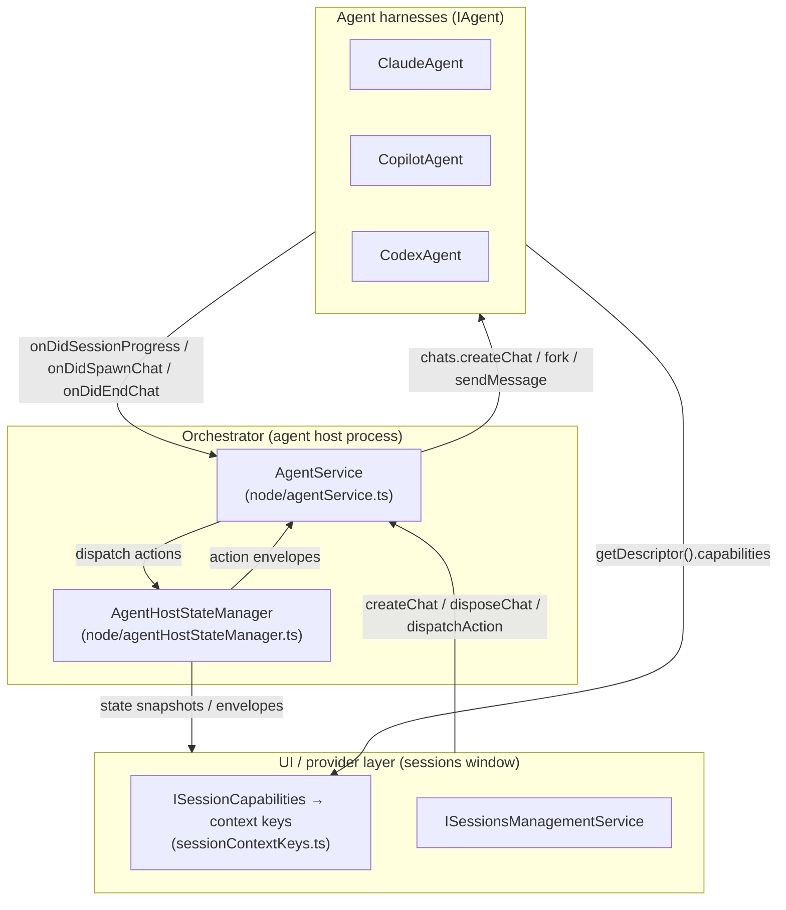
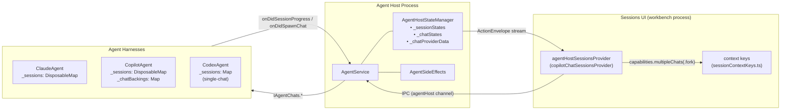
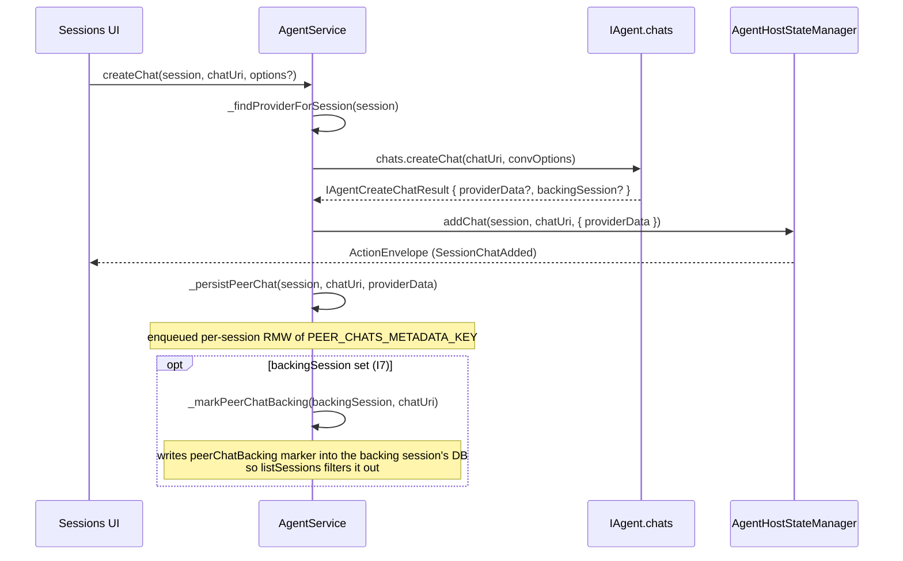
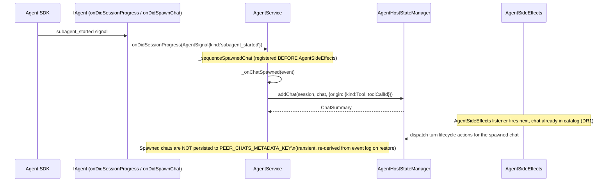
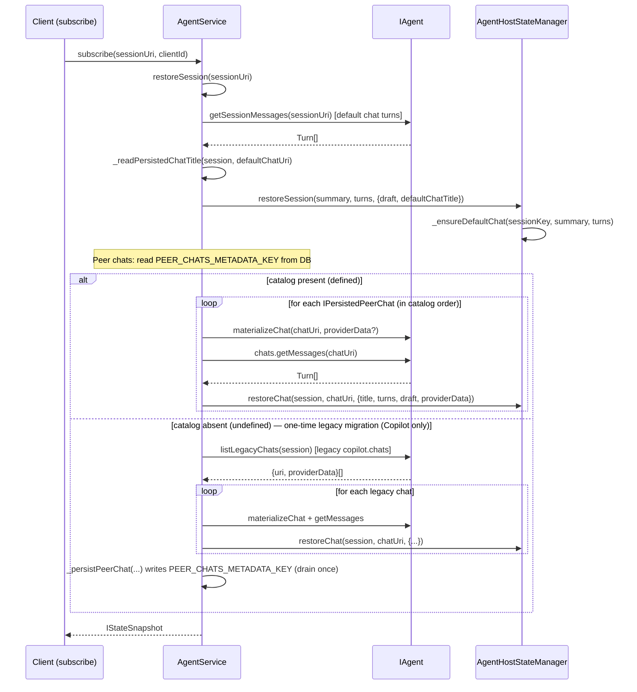
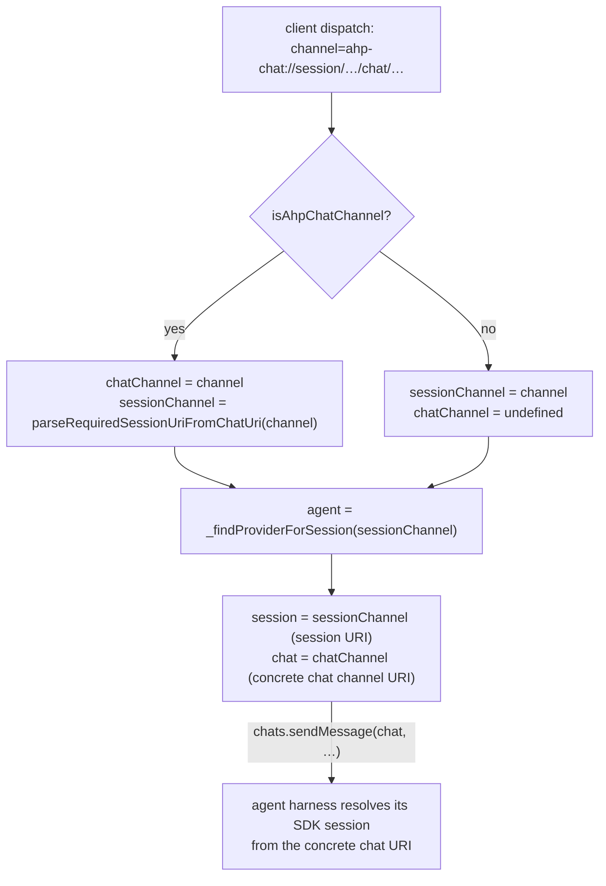

<!--
  MULTI_CHAT_ARCHITECTURE.md
  Living spec — keep in sync with code after each significant change.
  See: node/agentService.ts, node/agentHostStateManager.ts,
       node/claude/claudeAgent.ts, node/copilot/copilotAgent.ts,
       node/codex/codexAgent.ts, node/agentSideEffects.ts,
       common/agentService.ts (IAgent, IAgentChats, IAgentCapabilities).
-->

# Multi-Chat Architecture

> **Status: COMPLETE** (2026-07-01)
> All waves A–D and gates G-B1, G-C1, G-C2, G-D1 are done. Codex, Claude, and
> Copilot all use the unified orchestrator path.

---

## 1. Mental Model

### Three distinct concepts

| Term | What it is | Owner |
|------|-----------|-------|
| **Session** (SDK-level) | The SDK-level session: working directory, active client, tool permissions, restore identity. Owns the default chat implicitly. | Agent harness |
| **Chat** | A thread of turns within a session, addressed by a chat channel URI. The default chat's URI is derived from the session URI with `buildDefaultChatUri`. Additional (peer) chats have their own `ahp-chat://` URIs. | Agent harness (SDK) |
| **Orchestrator session** | The protocol-visible entity that bundles a session with its chat catalog, state, and persistence. The orchestrator owns the catalog (which chats exist), the default-chat pointer, and all persistence. | `AgentService` + `AgentHostStateManager` |

### Guiding principles

- **"Represent, don't orchestrate."** The agent harness creates and drives SDK
  chats; the orchestrator records what exists and routes protocol
  actions. No agent-specific logic leaks into `AgentService` or
  `AgentHostStateManager`.
- **Composition over inheritance.** All harnesses share one membership path
  (`addChat`/`removeChat`), one persistence path (`PEER_CHATS_METADATA_KEY`),
  and one restore path (`restoreChat`). Per-harness features are expressed
  through `IAgentCapabilities` flags, not `if (provider === 'claude') ...`
  branches.
- **Single catalog path.** Whether a chat is created by the user ("Add Chat")
  or spawned by the harness (subagent tool call), it enters the catalog through
  exactly one path (`AgentHostStateManager.addChat`). See invariant I4 below.

---

## 2. Ownership and Layering



### Agent layer (`common/agentService.ts:IAgent`)

Responsible for:
- Creating and owning SDK chats (`chats.createChat`, `chats.fork`).
- Reading history (`chats.getMessages`).
- Emitting progress signals (`onDidSessionProgress`).
- Emitting membership events for harness-spawned chats (`onDidSpawnChat`, `onDidEndChat`).
- Re-attaching a peer chat's backing on restore (`materializeChat`).
- Advertising static capability flags (`getDescriptor().capabilities`).

Agents do **not** maintain the chat catalog, persist membership, or know about the orchestrator's URI mapping.

### Orchestrator layer

**`AgentService` (`node/agentService.ts`):**
- Owns the `(session, chat)` → `(agent, session URI, chat URI)` mapping.
- Owns `_providers`, `_sessionToProvider`, and `_findProviderForSession` (which falls back through the session URI's scheme when a session was restored without a `createSession` call in this process lifetime).
- Dispatches user-driven chat lifecycle (`createChat`, `disposeChat`) to `chats.*`.
- Persists and restores the orchestrator-owned peer-chat catalog (`PEER_CHATS_METADATA_KEY` in the session database, serialized per session via `_peerChatCatalogWrites`).
- Suppresses a peer chat's separately-enumerable backing SDK session (when `IAgentCreateChatResult.backingSession` is set): marks it via `_markPeerChatBacking` and filters it out of `listSessions` (invariant I7).
- Routes harness-spawned chats into the catalog (`_onChatSpawned`, `_onChatEnded`).
- Owns the restore flow (`restoreSession`, `_restorePeerChats`).

**`AgentHostStateManager` (`node/agentHostStateManager.ts`):**
- Holds the authoritative in-memory state tree:
  - `_sessionStates: Map<string, ISessionEntry>` — per-session `SessionState` + catalog timestamps.
  - `_chatStates: Map<string, ChatState>` — per-chat state (turns, activeTurn, draft).
  - `_chatProviderData: Map<string, string>` — opaque `providerData` blobs keyed by peer-chat URI; never parsed.
- Owns `_ensureDefaultChat`: creates the default `ChatState` (URI derived deterministically from the session URI via `buildDefaultChatUri`) at create/restore time.
- `addChat`/`restoreChat`/`removeChat`: the single path for catalog membership changes.
- Session-level active-turn tracking via `_sessionsWithActiveTurn` (a set of chat URIs per session, so multi-chat sessions running concurrent turns stay correct).

### UI/provider layer (`sessions/services/sessions/common/session.ts:ISessionCapabilities`)

- Protocol `AgentCapabilities` (`multipleChats?: { fork?: boolean }`) flows from `AgentInfo.capabilities` (protocol) through the provider adapter into `ISession.capabilities` (`ISessionCapabilities`), whose `supportsMultipleChats`/`supportsFork` flags derive from the presence of `multipleChats` and `multipleChats.fork`, and from there into VS Code context keys (`sessionContextKeys.ts:SessionSupportsMultipleChatsContext`, `SessionSupportsForkContext`).
- UI actions read context keys — no provider-id switches.

---

## 3. Key Invariants

**I1 — `providerData` is opaque.**
`AgentHostStateManager._chatProviderData` stores the blob returned by `chats.createChat` verbatim. Neither `AgentService` nor `AgentHostStateManager` ever parses, validates, or mutates it. It is round-tripped to the agent verbatim on restore via `materializeChat(chat, providerData)`.

**I2 — `sessionUri` and `chatChannelUri` are never overloaded.**
A session URI (`ahp-copilot://`, `ahp-claude://`, …) identifies a session. A chat channel URI (`ahp-chat://…`) identifies a chat within a session. The two schemes are structurally distinct; `isAhpChatChannel` / `parseDefaultChatUri` / `buildDefaultChatUri` are the only crossing points. Passing a chat URI where a session URI is expected (or vice versa) is a bug.

**I3 — The default chat's backing SDK session IS the session.**
The default chat's URI is derived deterministically from the session URI (`buildDefaultChatUri(sessionUri)`), and its backing SDK session id equals the session raw id. The default chat owns the session-level resources: working directory, active client, and restore-by-session-id. Peer chats are satellites, each backed by its own SDK session id (`IPersistedChat.sdkSessionId`). This distinction is encapsulated inside each harness's session container; the orchestrator never special-cases it.

**I4 — Single catalog path (spawn channel).**
Both user-driven chats (`AgentService.createChat` → `addChat`) and harness-spawned chats (`AgentService._onChatSpawned` → `addChat`) go through `AgentHostStateManager.addChat`. The spawn-channel listener is registered **before** `AgentSideEffects` during `registerProvider` (`node/agentService.ts:registerProvider`) to guarantee the chat exists in the catalog before any turn actions arrive for it (DR1 deterministic sequencing).

**I5 — Orchestrator peer-chat catalog is the restore source of truth (with one-time legacy migration).**
After Wave C2, the orchestrator persists its own peer-chat catalog (`PEER_CHATS_METADATA_KEY`) alongside the session database. On restore, `_restorePeerChats` reads that catalog. When it is **absent** (`undefined` — a session persisted before the orchestrator owned the catalog), a one-time migration (`_migrateLegacyPeerChats`) enumerates the agent's legacy `*.chats` via `IAgent.listLegacyChats` (only **Copilot** implements it — mapping its `_readPersistedChats` entries to `{ uri: buildChatUri(session, chatId), providerData: encodeProviderData(info) }`; Claude and Codex omit it, so `listLegacyChats` falls to its optional-undefined default and nothing is drained), restores them through the same catalog path, then writes `PEER_CHATS_METADATA_KEY` so subsequent restores read the new catalog and never consult the legacy read again. An **empty** catalog (`[]`) is "known-empty" and skips migration. Harness-spawned chats (subagents) are NOT in the catalog — they are transient and re-derived from the parent's event log on restore. (Claude has no legacy `claude.chats` blob: Claude multi-chat shipped only with the orchestrator-owned catalog, so there was never a pre-catalog format to migrate.)

**I6 — `_findProviderForSession` not `_sessionToProvider`.**
The `_sessionToProvider` map is populated only by `createSession`. A restored session (alive in the state manager after a host restart but never created in this process) is absent from it. `_findProviderForSession` (`node/agentService.ts:AgentService._findProviderForSession`) falls back to the session URI scheme, which is what makes restored sessions work.

**I7 — A peer chat's backing SDK session must never surface as a top-level session.**
Some agents (e.g. Claude) back a peer chat with a fresh top-level SDK session minted in the same global store their own `IAgent.listSessions` enumerates, so the backing would leak into the session list as a phantom session. To suppress it, `IAgentCreateChatResult` carries an optional **first-class, non-opaque** `backingSession: URI` (distinct from the opaque `providerData` of I1 — the orchestrator reads it but still never parses `providerData`). On `createChat`, the orchestrator writes a persisted `peerChatBacking` marker (value = the owning peer chat's URI) into that backing session's own database (`_markPeerChatBacking`), and `AgentService.listSessions` drops any enumerated session whose database carries that marker (batched into the existing metadata-overlay read, mirroring the subagent filter). Because the marker is persisted, the suppression survives a host restart with no re-stamping. Agents whose peer chats do not have a separately-enumerable backing session (e.g. Copilot, whose peer SDK sessions live in the chat's data dir and are dropped by its own `listSessions`) may leave `backingSession` unset; Copilot sets it anyway for uniformity, which is harmless.

---

## 4. Capabilities Gating

`AgentCapabilities` (`common/state/protocol/channels-root/state.ts:AgentCapabilities`) is the protocol-level contract:

```typescript
interface AgentCapabilities {
    // presence (`{}`) signals multi-chat support; absence = unsupported
    multipleChats?: {
        fork?: boolean;               // can fork a chat from a turn
    };
}
```

The agent declares these in `getDescriptor().capabilities` (`common/agentService.ts:IAgentDescriptor`). They flow to the UI as `ISessionCapabilities` (`sessions/services/sessions/common/session.ts`) and are bound to context keys (`sessions/services/sessions/common/sessionContextKeys.ts:SessionSupportsMultipleChatsContext`, `SessionSupportsForkContext`).

UI code gates "Add Chat" and "Fork" actions on those context keys. No code inside `AgentService` or `AgentHostStateManager` switches on provider id to gate features. `AgentService.createChat` throws synchronously when `!provider.chats` (the structural guard that replaces a capability check in the orchestrator).

---

## 5. Diagrams

### 5a. Ownership/Component



### 5b. Sequence: User-Driven Add Chat



### 5c. Sequence: Harness-Spawned Chat (Subagent via Spawn Channel)



### 5d. Sequence: Restore



### 5e. The (session, chat) to (agent, session URI, chat URI) Mapping



The orchestrator resolves the owning **session** from the session URI for session-scoped work, but passes a concrete **chat channel URI** to `IAgentChats` operations. For the default chat, that is `buildDefaultChatUri(sessionUri)`, not the bare session URI. Agents encapsulate the SDK fact that the default chat's backing SDK session id is the session id.

---

## 6. Per-Agent Notes

### Claude (`node/claude/claudeAgent.ts`)

Single `_sessions: DisposableMap<string, ClaudeSessionEntry>` keyed by session id.

`ClaudeSessionEntry` (`claudeAgent.ts:ClaudeSessionEntry`) is a thin subclass of the shared `AgentSessionEntry<ClaudeAgentSession>` (`node/agentPeerChats.ts`), which is a `Disposable` container holding ALL chats of the session — the default (main) chat and any peers — together in ONE map keyed by each chat's channel URI string:
- `_chats: DisposableMap<string, AgentSessionEntry<ClaudeAgentSession>>` — every chat (default + peers) as a leaf entry, keyed by chat URI string.
- `_defaultChatKey` — the key of the default chat within `_chats`. `defaultChat` reads it; Claude narrows the base's optional `defaultChat` accessor to non-optional because a Claude entry is always seeded with a materialized default chat.

Chat resolution: `entry.resolveChat(chatKey)` is ONE uniform map lookup that returns the `ClaudeAgentSession` for any chat - default or peer - plus whether the resolved entry is the default chat. Operational methods derive the owning session from the concrete chat URI and use that resolved entry rather than branching on `isDefaultChatUri`. Capabilities: `supportsMultipleChats: true, supportsFork: true`.

Each peer chat is backed by a fresh top-level SDK session (`sdkSessionId = generateUuid()`) minted in the same global Claude project store that `listSessions` enumerates. `_createChat` therefore returns `backingSession: AgentSession.uri(this.id, sdkSessionId)` so the orchestrator can suppress that backing from the top-level session list (invariant I7); without it the peer chat would leak as a phantom session. The SDK exposes no delete-chat RPC, so `disposeChat` leaves the backing transcript on disk — the orchestrator-owned catalog simply drops the entry so it is never resumed again. (Claude writes no legacy `claude.chats` blob and has no legacy migration: Claude multi-chat shipped only with the orchestrator-owned catalog, so there is nothing to drain. Copilot keeps its own `copilot.chats` migration because `copilot.chats` predates the catalog.)

### Copilot (`node/copilot/copilotAgent.ts`)

F2 complete (2026-07-01): single `_sessions: DisposableMap<string, CopilotSessionEntry>` keyed by session id; the parallel `_chatSessions` map has been removed.

`CopilotSessionEntry` (`copilotAgent.ts:CopilotSessionEntry`) is an empty subclass of the shared `AgentSessionEntry<CopilotAgentSession>` (`node/agentPeerChats.ts`) — its API matches the base exactly. It is a `Disposable` container holding ALL chats (default + peers) in ONE map keyed by chat URI string:
- `_chats: DisposableMap<string, AgentSessionEntry<CopilotAgentSession>>` — every chat (default + peers) as a leaf entry.
- `defaultChat: CopilotAgentSession | undefined` — the default chat via `_defaultChatKey`; `undefined` while the session is still provisional (not yet materialized).
- `setDefaultChat(chatKey, entry)` / `clearDefaultChat()` — lifecycle for the default chat (e.g. config-driven restart), seeding/dropping it in the same map as peers.

Chat resolution reads that single map: `_findAnySession` returns `entry.defaultChat`, `_findPeerChat` returns `entry.getPeerChat(chatKey)`, and operational methods use `entry.resolveChat(chatKey)` so default and peer chats are resolved through the same map. Remaining `isDefaultChatUri` checks are outside the operational chat surface, for chat lifecycle, tool routing, and legacy/subagent guards.

The peer-chat `providerData` codec (`IPersistedChat` + `encodeProviderData`/`decodeProviderData`) is also shared from `node/agentPeerChats.ts`; both agents import it rather than carrying private copies.

An orthogonal `_chatBackings: Map<string, IPersistedChat>` records the live SDK session id (`sdkSessionId`) + model override for each peer chat URI so the agent can resume peer chats without re-consulting disk. This map is populated by `createChat`/`materializeChat` and is separate from the orchestrator's `_chatProviderData` (which holds the opaque blob the agent produced, while `_chatBackings` is the agent's own in-memory parse of that blob). Capabilities: `multipleChats: { fork: true }`.

### Codex (`node/codex/codexAgent.ts`)

Single-chat harness. `_sessions: Map<string, ICodexSession>` keyed by session id; no peer-chat map. `chats.createChat` and `chats.fork` **throw** (`"Codex agent does not support multiple chats"` / `"Codex agent does not support chat forking"`); `chats.disposeChat` is a no-op; `sendMessage`/`abort`/`changeModel`/`getMessages` first resolve the addressed chat to Codex's single session and then operate on it (and `changeAgent` is a no-op). `getDescriptor().capabilities` omits `multipleChats` (absent = unsupported), so the UI never offers "Add Chat" or "Fork" for Codex sessions.
