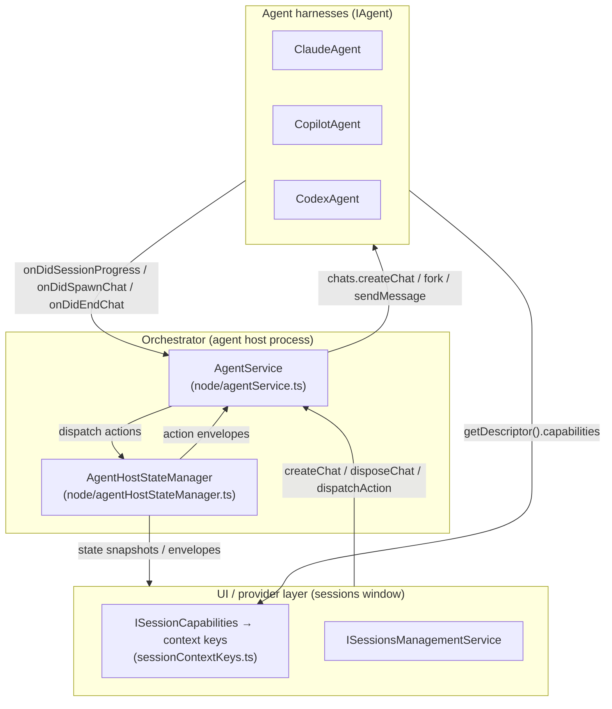
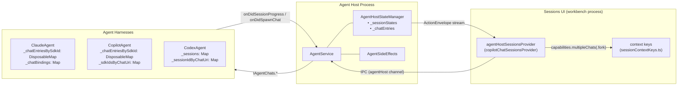
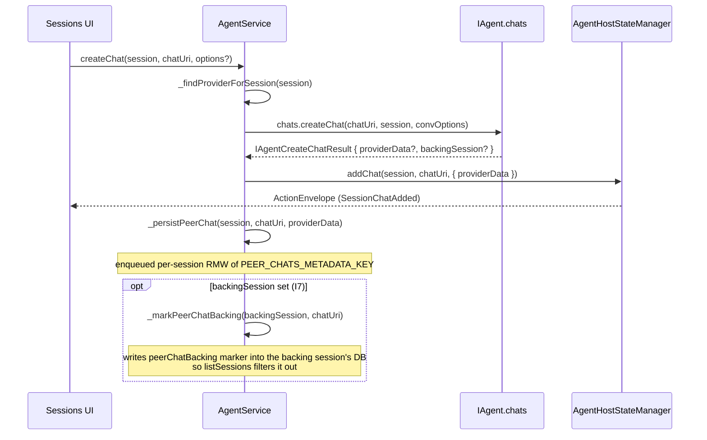
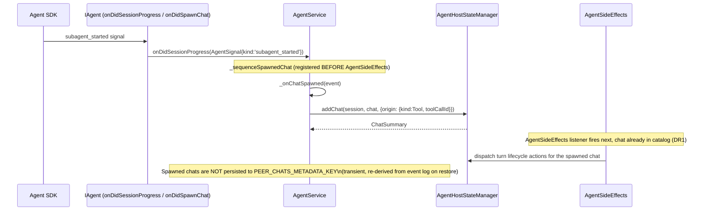
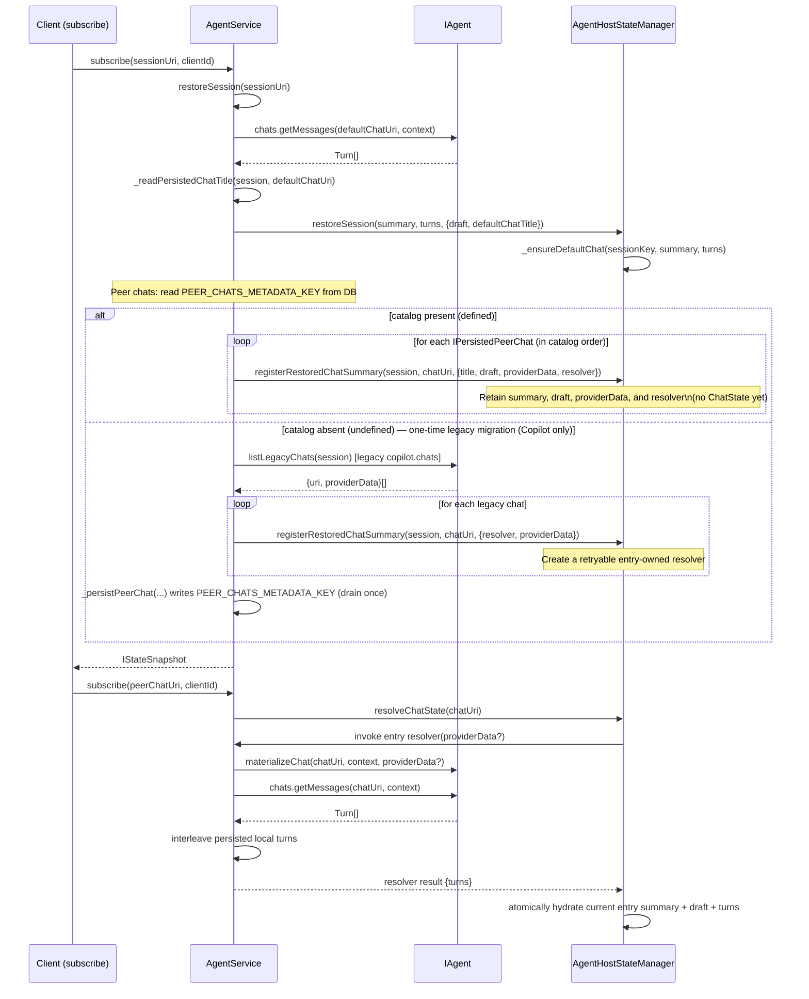
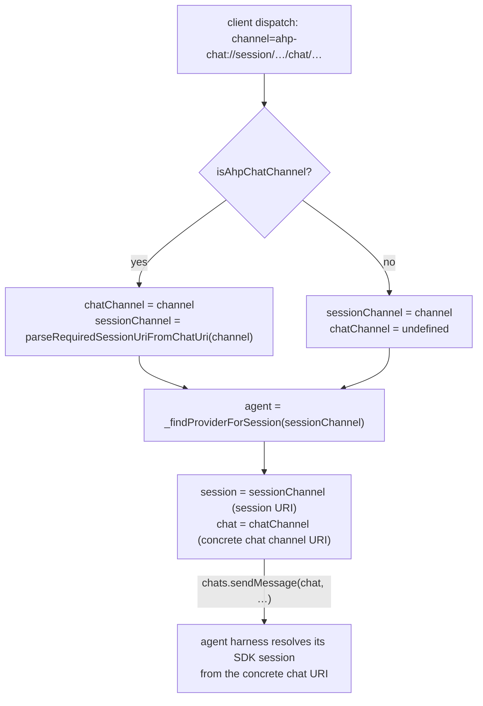

<!--
  MULTI_CHAT_ARCHITECTURE.md
  Living spec — keep in sync with code after each significant change.
  See: node/agentService.ts, node/agentHostStateManager.ts,
       node/claude/claudeAgent.ts, node/copilot/copilotAgent.ts,
       node/codex/codexAgent.ts, node/agentSideEffects.ts,
       common/agentService.ts (IAgent, IAgentChats, IAgentCapabilities).
-->

# Multi-Chat Architecture

> **Status: COMPLETE** (2026-07-01)
> All waves A–D and gates G-B1, G-C1, G-C2, G-D1 are done. Codex, Claude, and
> Copilot all use the unified orchestrator path.
>
> The *operational* chat surface (send/abort/model/agent/history) is fully
> chat-addressed and uniform across harnesses. Session ownership lives in the
> orchestrator: it drives every harness through the chat-surface seam — see
> [§7 Session Ownership (T2/T4)](#7-session-ownership-t2t4--the-orchestrator-owns-the-session).

---

## 1. Mental Model

### Three distinct concepts

| Term | What it is | Owner |
|------|-----------|-------|
| **Session** (SDK-level) | The SDK-level session: working directory, active client, tool permissions, restore identity. Owns the default chat implicitly. | Agent harness |
| **Chat** | A thread of turns addressed by a chat channel URI. AH owns its URI and membership; the agent owns its SDK backing. | `AgentService` + agent harness |
| **Orchestrator session** | The protocol-visible entity that bundles a session with its chat catalog, state, and persistence. The orchestrator owns the catalog (which chats exist), the default-chat pointer, and all persistence. | `AgentService` + `AgentHostStateManager` |

### Guiding principles

- **"Represent, don't orchestrate."** The agent harness creates and drives SDK
  chats; the orchestrator records what exists and routes protocol
  actions. No agent-specific logic leaks into `AgentService` or
  `AgentHostStateManager`.
- **Composition over inheritance.** All harnesses share one membership path
  (`addChat`/`removeChat`), one persistence path (`PEER_CHATS_METADATA_KEY`),
  and one restore path (`registerRestoredChatSummary` + `resolveChatState`).
  Per-harness features are expressed
  through `IAgentCapabilities` flags, not `if (provider === 'claude') ...`
  branches.
- **Single catalog path.** Whether a chat is created by the user ("Add Chat")
  or spawned by the harness (subagent tool call), it enters the catalog through
  exactly one path (`AgentHostStateManager.addChat`). See invariant I4 below.

### Terminology convention: "session" is overloaded — read it by layer

The word **session** means two different things depending on which side of the
seam you are on. To avoid confusion, follow this convention:

| Where | What `session` means | Notes |
|-------|----------------------|-------|
| AHP wire protocol (`common/state/protocol/`) and the orchestrator (`AgentService`, `AgentHostStateManager`) | The **AH session** — the protocol-visible grouping of a default chat plus its peer chats. | This is the vocabulary the generated protocol types pin (`SessionState`, `SessionSummary`, `sessionAdded`, ...); it is immutable and authoritative. |
| Inside an agent harness (`node/claude`, `node/copilot`, `node/codex`) | The agent's **own SDK / provider session** — the provider's native concept (Codex calls it a *thread*). The agent has no notion of the AH grouping; it only ever deals in chats and its own SDK sessions. | Prefer the provider's native term where one exists (Codex "thread"); otherwise spell it out as "SDK session" / "provider session" in comments and local names wherever the two could be confused. |
| The `IAgent` seam (`createSession` / `disposeSession` / `releaseSession`, `session: URI`) | An **AH-owned identity** (`AgentSession.uri`) passed to the provider. Claude and Copilot currently reuse its raw id for the default SDK session (I3); Codex persists an explicit thread mapping. | These few methods legitimately keep the name `session`. Chat-addressed operations receive a concrete chat URI plus transient owning-session context. |

**Why we do not rename the agents' "SDK session" symbols:** the generated
protocol fixes "Session" = AH session across hundreds of references we cannot
change, and the `IAgent` seam genuinely passes AH session URIs. Renaming the
provider-internal concept to `providerSession` would create a new inconsistency
against the protocol rather than removing one. The durable fix is this
convention plus the chat-addressed rename of the operational surface, not a
symbol-level rename of "session".

---

## 2. Ownership and Layering


```mermaid
graph TB
    subgraph UI["UI / provider layer (sessions window)"]
        caps["ISessionCapabilities → context keys<br/>(sessionContextKeys.ts)"]
        smgt["ISessionsManagementService"]
    end

    subgraph Orch["Orchestrator (agent host process)"]
        svc["AgentService<br/>(node/agentService.ts)"]
        stm["AgentHostStateManager<br/>(node/agentHostStateManager.ts)"]
        svc -->|dispatch actions| stm
        stm -->|action envelopes| svc
    end

    subgraph Agents["Agent harnesses (IAgent)"]
        claude["ClaudeAgent"]
        copilot["CopilotAgent"]
        codex["CodexAgent"]
    end

    UI -->|"createChat / disposeChat / dispatchAction"| svc
    svc -->|"chats.createChat / fork / sendMessage"| Agents
    Agents -->|"onDidSessionProgress / onDidSpawnChat / onDidEndChat"| svc
    stm -->|state snapshots / envelopes| UI
    Agents -->|"getDescriptor().capabilities"| caps
```

### Agent layer (`common/agentService.ts:IAgent`)

Responsible for:
- Creating and owning SDK chats (`chats.createChat`, `chats.fork`).
- Reading history (`chats.getMessages`).
- Emitting progress signals (`onDidSessionProgress`).
- Emitting membership events for harness-spawned chats (`onDidSpawnChat`, `onDidEndChat`).
- Re-attaching a peer chat's backing on restore (`materializeChat`).
- Advertising static capability flags (`getDescriptor().capabilities`).

Agents do **not** maintain the chat catalog, persist membership, or know about the orchestrator's URI mapping.

### Orchestrator layer

**`AgentService` (`node/agentService.ts`):**
- Owns the `(session, chat)` → `(agent, session URI, chat URI)` mapping.
- Owns `_providers`, `_sessionToProvider`, and `_findProviderForSession` (which falls back through the session URI's scheme when a session was restored without a `createSession` call in this process lifetime).
- Owns `AgentSessionRegistry`, the durable source of truth for which sessions exist. `listSessions` enumerates the registry, hydrates each entry through `IAgent.getSessionMetadata`, and applies the existing DB/state overlays.
- Dispatches user-driven chat lifecycle (`createChat`, `disposeChat`) to `chats.*`.
- Disposes and releases every catalog chat in stable order: peers first, default last.
- Fans session config changes out to concrete chats for chat-addressed providers.
- Supplies the owning session's resolved context (`IAgentCreateChatOptions.inheritedContext` = `{ workingDirectory, config }`) when creating an additional chat, so the agent stands up the new chat's backing without reading it back from the parent session's own state (`_buildInheritedChatContext`). The working directory is the AH-resolved worktree/folder; model/agent continue through the client + draft path.
- Records side-chat provenance in the catalog but leaves hidden context injection and visible-history filtering to the provider. The source is a stable turn id; active-turn partial response and selected text are immutable creation-time snapshots.
- Passes the full ordered `workingDirectories` set and the initiating `AgentHostClientType` on each send while still supplying transient chat context. Providers launch in index 0, retain additional roots, and attribute usage/telemetry to the correct client surface.
- Persists and restores the orchestrator-owned peer-chat catalog (`PEER_CHATS_METADATA_KEY` in the session database, serialized per session via `_peerChatCatalogWrites`).
- Suppresses a peer chat's separately-enumerable backing SDK session (when `IAgentCreateChatResult.backingSession` is set): marks it via `_markPeerChatBacking` and filters it out of `listSessions` (invariant I7).
- Routes harness-spawned chats into the catalog (`_onChatSpawned`, `_onChatEnded`).
- Owns the restore flow (`restoreSession`, `_restorePeerChats`).

**`AgentHostStateManager` (`node/agentHostStateManager.ts`):**
- Holds the authoritative in-memory state tree:
  - `_sessionStates: Map<string, ISessionEntry>` — per-session `SessionState` + catalog timestamps.
  - `_chatEntries: Map<string, IChatEntry>` — one entry for every chat catalog
    item. An entry owns its current `ChatSummary`, optional hydrated
    `ChatState`, opaque `providerData`, and (for restored peers) resolver,
    in-flight promise, and invalidation state.
- Owns `_ensureDefaultChat`: creates the default `ChatState` (URI derived deterministically from the session URI via `buildDefaultChatUri`) at create/restore time.
- `addChat`/`registerRestoredChatSummary`/`removeChat`: the paths for live,
  restored, and removed catalog membership.
- `getChatState` is a synchronous, no-I/O peek for reducers and diagnostics.
  Interaction paths use `resolveChatState`, which coalesces one peer's
  materialization, retries failures, and atomically publishes complete state.
- Session-level active-turn tracking via `_sessionsWithActiveTurn` (a set of chat URIs per session, so multi-chat sessions running concurrent turns stay correct).

### UI/provider layer (`sessions/services/sessions/common/session.ts:ISessionCapabilities`)

- Protocol `AgentCapabilities` (`multipleChats?: { fork?: boolean }`) flows from `AgentInfo.capabilities` (protocol) through the provider adapter into `ISession.capabilities` (`ISessionCapabilities`), whose `supportsMultipleChats`/`supportsFork` flags derive from the presence of `multipleChats` and `multipleChats.fork`, and from there into VS Code context keys (`sessionContextKeys.ts:SessionSupportsMultipleChatsContext`, `SessionSupportsForkContext`).
- UI actions read context keys — no provider-id switches.

---

## 3. Key Invariants

**I1 — `providerData` is opaque.**
The state-manager-owned `IChatEntry` stores the blob returned by
`chats.createChat` verbatim. Neither `AgentService` nor
`AgentHostStateManager` parses, validates, or mutates it. It is round-tripped
to the agent verbatim on restore via
`materializeChat(chat, context, providerData)`.

**I2 — `sessionUri` and `chatChannelUri` are never overloaded.**
A session URI (`ahp-copilot://`, `ahp-claude://`, …) identifies a session. A chat channel URI (`ahp-chat://…`) identifies a chat within a session. The two schemes are structurally distinct; `isAhpChatChannel` / `parseDefaultChatUri` / `buildDefaultChatUri` are the only crossing points. Passing a chat URI where a session URI is expected (or vice versa) is a bug.

**I3 — The default chat's backing SDK session identity is being decoupled from the AH session.**
The default chat's URI is derived deterministically from the AH session URI (`buildDefaultChatUri(sessionUri)`). Claude and Copilot currently reuse the session raw id for the default SDK conversation, while peer chats can have independent SDK ids (`IPersistedChat.sdkSessionId`). This retained identity does not give the agent ownership of chat grouping: AH's `SessionState.chats` and `defaultChat` remain authoritative and drive lifecycle/config fan-out.

> Per-agent nuance (I3 removal in progress). This identity holds **actively** only for **Claude** (`_bindSessionChatOnRestore` binds the default chat to `{ sdkSessionId: sessionId }`) and **Copilot** (`_materializeProvisional` mints an SDK session whose id *is* the session id). **Codex already decouples**: a fresh session's raw id is an AH-minted provisional UUID while its backing thread id is app-server-assigned, with the real mapping stored in the per-session metadata overlay (`_persistMaterializedSession`). Codex's only residual `sessionId == threadId` uses (`_readSession`'s `?? sessionId` fallback and `listSessions`' thread→URI mapping) are **legacy-compat shims** for pre-existing sessions whose *persisted identity* is the thread id — not an active invariant. They cannot be removed without a data migration (locked decision: no migration), so Codex is treated as already I3-satisfied. Enumeration no longer depends on I3 after the orchestrator-owned session registry (see the registry section); a later stage can remove the active identity from Claude and Copilot.

**I4 — Single catalog path (spawn channel).**
Both user-driven chats (`AgentService.createChat` → `addChat`) and harness-spawned chats (`AgentService._onChatSpawned` → `addChat`) go through `AgentHostStateManager.addChat`. The spawn-channel listener is registered **before** `AgentSideEffects` during `registerProvider` (`node/agentService.ts:registerProvider`) to guarantee the chat exists in the catalog before any turn actions arrive for it (DR1 deterministic sequencing).

**I5 — Orchestrator peer-chat catalog is the restore source of truth (with one-time legacy migration).**
After Wave C2, the orchestrator persists its own peer-chat catalog (`PEER_CHATS_METADATA_KEY`) alongside the session database. On restore, `_restorePeerChats` reads that catalog. When it is **absent** (`undefined` — a session persisted before the orchestrator owned the catalog), a one-time migration (`_migrateLegacyPeerChats`) enumerates the agent's legacy `*.chats` via `IAgent.listLegacyChats` (only **Copilot** implements it — mapping its `_readPersistedChats` entries to `{ uri: buildChatUri(session, chatId), providerData: encodeProviderData(info) }`; Claude and Codex omit it, so `listLegacyChats` falls to its optional-undefined default and nothing is drained), restores them through the same catalog path, then writes `PEER_CHATS_METADATA_KEY` so subsequent restores read the new catalog and never consult the legacy read again. An **empty** catalog (`[]`) is "known-empty" and skips migration. Harness-spawned chats (subagents) are NOT in the catalog — they are transient and re-derived from the parent's event log on restore. (Claude has no legacy `claude.chats` blob: Claude multi-chat shipped only with the orchestrator-owned catalog, so there was never a pre-catalog format to migrate.)

**I6 — `_findProviderForSession` not `_sessionToProvider`.**
The `_sessionToProvider` map is populated only by `createSession`. A restored session (alive in the state manager after a host restart but never created in this process) is absent from it. `_findProviderForSession` (`node/agentService.ts:AgentService._findProviderForSession`) falls back to the session URI scheme, which is what makes restored sessions work.

**I7 — A peer chat's backing SDK session must never surface as a top-level session.**
Some agents (e.g. Claude) back a peer chat with a fresh top-level SDK session minted in the same global store their own `IAgent.listSessions` enumerates, so the backing would leak into the session list as a phantom session. To suppress it, `IAgentCreateChatResult` carries an optional **first-class, non-opaque** `backingSession: URI` (distinct from the opaque `providerData` of I1 — the orchestrator reads it but still never parses `providerData`). On `createChat`, the orchestrator writes a persisted `peerChatBacking` marker into that backing session's database. Peer backings never enter `AgentSessionRegistry`, and the one-time legacy backfill plus the list metadata overlay both consult the marker as defense in depth.

---

## 3a. Session Registry and Backfill

`AgentSessionRegistry` (`node/agentSessionRegistry.ts`) stores `{ sessionUri → { provider, startTime } }` in the reserved `agent-host-registry:/sessions` database. Writes are serialized; registration is idempotent and preserves the first observed start time.

`AgentService` registers on successful create and restore, unregisters on definitive delete, and enumerates the registry rather than unioning provider SDK catalogs. Per-session metadata still comes from the owning provider and then flows through the normal persisted/live overlays. Idle provisional sessions stay hidden until materialization or turn activity.

For profiles created before the registry existed, a persisted `backfilled` marker gates one legacy provider-enumeration sweep. The sweep merges discovered sessions without overwriting concurrent creates and excludes subagents plus `peerChatBacking` records.

---

## 4. Capabilities Gating

`AgentCapabilities` (`common/state/protocol/channels-root/state.ts:AgentCapabilities`) is the protocol-level contract:

```typescript
interface AgentCapabilities {
    // presence (`{}`) signals multi-chat support; absence = unsupported
    multipleChats?: {
        fork?: boolean;               // can fork a chat from a turn
        sideChat?: boolean;           // can branch hidden context without copied visible history
    };
    multipleWorkingDirectories?: {
        immutablePrimary?: boolean;   // index 0 remains the fixed process root
    };
}
```

The agent declares these in `getDescriptor().capabilities` (`common/agentService.ts:IAgentDescriptor`). They flow to the UI as `ISessionCapabilities` (`sessions/services/sessions/common/session.ts`) and are bound to context keys (`sessions/services/sessions/common/sessionContextKeys.ts:SessionSupportsMultipleChatsContext`, `SessionSupportsForkContext`).

UI code gates "Add Chat" and "Fork" actions on those context keys. No code inside `AgentService` or `AgentHostStateManager` switches on provider id to gate features. `AgentService.createChat` throws synchronously when `!provider.chats` (the structural guard that replaces a capability check in the orchestrator).

---

## 5. Diagrams

### 5a. Ownership/Component


```mermaid
graph LR
    subgraph SessionsUI["Sessions UI (workbench process)"]
        provider["agentHostSessionsProvider<br/>(copilotChatSessionsProvider)"]
        ctxkeys["context keys<br/>(sessionContextKeys.ts)"]
    end

    subgraph AHP["Agent Host Process"]
        svc["AgentService"]
        stm["AgentHostStateManager\n• _sessionStates\n• _chatEntries"]
        se["AgentSideEffects"]
        svc --- stm
        svc --- se
    end

    subgraph Harnesses["Agent Harnesses"]
        claude["ClaudeAgent\n_chatEntriesBySdkId: DisposableMap<sdkId, ClaudeChatEntry>\n_chatBindings: Map<chatUri, binding>"]
        copilot["CopilotAgent\n_chatEntriesBySdkId: DisposableMap<sdkId, CopilotChatEntry>\n_sdkIdsByChatUri: Map<chatUri, sdkId>"]
        codex["CodexAgent\n_sessions: Map<id, ICodexSession>\n_sessionIdByChatUri: Map<chatUri, id>"]
    end

    provider -->|"IPC (agentHost channel)"| svc
    svc -->|"IAgentChats.*"| Harnesses
    Harnesses -->|"onDidSessionProgress / onDidSpawnChat"| svc
    stm -->|"ActionEnvelope stream"| provider
    provider -->|"capabilities.multipleChats(.fork)"| ctxkeys
```

### 5b. Sequence: User-Driven Add Chat


```mermaid
sequenceDiagram
    participant UI as Sessions UI
    participant AS as AgentService
    participant A as IAgent.chats
    participant SM as AgentHostStateManager

    UI->>AS: createChat(session, chatUri, options?)
    AS->>AS: _findProviderForSession(session)
    AS->>A: chats.createChat(chatUri, session, convOptions)
    A-->>AS: IAgentCreateChatResult { providerData?, backingSession? }
    AS->>SM: addChat(session, chatUri, { providerData })
    SM-->>UI: ActionEnvelope (SessionChatAdded)
    AS->>AS: _persistPeerChat(session, chatUri, providerData)
    Note over AS: enqueued per-session RMW of PEER_CHATS_METADATA_KEY
    opt backingSession set (I7)
        AS->>AS: _markPeerChatBacking(backingSession, chatUri)
        Note over AS: writes peerChatBacking marker into the backing session's DB<br/>so listSessions filters it out
    end
```

### 5c. Sequence: Harness-Spawned Chat (Subagent via Spawn Channel)


```mermaid
sequenceDiagram
    participant SDK as Agent SDK
    participant A as IAgent (onDidSessionProgress / onDidSpawnChat)
    participant AS as AgentService
    participant SM as AgentHostStateManager
    participant SE as AgentSideEffects

    SDK->>A: subagent_started signal
    A->>AS: onDidSessionProgress(AgentSignal{kind:'subagent_started'})
    Note over AS: _sequenceSpawnedChat (registered BEFORE AgentSideEffects)
    AS->>AS: _onChatSpawned(event)
    AS->>SM: addChat(session, chat, {origin: {kind:Tool, toolCallId}})
    SM-->>AS: ChatSummary
    Note over SE: AgentSideEffects listener fires next, chat already in catalog (DR1)
    SE->>SM: dispatch turn lifecycle actions for the spawned chat
    Note over AS: Spawned chats are NOT persisted to PEER_CHATS_METADATA_KEY\n(transient, re-derived from event log on restore)
```

### 5d. Sequence: Restore


```mermaid
sequenceDiagram
    participant C as Client (subscribe)
    participant AS as AgentService
    participant A as IAgent
    participant SM as AgentHostStateManager

    C->>AS: subscribe(sessionUri, clientId)
    AS->>AS: restoreSession(sessionUri)
    AS->>A: chats.getMessages(defaultChatUri, context)
    A-->>AS: Turn[]
    AS->>AS: _readPersistedChatTitle(session, defaultChatUri)
    AS->>SM: restoreSession(summary, turns, {draft, defaultChatTitle})
    SM->>SM: _ensureDefaultChat(sessionKey, summary, turns)
    Note over AS: Peer chats: read PEER_CHATS_METADATA_KEY from DB
    alt catalog present (defined)
        loop for each IPersistedPeerChat (in catalog order)
            AS->>SM: registerRestoredChatSummary(session, chatUri, {title, draft, providerData, resolver})
            Note over SM: Retain summary, draft, providerData, and resolver\n(no ChatState yet)
        end
    else catalog absent (undefined) — one-time legacy migration (Copilot only)
        AS->>A: listLegacyChats(session) [legacy copilot.chats]
        A-->>AS: {uri, providerData}[]
        loop for each legacy chat
            AS->>SM: registerRestoredChatSummary(session, chatUri, {resolver, providerData})
            Note over SM: Create a retryable entry-owned resolver
        end
        AS->>AS: _persistPeerChat(...) writes PEER_CHATS_METADATA_KEY (drain once)
    end
    AS-->>C: IStateSnapshot
    C->>AS: subscribe(peerChatUri, clientId)
    AS->>SM: resolveChatState(chatUri)
    SM->>AS: invoke entry resolver(providerData?)
    AS->>A: materializeChat(chatUri, context, providerData?)
    AS->>A: chats.getMessages(chatUri, context)
    A-->>AS: Turn[]
    AS->>AS: interleave persisted local turns
    AS-->>SM: resolver result {turns}
    SM->>SM: atomically hydrate current entry summary + draft + turns
```

Restored peer chats are catalog-only until their entry resolver succeeds. Their
provider backing and history are loaded before the state manager atomically
installs the entry's current summary, persisted draft, and returned turns.
`getChatState` remains a synchronous no-I/O peek; clients that need content use
`resolveChatState`. Failed resolution leaves the summary visible and retryable.
Resolves for one chat coalesce while different chats resolve independently.
Deletion, eviction, disposal, and URI reuse invalidate entries so stale async
work cannot publish state.

### 5e. The (session, chat) to (agent, session URI, chat URI) Mapping


```mermaid
graph TD
    A["client dispatch: channel=ahp-chat://session/…/chat/…"]
    B{isAhpChatChannel?}
    C["chatChannel = channel\nsessionChannel = parseRequiredSessionUriFromChatUri(channel)"]
    D["sessionChannel = channel\nchatChannel = undefined"]
    E["agent = _findProviderForSession(sessionChannel)"]
    F["session = sessionChannel (session URI)\nchat = chatChannel (concrete chat channel URI)"]
    A --> B
    B -->|yes| C
    B -->|no| D
    C --> E
    D --> E
    E --> F
    F -->|"chats.sendMessage(chat, …)"| G["agent harness resolves its SDK session\nfrom the concrete chat URI"]
```

The orchestrator resolves the owning **session** from the session URI for session-scoped work, but passes a concrete **chat channel URI** to `IAgentChats` operations. For the default chat, that is `buildDefaultChatUri(sessionUri)`, not the bare session URI. The provider resolves that concrete chat to its SDK backing; AH does not depend on the backing id matching the session id.

---

## 6. Per-Agent Notes

### Claude (`node/claude/claudeAgent.ts`)

Claude deliberately has no AH-session container and no membership/role concept of its own:
- `_chatEntriesBySdkId: DisposableMap<string, ClaudeChatEntry>` is the single disposable owner of every live SDK conversation and provides direct SDK-callback routing.
- `_chatBindings: Map<string, IClaudeChatBinding>` is the one concrete binding map, keyed by the exact host-supplied chat URI, holding only `{ sdkSessionId, model? }`. It deliberately does **not** retain the owning AH session or a storage URI: AH supplies the owning session and the persistence/config `resource` transiently on every operation (`IAgentChatContext`), and Claude never parses either back out of the chat URI. There is no default-vs-additional discriminator on the binding.
- `IClaudeChatBinding` is the single source of truth for both live and released chats: releasing a chat drops its `_chatEntriesBySdkId` leaf but keeps the binding so a later send can cold-resume from `sdkSessionId`/`model` alone.

Every chat operation resolves exactly one binding and routes to exactly one leaf; there is no default-vs-additional branch and no cascade between chats of the same session. An additional chat's send after restart materializes only that chat and never creates a provisional storage-scoped conversation. Capabilities remain `multipleChats: { fork: true }`.

Each additional chat is backed by a fresh top-level SDK session (`sdkSessionId = generateUuid()`) minted in the same global Claude project store that `listSessions` enumerates. `_createChat` therefore returns `backingSession: AgentSession.uri(this.id, sdkSessionId)` so the orchestrator can suppress that backing from the top-level session list (invariant I7); without it the additional chat would leak as a phantom session. The SDK exposes no delete-chat RPC, so `disposeChat` leaves the backing transcript on disk — the orchestrator-owned catalog simply drops the entry so it is never resumed again. (Claude writes no legacy `claude.chats` blob and has no legacy migration: Claude multi-chat shipped only with the orchestrator-owned catalog, so there is nothing to drain. Copilot keeps its own `copilot.chats` migration because `copilot.chats` predates the catalog.)


### Copilot (`node/copilot/copilotAgent.ts`)

Copilot also has no AH-session container:
- `_chatEntriesBySdkId: DisposableMap<string, CopilotChatEntry>` owns every live SDK conversation and its MCP/customization subscriptions.
- `_sdkIdsByChatUri: Map<string, string>` routes each concrete host chat URI to exactly one SDK conversation; SDK callbacks route directly by SDK id.
- Direct `createSession` fork/import results can remain unbound in the SDK-id owner until AH calls `bindSessionChat` with the concrete chat URI.
- `_chatBackings: Map<string, IPersistedChat>` remains peer-only provider metadata and preserves the existing `providerData` codec and one-time `copilot.chats` migration.

No `CopilotSessionEntry`, `AgentSessionEntry`, default-chat URI helper, or sibling cascade remains. Send/history/model/agent/abort/tool/config/dispose/release operations resolve one leaf. Active-client state remains keyed by the owning SDK session where it is genuinely shared, while each live leaf owns its own SDK and MCP lifecycle. Capabilities remain `multipleChats: { fork: true }`.

### Codex (`node/codex/codexAgent.ts`)

Codex supports multiple chats per session. Each conversation — the session's
default chat and every additional chat — is a distinct top-level Codex thread,
explicitly bound to the concrete chat URI AH supplies:
- `_sessions: Map<string, ICodexSession>` owns thread/session state by Codex session id.
- `_sessionIdByChatUri: Map<string, string>` is the exact chat-operation routing index; unbound chat URIs are rejected.
- `_sessionIdByThreadId` continues to route app-server callbacks by thread id.
- `bindSessionChat` binds the default chat to its freshly-created session (and attaches restored/forked direct-create threads before history or operations); `materializeChat` re-attaches an additional chat's backing thread on restore.

An additional chat is backed by a **fresh top-level thread minted eagerly** in
`chats.createChat` (via `thread/start`) or `chats.fork` (via `thread/fork` at the
requested turn, reusing `_forkSession`). Because the Codex app-server assigns the
thread id, the backing entry is keyed by that id (session id == thread id, per
Decision 7): this keeps the peer-chat-backing suppression key stable across a
restart (the marker lands on the same `codex:/<threadId>` DB that `thread/list`
enumerates). `_createChat`/`fork` therefore return
`backingSession: AgentSession.uri(this.id, threadId)` so the orchestrator
suppresses that backing from the top-level session list (invariant I7), plus an
opaque `providerData` blob (the backing thread id + model) that `materializeChat`
decodes on restore. The additional chat inherits the parent session's working
directory, model, and permissions. Exact disposal/release affects only the
addressed chat's own thread — there is no cascade between chats of the same
session. The persisted `codex.threadId`, `codex.cwd`, and `codex.model` keys and
app-server protocol are unchanged, and Codex still never recognizes or derives a
default-chat URI. Capabilities are `multipleChats: { fork: true }`.


---

## 7. Session Ownership (T2/T4) — the orchestrator owns the Session

**Status: implemented — AH owns identity, enumeration, lifecycle, and grouping.**

Agents still expose provider session lifecycle and metadata methods, but these
describe SDK backing data; they are not the source of protocol-visible
membership. `AgentSessionRegistry` is the durable membership source, and
`AgentHostStateManager` owns each session's chat catalog and default-chat
pointer.

Session *creation* and *chat* creation are distinct operations, so they are
distinct methods on the agent — the orchestrator does **not** overload
`chats.createChat` to also provision a session. `chats.createChat` has exactly
one meaning: add an additional chat to an already-provisioned session.

### The seam

- **Create.** For a fresh session, `AgentService._createProviderSession` mints
  the AH session URI, derives its default-chat URI, and calls
  `chats.createSessionChat`, which provisions and binds that chat in one
  provider call. Fork/import creation remains on the compatibility
  `createSession` + `chats.bindSessionChat` path because the provider determines
  the resulting identity. Both paths return `IAgentCreateSessionResult` and
  preserve provisional / `onDidMaterializeSession` / deferred-`sessionAdded`
  semantics. `chats.createChat` only adds an additional chat.
- **Add a chat.** `AgentService.createChat` dispatches to `chats.createChat` /
  `chats.fork` for additional chats only, supplying the owning session's resolved
  context via `IAgentCreateChatOptions.inheritedContext` (`{ workingDirectory,
  config }`) so the agent never reads it back from the parent session.
- **Dispose/release.** `AgentService` reads the authoritative chat catalog and
  calls `chats.disposeChat` (or optional `chats.releaseChat`) for every chat,
  peers first and the default last. Each chat hook is exact; an agent never
  cascades from the default chat to siblings. Providers without `releaseChat`
  retain the legacy `releaseSession` fallback.
- **Config.** `AgentSideEffects` fans merged session config values out through
  optional `onChatConfigChanged(chat, values)`. Providers without it retain the
  legacy `onSessionConfigChanged` hook.
- **Enumerate.** `AgentService.listSessions` enumerates
  `AgentSessionRegistry`, asks the registered provider for that exact session's
  metadata via `getSessionMetadata`, and applies persisted and live state
  overlays. Provider `listSessions` is used only by the one-time registry
  backfill (and as a compatibility fallback when direct lookup is unavailable);
  AH does not reconstruct membership by grouping provider conversations.

### No provider-side default-chat derivation

AH supplies both the chat URI and its owning session explicitly on every `createChat`/`fork`/`materializeChat` call, during provision, fork/import binding, and restore alike — no harness ever recovers the owning session by decoding the chat URI. Claude and Copilot record only the `chat → SDK conversation` link in their flat routing indexes (`_chatBindings` / `_sdkIdsByChatUri`, neither of which retains the owning session or a storage URI) and take the owning session and persistence `resource` from the transient `IAgentChatContext` on each operation; Codex records the `chat → session` link in its `_sessionIdByChatUri` routing index. Direct SDK-created conversations remain temporarily unbound until AH calls `bindSessionChat`. No harness calls `defaultChatUriForSession`, `buildDefaultChatUri`, `parseDefaultChatUri`, or `isDefaultChatUri` to derive an owning session from a chat URI.

### Storage-preservation

All three harnesses implement `createSessionChat`; the compatibility
`createSession` + `bindSessionChat` path remains for fork/import and restore.
The change is storage-preserving: existing session URIs, provider stores,
`providerData`, and `PEER_CHATS_METADATA_KEY` formats are unchanged. Registry
adoption is a one-time backfill, not a provider-data migration.

### Interface surface

`IAgent` retains `listSessions`, optional `getSessionMetadata`, `createSession`,
and `disposeSession` for provider persistence, backfill, direct metadata lookup,
and compatibility lifecycle paths. Conversation history is chat-addressed
through `chats.getMessages`; fresh provisioning is chat-addressed through
`chats.createSessionChat`; and additional-chat creation remains
`chats.createChat`.
