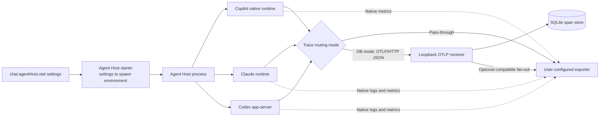

# Agent Host OTel Pipeline

The **agent host** is a separate utility process (under `src/vs/platform/agentHost/`) that hosts native Copilot, Claude, and Codex runtimes instead of using the extension's in-process harnesses. The agent host has its own OTel pipeline so provider-native traces can be exported to a collector or persisted locally for inspection.

This is the architecture and integration reference for OTel in Agent Host sessions. It lives next to `IAgentHostOTelService` in [node/otel/agentHostOTelService.ts](node/otel/agentHostOTelService.ts) because Agent Host runs outside the extension host. Local Copilot Chat remains an independent extension-host pipeline configured with `github.copilot.chat.otel.*` and documented in [`extensions/copilot/docs/monitoring/agent_monitoring.md`](../../../../extensions/copilot/docs/monitoring/agent_monitoring.md).

| Property | Agent Host OTel | Extension OTel |
|---|---|---|
| Process | Separate utility process (`src/vs/platform/agentHost/node/`) | Extension host |
| Settings prefix | `chat.agentHost.otel.*` | `github.copilot.chat.otel.*` |
| Service | `IAgentHostOTelService` (`node/otel/agentHostOTelService.ts`) | `IOTelService` (`extensions/copilot/src/platform/otel/`) |
| SDK | Copilot `TelemetryConfig`, Claude environment, and Codex `otel.*` launch overrides | `@opentelemetry/sdk-node` directly |
| Persistence | `<userData>/agent-host/otel/agent-host-traces.db` | `<extensionGlobalStorage>/otel/spans.db` |

## Sources of Truth

Agent Host owns transport routing, optional interception and persistence, resource normalization, and cross-provider trace context. Each provider owns the telemetry it produces:

- **Copilot:** the Rust-native OTel lifecycle in `github/copilot-agent-runtime`. Its `docs/developer-docs/monitor.md` is the exhaustive signal and configuration reference. Audit it at the `@github/copilot` version pinned in the root `package-lock.json`, not at an arbitrary runtime `main`; cite an immutable commit permalink in the resulting issue or pull request.
- **Claude:** the Claude runtime's native OTel implementation and launch environment.
- **Codex:** the Codex app-server's native OTel implementation and launch overrides.

Do not copy provider-native span, event, metric, or environment-variable catalogs into this document. Keep this reference focused on the VS Code-owned integration boundary. The extension-host Copilot CLI bridge under `extensions/copilot/src/extension/chatSessions/copilotcli/` is a deprecated compatibility path and is not the Agent Host architecture.

## Two Modes

| Mode | Trigger | Behavior |
|---|---|---|
| **Pass-through** | `chat.agentHost.otel.enabled` is `true` and `dbSpanExporter.enabled` is `false` | The SDK exports directly to the user-configured exporter (OTLP/HTTP, OTLP/gRPC, file, or console). SDK spans are not intercepted; host-produced session-title metadata uses the matching JSON/file/console forwarder. |
| **DB mode** | `chat.agentHost.otel.dbSpanExporter.enabled` is `true` (implicitly enables OTel) | The SDK is pointed at a loopback OTLP/HTTP receiver inside the agent host. Spans are decoded and written to a local SQLite database. With an OTLP/HTTP JSON external endpoint, the receiver also fans the normalized JSON body out to it. Protobuf and gRPC traces remain local because Agent Host does not transcode wire formats. |



- **Pass-through mode** (default when only `otlpEndpoint` is configured): the SDK is constructed with the user's exporter settings unmodified and exports directly. SDK span data is not intercepted; the agent host additionally emits the session-title metadata span described below through the configured exporter.
- **DB mode** (`COPILOT_OTEL_DB_SPAN_EXPORTER_ENABLED=true`): `AgentHostOTelService` starts a `LocalOtlpHttpReceiver` on `127.0.0.1` with an ephemeral port, then configures every native provider's trace exporter to use that loopback over OTLP/HTTP JSON. For each batch the receiver decodes the body and inserts spans into `OTelSqliteStore` (`onSpans`). If an OTLP/HTTP JSON external endpoint is also configured, the receiver fans the normalized JSON trace body out to an `OtlpHttpForwarder` (`onForward`) so the collector keeps receiving traces alongside the local DB. For OTLP/HTTP protobuf and OTLP/gRPC external protocols, traces remain in SQLite while native logs and metrics still export directly.

## Native Provider Signal Routing

Only traces enter the Agent Host loopback and SQLite database. When an external OTLP endpoint is configured, provider-native logs and metrics bypass Agent Host and export directly from the SDK:

| Provider | Trace configuration | Direct external signals |
|---|---|---|
| Copilot | SDK configuration consumed by the Rust-native OTel lifecycle | Metrics |
| Claude | `OTEL_TRACES_EXPORTER` and trace-specific endpoint | Logs and metrics |
| Codex | `otel.trace_exporter` launch override | Logs and metrics |

In DB mode the private trace hop always uses OTLP/HTTP JSON, which all three runtimes support and the local receiver decodes. The external logs/metrics hop retains the configured provider-supported protocol. Agent Host does not receive or persist `/v1/logs` or `/v1/metrics`.

When Agent Host OTel is enabled, its launch configuration overrides standalone Claude/Codex exporter destinations for that Agent Host process. When it is disabled, standalone provider telemetry remains untouched. Authentication headers are supported through inherited standard OTel environment variables; percent-encoded OTLP header values are decoded before HTTP/Codex use and re-encoded for Claude's environment. Managed-header delivery to provider subprocesses is not currently supported.

### Temporary Codex 0.142 trace filter

In DB mode, the loopback receiver drops only Codex spans with all three stable identifiers: resource `service.name=codex-app-server`, span name `auth`, and `code.module.name=codex_login::auth::manager`. Codex 0.142 emits this internal authentication polling span about twice per second, mostly as standalone root traces. The receiver keeps an aggregate filtered count and logs it at most once per minute; all other Codex spans are retained. Remove this compatibility filter after Codex stops exporting the polling span or provides native sampling/filtering.

External-only mode sends traces directly from each SDK to the user's collector and bypasses the Agent Host receiver, so this narrow filter does not apply there. Covering that path would require a general telemetry proxy or a provider change and is intentionally outside this PR.

## Resource Identity

Agent Host is one logical system with several native OTel producers. Agent Host-owned launch and ingest boundaries assign the standard resource attribute `service.namespace=vscode.agent-host` while keeping component service names distinct:

| Producer | `service.name` |
|---|---|
| Host session/title metadata | `vscode-agent-host` (unless the host has an explicit service-name override) |
| Copilot runtime | `github-copilot` |
| Claude runtime | `claude-code` |
| Codex app-server | `codex-app-server` |

Unrelated inherited resource attributes are preserved. A conflicting inherited `service.namespace` is replaced only inside Agent Host-owned telemetry and provider launch environments; no global VS Code namespace is set. Provider launch environments do not inherit a host `OTEL_SERVICE_NAME`.

Claude honors these standard resource variables for traces, logs, and metrics while retaining its native `claude-code` service name. The current Codex app-server hardcodes `codex-app-server` and does not consume standard resource overrides; Agent Host preserves that native name and adds the shared namespace to intercepted traces. Direct Codex logs/metrics cannot carry the namespace until Codex adds standard resource-attribute support.

## Distributed Trace Context

The host emits a zero-duration `vscode.agent_host.session` anchor and passes its W3C `traceparent`/`tracestate` to native runtimes. Copilot reads the context through `CopilotClientOptions.onGetTraceContext`, Claude receives it in its session subprocess environment, and Codex receives it on session-scoped JSON-RPC request envelopes. Provider-native traces can therefore share one trace id while retaining their provider conversation attributes.

## Session Title Metadata

When content capture is enabled, the agent host emits a zero-duration `vscode.agent_host.session.title_changed` span whenever an authoritative Copilot, Claude, or Codex session title changes. This includes fallback, generated, refined, and manually renamed titles; assigning the same title again does not emit another span. Downstream consumers can use the latest span for a conversation to display its current title.

| Attribute | Description |
|---|---|
| `gen_ai.conversation.id` | Provider conversation identifier (Copilot conversation ID, Claude SDK session ID, or Codex agent host session ID). |
| `vscode.agent_host.session.title` | Latest session title, bounded to 200 characters. |
| `vscode.agent_host.session.uri` | Agent Host protocol URI for the session. |

Title text is user-derived content, so these spans are emitted only when `chat.agentHost.otel.captureContent` is enabled. Host-produced title spans copy `OTEL_SERVICE_NAME` and `OTEL_RESOURCE_ATTRIBUTES` so collectors group them with the SDK telemetry. They are persisted in DB mode and use the configured OTLP, file, or console forwarder. Synthetic OTLP forwarding currently uses OTLP/HTTP JSON; when `http/protobuf` or gRPC is configured, title spans remain available in DB mode but are not sent to that external endpoint.


## VS Code Settings

Open **Settings** (`Ctrl+,`) and search for `agentHost otel`:

| Setting | Type | Default | Description |
|---|---|---|---|
| `chat.agentHost.otel.enabled` | boolean | `false` | Enable OTel emission from the agent host. |
| `chat.agentHost.otel.exporterType` | string | `"otlp-http"` | `otlp-http`, `otlp-grpc`, `console`, or `file`. Provider support differs; for Copilot, `otlp-grpc` is downgraded to `otlp-http` because the runtime supports OTLP/HTTP JSON and protobuf only. |
| `chat.agentHost.otel.otlpEndpoint` | string | `""` | OTLP endpoint URL. Accepts a bare base URL (`http://localhost:4318`) — `/v1/traces` is appended automatically when needed, matching the standard `OTEL_EXPORTER_OTLP_ENDPOINT` convention. A full signal-specific URL (`http://host:4318/v1/traces`) is used verbatim. |
| `chat.agentHost.otel.captureContent` | boolean | `false` | Capture prompt/response content in span attributes. Privacy-sensitive — do not enable in environments that ship spans to shared sinks. |
| `chat.agentHost.otel.outfile` | string | `""` | Output path for JSON-lines spans when `exporterType` is `file`. |
| `chat.agentHost.otel.dbSpanExporter.enabled` | boolean | `false` | Persist every emitted span to a local SQLite database at `<userData>/agent-host/otel/agent-host-traces.db`. Implicitly enables OTel. OTLP/HTTP JSON traces can also be forwarded; protobuf and gRPC traces remain local. |

## Environment Variables

The workbench-side starter translates the settings above into the following env vars on the agent host process. If a variable is already set in the parent environment, it wins over the corresponding setting (developer override).

| Variable | Sourced From | Notes |
|---|---|---|
| `COPILOT_OTEL_ENABLED` | `chat.agentHost.otel.enabled` | Set to `true` only when the setting is on. |
| `COPILOT_OTEL_EXPORTER_TYPE` | `chat.agentHost.otel.exporterType` | |
| `OTEL_EXPORTER_OTLP_ENDPOINT` | `chat.agentHost.otel.otlpEndpoint` | Standard OTel endpoint. |
| `COPILOT_OTEL_ENDPOINT` | (inherited) | Alternate endpoint used only when `OTEL_EXPORTER_OTLP_ENDPOINT` is unset. |
| `OTEL_INSTRUMENTATION_GENAI_CAPTURE_MESSAGE_CONTENT` | `chat.agentHost.otel.captureContent` | |
| `COPILOT_OTEL_FILE_EXPORTER_PATH` | `chat.agentHost.otel.outfile` | |
| `COPILOT_OTEL_DB_SPAN_EXPORTER_ENABLED` | `chat.agentHost.otel.dbSpanExporter.enabled` | |
| `OTEL_EXPORTER_OTLP_PROTOCOL` | (inherited or enterprise policy) | `grpc` and `http/grpc` select gRPC; `http/protobuf` selects HTTP protobuf; other values use HTTP JSON. Set from the managed `telemetry.protocol` when configured. |
| `COPILOT_OTEL_PROTOCOL` | (inherited) | Alternate protocol used only when `OTEL_EXPORTER_OTLP_PROTOCOL` is unset. |
| `COPILOT_OTEL_SOURCE_NAME` | (inherited) | Instrumentation scope name used by Copilot and host-produced metadata spans. |
| `OTEL_SERVICE_NAME` | (inherited or enterprise policy) | `service.name` resource attribute; set from the managed `telemetry.serviceName`. |
| `OTEL_RESOURCE_ATTRIBUTES` | (inherited or enterprise policy) | Extra resource attributes (`k=v,k2=v2`); set from the managed `telemetry.resourceAttributes`. |
| `OTEL_EXPORTER_OTLP_HEADERS` | (inherited) | Auth headers (for example, `Authorization=<value>`). **Not** delivered from managed settings — env delivery would leak the secret to tool subprocesses; managed headers apply to the Copilot Chat extension only. |

Inside Agent Host, OTel activates when `COPILOT_OTEL_ENABLED` or `COPILOT_OTEL_DB_SPAN_EXPORTER_ENABLED` is truthy, or when an OTLP endpoint or file-exporter path is non-empty. This allows inherited environment configuration to enable OTel without a local VS Code setting.

> **Activation timing.** Env vars are bound at agent host **spawn time**. Changing a setting while the agent host is already running has no effect until the host respawns — restart VS Code or reload the window if you change these settings mid-session.

## Local SQLite Span Store

When `chat.agentHost.otel.dbSpanExporter.enabled` is on, every span the agent host emits is written to:

```
<userData>/agent-host/otel/agent-host-traces.db
```

Use the **Chat: Export Agent Host Traces Database…** command (`workbench.action.chat.agentHost.otel.exportAgentTracesDB`) to save a copy of the database for offline inspection. The store uses WAL mode, so it is safe to copy or query with `sqlite3` while the agent host is running.

## Quick Start with Aspire Dashboard

To collect agent host traces with the [Aspire Dashboard](https://learn.microsoft.com/dotnet/aspire/fundamentals/dashboard/standalone) (or any OTLP-compatible collector):

```json
{
  "chat.agentHost.otel.enabled": true,
  "chat.agentHost.otel.captureContent": true,
  "chat.agentHost.otel.dbSpanExporter.enabled": true,
  "chat.agentHost.otel.otlpEndpoint": "http://localhost:4318"
}
```

This combination persists every span to SQLite for offline inspection **and** forwards them live to Aspire — useful when you want to spot-check a session in the dashboard and still be able to query the raw data later.

---

## File Structure

```
src/vs/platform/agentHost/
├── common/
│   └── agentService.ts                # Setting IDs, env var names, buildAgentHostOTelEnv()
├── electron-main/
│   └── electronAgentHostStarter.ts    # Spawns agent host (Electron); calls buildAgentHostOTelEnv()
└── node/
    ├── nodeAgentHostStarter.ts        # Spawns agent host (server / non-Electron path)
    └── otel/
        └── agentHostOTelService.ts    # IAgentHostOTelService impl, two-mode wiring

src/vs/platform/otel/
├── node/otlp/
│   ├── localOtlpReceiver.ts           # In-process OTLP/HTTP receiver (127.0.0.1, ephemeral)
│   ├── otlpJsonDecode.ts              # OTLP-JSON → ICompletedSpanData
│   └── outboundForwarder.ts           # OtlpHttpForwarder + FileForwarder + ConsoleForwarder + CompositeForwarder
└── node/sqlite/
    └── otelSqliteStore.ts             # Persistent span store (DB schema lives here)
```

## Settings → Env Var Translation

`buildAgentHostOTelEnv()` ([common/agentService.ts](common/agentService.ts)) is the single translation point. The starter (`electronAgentHostStarter.ts` / `nodeAgentHostStarter.ts`) reads settings, calls `buildAgentHostOTelEnv(settings, parentEnv)`, and merges the result into the spawned process's environment. Parent-env values win over the local `chat.agentHost.otel.*` settings (developer override); **enterprise managed-policy values win over parent env**.

| Setting | Env var |
|---|---|
| `chat.agentHost.otel.enabled` | `COPILOT_OTEL_ENABLED` |
| `chat.agentHost.otel.exporterType` | `COPILOT_OTEL_EXPORTER_TYPE` |
| `chat.agentHost.otel.otlpEndpoint` | `OTEL_EXPORTER_OTLP_ENDPOINT` (`COPILOT_OTEL_ENDPOINT` is also accepted when the standard variable is unset) |
| `chat.agentHost.otel.captureContent` | `OTEL_INSTRUMENTATION_GENAI_CAPTURE_MESSAGE_CONTENT` |
| `chat.agentHost.otel.outfile` | `COPILOT_OTEL_FILE_EXPORTER_PATH` |
| `chat.agentHost.otel.dbSpanExporter.enabled` | `COPILOT_OTEL_DB_SPAN_EXPORTER_ENABLED` |

`OTEL_EXPORTER_OTLP_HEADERS` flows via env inheritance only. `OTEL_EXPORTER_OTLP_PROTOCOL`, `OTEL_SERVICE_NAME`, and `OTEL_RESOURCE_ATTRIBUTES` are not translated from the local `chat.agentHost.otel.*` settings, but **enterprise managed settings (policy)** can set them on the spawned host: the renderer forwards the resolved policy to the starter, and managed values win over inherited env.

`readAgentHostOTelEnv()` ([node/otel/agentHostOTelService.ts](node/otel/agentHostOTelService.ts)) is the inverse: it reads `process.env` inside the agent host and produces the `ResolvedConfig` that drives mode selection and outbound forwarding.

## OTLP/HTTP Forwarder Conventions

`OtlpHttpForwarder` accepts an endpoint in either of the two shapes that SDKs expect for the standard `OTEL_EXPORTER_OTLP_ENDPOINT` env var:

- **Bare base URL** (`http://host:4318` or `http://host:4318/`) — `/v1/traces` is auto-appended via `resolveOtlpTracesEndpoint()` in [../otel/node/otlp/outboundForwarder.ts](../otel/node/otlp/outboundForwarder.ts).
- **Full signal-specific URL** (`http://host:4318/v1/traces`, `http://host:4318/custom/path`) — used verbatim.

This matches the path-handling rules of the official OpenTelemetry SDKs and ensures the pass-through SDK path and the DB-mode outbound forwarder path behave identically given the same `otlpEndpoint` setting.

## Spawn-Time Env Binding

The agent host inherits its env vars at fork time. `IAgentHostOTelService` reads `process.env` once in its constructor and caches the resolved config. Changing a `chat.agentHost.otel.*` setting at runtime therefore has **no effect** on the currently-running agent host — the host must respawn (reload window / restart VS Code) to pick up the new value. This is the same model used by the rest of the agent host service surface.
