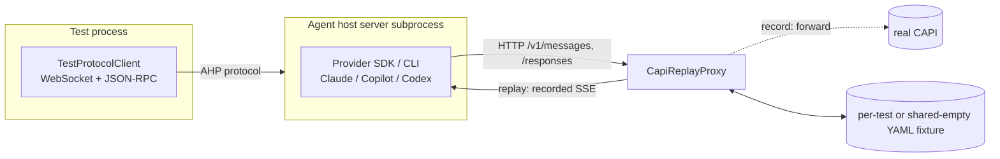

# Agent host end-to-end tests

End-to-end tests that exercise the **whole agent host** — the real server process, the real bundled provider SDK/CLI subprocess (Claude / Copilot / Codex), and the real JSON-RPC + AHP protocol over a WebSocket — **without a token and without network**.

They do this by recording the model traffic once (against real CAPI) into committed YAML fixtures, then **replaying** those fixtures deterministically on every run. Only the *model responses* are faked; everything else (the server, the SDK subprocess, tool execution, the protocol) is real.

> **New here?** Read [Mental model](#mental-model), then [Running the tests](#running-the-tests). Writing a test? Jump to [Writing a new test](#writing-a-new-test). CI is red? Jump to [Troubleshooting](#troubleshooting).

> These are **e2e tests**. The `*.integrationTest.ts` file suffix and `test-integration.sh` script are just the VS Code test-runner conventions they hook into.

---

## TL;DR

```bash
# Run the complete deterministic suite in parallel.
npm run test-agent-host-e2e

# Replay (default): deterministic, tokenless. This is what CI runs.
./scripts/test-integration.sh --run src/vs/platform/agentHost/test/node/e2e/providers/copilotAgentHostE2E.integrationTest.ts

# Update AHP snapshots only, replaying the existing LLM fixtures (tokenless).
AGENT_HOST_UPDATE_AHP_SNAPSHOTS=1 ./scripts/test-integration.sh --run src/vs/platform/agentHost/test/node/e2e/providers/copilotAgentHostE2E.integrationTest.ts

# Update both AHP snapshots and LLM fixtures (real CAPI; needs a GitHub token).
AGENT_HOST_UPDATE_SNAPSHOTS=1 ./scripts/test-integration.sh --run src/vs/platform/agentHost/test/node/e2e/providers/copilotAgentHostE2E.integrationTest.ts
```

- **Replay** (no env var) — serves committed fixtures, no upstream contact, no credential. Strict: an unrecorded request fails the run.
- **Update AHP** (`AGENT_HOST_UPDATE_AHP_SNAPSHOTS=1`) — replays committed LLM fixtures and rewrites AHP `serverToClient` snapshots in place. No token or network.
- **Update all** (`AGENT_HOST_UPDATE_SNAPSHOTS=1`) — rewrites AHP snapshots and forwards to real CAPI to re-record LLM fixtures. Needs `GITHUB_TOKEN` or `gh auth token`.
- **Record LLM only** (`AGENT_HOST_REPLAY_RECORD=1`) — the legacy focused mode for re-recording only normalized LLM fixtures against real CAPI.

---

## Mental model

A small HTTP proxy — `CapiReplayProxy` — sits between the agent host and CAPI. The agent host is pointed at the proxy via env overrides (`COPILOT_API_URL`, `VSCODE_AGENT_HOST_CAPI_URL_OVERRIDE`, …). The proxy is the only thing that changes between record and replay:



Key properties:

- **Sequence-based matching**, keyed by `(method, path)`: the *Nth* request to an endpoint replays the *Nth* recorded response. There is **no request-body matching** — the recorded responses drive the agent, so it reproduces the same call sequence. The recorded request is separately *asserted* (see [Asserting the model request](#asserting-the-model-request)).
- **Wire-agnostic**: works for Anthropic Messages (`/v1/messages`) and OpenAI Responses (`/responses`) SSE dialects.
- **Strict on replay**: a request with no recorded response is a hard cache miss that fails the test — CI can never silently reach real CAPI.
- **Complete on replay**: every recorded model response must be consumed before teardown, so a provider that stops early cannot pass by leaving the remainder of its fixture unused.
- **Ancillary bootstrap endpoints are stubbed, not recorded** (see [What's stubbed](#whats-stubbed-vs-recorded)) — keeps identity, tokens, and the model catalog out of fixtures.
- **Isolated persistent state**: each provider suite uses a temporary home and VS Code user-data directory. Provider config roots resolve under that home, with ambient overrides such as `CLAUDE_CONFIG_DIR` and `CODEX_HOME` cleared, so local config, MCP servers, and session state cannot affect the run. Teardown removes the directory after the agent host exits.

---

## Two governing principles

Everything below follows from two rules. When a design question comes up, answer it with these.

**1. The suite is external to the implementation.** Nothing here may reach inside the agent host. The only way to obtain a running implementation is `IAgentHostTarget` (`harness/agentHostTarget.ts`), and the only way to talk to it is the Agent Host Protocol over a WebSocket. A different program that speaks AHP should be able to be dropped in at that seam and run this suite unchanged.

This is what makes the tests an asset rather than a mirror of the current code: they describe the contract, so they survive the implementation being rewritten, and they are the thing that tells you whether a rewrite is correct.

Concretely, this rules out: registering a test-only `IAgent`, importing host internals, reading the host's database directly, or asserting on log output. If a scenario cannot be expressed over the wire, it is a unit test, not an E2E test. (The older `../protocol/` suite predates this rule and violates it — see [Relationship to the protocol suite](#relationship-to-the-protocol-suite).)

**2. Test selection is coverage-driven.** Two complementary signals steer where to add tests; see [Collecting coverage](#collecting-coverage).

---

## Tiers: conformance vs parity

Every scenario belongs to exactly one tier. This is the main thing to get right when adding a test.

| | Conformance | Parity |
|---|---|---|
| Question it answers | "Does the host implement AHP correctly?" | "Does *this provider* behave correctly through the host?" |
| Registered | **Once**, for the whole repo | Once **per provider** |
| Entry point | `conformance/agentHostConformance.integrationTest.ts` | `providers/*AgentHostE2E.integrationTest.ts` |
| Registrar | `conformanceTest(...)` | ordinary `test(...)`, or `providerHostOnlyTest(...)` |
| Model traffic | Never | Usually (replayed) |

The distinction exists because running a provider-invariant test three times does not test three things — it tests one thing three times, on three operating systems, at triple the cost, with triple the flake surface. Roughly half of the suite was in that state: session/chat catalog semantics, state reducer behavior, terminals, completions, and locally-executed commands have no provider-dependent branch in them at all.

**Choosing a tier.** Ask: *if I swapped the provider, could this assertion change?* If no, it is conformance. Note that "runs a host-local command" and "asserts on a reducer's output" are conformance even though a session — and therefore a provider — has to exist for the test to run at all. The conformance suite names Copilot as its reference provider purely because its CLI is an unconditional dev dependency.

The residual case is `providerHostOnlyTest(...)`: per-provider, but no model traffic. Use it for advertised capabilities and for how the host behaves when a provider *lacks* a feature — e.g. rejecting peer creation against a provider that does not support multiple chats. There are only two of these; be suspicious if you are adding a third.

---

## Organization

| Path | Role |
|---|---|
| `conformance/` | The conformance-tier entry point. Registered once; names a reference provider. |
| `providers/` | Deterministic provider entry points and provider-specific scenarios. Live Codex scenarios are isolated in `codexAgentHostLive.integrationTest.ts`. |
| `suites/` | Scenario modules, each of which may contribute to either tier. Add new scenarios to the closest existing suite; add a suite module when a new behavior area emerges. |
| `suites/clientFilesystemSuite.ts` | Client-to-host `resource*` operations and resource-watch behavior. |
| `suites/clientHostedFilesystemSuite.ts` | Host-to-client `resource*` operations against client-hosted files. |
| `harness/` | Record/replay, AHP snapshots, shared turn drivers, and server lifecycle. |
| `harness/agentHostTarget.ts` | The portability seam: the only code that knows how to launch a concrete AHP implementation. |
| `captures/*.yaml` | Committed model fixtures, plus one shared strict empty fixture for tests that declare no model traffic. |
| `conformance/__snapshots__/`, `providers/__snapshots__/` | Semantic AHP snapshots (`*.traffic.ahp.yaml`) and assembled-prompt snapshots (`*.prompt.md`), resolved relative to the entry point that registered the test. |
| `providers/copilotPromptsE2E.integrationTest.ts` | The provider request-body boundary: the complete model request body the bundled Copilot CLI sends, read off a replayed turn. See [Prompt snapshots](#prompt-snapshots). |
| `coverage/summary.json` | Checked-in line coverage of the host implementation. |
| `coverage/protocol-surface.json` | Checked-in coverage of the AHP contract itself. |
| [`KNOWN_ISSUES.md`](./KNOWN_ISSUES.md) | Inventory and reevaluation process for disabled or conditional tests. |

Use these deterministic E2E tests when the value comes from running the bundled provider process with realistic captured model behavior: SDK event ordering, tool schemas and execution, provider persistence, protocol-to-provider mapping, or cross-provider parity. Use `../providerIntegration/` for a bundled provider with a synthetic local LLM, and an ordinary unit test when no server process is required. `../protocol/` is frozen; do not add to it.

Entries under `KNOWN_ISSUES.md`'s suspected-product-bug section must be understandable without reading the test or knowing Agent Host implementation terminology. Begin with complete sentences that explain the user workflow, the failure, and its likely user impact. Put test titles, protocol actions, provider-specific names, gates, and reproduction commands after that explanation.

---

## Fixture format

Model-backed fixtures live in `captures/` and are named `${provider}-${slugified-test-title}.yaml`. Tests registered with `conformanceTest(...)` or `providerHostOnlyTest(...)` instead use `captures/empty.yaml` in strict replay mode. Any unexpected model request is therefore a hard cache miss, including during fixture-recording runs, without creating one empty file per host-only test.

Fixtures are intentionally minimal and human-reviewable:

```yaml
version: 1
dialect: anthropic          # anthropic → POST /v1/messages, responses → POST /responses
exchanges:
  - request:                # normalized request summary; asserted as a projection
      model: claude-opus-4.8
      system: ${system}
      messages:
        - role: user
          content: Say exactly "hello" and nothing else
    response:               # the captured assistant reply, replayed as SSE
      content: hello
      stopReason: end_turn
```

- **`dialect`** is stored **once** at the top. It determines both the endpoint the turns bucket under (`method`/`path` are derived, always `POST`) and which SSE regenerator to use. It's the one wire fact that can't be recovered from the normalized turn, so it can't be dropped. Fixtures with no model turns (e.g. `listModels`) omit it.
- **Each exchange** is just `request` + `response`. Tool-calling replies store `content` as a block list (`text` / `tool_use`); simple replies store a bare string.
- **New recordings omit token usage.** Exact counts are volatile recording metadata, not model behavior. Older captures may still contain ignored `usage` fields; replay emits stable positive placeholder counts so usage-dependent Agent Host paths remain exercised without fixture churn.
- **Placeholders** are substituted at record time so fixtures are deterministic and secret-free:

  | Placeholder | Replaces |
  |---|---|
  | `${workdir}` | the test's temp working directory |
  | `${temp}` | the random six-character suffix generated by `mkdtemp` |
  | `${homedir}` | the recorder's home directory |
  | `${user}` | the recorder's OS username (e.g. in `ls -la` owner columns) |
  | `${capi}` | the upstream CAPI origin (rewritten back to the proxy URL on replay) |
  | `${redacted}` | minted session tokens (`token` / `session_token` fields) |
  | `${system}` | the echoed system prompt (Responses API echoes `instructions`) |
  | `${uuid_N}` | the Nth runtime UUID captured across requests and responses |
  | `${plugin_copy}` | the path-derived directory name of a client plugin copied into the isolated Agent Host home |

  Tool-call ids are also normalized to stable ordinals (`toolcall_0`, `toolcall_1`, …).

  UUID placeholders are rebound dynamically during replay. The proxy aligns each recorded request with the live request, learns the fresh UUID corresponding to `${uuid_N}`, normalizes the request before comparison, and expands later model tool arguments with the learned value. Bindings are cleared whenever the shared proxy switches fixtures.

---

## Asserting the model request

Response *selection* is ordinal, but the recorded request is not decorative: on every replayed turn the live request is compared against the committed one via `harness/modelRequestProjection.ts`. Without this, the request body — prompt assembly, retained history, truncation, attachment marshalling, tool-result hand-back, all of it host-authored — was never checked, so a regression replayed green and became the new expected value at the next re-record.

Both sides go through the same projection, so captures keep their existing shape:

| Asserted (host-authored) | Elided (environment-derived) |
|---|---|
| Message roles and ordering | `tool_result` payloads |
| Retained history | Run-time identifiers (`${uuid_0}`, real UUIDs) |
| Whether a system prompt was sent | Filesystem paths |
| Text and attachment content | The model id |
| Tool names, inputs, and `tool_use_id` wiring | Reasoning blocks |

Each elision has a reason, and dropping any of them would make the assertion either platform-coupled or permanently red. Reasoning blocks are the least obvious: aggregating a recorded reply drops them, so the assistant turn replayed back to the agent never carries one even though the live recording did.

A mismatch fails the test as `[capi-replay] N model request mismatch(es)` and prints both projections. It usually means the capture is stale — the prompt or the host's prompt assembly changed without a re-record — so **re-record it** (see [Updating snapshots and fixtures](#updating-snapshots-and-fixtures)). Never hand-edit the request block to match. If a capture genuinely cannot be refreshed, add its test title to `STALE_RECORDED_REQUEST_EXCEPTIONS` in `agentHostE2ETestHarness.ts` with a `KNOWN_ISSUES.md` entry.

---

## Running the tests

Replay is the default — no setup, no token:

```bash
# Run conformance and all provider suites in parallel.
npm run test-agent-host-e2e

# Limit parallelism when machine resources are constrained.
npm run test-agent-host-e2e -- --jobs 2

# Run one provider.
./scripts/test-integration.sh --run src/vs/platform/agentHost/test/node/e2e/providers/copilotAgentHostE2E.integrationTest.ts
```

The complete-suite runner starts one test process per entrypoint and runs up to four concurrently. `AGENT_HOST_E2E_JOBS` or `--jobs` can lower the worker count. Each process's output is printed as one block when it completes, and any Mocha failure details are repeated after the final suite summary so failures remain easy to find. Recording and snapshot-update modes remain per-provider commands so they never make concurrent writes or real CAPI requests.

Pull request Electron jobs run the complete suite only when the changed files can affect the Agent Host, its shared platform dependencies, provider SDK versions, build infrastructure, or the E2E harness. The classification happens inside each already-allocated Electron runner so Linux, macOS, and Windows jobs remain parallel. When no relevant files changed, CI sets `VSCODE_SKIP_AGENT_HOST_E2E=1`; `test-integration.sh` and `test-integration.bat` then skip this suite while continuing with every other integration test.

Provider availability:

- **Copilot** (`copilotcli`) — always enabled (the CLI is a dev dependency).
- **Claude** — enabled when `node_modules/@anthropic-ai/claude-agent-sdk` is present (dev dep).
- **Codex** — shared suite enabled when `node_modules/@openai/codex` is present. Codex-specific *steering* tests (real-time, non-deterministic) are extra and gated behind `AGENT_HOST_REAL_CODEX=1`.

---

## Server lifecycle

Each test needs an agent host server (a forked subprocess) fronted by a `CapiReplayProxy`. `AgentHostE2EServerLease` (in `harness/agentHostE2ETestHarness.ts`) owns that lifecycle and picks one of two strategies:

The lease also owns a fresh suite data directory. Every server it starts uses that directory as its home and VS Code user-data directory and prevents provider-specific config overrides from escaping it, so both shared and provider-specific scenarios are isolated from developer-machine configuration.

- **Per-test** (always while recording) — fork a fresh server + proxy for every test and kill it in teardown. Full isolation: nothing carries over between tests. The cost is that every test re-pays the server fork **and** the provider SDK/CLI cold start (`_ensureClient` spawns and caches the CLI subprocess per server).

- **Shared** (the default in replay, for every provider) — reuse a server + proxy across tests, swapping the per-test fixture and reconnecting a fresh client. The lease recycles after 25 model-backed tests or 40 total tests, whichever comes first. The model cap bounds provider-process load; the total cap bounds host-owned terminals, watchers, subscriptions, and other resource accumulation in host-only suites.

The complete-suite runner parallelizes above this lease: conformance, Claude, Codex, and Copilot each run in an isolated test process with their own server lease. Tests within one entrypoint stay serial and continue sharing servers, preserving the lifecycle and fixture-window invariants while letting the four independent entrypoints overlap.

The swap is what makes sharing cheap: the proxy is an `http.Server` running **inside the test process**, so `CapiReplayProxy.resetForReplay(fixturePath)` is a plain in-process method call — no IPC, no re-fork. It reloads the replay buckets and clears the cache-miss log while keeping the **same proxy URL**, so the long-lived agent host (forked against that URL) keeps talking to the same proxy and just receives the next fixture's recorded responses. Per-test state must be reset there rather than read from the proxy's constructor options, which belong to whichever test started the shared server. Teardown calls `assertNoReplayMismatches()` to verify a test's traffic *without* stopping the server (vs `stop()`, which verifies then closes); the suite's `suiteTeardown` closes it via `close()`.

**The one invariant: a shared-server test must not leave a turn in flight.** Because one server serves multiple tests, each test's request/response traffic must land inside its own fixture window. If a test returns mid-turn, the SDK's continuation HTTP call fires *after* the fixture is swapped for the next test, landing in that test's window as an unrecorded call. In replay, failure to drain to `turnComplete` is fatal. Direct live recording may use an explicitly bounded best-effort drain because provider latency is not deterministic.

Teardown resolves the default chat's active turn and dispatches the client-supported `chat/turnCancelled` action before disposing the session. Any cancellation, disposal, replay-verification, or server-shutdown failure fails teardown and forces a fresh shared server; cleanup is never silently treated as success.

> Historical note: an older comment warned that "Claude's mid-turn dispose leaves the agent host in a bad state." That dates from the live real-SDK era (real streaming turns actually in flight). In the deterministic replay suite the only mid-turn paths are gone — the abort test is record-only, and turns drain — so all providers reuse the server safely. Recording still uses a fresh proxy + fixture per test regardless of the flag (a proxy records to one fixture at a time).

---

## Collecting coverage

```bash
npm run test-agent-host-e2e-coverage
```

Two complementary signals are checked in. Neither is a gate; both are for deciding where to look next.

### Line coverage — `coverage/summary.json`

Measures the current host implementation. The command retranspiles, runs the conformance tier plus every provider parity tier in replay mode, and sets `AGENT_HOST_E2E_COVERAGE=1`. These suites exercise the real Agent Host server, bundled provider process, AHP transport, and local tools; only model traffic is replayed. Mock-agent protocol tests, mocked-LLM provider tests, and direct SDK integration tests do not contribute.

The coverage opt-in sets `NODE_V8_COVERAGE` only on Agent Host child processes. Suite teardown closes the server's stdin and awaits its graceful shutdown so Node flushes coverage after the host finishes its existing persistence cleanup.

After the tests pass, `c8` combines the raw process data and source-maps it to TypeScript. The report includes only loaded executable files under `src/vs/platform/agentHost/common/` and `src/vs/platform/agentHost/node/`; unloaded files, tests, provider dependencies, and generated type-only modules are outside the denominator.

Its blind spot is exactly the thing principle 1 cares about: a replacement implementation shares none of these lines, so this number says nothing about whether the suite would validate it.

### Protocol-surface coverage — `coverage/protocol-surface.json`

Measures the *contract* rather than the implementation, so it stays meaningful across implementations. `TestProtocolClient` records every command, notification, and action type that crosses the wire (gated on `AGENT_HOST_RECORD_PROTOCOL_SURFACE=1`, so ordinary runs are unaffected); the denominator is extracted from the generated sources under `common/state/protocol/`.

Read the `uncovered` lists, not the percentages. A symbol counts as covered the moment it appears on the wire once, which is a floor — it says nothing about how deeply the semantics are asserted. What the metric is genuinely good at is naming contract areas with *no* test at all.

### Outputs

- `.build/agent-host-e2e-coverage/raw/` — raw V8 process coverage.
- `.build/agent-host-e2e-coverage/report/index.html` — browsable HTML report.
- `.build/agent-host-e2e-coverage/report/lcov.info` — LCOV output for editor tooling.
- `.build/agent-host-e2e-coverage/report/coverage-summary.json` — full c8 JSON summary.
- `.build/agent-host-e2e-coverage/protocol-surface/observed.json` — raw observed symbols.
- `coverage/summary.json`, `coverage/protocol-surface.json` — the checked-in stats.

Every successful coverage run rewrites the checked-in stats. Test, report, or normalization failures leave the previous stats untouched. There is no threshold, regression check, or commit gate yet. Asynchronous host and provider startup can cover slightly different executable ranges across otherwise identical runs, so a future gate must define an intentional tolerance or ratchet policy rather than assuming byte-identical stats.

Per-provider reports are deferred until there is a concrete need. Per-test attribution is intentionally out of scope for native aggregate coverage; it would require inspector-based precise coverage snapshots and deltas.

### Coverage expansion strategy

Coverage is a discovery tool, not the goal by itself. A coverage expansion round should add tests for meaningful full-stack contracts, not manufacture line hits or add equivalent prompt variants.

1. **Measure before selecting work.** Save a fresh baseline from `npm run test-agent-host-e2e-coverage`, rank loaded files by uncovered executable lines/functions, cross-reference the protocol-surface `uncovered` lists, then inspect the exact LCOV ranges and existing lower-layer tests. Compare the final result against that same run, not an older checked-in baseline.
2. **Choose behavior that belongs at this boundary.** Prefer behavior whose value comes from the real server, provider SDK/CLI, AHP transport, persistence, or local tools working together. Pure reducer rules and provider-independent validation usually belong in unit tests instead.
3. **Prioritize useful breadth.** Favor underrepresented host-owned behavior and cross-provider contracts over more variants of an already-covered prompt. Count declarations per tier: a conformance declaration executes once, a parity declaration executes once per enabled provider.
4. **Choose the model boundary explicitly.** Cross it only when realistic model behavior is what drives the scenario.
5. **Use the narrowest durable oracle.** Follow the snapshot/direct/hybrid guidance below. Assert external effects directly, and snapshot a protocol transcript only when its ordering, routing, or lifecycle is part of the contract.
6. **Design for every CI platform.** Do not assume POSIX paths, shell syntax, PTY chunk boundaries, shell-integration events, persistent terminal titles, or immediately releasable filesystem locks. Use precise platform/provider gates for genuinely unsupported behavior rather than weakening assertions, and keep [`KNOWN_ISSUES.md`](./KNOWN_ISSUES.md) current when a variant is disabled.
7. **Keep shared-server isolation.** Drain every model-backed turn, dispose terminals and other owned resources, and keep temporary work inside tracked test directories. A failure that wedges later tests is a lifecycle bug in the test even if its own assertion passed.

A round is complete when TypeScript type-checks, focused replay passes for the conformance tier and every enabled provider, model-backed artifacts are reviewed, host-only tests remain strict in recording mode, the full coverage command succeeds, hygiene and layer checks pass, and the measured covered counts/percentages are reported. Native V8 totals have small asynchronous variance; treat broad unrelated failures by rerunning the exact failures in a fresh process before changing code.

---

## Updating snapshots and fixtures

Normal test runs are read-only. An AHP mismatch fails and writes a sibling `.actual` file for diagnosis. Use an explicit update mode to accept changes in place:

```bash
# Update only AHP snapshots using deterministic, tokenless LLM replay:
AGENT_HOST_UPDATE_AHP_SNAPSHOTS=1 ./scripts/test-integration.sh --run \
  src/vs/platform/agentHost/test/node/e2e/providers/copilotAgentHostE2E.integrationTest.ts

# Update LLM fixtures and AHP snapshots together:
AGENT_HOST_UPDATE_SNAPSHOTS=1 ./scripts/test-integration.sh --run \
  src/vs/platform/agentHost/test/node/e2e/providers/copilotAgentHostE2E.integrationTest.ts

# Re-record only LLM fixtures (legacy focused mode):
AGENT_HOST_REPLAY_RECORD=1 ./scripts/test-integration.sh --run \
  src/vs/platform/agentHost/test/node/e2e/providers/copilotAgentHostE2E.integrationTest.ts
```

The AHP update preserves the executable `clientToServer` input and replaces only `serverToClient` with the observed semantic traffic. Review the resulting Git diff, then rerun without an update flag to verify the committed snapshot.

`AGENT_HOST_UPDATE_SNAPSHOTS=1` records both boundaries in one run. The AHP recorder coalesces streamed `chat/responsePart` + `chat/delta` traffic into final semantic content, so live CAPI chunking and replay-generated chunking produce the same snapshot. `AGENT_HOST_REPLAY_RECORD=1` updates only LLM fixtures.

The update scope is the tests selected by the command. Running a whole provider file intentionally re-records every test in that file, so provider-default model changes can produce broad fixture diffs. Add `--grep "<test title>"` when only one scenario needs updating. Record-only scenarios such as abort are excluded from combined updates.

### Prompt snapshots

`providers/copilotPromptsE2E.integrationTest.ts` pins every field of the model request body the bundled Copilot CLI sends. That covers the assembled system prompt, the tool definitions, and the turn messages with the context the CLI injects around them (`<current_datetime>`, `<system_reminder>`), and equally the sampling parameters (`thinking` / `text.verbosity` / `max_tokens` / `parallel_tool_calls`) that a rendered subset used to leave unpinned.

The body is pretty-printed rather than reproduced byte-for-byte — the CLI minifies it onto one line — and no field is dropped, so a parameter the CLI starts sending appears in the next baseline diff on its own. Indenting only reaches the structure: JSON escapes the newlines inside string values, so the system prompt and the longer tool descriptions each stay on one line. A reworded sentence inside one of them therefore shows up as that entire line rewritten, not as a line-level diff.

It keeps as much real prompt text as possible. What is elided is the session id, the clock, the environment probe (OS name, tools found on `PATH`), the platform-specific package-manager hint in the Bash tool, the injected repository instructions, and the model catalog — each keeping its surrounding label or wrapper, so a change to the *shape* of those lines still fails. Request metadata outside the body is deliberately out of scope.

Pinning a new model is opt-in. Nothing here is derived from the live `/models` catalog, so a newly released model does not appear until a maintainer adds it to `capiStubs.ts` — and adding it there alone does not fail the suite, because the CLI's inlined model listing is elided. A model is only pinned once someone also adds it to `SNAPSHOT_MODELS` and commits its fixture and baseline.

The repository instructions and the model catalog are the two elisions that are not about run-to-run variance. The CLI injects `.github/copilot-instructions.md` and `AGENTS.md` verbatim, and their content is stable across machines, so it could be pinned. It is not, because the cost would land on the wrong file: appending a single line to `AGENTS.md` would rewrite every baseline here and fail CI for an unrelated docs edit. The `<custom_instruction>` wrappers still assert that instructions are injected, how many, and where they sit in the prompt.

The model catalog is the same trade. The CLI inlines the whole `/models` list into the `Task` tool's schema, as a count and a per-model listing, so left verbatim a single new entry in `capiStubs.ts` would rewrite every baseline — including those of models nobody snapshots. The labels survive, so the catalog vanishing from the prompt, or changing shape, still fails.

`SNAPSHOT_MODELS` holds one entry per model family. It includes the families in the Copilot extension's `agentPrompt.spec.tsx` that reach the model under replay, plus newer families supported by the Agent Host. Families sharing a dialect largely produce the same prompt — the CLI does not branch it per model within a dialect, and the host contributes the same sections to every model — so several baselines are near-identical by construction. They are kept per family anyway so a future per-model divergence shows up against the family that introduced it.

Every model is selected explicitly. Sending no selection is deliberately not pinned: the CLI would then pick from the stub catalog by its own ranking, so the baseline would record a property of this suite's fixture rather than the product, and would move whenever a higher-ranked model was added to or removed from `capiStubs.ts`.

The prompt is the CLI's product, not the host's — it is compiled into the `@github/copilot` native binary and only becomes observable when the CLI serializes it onto the wire. These tests therefore read it from a **replayed** turn, which is deterministic and tokenless. They deliberately do not snapshot while recording: a recording run reaches live CAPI for the model catalog and experiment assignment, and either can move the prompt for reasons unrelated to this repository.

Accept a new baseline with the same flag the AHP snapshots use, then review the diff:

```bash
AGENT_HOST_UPDATE_AHP_SNAPSHOTS=1 ./scripts/test-integration.sh --run \
  src/vs/platform/agentHost/test/node/e2e/providers/copilotPromptsE2E.integrationTest.ts
```

Two constraints when adding a model:

1. **It must appear in `harness/capiStubs.ts`'s stub catalog.** A model absent from `/models` is rejected before the CLI builds a request, and the test fails with no captured body.
2. **It needs a committed fixture** at `captures/copilotcli-<slugified-test-title>.yaml`, because a replayed turn still has to be answered. Match the fixture dialect to the model's stub endpoint: `/responses` uses `dialect: responses`, while `/v1/messages` uses `dialect: anthropic`.

A diff here means the CLI changed (an SDK bump) or the host changed what it hands the CLI. Editing the repository instructions does not, by design. The host's own contribution is included: `resolveSystemMessageConfig` in `node/copilot/prompts/promptRegistry.ts` composes sections that land in this prompt verbatim, so the baseline covers them end to end. What it does *not* reach is a per-model contributor gated behind host configuration — the E2E harness has no seam for setting root config, so those gates stay covered by `test/node/agentHostPromptRegistry.test.ts`.

1. The proxy forwards all traffic to real CAPI (`AGENT_HOST_RECORD_CAPI_URL`, default `https://api.githubcopilot.com`) and GitHub (`AGENT_HOST_RECORD_GITHUB_URL`, default `https://api.github.com`).
2. Auth: `GITHUB_TOKEN` (preferred) or `gh auth token`. The GitHub token is used directly as the CAPI bearer credential (same pattern as the `@github/copilot` CLI). It lives only in request headers and is **never** written to fixtures.
3. Model responses are captured, normalized (placeholders + redaction), and written to the per-test fixture. Ancillary endpoints are forwarded but **not** stored.

After recording, **review the diff** (paths normalized? no usernames, tokens, or unreleased model ids?) and commit the updated snapshots and fixtures.

> Recording creates real agent sessions. Keep prompts read-only / trivial (`echo`, `pwd`, list files) and scoped to isolated temp dirs.

---

## Writing a new test

Most tests are cross-provider and live in a focused module under `suites/`. A shared test receives `IAgentHostE2ETestContext` and registers its cases:

```ts
export function defineMyBehaviorTests(context: IAgentHostE2ETestContext): void {
  const { config, createdSessions, tempDirs } = context;

  test('my new behavior', async function () {
    this.timeout(120_000);
    const workspace = mkdtempSync(join(tmpdir(), 'e2e-mine-'));
    tempDirs.push(workspace);
    const sessionUri = await createRealSession(context.client, config, `e2e-mine-${config.provider}`, createdSessions, URI.file(workspace));
    dispatchTurn(context.client, sessionUri, 'turn-1', 'Do the thing', 1);
  });
}
```

Guidelines:

1. **Pick a tier first** — see [Tiers](#tiers-conformance-vs-parity). Getting this wrong either triples the cost of a provider-invariant test or hides a real provider difference.
2. **The fixture name is derived from the test title** (`${provider}-${slug}.yaml`), as is the AHP snapshot filename (which also includes the suite title). Renaming a test — or moving it between tiers — orphans both; re-record after renaming.
3. **Drive with `client.waitForNotification(...)`** and assert on protocol actions. Don't wait on wall-clock timing.
4. **Choose the model boundary explicitly**: conformance tests never cross it. For a parity test, either register with `providerHostOnlyTest(context, ...)` or add the test normally and run once with `AGENT_HOST_UPDATE_SNAPSHOTS=1` to capture AHP snapshots and LLM fixtures for every enabled provider.
5. **Keep prompts deterministic and minimal** — fewer model turns = smaller, more robust fixtures.
6. Register a new suite from `suites/agentHostE2ESuites.ts`, in the tier block it belongs to. **Provider-specific** assertions stay in that provider's entry point.
7. If the behavior can't replay deterministically (real-time streaming, mid-turn aborts, concurrency), gate it — see below.

`conformanceTest(...)` and `providerHostOnlyTest(...)` apply the shared timeout and record the title with the suite harness before Mocha runs. The harness routes that title to the shared empty fixture. Do not use them merely to avoid recording a prompt: they are an executable assertion that the full stack reaches the tested behavior without crossing the model boundary.

### AHP traffic snapshots

An AHP snapshot is executable and contains one or more `rounds`. In each round, `clientToServer` is the test input and `serverToClient` is the expected output. `runAhpSnapshotTest(...)` creates the session, dispatches one round's client actions, waits for that round's final expected server message, and then advances to the next round. A complete snapshot-driven test can therefore be one helper call; focused assertions may still be added before or after it when a relationship is clearer in code than in the transcript.

Each round stores separate `clientToServer` and `serverToClient` streams. Ordering is exact within each direction, without asserting accidental scheduling between a client dispatch and concurrently emitted server notifications. The final `serverToClient` entry must be a stable synchronization boundary such as `chat/toolCallReady` or `chat/turnComplete`. The snapshot is a semantic projection rather than raw JSON-RPC: request ids, sequence numbers, resource ids, and other volatile details are omitted or normalized, and high-frequency environment-dependent customization updates are excluded. Each action keeps only fields that define its tested behavior, so adding an unrelated optional protocol property does not rewrite every snapshot. Newly emitted action types remain exact.

Choose the oracle based on what would make a regression understandable:

- **Use an AHP snapshot** when the contract is the presence, absence, ordering, or routing of several protocol messages. Permission transitions, local-command tool lifecycles, subagent channel routing, reconnect/replay, and multi-round interactions are good fits because the semantic transcript makes the whole contract reviewable.
- **Use direct assertions** when the primary oracle is outside AHP (filesystem contents, Git state, a live terminal, persisted database state), when one relationship is clearer as a focused comparison, or when the snapshot projection does not retain the relevant payload. Generic request/response commands currently project to the method name plus success/error only, so a snapshot of `completions` does not prove which completion items were returned.
- **Use both** when the scenario has a meaningful protocol lifecycle and an external or relational outcome. Snapshot the stable AHP sequence, then directly assert the side effect or value that the projection intentionally omits. Avoid adding a snapshot that only duplicates a single focused assertion without preserving additional protocol behavior.

Code-driven scenarios can request the `behavior` snapshot profile when the tested contract is the real tool execution and its observable result rather than provider-specific presentation. That profile retains user turns, tool identity, tool completion success, assistant responses, errors, and turn completion. It omits raw tool output, display strings, usage, repeated ready/delta notifications, confirmation UI traffic, and incidental session updates. Tests whose provider does not reliably report completion for a particular tool can list it in `omitToolCallSuccessForToolNames` when a stronger direct oracle proves the outcome. The tools still execute normally; mutation scenarios assert their filesystem side effects directly in TypeScript, while read-only scenarios retain their final-response assertions. Permission and protocol-lifecycle tests continue to use the default detailed profile.

To accept an AHP output change, run the affected test with `AGENT_HOST_UPDATE_AHP_SNAPSHOTS=1`; the snapshot is rewritten in place and Git shows the diff. If the behavior also changes the LLM request/response sequence, use `AGENT_HOST_UPDATE_SNAPSHOTS=1` instead so both boundaries update in one run. Editing `clientToServer` remains deliberate because it changes the test input.

Tests that need imperative setup or filesystem assertions can drive AHP in code and call `assertRecordedAhpSnapshot(...)` at the end. Update mode records the code-driven client actions and semantic server traffic; replay mode compares both directions with the committed snapshot. Unlike `runAhpSnapshotTest(...)`, the committed `clientToServer` entries document the scenario but the test code remains the executable input.

---

## The filesystem, in both directions

`suites/clientFilesystemSuite.ts` covers the `resource*` family, which travels both ways over the same connection.

**Client to server** — the host executes the command against the filesystem it runs on. Note that resource commands are only routed once the connection has a registered client: call `initialize` first, or the server answers `Method not found` rather than a filesystem error.

**Server to client** — the host addresses client-side files through the `vscode-agent-client` scheme (`vscode-agent-client://<clientId>/<scheme>/<authority>/<path>`) and serves them by sending *reverse* JSON-RPC requests back down the connection. `TestProtocolClient` answers those against the real local filesystem, and records them on `servedReverseRequests` so a test can assert the host actually reached back rather than resolving a path locally.

Getting the host into that configuration needs a feature that genuinely reaches for client-side files. The suite uses plugin sync: a client publishes a `CustomizationType.Plugin` in the `activeClient` of `session/activeClientSet`, and the host materializes it by copying the directory out of the client. Both processes share a filesystem in the test environment, so what proves the reverse path was used is the assertion on `servedReverseRequests`, not where the directory sits. `session/customizationUpdated` fires on both the success and failure paths, so assert the resulting `load.kind` too — otherwise a sync that reverse-reads and *then* fails still looks green.

---

## Provider config & per-test gates

`IAgentHostE2EProviderConfig` (in `harness/agentHostE2ETestHarness.ts`) parameterizes the shared suite. Notable flags and the gates that use them:

| Flag / condition | Effect |
|---|---|
| `enabled` | Skips the whole suite if the SDK isn't present. |
| `supportsSubagents` | Gates the two subagent tests. |
| `supportsWorktreeIsolation` | Gates the worktree test. |
| `supportsPlanMode` | Gates the plan-mode test. |
| `fileOperationStrategy` | Selects native file-tool prompts or pinned portable shell commands for shared file-operation scenarios. |
| `shellToolReplayUnstableOnLinux` | Skips shell-dependent replay tests on **Linux** for that provider. Recording and other platforms remain enabled. |
| `subagentReplayUnstableOnWindows` | Skips the subagent-reopen ("replay path") test on **Windows** for that provider (e.g. Claude rebuilds the transcript from the SDK's on-disk `subagents/*.jsonl`, not reliably visible there right after the turn). |
| `RECORD` (env) | Set by `AGENT_HOST_REPLAY_RECORD=1` and internally during the first `AGENT_HOST_UPDATE_SNAPSHOTS=1` pass. The `can abort a running turn` test runs only for direct record mode, not bulk snapshot updates. |
| `isWindows` | The worktree test is skipped on Windows (POSIX-shaped `.worktrees` paths + host-terminal `pwd`). |

File-operation capability and coverage are separate concerns. A provider with no native file tools can still run the behavior scenarios through `fileOperationStrategy: 'shell'`; those prompts pin portable `node -e` commands and retain direct filesystem assertions. Native-tool-only behavior, such as streaming file-creation argument deltas, remains gated by the corresponding tool-name field. A shell strategy also respects `shellToolReplayUnstableOnLinux`, so enabling Codex file coverage on macOS and Windows does not overstate its packaged-Linux replay support.

**Rule of thumb:** if a test relies on real-time behavior, concurrency, or POSIX-specific local execution, gate it rather than fighting the fixture. Prefer a *targeted* gate (per-provider flag or `!isWindows`) so you don't disable coverage where it works.

---

## What's stubbed vs recorded

`capiStubs.ts` answers ancillary bootstrap endpoints with hardcoded, PII-free responses. These are **forwarded** during recording (so the live run works) but **never stored**, and served from stubs on replay:

- `GET /models` — a curated stub catalog (keeps unreleased models out of fixtures).
- `GET /responses` — the SDK's WebSocket transport probe; returns `400` so it falls back to recorded `POST /responses` turns.
- `POST /models/session`, `POST /models/session/intent` — auto-mode selection. Deliberately answered with a `500 + x-should-retry:false` so the SDK falls back to the configured model (auto-mode isn't wanted in replay). Not counted as a cache miss.
- `/copilot_internal/*token*`, `/copilot_internal/*user*` — fake token + generic user/identity.
- `GET /copilot/mcp_registry` — enterprise MCP registry policy. The Copilot CLI fetches this only when the developer has local MCP servers configured (`~/.copilot/mcp-config.json`) on an org/enterprise plan, so whether it's called varies per machine. Served as an empty registry (`{ mcp_registries: [] }`) so a developer's local MCP config never breaks replay (issue #325248).
- `POST /mcp`, `POST /mcp/readonly`, and the subsequent GitHub MCP OAuth metadata probes — built-in GitHub MCP bootstrap. These suites do not exercise GitHub MCP tools, so replay returns `404` instead of recording ancillary traffic or changing the fixture's model-visible tool inventory.
- `/telemetry`, `/agents*` — empty bodies.

Everything else — i.e. the model endpoints `/v1/messages` and `/responses` — is recorded/replayed as turns.

---

## Troubleshooting

### `[capi-replay] N cache miss(es): POST <endpoint> (call #K) — no recorded response`

The SDK made a model call the fixture doesn't have. Causes:

- **The SDK was bumped** and now issues more/different calls than were recorded → **re-record** the affected fixtures.
- **A new ancillary endpoint** is being hit → if it's a bootstrap/probe (not a real model turn), add it to `capiStubs.ts` instead of recording it. (This is how `/models/session` was handled.)
- **Stale subagent fixtures after an SDK bump** — parent + subagent calls share one `/v1/messages` sequence; once the recorded responses are from an older SDK they can drive the current SDK to diverge (an extra call, or the subagent never reaching its tool call). The flow is deterministic, so **re-record** the subagent fixtures to fix it.

### `[capi-replay] N model request mismatch(es)`

The live request no longer matches the one recorded for that turn (see [Asserting the model request](#asserting-the-model-request)). The error prints both projections; the first differing field is the signal.

- **A prompt in the test changed** without a re-record → **re-record** the fixture.
- **The host's prompt assembly changed** (history retention, injected context preambles, attachment marshalling) → decide whether the new request is correct; if it is, **re-record**.
- **The capture recorded a one-off ordering** of parallel `tool_result` blocks → re-record; replay ordering is deterministic.

Never hand-edit the `request:` block to silence this. If the capture genuinely cannot be refreshed — e.g. recording it hits a known provider defect — add the test title to `STALE_RECORDED_REQUEST_EXCEPTIONS` in `agentHostE2ETestHarness.ts` and record why in [`KNOWN_ISSUES.md`](./KNOWN_ISSUES.md).

### `replay mode requires a fixture but none exists`
The fixture was never recorded (or the test title changed and orphaned it). Record it, or fix the name.

### A test times out waiting for a notification, only on one OS

Usually the *local execution* diverges by platform (the model replay is byte-identical everywhere). Windows shells, `pwd`, `git worktree` paths, and some SDK tool calls behave differently. Gate the test off that platform (`!isWindows` or a per-provider flag) — don't bump timeouts to mask it.

Codex fixtures use its unified `exec_command` tool, so Codex record/replay servers explicitly enable `features.unified_exec` rather than inheriting an app-server configuration that advertises the incompatible legacy `shell_command` tool. Packaged Linux still completes those recorded turns without command-execution notifications, so the shell-dependent Codex replay tests are gated there.

### A turn hangs or times out with no OS pattern

When a test times out waiting for a notification and it is **not** platform-specific local execution (above), the failure is usually inside the bundled provider SDK/CLI. For the **Copilot** provider, a failed test tails the most recent Copilot runtime (`@github/copilot` CLI) `process-*.log` into the test output — look for the `[agent-host-e2e] # …` lines. That is the SDK/CLI's own account of startup, auth, the model request, and the turn lifecycle; a turn that started but never produced a model response, a panic, or an out-of-order / protocol error points at the SDK/CLI. Re-record after an SDK bump if the fixture is stale; otherwise treat it as a genuine regression. The Copilot runtime runs at `--log trace` in this harness, and the full logs live under the server's temp home (`${homeDir}/.copilot/logs`) until the suite tears down. (Claude and Codex use their own runtimes and are not captured here — check their provider CLI's own logs.)

### Replayed text is doubled (`VALUEVALUE`)

The Responses (`/responses`) regenerator announces each output item before streaming it. If `response.output_item.added` carries the item's final content, a consumer that accumulates that content *and* the following deltas counts the same text twice, so a recorded `SHELL_VALUE_73` replays as `SHELL_VALUE_73SHELL_VALUE_73`.

`responsesMessageToSse` therefore sends the added item empty. Recording is unaffected (it proxies real bytes), which is why this only ever showed up on replay — and why the recorded capture looked correct while the replayed snapshot did not.

### A test passes on macOS/Linux but fails on Windows

Same as above — it's platform-specific real execution, not the proxy. See the worktree and subagent gates for established patterns.

### Fixture leaks a username / absolute path / token

Normalization missed something (e.g. a path that `ls` line-wrapped, or a new secret field). Add/extend a placeholder in `capiReplayProxy.ts` (`_normalize` + the `*_RE` redactors), then re-record. Never hand-edit secrets back in.

### Subagent tests fail after an SDK bump

Subagent flows are the most SDK-version-sensitive: the parent's and child's `/v1/messages` calls share one by-endpoint sequence, so once the recorded responses are from an older SDK they can drive the current SDK to diverge (an unrecorded call, or the subagent never reaching its tool call). **Re-record** the provider's subagent fixtures (`AGENT_HOST_REPLAY_RECORD=1 …`). The flow itself is deterministic, so a fresh recording replays reliably.

### Everything suddenly reaches "real CAPI" / 401s locally

You're accidentally in record mode (`AGENT_HOST_REPLAY_RECORD` set) without a token, or an env override isn't pointing at the proxy. Unset the var to replay.

### A test passes alone but fails only when run after another test (shared server)

In replay one server serves every test (see [Server lifecycle](#server-lifecycle)), so a test that returns **mid-turn** leaks: the SDK's continuation call fires after the fixture is swapped and lands in a later test's window as an unrecorded call (a `POST /v1/messages` / `POST /responses` cache miss, usually attributed to the *next* test's teardown). Fix the culprit — the test that returned mid-turn — by draining its turn to `turnComplete` before it ends. (Verify by running the suspected test alone via `--grep`, which gives it a clean one-test server; if it passes alone but fails after a sibling, that's the leak.)

### CI infra flakes (not your code)

Sysroot/asset download `429: Too Many Requests`, network resets, etc. are infrastructure, not test failures — re-run the failed job.

---

## Relationship to the protocol suite

`../protocol/` is **frozen**. Do not add tests there; add them here.

It predates the externality principle and cannot satisfy it. Its tests drive a `ScriptedMockAgent` that implements the host's internal `IAgent` interface and is side-loaded into the production server via `--enable-mock-agent`, then steer it with magic prompt keywords and internal env knobs. That is a fine way to write cheap deterministic host tests, but it is a *white-box* harness: a different AHP implementation has no `IAgent`, no mock-agent flag, and no way to run any of it. The tests describe our implementation, not the protocol.

Existing tests there stay and keep running — they are cheap and they work. They are just not the place to invest.

### Migration backlog

A one-off union measurement (protocol + E2E vs. E2E alone) put the protocol suite's unique contribution at **1673 statements (+1.8pp)** across 30 files. Cross-referencing that with the protocol-surface `uncovered` list gives a concrete list of contracts that exist *only* in the frozen suite and should be re-expressed here as conformance tests, highest value first:

The **Protocol symbols** column lists what each row is responsible for; check `coverage/protocol-surface.json` for the authoritative covered/uncovered split rather than reading it out of this table.

| Area | Status | Protocol symbols |
|---|---|---|
| Client-hosted filesystem (reverse requests) | migrated — `suites/clientFilesystemSuite.ts` | `resourceWatch/changed` covered |
| Turn history paging | migrated — `suites/protocolContractsSuite.ts` | `fetchTurns`, `chat/turnsLoaded` — covered |
| Reconnect and multi-client fan-out | partly migrated — `suites/protocolContractsSuite.ts` covers `reconnect`; fan-out across several live clients is still only in `multiClient` | `reconnect` — covered |
| Changeset lifecycle | migrated — `suites/changesetSuite.ts` | `operationStatusChanged` covered; `fileSet` and `fileRemoved` remain uncovered |
| OTLP export | still only in `otlpLogs` | `otlp/exportLogs`, `otlp/exportMetrics`, `otlp/exportTraces` uncovered |
| Liveness | migrated — `suites/protocolContractsSuite.ts` | `ping` — covered |

Changeset lifecycle followed. `suites/changesetSuite.ts` covers status, content, review state, the operations a changeset advertises, and the catalog in the conformance tier, driving real git-backed edits through host-executed bang commands so no scenario crosses the model boundary. The frozen suite's version could not be copied: it drives a mock agent with the magic prompt `terminal-edit:<path>`, which no other AHP implementation would understand.

The two remaining `changeset/*` actions need scenarios this suite does not yet reach: `fileSet` / `fileRemoved` are the incremental per-file updates (the bulk `contentChanged` path is what a fresh session emits). `operationStatusChanged` is covered through the discard operation.

The filesystem family was the largest of these and is now covered by `suites/clientFilesystemSuite.ts` in the conformance tier — both the `resource*` command surface the host executes against its own filesystem, and the reverse direction where the host asks the *client* for a file it cannot otherwise reach. See [The filesystem, in both directions](#the-filesystem-in-both-directions).

Some contracts are covered by **neither** suite and need new tests outright: `auth/required`, `root/progress`, and `chat/toolCallAuthRequired` / `chat/toolCallAuthResolved`. The `annotations/*` channel is now covered by `suites/annotationsSuite.ts`.

`reconnect` is only answerable on a transport that has **not** completed the handshake — it is the alternative to `initialize`, not a command an established connection can issue. Testing it therefore needs a second connection that can be dropped and re-established, which is what `IAgentHostE2ETestContext.connectClient` exists for; the shared per-test client cannot express it.

---

## Relationship to the Copilot CLI e2e harness

This system is a lighter-weight adaptation of the `copilot-agent-runtime` CLI e2e replay harness (`test/cli/e2e/`) — it borrows the record/replay-proxy idea from it (the proxy's `x-should-retry: false` and auto-mode handling deliberately mirror that harness). The main differences:

| | This (agent-host) | Copilot CLI e2e |
|---|---|---|
| **System under test** | The agent host server, driven over the AHP WebSocket / JSON-RPC protocol | The Copilot CLI itself, driven through a real PTY / xterm terminal emulator (the full TUI) |
| **Assertions** | On AHP protocol notifications | On rendered terminal output (`app.expect(…)`, tool-call UI, menus, tab-completion) |
| **Providers** | Multi-provider (Claude / Copilot / Codex) via one shared parameterized suite | Copilot CLI only |
| **Response matching** | Sequence-based per `(method, path)` — no body matching | Normalized **request-body** matching (canonicalized to chat-completions), reports a `mismatchReason` on miss |
| **Fixtures** | One minimal YAML per `(provider, test)` | A directory of named YAML snapshots per scenario |
| **Runner / record** | Mocha (Electron) via `test-integration.sh`; record with `AGENT_HOST_REPLAY_RECORD=1` | vitest; `SKIP_CACHE` / `STRICT_CAPTURES`, plus asciinema session recording |
| **Scope** | A focused set of protocol behaviors | Broad: MCP, plugins, permissions, resume, auto-mode, TUI, … |

Practical upshot: the CLI harness matches on request *content* (tolerant of call-order changes, but more setup), while this one matches on call *sequence* (simpler, but sensitive to non-deterministic ordering — see the subagent notes in [Troubleshooting](#troubleshooting)).

### Fixture shape & subagents

The deepest difference is the **unit of storage**, and it's why subagents behave differently:

- **CLI harness** stores a list of **`conversations`**, each the *full* message history, and matches an incoming request against them by **normalized content** (canonicalized to OpenAI chat-completions: `role`/`tool_calls`/`tool`). Every conversation — the parent and each (possibly nested) subagent — is its **own entry**, matched by *what it contains*, not by arrival order. Subagent interleaving is therefore a non-issue, and subagent ids are normalized to a `${agent_id}` placeholder.

  ```yaml
  models: [claude-sonnet-4.5]
  conversations:
    - messages: [ …parent conversation… ]
    - messages: [ …subagent conversation… ]   # separate entry, content-matched
  ```

- **This harness** stores a flat list of **`exchanges`** (request→response pairs) bucketed only by `(method, path)` and matched by **sequence position**; the request is a review-only summary, not matched. Parent and subagent turns land in the *same* `/v1/messages` bucket and match by arrival order, so the harness relies on that order being deterministic. In practice it is (a fresh recording replays reliably), but it makes subagent fixtures the most SDK-version-sensitive — a bump can change the responses enough that a stale recording derails the current SDK, so re-record after bumps.

So: **content-keyed conversations vs. sequence-keyed exchanges.** That single choice is the biggest reason the CLI harness replays subagents robustly across SDK changes where this one needs re-records — and it's the natural direction to evolve this harness if that maintenance cost becomes a problem.

---

## Design notes / FAQ

- **Why sequence matching instead of body matching?** Request bodies carry volatile fields (dates, request ids) and the whole point of replay is that recorded responses drive the agent deterministically — so the Nth call to an endpoint is always the same call. Body matching would be brittle for no gain.
- **Why normalize turns instead of storing raw SSE?** Readability. Fixtures are meant to be reviewed in PRs; a normalized `request`/`response` pair is far easier to reason about than a raw SSE blob, and the codec regenerates faithful SSE on replay.
- **Why is auto-mode (`/models/session`) stubbed to fail?** In replay the model is fixed by the recorded turn; letting auto-mode pick a model could steer the SDK onto an endpoint the fixture never recorded. Failing the probe makes the SDK fall back to the configured model — the same path it takes today.
