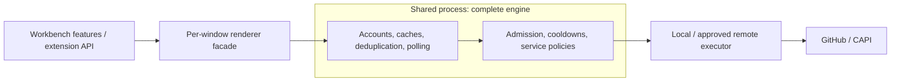
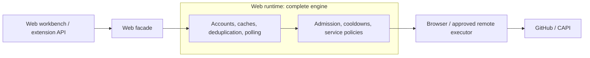
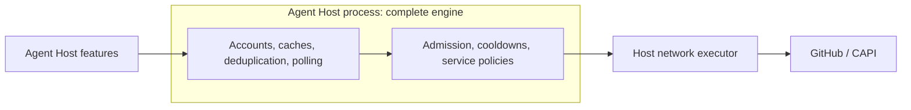

<!--
Copyright (c) Microsoft Corporation. All rights reserved.
Licensed under the MIT License. See License.txt in the project root for license information.
-->

# GitHub service

Reusable GitHub engine and cross-target architecture.

> **Status:** Draft consolidation design. The target architecture below is not yet implemented.

## Current implementation

[GitHubService](common/githubService.ts) composes credentials, capabilities, transport, queries, mutations, and PR subscriptions. It already provides concurrency limits, rate-limit handling, REST ETags, and read coalescing.

- The [workbench binding](../../workbench/services/github/browser/githubService.ts) runs per window and selects the default account.
- The [Agent Host service graph](../agentHost/node/agentHostServices.ts) creates a separate instance, alongside its own GitHub and CAPI clients.
- The [legacy Sessions service](../../sessions/contrib/github/browser/githubService.ts) and extension clients still own independent requests and polling.

These instances do not currently share application-wide request state.

### Request execution

Internal requests carry caller attribution and a deadline. Current transport defaults, not public API guarantees:

- At most 256 retained requests, including queued and cooldown-waiting work; 64 per account or caller. Up to eight slots in each limit are reserved for interactive/mutation work.
- At most four active requests, two per host or caller, and one per account. Equal-priority callers share scheduling fairly; parked requests consume no active slot.
- A five-minute request deadline includes queueing, cooldowns, retries, and body reads. Callers can tighten it; deadlines are rechecked before wire attempts and successful settlement even if timer callbacks are delayed. Responses are capped at 16 MiB; JSON overflow fails explicitly, while bounded downloads report truncation.
- Equivalent reads share a request with at most 64 waiters and independent cancellation/deadlines; detached waiters are released immediately. Credential invalidation preserves live cooldowns and reclaims inactive account state once they expire.
- Reads receive at most one transient-failure retry when not rate-limited. Writes are not automatically retried by the transport; mutation services reconcile ambiguous writes, but never a request that timed out before network dispatch.
- Server cooldowns also gate repeated identity lookups and authenticated download redirects. Download error classification inspects at most an 8 KiB diagnostic prefix, without exposing it in errors or telemetry.
- Long server cooldowns use bounded native timer chunks. Queue drains also expire overdue active requests after wall-clock jumps; rejected unique reads never retain coalescing entries or waiter timers.

### Request identification

Bindings supply trusted product/channel/version and originating component/version metadata. Configured GitHub endpoints receive `X-Client-Application`, `X-Client-Source`, an allowlisted `X-Client-Feature`, and `X-Is-Retry` on Node egress. Shared reads retain the initiating caller's attribution; arbitrary caller strings are never sent.

`X-Is-Retry` is `"true"` only for an engine-controlled retry and `"false"` for an initial attempt. New polls, pages, refreshes, and redirect hops are not retries. Higher-layer authentication or feature retries are not currently labeled, and these headers do not introduce retries or mutation replay.

Browser fetch, including desktop renderers, sends only `X-Client-Application` to `https://api.github.com`. The other headers are not in GitHub.com's CORS allowlist. Enterprise browser endpoints receive no identification headers until their allowlists are established; CAPI requires its own endpoint policy. This is an explicit egress policy, not a fallback after failed requests. Cross-origin download storage hops receive no identification or retry headers.

### Telemetry

[Request telemetry](common/githubRequestTelemetry.ts) uses the existing product telemetry service and usage-telemetry controls. Active five-minute windows emit one `githubRequestSummary` with traffic, outcome, rejection and queue counters, plus at most ten reservoir-sampled `githubRequestTiming` events. Disposal flushes completed observations best-effort; idle engines emit nothing.

Timing samples separate queue, cooldown and execution time and include their sample population. Categories are allowlisted; payloads contain no account/repository identifiers, hostnames, URLs, headers, request/response content, GraphQL text, or raw errors. The summary distinguishes logical callers from wire attempts and GraphQL partial-error responses.

## Consolidation scope

Consolidate VS Code, built-in extensions, and [GitHub Pull Requests](https://github.com/microsoft/vscode-pull-request-github) behind a governed service and public extension API. Include REST/GraphQL, Copilot API (CAPI), and content transfers. Exclude GitHub MCP server/tool traffic, git transport, build tooling, and arbitrary browser URLs; track SDK-owned exceptions. REST/CAPI requests for MCP registry and connector management remain in scope.

Keep portable contracts and mechanisms in [common](common). Adapters own hosting, credentials, and networking; the engine must not depend on workbench UI.

### Common guarantees

Every target uses the **complete engine**, not merely the same HTTP client:

- **Identity:** Explicit account/session selection, extension consent, and authorization-scoped caches for GitHub.com, GHE.com, GHES, and anonymous access. No background sign-in prompts or authentication bootstrap cycles.
- **Admission:** Bound active, queued, and rate-parked work with deadlines, request-rate budgets, fairness, and reserved interactive capacity.
- **Cooldowns:** Honor primary/secondary limits and `Retry-After` across callers and credential rotation. Account for every attempt, including pages and retries.
- **Resources:** Share compatible caches, in-flight reads, and polling plans. Bound retention/subscriptions; use freshness, conditional requests, cancellation, backoff, jitter, and consumer interest.
- **Operations:** Bound pagination, bytes, and time; never automatically replay mutations. Separate CAPI/streaming/bulk policies from repository metadata, preserving entitlement and policy enforcement.
- **Results:** Explicit overload, timeout, and incomplete-result states; cancellation and backpressure across process boundaries; diagnostics without credentials or private content.

Cache hits need no network admission; every wire request does. Credentials and arbitrary authenticated URLs are not exposed by the new extension API.

## Target hosting

### Desktop

Facades own consent, visibility, and consumer lifetimes; the existing shared process shares engine state across windows. Electron main only handles lifecycle and connection setup.

### Web

Web uses all the same protections. Core and extensions share the engine; cross-tab coordination remains open. Shared code does not imply shared runtime state.

### Standalone Agent Host

Host-owned credentials and lifetimes require no attached workbench. Coordination with other engines must be explicit.

Preserve reachability, proxies, certificates, and CORS in every deployment. Remote execution must return rate-limit feedback to the admitting engine, not bypass it.
