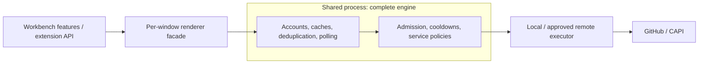
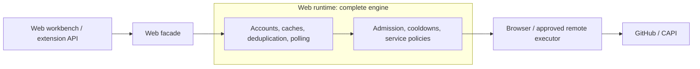
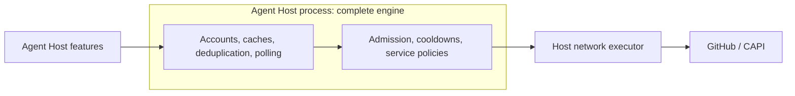

<!--
Copyright (c) Microsoft Corporation. All rights reserved.
Licensed under the MIT License. See License.txt in the project root for license information.
-->

# GitHub service

Reusable GitHub engine and cross-target architecture.

> **Status:** Draft consolidation design. The target architecture below is not yet implemented.

## Current implementation

[GitHubService](common/githubService.ts) owns shared admission, cooldowns and telemetry. It supplies explicit authorization-scoped clients composing credentials, capabilities, transport, queries, mutations, and PR subscriptions.

- The [workbench binding](../../workbench/services/github/browser/githubService.ts) runs per editor or Agents window. Existing features explicitly acquire a client for the selected default account; other callers can select a specific existing session.
- The [Agent Host binding](../agentHost/node/agentHostGitHubService.ts) selects its host-owned repository credential resource without an attached workbench. Repository/PR association, creation, merge settings, auto-merge and issue/PR title context use its explicit clients. Copilot discovery uses this engine's bootstrap capability; the [separate Copilot service](copilotApiService.md) governs CAPI model reads without sharing GitHub quota state.
- The [legacy Sessions service](../../sessions/contrib/github/browser/githubService.ts) and extension clients still own independent requests and polling.

These instances do not currently share application-wide request state.

The [client inventory](client-inventory.md) maps runtime callers, migration boundaries, and remaining gaps.

### Code organization

GitHub and Copilot API services are colocated here, with separate domain contracts and quota owners. Shared [types](common/types.ts), [queue](common/requestQueue.ts), [scheduler](common/scheduler.ts), [backoff](common/backoff.ts), [cooldown state](common/cooldownState.ts), [body reader](common/responseReader.ts), [operation waiters](common/operationWaiters.ts) and [control transport](common/controlTransport.ts) have neutral names and do not interpret service-specific payloads. GitHub header/GraphQL policy stays in [GitHubRateLimitCoordinator](common/githubRateLimitCoordinator.ts); Copilot discovery, model policy and inference semantics stay in [CopilotApiService](common/copilotApiService.ts).

Copilot is an application service, not a standalone Monaco editor entry point. Its SDK type dependencies stay outside Monaco's root compilation; the shared request mechanisms remain included.

An in-flight operation owns its controller and shared deadline. `OperationWaiters` owns individual callers' waiting, cancellation and result delivery, not network execution. One caller can detach without cancelling peers; the operation owner decides what happens when its last waiter leaves. This also supports service-wide metadata initialization, which is not an HTTP request.

### Authorization clients

The hosting binding selects provider/session/scopes and endpoints and supplies a context-specific credential bridge. The engine does not select accounts, prompt for sign-in, or fall back to another session. A missing repository-scoped session surfaces an authentication error; existing explicit sign-in actions remain responsible for consent. Account selection and credential resolution each have a cancellable five-minute deadline, including stalled authentication providers.

Consumers retain a disposable reference from `acquireClient`. Equivalent grants share one client, including resources and coalesced reads. Different sessions, scope sets, issuers or endpoints have separate private caches and subscriptions, even when they resolve to the same GitHub account. They still share account/host/caller limits and stable-account cooldowns within the engine.

At most 64 clients are retained across authorization, anonymous and bootstrap contexts. Releasing the last reference cancels only that client's work and disposes its resources; bounded identity-backoff bookkeeping for authorization clients remains for up to five minutes so reacquisition cannot reset repeated-failure backoff. Unused bookkeeping can be evicted for a new client. Grant changes retire only affected session clients; same-session token-only renewals preserve the client, and default-account selection changes do not revoke explicit clients for other accounts. Live server quota and identity-bootstrap cooldowns survive client release/recreation until expiry. A resolved account's core or secondary cooldown also gates subsequent identity bootstrap; a search-only limit does not block identity lookup.

Each workbench/Agent Host binding retains one reference for its selected default/repository client so short-lived consumers reuse identity, ETags and capability observations. Selection changes and binding disposal release that reference. Other explicit clients remain caller-owned.

### Anonymous public reads

`acquireAnonymousClient` is an explicit, read-only capability for an approved HTTPS API base. It does not select an account, invoke a credential provider, resolve `/user`, or acquire scopes. Anonymous-only hosts can construct the engine without a credential provider; attempting to acquire an authenticated client then fails explicitly.

Anonymous clients expose API-relative JSON `GET` requests, not mutations, GraphQL, raw tokens, or arbitrary request headers. Requests omit authorization, cookies and referrers, including on retries and same-origin redirects. Credential-bearing URLs, insecure endpoints and paths escaping the API base are rejected, including redirect targets outside the normalized API base path. Authenticated failures never automatically fall back to anonymous traffic.

Equivalent anonymous clients share requests and ETag state, but never share cached data with authenticated clients. All anonymous clients using the same API origin and engine-owned executor share an anonymous quota identity, independent of signed-in accounts; creating another client or releasing the final reference does not reset live server cooldowns. The engine's existing global/host/caller admission limits and client-capacity bound still apply. Independent engines/processes and unrelated clients behind the same public IP are not coordinated yet.

The Issue Reporter's GitHub similar-issue searches, in both the wizard and legacy/web UI, use this capability with cancellable ten-second deadlines. Both search backends invalidate obsolete work when the source/input changes or the reporter is disposed, so late responses cannot cancel or replace a newer search. Existing duplicate-detection service calls and authenticated issue submission remain separate. Anonymous Copilot/device token issuance, general text/binary transfers and shared-process relocation remain outside this capability.

Existing consumers use these clients directly; there is no compatibility singleton API for queries or mutations. Agent Merge captures its authorized client with the turn. Host token refresh preserves the client and rotates credentials on the next request; revocation, endpoint changes and a resolved account change reset the dependent runtime. Async consumers release references that arrive after their owning scope has ended and do not install subscriptions with invalidated credentials.

VS Code forwards optional account provenance through the standard authentication `_meta` bag under `vscode.authentication.account`. The Agent Host uses the provider/account/issuer tuple to separate client and bootstrap quota ownership before `/user` resolves a new token; GitHub still establishes the authoritative account identity. Token expiry alone does not reset that selection. The binding reconciles provenance during token lookup and acquisition as well as authentication events, so scoped-token fallback and expired-token pruning notify dependent consumers. Hosts and clients without this metadata remain supported with a conservative per-resource bootstrap cooldown. Sealed-token adapters that substitute a different credential omit the original token's provenance.

### Credential-independent authenticated bootstrap

`acquireBootstrapClient` is an internal, API-relative GET capability for a trusted binding's explicitly supplied credential. It does not resolve `/user` or consult the accepted-token store, so Copilot discovery can run while provider authentication is still in progress without a circular dependency. It never makes that credential accepted.

Private caches and request sharing remain token/base-specific. Host-supplied account provenance affects only quota accounting: known IDs share applicable GitHub account limits, while unknown identities use a conservative origin-wide bootstrap bucket. Known bootstrap clients also honor outstanding unresolved-origin waits. A bootstrap waiter fails promptly as rate-limited when the cooldown cannot fit its deadline; authenticated repository and anonymous reads keep their existing deadline behavior. Client release preserves live server cooldowns and cannot cancel another token's work. The [Copilot service](copilotApiService.md) uses this path for GitHub discovery, with separate policy state for CAPI-origin model reads.

### Agent Host repository and PR operations

The [association resolver](../agentHost/node/agentHostPullRequestAssociationResolver.ts), [creation handler](../agentHost/node/agentHostPullRequestOperationHandler.ts) and [title controller](../agentHost/node/agentHostSessionTitleController.ts) retain an authorized client for each operation. They reuse the binding's selected repository resource and existing silent missing-token checks; title context does not introduce another scope requirement or a sign-in prompt.

Title enrichment submits its bounded batch directly to the engine's request queue, without a separate concurrency limiter. The caller still caps enrichment at ten references, bounds the model context, and imposes a five-second budget on the optional reads.

Operation cancellation spans the workflow, while individual domain requests manage credential-generation signals. Same-account token renewal can therefore recover through subsequent requests or create reconciliation without switching the captured client or account.

Query operations preserve fork head owners, caller-approved URL filtering and ordering, exact head-SHA matching, open/closed selection, and PR identity/title/creation metadata. An empty approved set issues no lookup. A full commit-association page remains inconclusive, and only GitHub's specific missing-commit 422 response means no match. The minimal issue/PR context read accepts the issues endpoint's PR payload without subscribing to an issue-only resource.

Git/worktree changes, folder/session association and notifications remain caller-owned. PR creation uses the existing mutation operation; after a create failure the handler reconciles by reading the same head through the captured client, never by replaying the write. A timeout before dispatch is not reconciled. Repository settings and auto-merge share governed transport, while optional settings/context failures retain the existing logged fallback behavior. There is no separate Agent Host repository HTTP client or lookup cache.

### Review-thread replies

Review-thread reply outcomes distinguish publication: `succeeded` and `reconciled` require a `SUBMITTED` comment, `pending` means an unpublished reply in the viewer's pending review, and `indeterminate` means publication could not be confirmed. Only confirmed published replies permit `replyAndResolveThread` to resolve the thread. Mutation responses and fully paginated reconciliation reads retain comment state; duplicate operation markers cannot identify a unique reply and never trigger replay or resolution.

The service never submits, discards, or replaces a pending review. Agent Merge reports pending or unconfirmed replies and leaves review management to the user. After a confirmed pending reply, it disables monitoring for that folder when the repair turn ends and notifies the user; resuming requires explicitly enabling Agent Merge again. Turn finalization waits for in-flight replies, including after cancellation, and preserves the changed-worktree safeguard before clearing the repair baseline. Explicit `resolveThread` remains a separate intentional operation.

### Request execution

Internal requests carry caller attribution and a deadline. Current transport defaults, not public API guarantees:

- At most 256 retained requests, including queued and cooldown-waiting work; 64 per account or caller. Up to eight slots in each limit are reserved for interactive/mutation work.
- At most four active requests, two per host or caller, and one per account. Equal-priority callers share scheduling fairly; parked requests consume no active slot.
- A five-minute request deadline includes queueing, cooldowns, retries, and body reads. Callers can tighten it; deadlines are rechecked before wire attempts and successful settlement even if timer callbacks are delayed. Responses are capped at 16 MiB; JSON overflow fails explicitly, while bounded downloads report truncation.
- Equivalent reads share a request with at most 64 waiters and independent cancellation/deadlines; detached waiters are released immediately. Credential invalidation preserves live cooldowns and reclaims inactive account state once they expire.
- Reads receive at most one transient-failure retry when not rate-limited. Writes are not automatically retried by the transport; mutation services reconcile ambiguous writes, but never a request that timed out before network dispatch.
- Server cooldowns also gate repeated identity lookups and authenticated download redirects. Download error classification inspects at most an 8 KiB diagnostic prefix, without exposing it in errors or telemetry.
- HTTP 403 is throttling only with quota evidence: spent `remaining`, a valid `Retry-After`, explicit secondary-limit feedback, or an unambiguous primary-limit diagnostic when counters are absent. Generic "Rate Limit Exceeded" denials with available quota remain authorization errors; they do not invalidate credentials or park unrelated traffic.
- Server-reported REST resources govern admission, retries and bootstrap waiters, rather than only the initial core/search estimate. Account/API-origin/base-scoped route families group checks across repositories/refs and separate code/semantic/keyword searches; legacy hosts retain reported core/search behavior. Each credential client retains its own observed mapping so integration-specific buckets cannot overwrite a peer's; fresh clients conservatively consult existing account/family observations until receiving their own feedback. Mappings live in the existing coordinator, capped at 512 with bounded keys and 16 retained resource variants per route. Active mappings and live cooldowns cannot be evicted to bypass a wait; account cleanup removes idle observations after required waits expire.
- Credential resolution has a separate five-minute caller deadline covering token acquisition, identity backoff and shared identity lookup. A caller timing out does not erase server cooldowns or cancel another caller's identity lookup.
- Long server cooldowns use bounded native timer chunks. Queue drains also expire overdue active requests after wall-clock jumps; rejected unique reads never retain coalescing entries or waiter timers.

### Request identification

Bindings supply trusted product/channel/version and originating component/version metadata. Configured GitHub endpoints receive `X-Client-Application`, `X-Client-Source`, an allowlisted `X-Client-Feature`, and `X-Is-Retry` on Node egress. Shared reads retain the initiating caller's attribution; arbitrary caller strings are never sent.

`X-Is-Retry` is `"true"` only for an engine-controlled retry and `"false"` for an initial attempt. New polls, pages, refreshes, and redirect hops are not retries. Higher-layer authentication or feature retries are not currently labeled, and these headers do not introduce retries or mutation replay.

Browser fetch, including desktop renderers, sends only `X-Client-Application` to `https://api.github.com`. The other headers are not in GitHub.com's CORS allowlist. Enterprise browser endpoints receive no identification headers until their allowlists are established; CAPI requires its own endpoint policy. This is an explicit egress policy, not a fallback after failed requests. Cross-origin download storage hops receive no identification or retry headers.

### Telemetry

[Request telemetry](common/githubRequestTelemetry.ts) uses the existing product telemetry service and usage-telemetry controls. Active five-minute windows emit one `githubRequestSummary` with traffic, outcome, rejection and queue counters, plus at most ten reservoir-sampled `githubRequestTiming` events. Disposal flushes completed observations best-effort; idle engines emit nothing.

Bindings notify the collector immediately when usage telemetry is disabled, discarding buffered aggregates and invalidating completion handles even if no request or timer callback runs during the opt-out.

Timing samples separate queue, cooldown and execution time and include their sample population. Categories are allowlisted; payloads contain no account/repository identifiers, hostnames, URLs, headers, request/response content, GraphQL text, or raw errors. The summary distinguishes logical callers from wire attempts and GraphQL partial-error responses.

## Consolidation scope

Consolidate VS Code, built-in extensions, and [GitHub Pull Requests](https://github.com/microsoft/vscode-pull-request-github) behind a governed service and public extension API. Include REST/GraphQL, Copilot API (CAPI), and content transfers. Exclude GitHub MCP server/tool traffic, git transport, build tooling, and arbitrary browser URLs; track SDK-owned exceptions. REST/CAPI requests for MCP registry and connector management remain in scope.

Keep portable contracts and mechanisms in [common](common). Adapters own hosting, credentials, and networking; the engine must not depend on workbench UI.

### Common guarantees

Every target uses the **complete engine**, not merely the same HTTP client:

- **Identity:** Explicit account/session selection, extension consent, and authorization-scoped caches for GitHub.com, GHE.com, GHES, and anonymous access. No background sign-in prompts or authentication bootstrap cycles.
- **Admission:** Bound active, queued, and rate-parked work with deadlines, request-rate budgets, fairness, and reserved interactive capacity.
- **Cooldowns:** Honor primary/secondary limits and `Retry-After` across callers and credential rotation. Account for every attempt, including pages and retries.
- **Resources:** Share compatible caches, in-flight reads, and polling plans. Bound retention/subscriptions; use freshness, conditional requests, cancellation, backoff, jitter, and consumer interest.
- **Operations:** Bound pagination, bytes, and time; never automatically replay mutations. Separate CAPI/streaming/bulk policies from repository metadata, preserving entitlement and policy enforcement.
- **Results:** Explicit overload, timeout, and incomplete-result states; cancellation and backpressure across process boundaries; diagnostics without credentials or private content.

Cache hits need no network admission; every wire request does. Credentials and arbitrary authenticated URLs are not exposed by the new extension API.

## Target hosting

### Desktop

Facades own consent, visibility, and consumer lifetimes; the existing shared process shares engine state across windows. Electron main only handles lifecycle and connection setup.

### Web

Web uses all the same protections. Core and extensions share the engine; cross-tab coordination remains open. Shared code does not imply shared runtime state.

### Standalone Agent Host

Host-owned credentials and lifetimes require no attached workbench. Coordination with other engines must be explicit.

Preserve reachability, proxies, certificates, and CORS in every deployment. Remote execution must return rate-limit feedback to the admitting engine, not bypass it.
