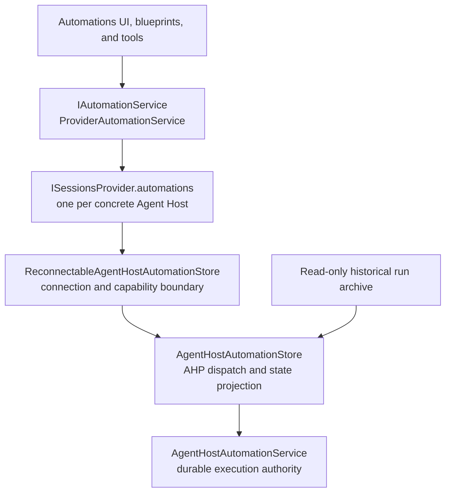

# Automations architecture

> **Specification change gate:** Update this document only when Automation ownership, routing, persistence, or lifecycle invariants intentionally change. Concrete behavior belongs in focused tests.

## Scope and authority

Automations schedule or manually start agent sessions on a selected Agent Host. AHP is the only execution path, for both local and remote hosts.

The Agents Window manages definitions, requests manual execution, and observes authoritative state. It does not evaluate schedules, elect a window leader, claim runs in browser storage, create run sessions, send their first prompts, or recover their lifecycle. An unavailable or unsupported host never falls back to browser execution or to another host.

The Sessions layer direction remains defined by [LAYERS.md](LAYERS.md). Non-provider contributions consume provider-neutral Automation contracts. AHP adaptation stays under `contrib/providers/agentHost`.

## Ownership

| Concern | Owner |
|---|---|
| Shared catalogue and command contract | [`IAutomationStore`](../workbench/contrib/chat/common/automations/automationService.ts) |
| One provider's Automation interface and observable capabilities | [`ISessionsProviderAutomations`](services/sessions/common/sessionsProvider.ts) |
| Injected, multi-provider Automation API | [`IAutomationService`](../workbench/contrib/chat/common/automations/automationService.ts) |
| Unified catalogue and concrete-provider routing | [`ProviderAutomationService`](contrib/automations/browser/providerAutomationService.ts) |
| Connection, feature enablement, and negotiated capability | [`ReconnectableAgentHostAutomationStore`](contrib/providers/agentHost/browser/reconnectableAgentHostAutomationStore.ts) |
| Definition commands, manual dispatch, and AHP state projection | [`AgentHostAutomationStore`](contrib/providers/agentHost/browser/agentHostAutomationStore.ts) |
| Manual invocation feedback and observation | [`IAutomationRunner`](../workbench/contrib/chat/common/automations/automationRunner.ts), implemented by [`AutomationRunner`](contrib/automations/browser/automationRunner.ts) |
| Definitions, schedules, run claims, sessions, lifecycle, history, and recovery | [`IAgentHostAutomationService` / `AgentHostAutomationService`](../platform/agentHost/node/agentHostAutomationService.ts) |
| Portable blueprint format and validation | Workbench Automation common code |
| Inert plugin blueprint discovery and enablement | `IAgentPluginService` |
| Definition review, draft configuration, cards, and history presentation | Automations contributions |

The provider-neutral store exposes definition mutations and a manual run request, not run-claim or lifecycle-write APIs. The manual runner has no Sessions session-creation dependency.

`IAutomationService` and `ISessionsProviderAutomations` each extend `IAutomationStore`; neither extends the other. The provider contract describes one host's catalogue and observable creation eligibility, while the injected service adds provider lists and creation checks by provider ID. The common interfaces live in Workbench, and the provider specialization lives in Sessions, preserving the layer direction.

`ProviderAutomationService` aggregates the objects exposed by `ISessionsProvider.automations`. For AHP providers, that object is a stable `ReconnectableAgentHostAutomationStore`; its inner `AgentHostAutomationStore` lasts only for one usable connection. Neither client-side object is the host-process `AgentHostAutomationService`, which owns execution and durable storage.

`AutomationMutationGuard` is a caller-supplied pre-dispatch check for transient client conditions. Throwing stops a definition mutation before it is sent; the callback neither performs host authorization nor rolls back an already-dispatched request. Guarded editable-state comparison is a separate concern.

Manual invocation also has two result boundaries: `IAutomationRunRequestResult` describes the provider's response to a host request, while `IAutomationRunOperation` separates user-facing dispatch feedback from ongoing observation. A host-handled request need not create a session successfully, and terminal observation does not imply a successful run.

## Definitions and session configuration

`IAutomationDescriptor` contains immutable identity, editable name and prompt, schedule, execution target, optional session template, enabled state, and host-projected runtime timestamps.

An `AutomationTarget` separates concrete host identity (`providerId`) from the agent on that host (`sessionTypeId`). Workspace targets also carry the workspace URI and isolation choice. Session type or display name alone cannot determine ownership. Creation requires an explicit, available Automation-capable provider; providers without AHP Automations do not offer Automation creation.

Projected definition and run identifiers are opaque, concrete-provider-scoped identities containing the complete host resource URI. Equal resource URIs on different hosts, or equal final path segments within one host, do not share identity. Commands resolve the scoped identity to the original host resource; they never reconstruct a host resource from a displayed ID. Historical archive rows use the same definition identity and a distinct provider-scoped history identity.

`IAutomationSessionTemplate` contains an optional model and model preferences, optional custom agent, and opaque provider-owned configuration. Working directory, isolation, and branch belong to the target, not the template. Shared Automation code does not interpret provider Mode or Approvals vocabularies.

Saved configuration is a preference, not a durable permission grant. Providers resolve it against current models, agents, schema, feature enablement, and managed policy for each configuration draft and run. Same-target edits preserve unknown or temporarily unavailable template values unless explicitly changed. Selecting another agent does not carry the previous agent's template into the new one.

Compatibility decoding for configuration values in existing AHP definitions is separate from definition ownership. Flat configuration input aliases may be translated at the provider boundary but cannot override an explicit session template.

### Blueprints and templates

`IAutomationBlueprint` is a versioned portable name, prompt, and schedule. It excludes runtime identity, target provider, workspace, session configuration, enabled state, timestamps, and history.

Standalone `.automation.md` files and plugins use the same blueprint format. Plugin discovery exposes inert templates and follows effective plugin enablement; discovery, installation, and updates never mutate saved Automations.

Import, duplication, and templates open the same review dialog and use the same AHP-only creation path. File imports and plugin templates start disabled. The user selects an available host and provider-owned configuration locally. Export transfers only portable state, not execution authority or history.

Blueprint schedules are manual, hourly, or five-field cron schedules interpreted in the importing user's local time zone. Import rejects schedule semantics the editor cannot preserve rather than silently changing their meaning.

## Availability and routing

A store's catalogue is `loading`, `ready`, `unavailable`, or in `error`. Only `ready` makes an empty catalogue authoritative.

- `loading` means initial provider discovery, capability negotiation, or an authoritative snapshot is still in flight.
- `unavailable` means a known host is disconnected, disabled, or does not advertise Automations.
- `error` means an authoritative catalogue could not be read.

The aggregate waits for AfterRestored provider registration. A window without an Automation-capable provider then settles to unavailable, not loading or empty-ready. Across providers, errors take precedence, followed by loading, unavailability, and finally ready. Available hosts remain usable even while another host is unavailable.

Creation availability is observable and comes from the negotiated AHP create capability and authoritative catalogue readiness. Forms and tools use the same capability. Definition-specific Run, Update, and Remove actions come from the host's operations; clients do not infer permission from a locally retained definition.

Editing an existing definition requires its `Update` operation, not host-level `create`. The edit dialog offers its owning host and permits configuration drafts on a ready AHP catalogue even when new definitions cannot be created. New definitions, templates, imports, and duplicates still require `create`.

Local and remote providers have independent connections and catalogues. Disconnecting disposes the connection's projection and pending observations, without changing host definitions or run state. Reconnect projects the host's current state; it performs no browser-ledger import or activation handshake.

The AHP-only client additionally requires the `vscode.autonomousAutomations` initialize metadata capability. Older hosts advertise the same baseline AHP catalogue while requiring client-driven activation; they are unavailable with upgrade guidance rather than accepting definitions that cannot run. The metadata capability distinguishes this host implementation contract without changing the standardized AHP protocol.

### Editing and host identity

Existing definitions and runs route to their owning provider. Same-host agent, workspace, schedule, configuration, and enablement edits remain supported.

An edit cannot transfer a definition between concrete Agent Hosts: AHP does not provide a history-preserving transfer command. Ordinary and guarded edits reject a host change before any mutation. A stale guarded edit still reports its conflict before transfer eligibility is checked.

To use a different host, explicitly duplicate the definition there. The original definition and history remain with the original host, and an enabled original continues scheduling until explicitly disabled. Duplication never disables or deletes the source.

## Host lifecycle

`AgentHostAutomationService` is authoritative as soon as durable host storage is readable. Execution is gated by host feature enablement and current provider availability, not renderer startup or migration flags. Host configuration restores saved Automation enablement and timeout before authority initialization, without restoring client-owned approval grants.

Providers may expose model-dependent readiness for unattended execution. While required credentials are missing, the host leaves due schedule cursors unchanged and resumes scheduling when readiness changes. Copilot's readiness covers initially missing credentials and preserves explicitly selected BYOK models when signed-out operation is supported; it does not persist credentials or bypass runtime authorization.

The host owns:

- durable manual request IDs and single-active-run admission;
- schedule cursors, due-trigger evaluation, and misfire handling;
- session creation, Automation prompt provenance, membership, and primary-session linkage;
- cancellation, timeout, and terminal outcomes;
- restart recovery and paginated run history.

Definitions and run mutations are persisted before corresponding AHP state is published. An unreadable or unsupported host storage format must not be replaced with an empty writable catalogue.

At most one non-terminal run occupies an Automation's active-run slot. `pending` and `running` are non-terminal; `completed` and `failed` are terminal in the Sessions projection. AHP cancellation projects as failed with its cancellation reason. A run exposes its session resource only once the host links that session.

Run Now submits a manual request to this authority and observes dispatch and completion. An existing active run is reported without creating another session. Pre-dispatch cancellation prevents the request; supported in-flight cancellation is forwarded to the host. Observation failure or window closure cannot synthesize a terminal run or move execution elsewhere.

Disabling scheduled execution on a definition preserves manual Run Now. Disabling the Automations feature removes new-run authority without deleting definitions or automatically terminating sessions already running. On restart or re-enablement, the host applies its existing recovery and misfire rules without requiring an Agents Window.

## Persistence and retained history

Canonical definitions, schedule cursors, manual request IDs, and run state live in Agent Host storage.

Already-migrated historical runs may also exist in a provider-scoped `agentHostAutomation.legacyRunArchive.*` value. The projection reads these archives solely for history, merging them with authoritative host runs. It does not add to or rewrite them. Historical rows never claim an active-run slot or dispatch execution; malformed non-terminal archive rows are represented as interrupted history, not active host runs.

Obsolete global and provider browser definition ledgers are outside the supported runtime contract. They are not read, imported, executed, or rewritten. Their persisted values are left untouched rather than destructively removed. There is no browser definition migration, interruption recovery, pending-import acknowledgement, or window-leadership path.

Existing AHP definitions and history are not deleted because an obsolete migration marker is absent or remains in persisted metadata. Such markers do not control host activation or operations.

## Cross-component invariants

1. The selected Agent Host is the only execution and lifecycle authority.
2. Concrete provider identity determines ownership; agent type alone does not.
3. Missing capability or connection fails closed without creating local definitions or sessions.
4. Browser startup, clocks, and window leadership cannot dispatch an Automation run.
5. UI, tools, imports, templates, and duplication share the same AHP capability and mutation boundaries.
6. Saved configuration is revalidated under current provider schema and policy, never treated as a grant.
7. Retained historical archives are read-only presentation data, not execution state.
8. Cross-host edit rejection preserves the original definition and history without partial writes.

## Related specifications

- [Sessions architecture](SESSIONS.md)
- [Sessions list](SESSIONS_LIST.md)
- [Agent Host sessions provider](contrib/providers/agentHost/AGENT_HOST_SESSIONS_PROVIDER.md)
- [Remote Agent Host sessions provider](contrib/providers/remoteAgentHost/REMOTE_AGENT_HOST_SESSIONS_PROVIDER.md)
