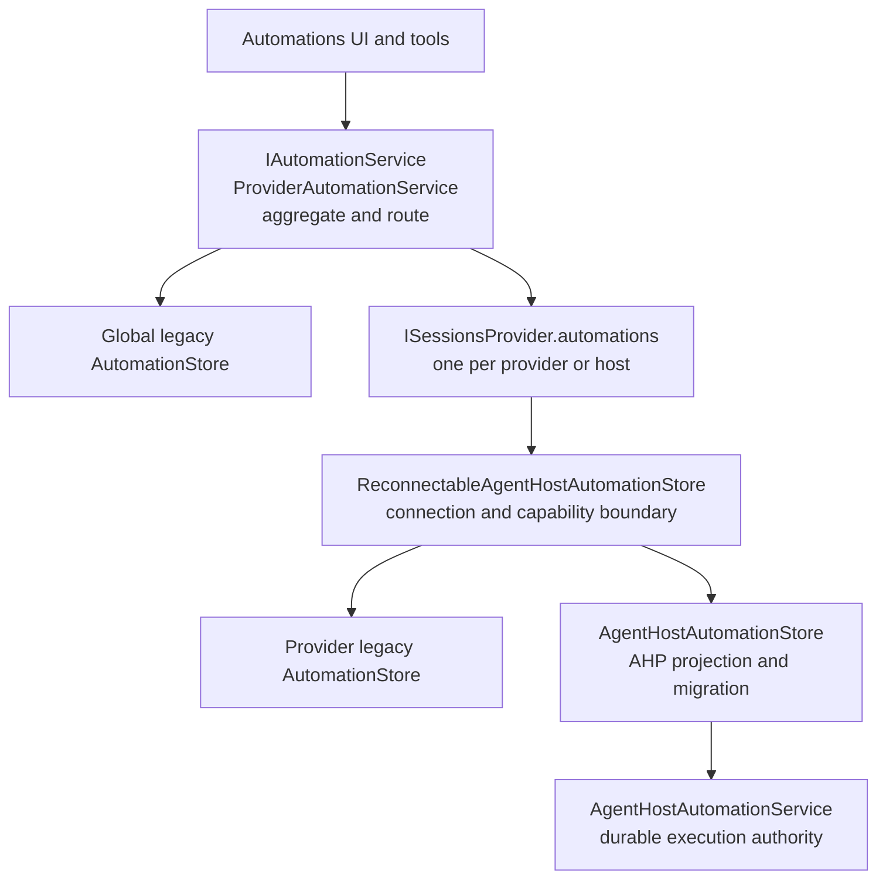
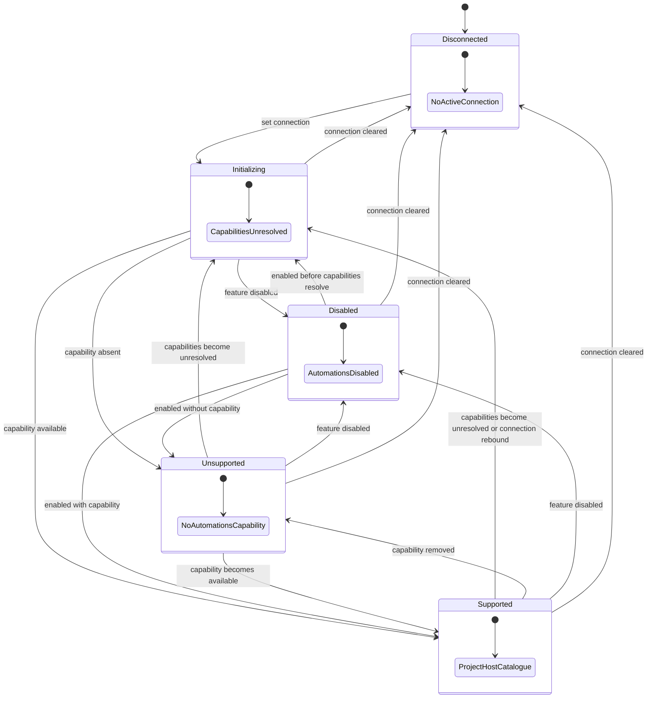

# Automations architecture

> **Specification change gate:** Do not update this document for individual bugs, UI details, telemetry fields, retry constants, or implementation chronology. Update it only when Automation ownership, routing, authority transition, persistence, or lifecycle invariants intentionally change.

## Scope

Automations schedule or manually start agent sessions against a selected Sessions provider. They are presented through one provider-neutral service, but definitions and runs are owned by the concrete provider or Agent Host selected by each automation target.

This specification defines:

- component and service ownership;
- multi-host identity and routing;
- durable storage and execution authority;
- legacy-to-provider and provider-to-Agent-Host migration;
- run lifecycle, recovery, and history invariants.

It does not define card or history-row rendering, dialog layout, telemetry fields, cron parsing algorithms, or provider-specific transport behavior.

## Architecture

The Sessions layer direction remains defined by [LAYERS.md](LAYERS.md). Non-provider contributions consume `IAutomationService` and provider-neutral Automation data. Agent Host-specific adaptation stays under `contrib/providers/agentHost`.

## Ownership

| Concern | Owner |
|---|---|
| Unified Automation catalogue exposed to UI and tools | `ProviderAutomationService` |
| Selection of the store for a create, update, run, or delete | `ProviderAutomationService` |
| Legacy VS Code definitions, runs, and compare-and-swap persistence | `AutomationStore` |
| Connection and capability transitions for one Agent Host provider | `ReconnectableAgentHostAutomationStore` |
| Projection between AHP state and provider-neutral Automation objects | `AgentHostAutomationStore` |
| Import of one provider's legacy definitions into its Agent Host | `AgentHostAutomationStore` |
| Host-owned definitions, scheduling, execution, and run lifecycle | `AgentHostAutomationService` |
| Card, dialog, and history presentation | Automations contributions |

`ProviderAutomationService` is an aggregate and router, not a global execution authority. Each store remains responsible for the data it owns.

## Domain model

### Automation

`IAutomationDescriptor` contains:

- immutable Automation identity;
- editable name and prompt;
- schedule;
- execution target;
- optional model, mode, and permission selection;
- enabled state;
- runtime timestamps.

### Target identity

An `AutomationTarget` identifies both where and how a session is created:

- `providerId` identifies a concrete Sessions provider and therefore a concrete compute location or Agent Host;
- `sessionTypeId` identifies the agent exposed by that provider;
- workspace targets also carry the workspace URI and isolation choice.

The same logical agent may be available from multiple providers. Consumers must not infer provider identity from `sessionTypeId`.

Workspace targets may omit `providerId` and `sessionTypeId`. Such definitions use global legacy routing and cannot migrate to a provider until their target identifies one. Quick-chat targets always identify both.

### Run

`IAutomationRun` records one execution attempt. `pending` and `running` are non-terminal; `completed` and `failed` are terminal. A run may expose the created session resource once that session is committed.

At most one non-terminal run may occupy an Automation's active-run slot within one authority.

## Multi-host routing

VS Code may register one local Agent Host provider and multiple remote Agent Host providers at the same time. A remote connection has its own provider identity, Automation store, AHP catalogue, and migration state.

The AHP Automation catalogue is singleton within one Agent Host. It is not shared across every host connected to a VS Code window.

### Create routing

For a new Automation:

1. the dialog or tool produces a complete `AutomationTarget`;
2. `ProviderAutomationService` resolves `target.providerId`;
3. when that provider exposes an Automation store, creation is delegated to it;
4. otherwise creation falls back to the global legacy store.

An Agent Host provider may itself use provider-scoped legacy storage while its host is disconnected, unsupported, disabled, or not yet migrated.

A destination store that explicitly cannot preserve imported run history is not eligible for destructive source removal. The source remains as the durable history owner.

### Existing-object routing

Existing definitions and runs route by immutable identifier to the store that currently contains them. Aggregate observables deduplicate overlapping source and destination snapshots during migration.

Changing `target.providerId` changes durable ownership. It therefore performs a guarded store transfer rather than only updating metadata.

## Persistence topology

| Persistence | Purpose |
|---|---|
| Global legacy ledger | Definitions not yet assigned to an available provider store |
| Provider-scoped legacy ledger | Compatibility source for one provider before Agent Host authority is active |
| Agent Host Automation storage | Canonical definitions, trigger cursors, manual request IDs, and run state after activation |
| Provider-scoped legacy run archive | Read-only historical runs retained because AHP has no history-import command |

The legacy run archive is not an execution authority. Every archived row must already be terminal.

## Execution authority

### Legacy authority

Before Agent Host authority is activated, the legacy store owns:

- run claims;
- schedule advancement;
- session creation through Sessions;
- session-resource linkage;
- terminal lifecycle updates.

Renderer-window leader election prevents duplicate scheduled execution across windows.

### Agent Host authority

After durable host migration completes, `AgentHostAutomationService` owns:

- manual and scheduled run claims;
- trigger cursors and misfire handling;
- session creation;
- run/session membership and primary-session selection;
- cancellation and timeout;
- terminal lifecycle;
- restart recovery.

The browser runner becomes a bridge for manual invocation: it requests host execution and observes the resulting authoritative run instead of creating a duplicate session.

The browser scheduler skips an Automation when its provider reports that scheduling is host-owned.

### Authority transition

Authority changes only after durable source removal and host activation. Existing source-owned runs remain writable by their source until they become terminal or are recovered. Migration must never move a non-terminal run into read-only history.

New-run admission during the transition must preserve the same single-authority invariant. Concrete admission policy is enforced by the owning store and scheduler rather than inferred by presentation code.

## Compatibility states

`ReconnectableAgentHostAutomationStore` represents one provider's host-capability lifecycle:

Every non-supported state exposes the provider-scoped legacy fallback when it contains data. Capability initialization is not treated as migration failure. Local and remote providers transition independently.

After legacy data has migrated and its source is drained, disconnecting or disabling the provider does not create a second authority. The host retains durable definitions; its projection becomes available again after reconnect or re-enable.

## Migration

Migration has two ownership boundaries:

1. global legacy storage to the target provider store;
2. provider-scoped legacy storage to that provider's Agent Host.

Both boundaries preserve data with snapshot comparison and guarded removal.

### Global legacy to provider

`ProviderAutomationService`:

1. verifies that the global legacy ledger is readable;
2. reads a definition-and-runs snapshot from the global legacy store;
3. resolves the target provider from `providerId`;
4. imports the snapshot into that provider's store;
5. removes the source only if its current snapshot still matches;
6. acknowledges the import after durable source removal.

When the provider is unavailable, the source remains authoritative. Conflicts retain the source rather than overwriting divergent destination data.

### Provider legacy to Agent Host

For an AHP-capable host, `AgentHostAutomationStore`:

1. preflights the provider's legacy catalogue for non-terminal runs;
2. verifies that the legacy source is readable;
3. for each definition:
   1. creates or updates the host definition with legacy-import metadata;
   2. waits for authoritative AHP catalogue state;
   3. archives terminal legacy run history;
   4. guarded-removes the matching legacy snapshot;
   5. clears the pending-import marker after source removal;
4. verifies that no provider legacy definitions remain;
5. sends the complete expected resource set to the host;
6. waits for durable host migration completion;
7. verifies again that no provider legacy definitions appeared during the host round-trip;
8. drains any stranded pending-import markers;
9. publishes the host projection as ready.

If any source run is non-terminal, migration defers before importing the first definition. A run that becomes active during item migration also defers the attempt and leaves current source state to be reconciled on retry.

Items complete independently inside the per-definition loop. If a later item fails, definitions already transferred remain durable while untouched or conflicting definitions stay in their source store for retry.

### Pending-import authority

A host definition imported from legacy remains marked pending until its source is durably removed. While pending, the host withholds `Run` and `Remove` authority. This prevents the source and destination from independently executing or deleting the same Automation.

### Host activation

On completion, `AgentHostAutomationService`:

1. verifies every expected Automation resource exists;
2. durably writes the migration-completion marker;
3. grants operations allowed by enabled and pending-import state;
4. publishes the complete authoritative catalogue;
5. recovers interrupted host-owned runs;
6. starts schedule evaluation.

Host scheduling uses persisted trigger cursors. Due triggers apply their configured misfire policy after activation.

### Retry and recovery

Migration is idempotent and retryable. Provider registration and timed retry re-enter migration. Cancellation caused by disconnect or disposal does not become a durable failure.

Stale-run recovery is scoped to the active browser-scheduler leader. `ProviderAutomationService` applies recovery before and after migration so providers registered during the leadership period are included.

Expected active-run deferrals remain distinct from storage, protocol, or corruption failures. A mixed batch containing a genuine failure remains a failure.

## Legacy history archive

Historical legacy runs are archived locally because AHP intentionally has no command to import old run state.

Archive invariants:

- only terminal rows are valid;
- imports reject non-terminal snapshots before host mutation;
- terminalization of previously invalid rows is deterministic and idempotent;
- existing completion timestamps and errors are preserved;
- when completion time is absent, `startedAt` is reused because the true interruption time is unknowable;
- repair uses a dedicated compare-and-swap loop and never overwrites a newer terminal row;
- generic archive writes normalize at the serialization boundary as a defensive backstop.

The archive is merged with projected host runs for presentation, but archived rows never participate in host execution.

## Updates and ownership transfer

Updates use canonical editable-state comparison. Guarded updates return conflicts before enforcing transfer eligibility, allowing callers to refresh stale state.

When an update changes provider ownership:

1. acquire the actual pre-update state through guarded compare-and-swap;
2. reject a transfer when an active run already exists;
3. recheck before destination upsert;
4. import the complete definition-and-history snapshot;
5. guarded-remove the source;
6. roll back only when the destination still matches the imported snapshot.

If a run starts after the initial check, the update is rejected and the complete prior editable state is restored without overwriting newer concurrent edits.

Updates that do not change the target remain allowed while an active run delays opportunistic store migration.

## Cross-component invariants

1. A definition has one operational authority at a time.
2. Provider identity determines host ownership; session type alone does not.
3. Source data is removed only after destination state is durable and verified.
4. Pending imports cannot run or be removed by the host.
5. Non-terminal runs remain owned by a lifecycle executor.
6. Read-only archive rows are terminal and deterministic.
7. A newer terminal run state wins over stale repair.
8. Migration and retargeting preserve concurrent edits through snapshot comparison.
9. Mixed expected deferrals and real failures are reported as failures.
10. Provider-specific state stays behind `ISessionsProviderAutomations`; UI and tools consume provider-neutral models.

## Concrete behavior

Focused tests own concrete migration, retry, repair, conflict, and execution behavior:

- `contrib/automations/test/browser/automationService.test.ts`;
- `contrib/automations/test/browser/providerAutomationService.test.ts`;
- `contrib/automations/test/browser/automationScheduler.test.ts`;
- `contrib/providers/agentHost/test/browser/agentHostAutomationStore.test.ts`.

## Change policy

Update this specification only when changing:

- Automation service or provider ownership;
- multi-host routing identity;
- execution-authority transitions;
- migration or persistence contracts;
- run lifecycle or recovery invariants;
- cross-component concurrency guarantees.

Put UI behavior, copy, telemetry fields, algorithms, timing constants, individual races, and incident analysis in code, focused tests, issues, or pull requests.

## Related specifications

- [Sessions architecture](SESSIONS.md)
- [Sessions list](SESSIONS_LIST.md)
- [Agent Host sessions provider](contrib/providers/agentHost/AGENT_HOST_SESSIONS_PROVIDER.md)
- [Remote Agent Host sessions provider](contrib/providers/remoteAgentHost/REMOTE_AGENT_HOST_SESSIONS_PROVIDER.md)
