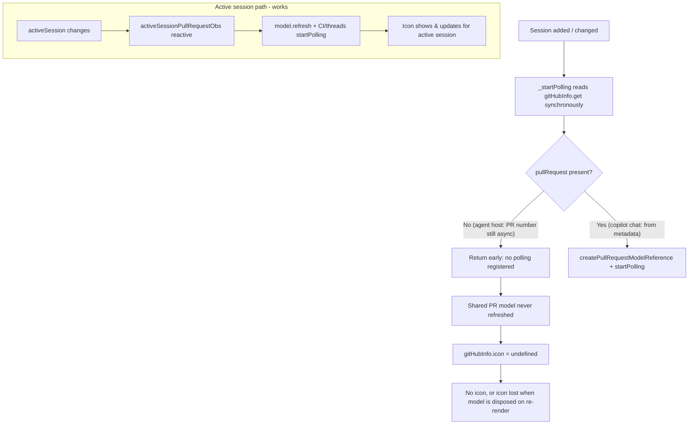

# PR Icon Determination & Polling in the Sessions Window

This document explains how the pull-request (PR) icon is determined for each session in
the Agents (Sessions) window, which sessions are kept up to date by polling, and why
non‑active sessions can lose their PR icon even while the PR is still open. It ends with
options for making more sessions poll.

## TL;DR

- The PR icon for a session is produced by that session's `gitHubInfo` observable. The
  icon is computed from a **live, shared PR model** (`GitHubPullRequestModel`) — not from
  static metadata (for the agent‑host provider).
- A live PR model only contains data after someone calls `refresh()` / `startPolling()`
  on it.
- In practice **only the active session** reliably refreshes/polls its PR model. The code
  that is *supposed* to poll every non‑archived session
  ([`GitHubPullRequestPollingContribution._startPolling`](browser/github.contribution.ts#L112))
  reads `gitHubInfo` **synchronously**, but the agent‑host provider resolves the PR number
  **asynchronously**, so the snapshot has no PR yet and polling is skipped.
- Result: non‑active agent‑host sessions never start polling, their shared PR model is
  never refreshed (and can be disposed + recreated empty on list re‑renders), so the icon
  is missing or disappears.

## Status: resolved

Both halves of the fix are now implemented:

1. **Provider‑agnostic per‑session polling (Approach 1 below).**
   [`GitHubPullRequestPollingContribution`](browser/github.contribution.ts) tracks **every**
   non‑archived session with a reactive per‑session poller (`_createSessionPoller`, kept in
   a `DisposableMap`). The poller reads `gitHubInfo` **reactively**, so it fires once the
   async PR number resolves, acquires a shared PR‑model reference and holds it for the
   session's lifetime — keeping the live model warm (and the icon stable) even for
   non‑active sessions. Merged PRs stop the repeating loop unless the session is active.

2. **Sticky PR‑number resolution in the agent‑host provider.**
   [`SessionGitHubInfoResolver`](../providers/agentHost/browser/sessionGitHubInfo.ts) — the
   class that owns the whole coords → PR number → icon chain for an agent‑host session —
   caches the promise‑backed PR‑number observable per `owner/repo@branch`. Previously a
   **fresh** `observableFromPromise(...)` was created on every `gitHubInfo` recompute (or
   unobserve→reobserve during a session switch / list re‑render); because
   `observableFromPromise` starts unresolved, the PR number — and therefore
   `gitHubInfo.pullRequest` — flapped back to `undefined`, which made the poller's identity
   go `undefined`, **released the shared model reference, disposed the model, and blanked
   the icon**. Reusing the cached observable keeps a resolved PR number sticky, so the
   poller's identity stays stable and the model is never torn down. ("No PR yet" lookups are
   evicted so a PR created later is still picked up.)

The remainder of this document describes the original analysis and the alternatives that
were considered.

## Where the icon is shown

The same `gitHubInfo.pullRequest.icon` value feeds two surfaces:

- The sessions list rows — [sessionsList.ts](../sessions/browser/views/sessionsList.ts#L349)
  reads `gitHubInfo` and passes `gitHubInfo?.pullRequest?.icon` to the status‑icon widget.
- The session header in the session view —
  [sessionHeader.ts](../../browser/parts/sessionHeader.ts#L336) reads the same icon.

Both read the icon **reactively** (via `.read(reader)` inside an `autorun`), so whatever
the `gitHubInfo` observable produces is rendered immediately.

## How the icon value is produced per provider

Each session exposes `gitHubInfo: IObservable<IGitHubInfo | undefined>`, and the icon lives
at `gitHubInfo.pullRequest.icon`. The icon glyph/color is computed by
[`computePullRequestIcon`](common/types.ts#L119) from the PR state
(`open` / `closed` / `merged` / `draft`) and, for open PRs, optional refinements
(failing CI checks, unresolved review threads).

### Agent‑host provider (the reported case)

In [sessionGitHubInfo.ts](../providers/agentHost/browser/sessionGitHubInfo.ts) the
`SessionGitHubInfoResolver` builds `gitHubInfo` as a fully derived chain:

1. `_coords` derives `{ owner, repo, branch }` from the session's git state.
2. `_pullRequestNumber` resolves the PR **number asynchronously** via
   `observableFromPromise(gitHubService.findPullRequestNumberByHeadBranch(...))`, kept
   sticky per `owner/repo@branch`.
3. The `gitHubInfo` derived then acquires a **shared live PR model reference** and reads
   its `pullRequest` observable to compute the icon (`_computePullRequestIcon`):

   ```ts
   const ref = reader.store.add(gitHubService.createPullRequestModelReference(owner, repo, prNumber));
   const livePR = ref.object.pullRequest.read(reader);
   if (livePR) {
       // also reads CI + review-thread models for open PRs to refine the icon
       icon = computePullRequestIcon(livePR.isDraft ? 'draft' : livePR.state, { hasFailingChecks, hasUnresolvedComments });
   }
   ```

Key consequence: **if `livePR` is `undefined` (model never refreshed), `icon` is
`undefined`.** There is no static fallback icon for agent‑host sessions — the icon depends
entirely on a refreshed live model.

### Copilot Chat sessions provider (for comparison)

In [copilotChatSessionsProvider.ts](../providers/copilotChatSessions/browser/copilotChatSessionsProvider.ts#L1006)
`gitHubInfo` derives from `_baseGitHubInfo`, which is extracted **synchronously** from
session metadata in
[`_extractGitHubInfo`](../providers/copilotChatSessions/browser/copilotChatSessionsProvider.ts#L1113).
That metadata already includes the PR number and a **baseline icon** from
`metadata.pullRequestState`
([`_extractPullRequestStateIcon`](../providers/copilotChatSessions/browser/copilotChatSessionsProvider.ts#L1203)).
The live model only **enriches** the icon when available.

This difference matters:

| Provider | PR number availability | Baseline icon without live model | Effect on `_startPolling` |
| --- | --- | --- | --- |
| Copilot Chat | Synchronous (from metadata) | Yes (`metadata.pullRequestState`) | Works — snapshot already has a PR |
| Agent host | Asynchronous (REST lookup) | No | Skipped — snapshot has no PR yet |

## The live PR model and its lifetime

[`GitHubPullRequestModel`](browser/models/githubPullRequestModel.ts) wraps the GitHub API
in observables (`pullRequest`, `reviews`, `mergeability`). It does nothing until told to:

- [`refresh()`](browser/models/githubPullRequestModel.ts#L73) fetches once.
- [`startPolling()`](browser/models/githubPullRequestModel.ts#L94) refreshes immediately and
  then re‑fetches every `DEFAULT_POLL_INTERVAL_MS` (60s) until the returned disposable is
  disposed.

Models are **shared and reference‑counted** through a `ReferenceCollection` keyed by
`owner/repo/prNumber`
([`createPullRequestModelReference`](browser/githubService.ts#L178)). When the **last**
reference is released the model is **disposed**, dropping its fetched `pullRequest` value.
Acquiring the key again creates a **fresh, empty** model.

Because the icon‑computing `gitHubInfo` derived only holds its reference while it is being
observed (`reader.store.add(...)`), a non‑active session's model can be disposed and
recreated during normal list re‑renders (row recycling on tree splices) — and the recreated
model is empty until something refreshes it.

## Which sessions poll — and which don't

There are exactly two code paths that refresh/poll PR models, both in
[github.contribution.ts](browser/github.contribution.ts):

### 1. Active‑session autoruns (works)

Three autoruns watch the **active** session only and drive its PR / CI / review‑thread
models:

- PR model: `refresh()` once when it resolves
  ([here](browser/github.contribution.ts#L41)).
- CI model: `refresh()` + `startPolling()`
  ([here](browser/github.contribution.ts#L52)).
- Review threads: `refresh()` + `startPolling()`
  ([here](browser/github.contribution.ts#L67)).

These read `activeSessionPullRequestObs` (and friends), which are derived from
`sessionsService.activeSession` and read `gitHubInfo` **reactively**
([githubService.ts](browser/githubService.ts#L120)). Because they are reactive, they
correctly wait for the agent‑host provider's asynchronous PR‑number resolution. This is
why the **active** session shows and updates its icon.

> Note: even for the active session, the *base* PR model is only `refresh()`‑ed (not
> continuously polled). Continuous PR‑model polling is meant to come from path #2.

### 2. Per‑session polling (broken for agent host)

[`_startPolling`](browser/github.contribution.ts#L112) is invoked for every non‑archived
session from `onDidChangeSessions` and is intended to keep **all** sessions' PR models
warm. But it takes a **synchronous snapshot**:

```ts
const gitHubInfo = session.workspace.get()?.folders[0]?.gitRepository?.gitHubInfo.get();
if (!gitHubInfo || !gitHubInfo.pullRequest) {
    return; // <-- agent-host sessions bail out here
}
```

For agent‑host sessions, at the moment the session is added/changed the asynchronous
`findPullRequestNumberByHeadBranch` has not resolved, so `gitHubInfo.get()` returns
`{ owner, repo }` **without** `pullRequest`, and the method returns early. Crucially:

- There is **no per‑session reactive subscription** that re‑runs `_startPolling` once the
  PR number later resolves.
- `.get()` is a one‑shot, non‑reactive read; re‑invoking it on a later `changed` event
  usually still returns no PR (the derived recreates a fresh, unresolved
  `observableFromPromise` when not actively observed/cached).

So agent‑host sessions are never added to the `_pullRequests` polling map, and their
shared PR models are never refreshed by this path.

The existing unit tests don't catch this because the test double builds `gitHubInfo`
**synchronously** with a PR already present (`makeGitHubInfo(1)` in
[githubContribution.test.ts](test/browser/githubContribution.test.ts#L101)), which doesn't
reproduce the agent‑host async resolution.

## Why icons appear then disappear on non‑active sessions

Putting it together for an agent‑host session:

1. **Never activated** → its PR model is never refreshed → `livePR` is `undefined` →
   `icon` is `undefined` → no icon ever.
2. **Previously active** → while active, path #1 refreshed the shared model, so the icon
   appeared. After switching away, nothing refreshes it. The icon persists only while the
   shared model stays alive. On the next list re‑render where the non‑active session's
   `gitHubInfo` reference is momentarily the only one and gets released, the model is
   disposed and recreated empty → the icon disappears ("loses its PR icon again") even
   though the PR is still open.



## What we'd have to do to get more sessions to poll

The goal: every non‑archived session **with a resolved PR number** should keep its shared
PR model warm — not just the active one — while avoiding wasted polling on PRs that can no
longer change.

### Shared rule: when should a session poll?

Both approaches below use the same gating predicate:

```
shouldPoll(session) =
       hasResolvedPrNumber
    && !isArchived
    && (prState !== Merged || isActiveSession)
```

Notes that apply to either approach:

- **Always fetch once first.** Even a merged PR needs a single `refresh()` so we can render
  the correct (purple "merged") icon. Only the *repeating* 60s loop is gated off afterwards.
- **Merged is terminal.** A merged PR can never change again, so non‑active merged sessions
  stop polling. (A *closed* — not merged — PR can be reopened, so by default it keeps
  polling; this is cheap thanks to ETags and can be made terminal too if desired.)
- **Active is the exception.** If a merged session becomes active, the predicate flips back
  to `true` and polling resumes; when it's deactivated it stops again. Because the rule is
  evaluated reactively, these transitions happen automatically.

### Approach 1 — Reactive per‑session pollers in the contribution (provider‑agnostic)

Evolve [`GitHubPullRequestPollingContribution`](browser/github.contribution.ts#L19):
replace the broken synchronous [`_startPolling`](browser/github.contribution.ts#L112) with a
per‑session **`autorun`** (kept in a `DisposableMap` keyed by `sessionId`, created/removed
from `onDidChangeSessions`). The autorun reads `gitHubInfo` **reactively**, so it fires once
the async PR number resolves; a nested child autorun reads the live PR `state` + active flag
and toggles polling per the shared rule (so a poll tick never re‑triggers the initial
`refresh()`):

```ts
private _trackSession(session: ISession): IDisposable {
    return autorun(reader => {
        const gitHubInfo = session.workspace.read(reader)?.folders[0]?.gitRepository?.gitHubInfo.read(reader);
        const pr = gitHubInfo?.pullRequest;
        if (!pr) {
            return; // re‑runs automatically once the async PR number resolves
        }
        const ref = reader.store.add(this._gitHubService.createPullRequestModelReference(gitHubInfo.owner, gitHubInfo.repo, pr.number));
        ref.object.refresh(); // one fetch so we learn the state / render the icon

        // Gate the repeating loop on live state, in a child autorun so poll ticks
        // (which update `pullRequest`) don't re‑run the refresh above.
        reader.store.add(autorun(r => {
            const details = ref.object.pullRequest.read(r);
            const isActive = this._isActiveSession(session, r);
            if (details?.state === GitHubPullRequestState.Merged && !isActive) {
                return; // merged + not active → no repeating poll (icon already computed)
            }
            r.store.add(ref.object.startPolling());
            if (details && !details.isDraft && details.state === GitHubPullRequestState.Open) {
                // existing CI + review‑thread polling
            }
        }));
    });
}
```

- **Pros:** smallest change; reuses `GitHubPullRequestModel.startPolling()` and the shared
  `ReferenceCollection` (multiple sessions on one PR ⇒ one network loop). **Provider‑agnostic**
  — it only relies on the common `ISession.gitHubInfo`, so agent host, Copilot Chat, and any
  future provider are covered by one implementation. Central place to enforce global policy
  (rate limits, archived handling, the active‑session exception).
- **Cons:** the contribution re‑derives coords the provider already computed; one 60s timer
  per distinct non‑merged PR (bounded by the merged gate); a little more autorun bookkeeping.
- **Touches:** [github.contribution.ts](browser/github.contribution.ts) plus
  [githubContribution.test.ts](test/browser/githubContribution.test.ts#L101) (the test double
  must build `gitHubInfo` **asynchronously** and expose `pullRequest.state` so the
  async‑resolution + merged‑gating paths are actually exercised).

### Approach 2 — Provider‑owned polling on the agent‑host session

Make the thing that already resolves the PR number and computes the icon — the agent‑host
`AgentSession` in
[baseAgentHostSessionsProvider.ts](../providers/agentHost/browser/baseAgentHostSessionsProvider.ts#L351)
— also keep it fresh. Add a dedicated polling controller `autorun` in the constructor,
registered to the session's own `this._store` (kept **separate** from the side‑effect‑free
`gitHubInfo` derived). It reuses the session's existing `isActiveSessionObs` and `isArchived`:

```ts
// Registered to this._store in the AgentSession constructor.
this._register(autorun(reader => {
    if (this.isArchived.read(reader)) {
        return;
    }
    // Read the resolved coords + PR number (the same inputs `gitHubInfo` uses) rather than
    // the full `gitHubInfo`, to avoid a feedback loop with the icon recomputation.
    const coords = gitHubCoords.read(reader);
    const prNumber = pullRequestNumberObs.read(reader)?.read(reader)?.value;
    if (!coords || prNumber === undefined) {
        return; // re‑runs once findPullRequestNumberByHeadBranch resolves
    }
    const ref = reader.store.add(gitHubService.createPullRequestModelReference(coords.owner, coords.repo, prNumber));
    ref.object.refresh();

    reader.store.add(autorun(r => {
        const details = ref.object.pullRequest.read(r);
        const isActive = this.isActiveSessionObs.read(r);
        if (details?.state === GitHubPullRequestState.Merged && !isActive) {
            return; // merged + not active → no repeating poll
        }
        r.store.add(ref.object.startPolling());
        // CI + review‑thread polling for open, non‑draft PRs
    }));
}));
```

The contribution's per‑session `_startPolling` path is then retired for agent host (the
active‑session autoruns can stay or also be subsumed, since each session now self‑maintains).

- **Pros:** co‑located with PR‑number resolution and icon computation — the session both
  *shows* and *maintains* its PR. Lifetime is exactly the session object's lifetime (no
  tracker map, no `onDidChangeSessions` plumbing). The provider already depends on
  `IGitHubService` and the model reference, so coupling barely grows.
- **Cons:** **provider‑specific** — lives in `baseAgentHostSessionsProvider` (covers local +
  remote agent host) but any other provider wanting the same behaviour must repeat it, unless
  it's extracted into a shared helper (e.g. a small `PullRequestPollingController` a session
  class can instantiate). There's no central coordinator, so window‑wide throttling /
  back‑pressure across many sessions is harder. Slightly more side‑effecting logic in the
  session.
- **Touches:** [baseAgentHostSessionsProvider.ts](../providers/agentHost/browser/baseAgentHostSessionsProvider.ts#L351)
  (the `gitHubInfo` derived stays read‑only; add the controller), optionally a shared
  `pullRequestPollingController.ts`, plus agent‑host provider tests.

### Orthogonal optimizations (apply to either approach)

- **Central batched refresh.** Instead of N independent `RunOnceScheduler`s (one per PR
  model), run a single timer that refreshes the de‑duplicated set of pollable PR models each
  tick — optionally batching via the GitHub list/search API to cut request volume and make
  global rate‑limiting trivial.
- **Baseline icon for agent‑host sessions.** Independently of polling, give agent‑host
  sessions a static baseline icon (analogous to Copilot Chat's `metadata.pullRequestState`)
  so the icon doesn't blank out during the very first fetch or if a model is briefly disposed.
  This complements — but does not replace — either approach.

### Cross‑cutting considerations

- **Cost / rate limits:** polling every session every 60s multiplies GitHub API calls.
  Consider a longer interval for non‑active sessions, pausing when the window is hidden, or
  only polling visible rows. ETags already make unchanged fetches cheap
  ([`_refresh`](browser/models/githubPullRequestModel.ts#L120)).
- **De‑duplication:** sessions sharing a PR should not each open a poll loop; rely on the
  shared `ReferenceCollection` model + reference‑counted `startPolling()`.
- **Merged / terminal PRs:** a merged PR can't change again, so non‑active merged sessions
  must drop their repeating loop after the first fetch (the active session is exempt). Decide
  whether *closed* (non‑merged) PRs are treated the same way or kept polling (they can be
  reopened).
- **Archived sessions:** must not poll (current archive handling in
  [`_onDidChangeSessions`](browser/github.contribution.ts#L88) should be preserved).
- **Tests:** add regression tests where `gitHubInfo` starts without a PR and resolves it
  asynchronously (asserting polling starts once it resolves) and where a non‑active PR
  transitions to `Merged` (asserting the repeating loop stops, but resumes if the session
  becomes active) — the current test double cannot reproduce either path.

## Key files

- [github.contribution.ts](browser/github.contribution.ts) — active‑session autoruns and
  per‑session `_startPolling` (the broken path).
- [githubService.ts](browser/githubService.ts) — `activeSessionPullRequestObs`,
  `createPullRequestModelReference`, `findPullRequestNumberByHeadBranch`.
- [models/githubPullRequestModel.ts](browser/models/githubPullRequestModel.ts) — the live
  model, `refresh()` / `startPolling()`, shared reference collection.
- [providers/agentHost/browser/sessionGitHubInfo.ts](../providers/agentHost/browser/sessionGitHubInfo.ts)
  — `SessionGitHubInfoResolver`: agent‑host `gitHubInfo` (sticky async PR number, live‑model
  icon refined by CI + review threads).
- [providers/copilotChatSessions/browser/copilotChatSessionsProvider.ts](../providers/copilotChatSessions/browser/copilotChatSessionsProvider.ts#L1006)
  — Copilot Chat `gitHubInfo` (sync metadata + baseline icon).
- [common/types.ts](common/types.ts#L119) — `computePullRequestIcon`.
- [sessionsList.ts](../sessions/browser/views/sessionsList.ts#L349) and
  [sessionHeader.ts](../../browser/parts/sessionHeader.ts#L336) — icon consumers.
