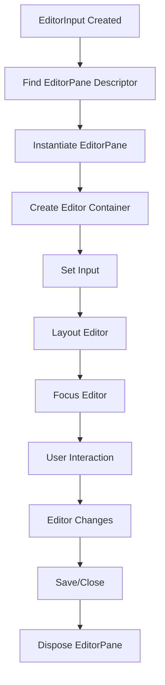

# VS Code Editor System Architecture

## Overview

The VS Code editor system is a sophisticated, layered architecture that manages the display and interaction of different types of editors within the workbench. It provides a flexible framework for handling various editor types, from simple text editors to complex webview-based editors, while maintaining a consistent user experience.

## Core Architecture Components

### 1. Editor Input System

**EditorInput** is the fundamental abstraction that represents what can be opened in an editor. It's a lightweight object that contains metadata about the content to be displayed.

#### Key Characteristics:
- **Type Identification**: Each `EditorInput` has a unique `typeId` that identifies its type
- **Resource Management**: Contains a `resource` URI that uniquely identifies the content
- **Capabilities**: Defines what the editor can do (readonly, untitled, singleton, etc.)
- **Lifecycle Events**: Emits events for dirty state changes, label changes, and capability changes

#### Common EditorInput Types:
- **TextResourceEditorInput**: For text files
- **WebviewInput**: For webview-based editors
- **SideBySideEditorInput**: For side-by-side comparisons
- **DiffEditorInput**: For diff views

### 2. Editor Pane System

**EditorPane** is the visual container that displays the actual editor content. It's the bridge between the editor input and the underlying editor widget.

#### Lifecycle:
1. **createEditor()**: Initial creation
2. **setEditorVisible()**: Show/hide the editor
3. **layout()**: Handle size changes
4. **setInput()**: Set the editor input
5. **focus()**: Handle focus events
6. **dispose()**: Cleanup when closed

#### Key Interfaces:
- **IEditorPane**: Base interface for all editor panes
- **ITextEditorPane**: For text-based editors
- **ITextDiffEditorPane**: For diff editors

### 3. Editor Groups and Parts

The editor system is organized hierarchically:

#### EditorParts
- **Main Editor Part**: The primary editor area
- **Auxiliary Editor Parts**: Additional editor windows
- **Multi-window Support**: Handles multiple editor windows

#### Editor Groups
- **IEditorGroup**: Represents a group of editors (tabs)
- **IEditorGroupsView**: Manages multiple groups
- **Group Operations**: Add, remove, move, merge groups

### 4. Editor Registry System

The registry system allows for dynamic registration and resolution of editor types:

#### Editor Extensions:
```typescript
export const EditorExtensions = {
    EditorPane: 'workbench.contributions.editors',
    EditorFactory: 'workbench.contributions.editor.inputFactories'
};
```

#### Registration Process:
1. **Editor Descriptors**: Register editor pane types
2. **Editor Factories**: Register input creation logic
3. **Editor Serializers**: Handle serialization/deserialization

## Data Flow

### Opening an Editor

1. **Input Creation**: An `EditorInput` is created with the content to display
2. **Editor Resolution**: The system finds the appropriate `EditorPane` for the input
3. **Pane Creation**: The `EditorPane` is instantiated and configured
4. **Input Setting**: The input is set on the pane
5. **Display**: The pane is made visible and focused

### Editor Lifecycle



## Key Services

### IEditorService
- **Primary Interface**: For opening, closing, and managing editors
- **Editor Discovery**: Finds existing editors
- **Editor Operations**: Move, copy, close editors

### IEditorGroupsService
- **Group Management**: Create, remove, arrange editor groups
- **Active Group**: Track which group is currently active
- **Group Events**: Listen to group changes

### IEditorResolverService
- **Editor Resolution**: Maps untyped inputs to typed editors
- **Editor Matching**: Determines which editor to use for content

## Editor Types

### 1. Text Editors
- **Base**: `TextEditorPane`
- **Input**: `TextResourceEditorInput`
- **Features**: Syntax highlighting, IntelliSense, debugging

### 2. Webview Editors
- **Base**: `WebviewEditor`
- **Input**: `WebviewInput`
- **Features**: HTML/CSS/JS content, extension communication

### 3. Side-by-Side Editors
- **Base**: `SideBySideEditor`
- **Input**: `SideBySideEditorInput`
- **Features**: Compare two editors side by side

### 4. Diff Editors
- **Base**: `DiffEditorPane`
- **Input**: `DiffEditorInput`
- **Features**: Show differences between files

## Configuration and Options

### Editor Part Options
- **Tab Management**: Show/hide tabs, tab sizing, positioning
- **Layout**: Split direction, sizing behavior
- **Behavior**: Preview mode, focus behavior, close behavior

### Editor Options
- **View State**: Cursor position, selection, scroll position
- **Language**: Syntax highlighting, language features
- **Display**: Font, theme, decorations

## Event System

### Key Events:
- **onDidChangeDirty**: Editor content has unsaved changes
- **onDidChangeLabel**: Editor title has changed
- **onDidChangeCapabilities**: Editor capabilities have changed
- **onDidFocus**: Editor has received focus
- **onDidChangeSelection**: Editor selection has changed

## Best Practices

### Creating Custom Editors

1. **Extend EditorInput**: Create a custom input class
2. **Implement EditorPane**: Create the visual component
3. **Register Descriptor**: Register with the editor registry
4. **Handle Lifecycle**: Implement proper creation/disposal

### Performance Considerations

1. **Lazy Loading**: Only create editor panes when needed
2. **Resource Management**: Properly dispose of resources
3. **View State**: Save/restore editor state efficiently
4. **Memory Management**: Avoid memory leaks in long-running sessions

## Extension Points

### For Extension Developers

1. **Custom Editor Inputs**: Create specialized input types
2. **Custom Editor Panes**: Implement custom visual components
3. **Editor Contributions**: Add features to existing editors
4. **Editor Actions**: Add commands and context menu items

### Registration Example:
```typescript
// Register editor pane
Registry.as<IEditorPaneRegistry>(EditorExtensions.EditorPane)
    .registerEditorPane(descriptor);

// Register editor factory
Registry.as<IEditorFactoryRegistry>(EditorExtensions.EditorFactory)
    .registerFileEditorFactory(factory);
```

## Troubleshooting

### Common Issues:
1. **Editor Not Opening**: Check input type and pane registration
2. **Memory Leaks**: Ensure proper disposal of event listeners and resources
3. **Layout Issues**: Verify dimension handling in layout methods
4. **Focus Problems**: Check focus handling in editor panes

### Debugging Tips:
1. **Use Developer Tools**: Inspect DOM and event flow
2. **Check Registry**: Verify editor registrations
3. **Monitor Events**: Listen to editor lifecycle events
4. **Test Edge Cases**: Handle various input types and states

## Conclusion

The VS Code editor system provides a robust, extensible framework for managing different types of editors. Its layered architecture allows for flexibility while maintaining consistency. Understanding these components and their interactions is crucial for developing custom editors and extending the VS Code experience.
