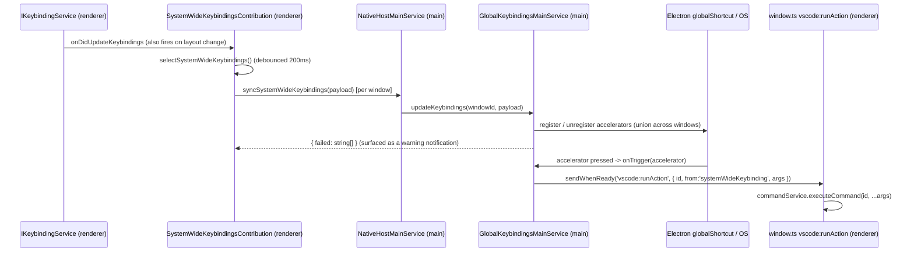

# System-wide (OS global) keybindings

This document is the canonical spec for the **system-wide keybindings** feature: user
`keybindings.json` entries that fire even when VS Code is not the focused application, backed by
Electron's [`globalShortcut`](https://www.electronjs.org/docs/latest/api/accelerator) module.

History: introduced in PR microsoft/vscode#323871; the first-run notice dialog was later removed in
PR microsoft/vscode#324045 (it could appear in multiple windows at once, and the single-window
election meant to prevent that was racy). The feature is **desktop only** and **always on**.

## User-facing contract

A user adds `"systemWide": true` to a keybinding entry in **`keybindings.json`**:

```jsonc
{
  "key": "ctrl+cmd+a",
  "command": "workbench.action.openAgentsWindow",
  "systemWide": true
}
```

While VS Code is running (even unfocused), pressing that combination runs the command. Rules:

- **User keybindings only.** Default and extension-contributed keybindings can never be
  system-wide — this prevents extensions from silently grabbing OS-global shortcuts.
- **Single key combinations only.** Chords (`ctrl+k ctrl+c`) and single-modifier bindings cannot be
  expressed as an Electron accelerator; they are skipped with a `warn` log.
- **`when` clauses are ignored** for the global trigger — an OS-global shortcut has no editor/UI
  context, so it is always active while VS Code runs. The user is warned once per binding label.
- **First binding wins** on accelerator conflicts (deduped both in the renderer selection and in the
  main-process per-window payload).
- **Desktop only.** The flag is inert on web/server (there is no `globalShortcut` there, and the
  contribution is `electron-browser`).
- **Always on.** There is no setting to enable/disable it and no first-run dialog.

The `systemWide` boolean is declared in the `keybindings.json` JSON schema in
`src/vs/workbench/services/keybinding/browser/keybindingService.ts`.

## Architecture at a glance

The feature spans the renderer (electron-browser) and the Electron main process, connected by the
existing native-host IPC channel.



### Renderer

**`src/vs/workbench/contrib/keybindings/electron-browser/systemWideKeybindings.contribution.ts`** —
the heart of the renderer side. Registered as a workbench contribution at
`WorkbenchPhase.AfterRestored` (never blocks startup).

- `selectSystemWideKeybindings(items)` — a **pure** function that filters the full set of resolved
  keybindings down to eligible candidates. Eligibility: `item.systemWide && !item.isDefault &&
  item.command && item.resolvedKeybinding && getElectronAccelerator() !== null` and the accelerator
  has not already been claimed. Returns `{ candidates, unsupported, duplicates }` so the caller can
  log why entries were dropped. Kept pure and separately unit-tested.
- `SystemWideKeybindingsContribution` — subscribes to `IKeybindingService.onDidUpdateKeybindings`
  (which also fires on keyboard-layout changes, since accelerator strings depend on layout),
  debounces via a 200ms `RunOnceScheduler`, and on each `sync()`:
  1. collects candidates (logging unsupported/duplicate entries),
  2. warns once per label about ignored `when` clauses (`warnedWhenLabels` guard),
  3. pushes the payload to the main process via `INativeHostService.syncSystemWideKeybindings`,
  4. reports registration failures via `INotificationService`, deduped against the last reported set
     (`lastReportedFailures`) so unchanged failures are not re-notified.

**`src/vs/workbench/electron-browser/window.ts`** — handles the `vscode:runAction` IPC in the
renderer. For `request.from === 'systemWideKeybinding'` it runs the command with **exactly** the
args configured in `keybindings.json` — unlike the `menu`/`mouse` senders it does **not** append a
`{ from }` sentinel, so a command taking positional args receives the same payload it would from a
normal in-window keybinding. Emits the standard `workbenchActionExecuted` telemetry.

### IPC contract

**`src/vs/platform/native/common/native.ts`**

- `INativeSystemWideKeybinding` — `{ accelerator, commandId, args?, userSettingsLabel? }`. The
  `accelerator` is in Electron accelerator format (e.g. `Control+Cmd+A`).
- `INativeSystemWideKeybindingResult` — `{ failed: string[] }`. `failed` lists user-settings labels
  (or accelerators) that could not be registered.
- `ICommonNativeHostService.syncSystemWideKeybindings(keybindings)` — the method exposed to the
  renderer.

**`src/vs/platform/window/common/window.ts`** — `INativeRunActionInWindowRequest.from` includes
`'systemWideKeybinding'` in its union.

### Main process

**`src/vs/platform/native/electron-main/nativeHostMainService.ts`** — `syncSystemWideKeybindings`
delegates to `IGlobalKeybindingsMainService.updateKeybindings(windowId, ...)`. If there is no
`windowId` it returns `{ failed: [] }`.

**`src/vs/platform/globalKeybindings/electron-main/globalKeybindingsMainService.ts`** — owns the OS
registrations. Wired up in `src/vs/code/electron-main/app.ts` with the real Electron global:
`services.set(IGlobalKeybindingsMainService, new SyncDescriptor(GlobalKeybindingsMainService, [globalShortcut]))`.

- `IGlobalShortcutRegistry` — the tiny `register/unregister/isRegistered` subset of Electron's
  `globalShortcut`, injected as a constructor arg (not imported directly) so tests can supply a fake.
- State:
  - `registry: Map<windowId, Map<accelerator, binding>>` — each window's desired bindings.
  - `registeredAccelerators: Set<string>` — accelerators this service currently owns an OS
    registration for.
  - `failedAccelerators: Set<string>` — desired accelerators that failed to register (e.g. already
    taken); retried on the next reconcile.
- `updateKeybindings(windowId, keybindings)` — validates + dedups the payload for that window,
  replaces (or clears) the window's entry, calls `reconcile()`, and returns the `failed` labels for
  that window.
- `reconcile()` — computes the union of desired accelerators across **all** windows. Unregisters
  only accelerators this service owns that are no longer desired (never touches shortcuts owned
  elsewhere), then registers newly desired ones (retrying previously failed). Each accelerator is
  registered **once** with a stable callback `() => this.onTrigger(accelerator)` that reads the
  **current** registry at fire time, so command/args are never captured from a stale snapshot.
- `onTrigger(accelerator)` — resolves the target window: the focused window if it owns the
  accelerator, otherwise the deterministic winner (lowest window id) among alive owners. Sends
  `vscode:runAction` via `target.sendWhenReady(...)`. It deliberately does **not** force-focus the
  routing window — a system-wide keybinding fires while VS Code is typically unfocused, and pulling
  the routing window forward would flicker when the command opens/reveals a *different* window
  (e.g. `workbench.action.openAgentsWindow`). This matches every other `vscode:runAction` sender.
- Lifecycle: on `IWindowsMainService.onDidDestroyWindow` it drops the window's entry and reconciles;
  on `ILifecycleMainService.onWillShutdown` and on dispose it unregisters everything.

### How the `systemWide` flag is plumbed

The boolean travels from `keybindings.json` to `ResolvedKeybindingItem`:

- `src/vs/workbench/services/keybinding/common/keybindingIO.ts` — parses `systemWide` from each
  entry (`IUserKeybindingItem`) and writes it back out on serialization.
- `src/vs/platform/keybinding/common/keybinding.ts` — `IUserKeybindingItem.systemWide?: boolean`.
- `src/vs/platform/keybinding/common/resolvedKeybindingItem.ts` — `ResolvedKeybindingItem.systemWide`
  (defaults `false`; only ever `true` for user keybindings).
- `src/vs/workbench/services/keybinding/browser/keybindingService.ts` — threads `item.systemWide`
  into every `ResolvedKeybindingItem` it builds, and declares the schema property.

## Design decisions and rationale

1. **User-only, single-combo, `when`-ignored** — hard constraints of OS-global shortcuts; each is
   enforced and surfaced (log for unsupported/duplicate, notification for ignored `when`).
2. **Per-window registry + union registration** — multiple windows may each request the same or
   different system-wide bindings. The main service registers the union and routes a press to a
   single window (focused owner, else deterministic lowest id). It only ever unregisters
   accelerators it owns, so it never stomps global shortcuts registered by the OS or other apps.
3. **No force-focus on trigger** — avoids visible flicker and lets the invoked command decide what
   to surface/focus.
4. **Always-on, no dialog** — the feature is unconditionally active; the earlier one-time notice was
   removed because it leaked into multiple windows and its single-window election was racy. Users who
   opt a binding into `systemWide` are assumed to understand the implication.
5. **Deduped failure notifications** — `reportFailures` only notifies when the failed set changes, so
   a persistent conflict is reported once, not on every re-sync.
6. **Stable trigger callback reading live state** — registering once per accelerator (rather than
   re-registering on every payload change) avoids races and stale command/args capture.

## Testing

- `src/vs/platform/globalKeybindings/test/electron-main/globalKeybindingsMainService.test.ts` — the
  main service against a fake `IGlobalShortcutRegistry` and fake windows service: register/reconcile,
  dedup within a window, failed-registration reporting + retry, trigger routing (focused owner,
  deterministic lowest-id, no force-focus, undefined args), cross-window conflict resolution, window
  destroy unregistration, and shutdown unregister-all. Pure electron-main (node-safe, no DOM/CSS).
- `src/vs/workbench/contrib/keybindings/test/electron-browser/systemWideKeybindings.test.ts` — the
  pure `selectSystemWideKeybindings`: eligibility filtering, unsupported (chords/modifiers),
  duplicates.
- `keybindingIO.test.ts` / `keybindingEditing.test.ts` — round-trip of the `systemWide` flag through
  parse/serialize.

## Gotchas for future work

- Adding another `vscode:runAction` sender kind requires extending the `from` union in
  `INativeRunActionInWindowRequest` (`src/vs/platform/window/common/window.ts`) and handling it in
  `window.ts`.
- Accelerator strings are keyboard-layout dependent; the contribution re-syncs on
  `onDidUpdateKeybindings`, which also fires on layout changes.
- `globalShortcut.register` returns `false` (or throws) when an accelerator is already taken by the
  OS or another application; such accelerators land in `failedAccelerators`, are retried on the next
  reconcile, and are surfaced to the user as a warning.
- Keep `selectSystemWideKeybindings` pure — it is the primary unit-tested seam for renderer
  eligibility logic.
