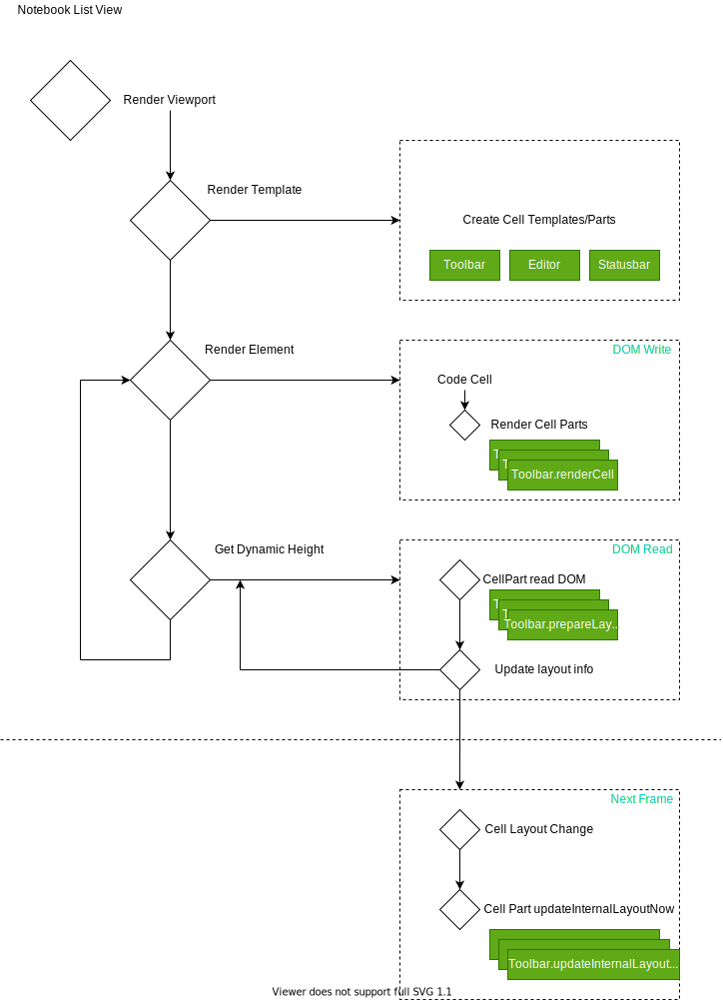

The notebook editor is a virtualized list view rendered in two contexts (mainframe and webview/iframe). It's on top of the builtin list/tree view renderer but its experience is different from traditional list views like File Explorer and Settings Editor. This doc covers the architecture of the notebook editor and layout optimizations we experimented with.

- [Architecture](#architecture)
	- [Notebook model resolution](#notebook-model-resolution)
	- [Viewport rendering](#viewport-rendering)
	- [Cell rendering](#cell-rendering)
	- [Focus Tracking](#focus-tracking)
- [Optimizations](#optimizations)
	- [Avoid flickering on resize of cells above current viewport](#avoid-flickering-on-resize-of-cells-above-current-viewport)
	- [Executing code cell followed by markdown cells](#executing-code-cell-followed-by-markdown-cells)
	- [Re-executing code cell followed by markdown cells](#re-executing-code-cell-followed-by-markdown-cells)
	- [Scrolling](#scrolling)


# Architecture

## Notebook model resolution

The notebook model resolution consists of two main parts

* Resolving the raw data (bytes) of the resource from file service. This part is backed by the `WorkingCopyService` and it will resolve the data and broadcast updates when the resource is updated on file system.
* Requesting the contributed notebook serializer to serialize/deserize the raw bytes for the resource. We will find the best matched notebook serializer (by user's editor type configuration and serializer's selector definition) and convert the raw bytes from/to `NotebookTextModel`.

`NotebookTextModel` is the only source of truth for the notebook document once the resource is opened in the workspace. The source text of each individual cell in the notebook is backed by a piece tree text buffer. When the notebook is opened in the editor group, we will request the `TextModelResolverService` for the monaco `TextModel` reference for each cell. The `TextModel` will use the piece tree text buffer from the cell as the backing store so whenever the `TextModel` gets updated, the cells in `NotebookTextModel` are always up to date.``

Since we are using the `TextModelResolverService` for cell's text model resolution, the `TextModel`s will have a mirror in the extension host, just like a normal resource opened in a text editor. Extensions can treat them as normal text documents.


## Viewport rendering

The viewport rendering of notebook list view is a "guess and validate" process. It will calcuate how many cells/rows it can render within the viewport first, have them all rendered, and then ask for their real dimensions, and based on the cell/row dimensions it will decide if it needs to render more cells (if there is still some room in the viewport) or remove a few.

For short, the process is more or less

* Render cell/row (DOM write)
* Read dimensions (DOM read)

The catch here is if we happen to perform any DOM read operation between DOM write while rendering a cell, it will trigger forced reflow and block the UI. To make it even worse, there are multiple components in a cell and often they are not aware of the existence of each other. When one component is updating its own DOM content, another component might be reading DOM dimensions at the same time. To prevent the unnecessary forced reflow from happening too often, we introduced the concept of `CellPart`. A `CellPart` is an abstract component in a cell and its lifecycle consists of four phases:

* Creation. `CellPart` is usually created on cell template
* Attach cell. When a cell is being rendered, we would attach the cell with all `CellPart`s by invoking `CellPart#renderCell`.
  * A subclass of `CellPart` should implement `CellPart#didRenderCell` to customize this phase
* Read DOM dimensions. All DOM read operation should be performed in this phase to prepare for the layout update. `CellPart#prepareLayout` will invoked.
* Update DOM positions. Once the list view finish reading DOM dimensions of all `CellPart`s, it will ask each `CellPart` to update its internal DOM nodes' positions, by invoking `CellPart#updateLayoutNow`.

When we introduce new UI elements to notebook cell, we would make it a `CellPart` and ensure that we batch the DOM read and write operations in the right phases.



<!--  -->

When the notebook document contains markdown cells or rich outputs, the workflow is a bit more complex and become asynchronous partially due to the fact the markdown and rich outputs are rendered in a separate webview/iframe. While the list view renders the cell/row, it will send requests to the webview for output rendering, the rendering result (like dimensions of the output elements) won't come back in current frame. Once we receive the output rendering results from the webview (say next frame), we would ask the list view to adjust the position/dimension of the cell and ones below.


## Cell rendering

The rendering of cells in the notebook editor consists of following steps:

* Update reused DOM nodes in the template and cell decorations
* Set up context for the cell and toolbars
* Update cell toolbar, run toolbar and insertion toolbar between cells
* Render cell
* Register listeners for:
  * Notebook layout change
  * Cell layout change
  * Cell state change: Folding, Collapse, Focus

## Focus Tracking

Due to the nature of virtualization (list view) and two layers architecture, the focus tracking is more complex compared to file explorer or monaco editor. When a notebook is *focused*, the `document.activeElement` can be

* Monaco editor, when users focus on a cell editor
  * `textarea` when users focus the text
  * Widgets
* Webview/iframe, when users focus on markdown cell or rich outputs rendered rendered in iframe
* List view container, when users focus on cell container
* Focusable element inside the notebook editor
  * Builtin output (e.g., text output)
  * Find Widget
  * Cell statusbar
  * Toolbars

The catch here is if the focus is on a monaco editor, instead of the list view container, when the cell is moved out of view, the list view removes the cell row from the DOM tree. The `document.activeElement` will fall back `document.body` when that happens. To ensure that the notebook editor doesn't blur, we need to move focus back to list view container when the focused cell is moved out of view. More importantly, focus the cell editor again when the cell is visible again (if the cell is still the *active* cell).

Copy in Notebook depends on the focus tracking

* Send `document.executeCommand('copy')` if users select text in output rendered in main frame by builtin renderer
* Request webview copy if the focus is inside the webview
* Copy cells if the focus is on notebook cell list
* Copy text if the focus is in cell editor (monaco editor)


# Optimizations

Since most elements' positions are absolute and there is latency between the two frames, we have multiple optimizations to ensure smooth (we try our best) perceived user experience. The optimizations are mostly around:

* Ensure the elements in current viewport are stable when other elements' dimensions update
* Fewer layout messages between the main and iframe
* Less flickering and forced reflow on scrolling

While we continue optimizing the layout code, we need to make sure that the new optimization won't lead to regression in above three aspects. Here is a list of existing optimziations we already have and we want to make sure they still perform well when updating layout code.

## Avoid flickering on resize of cells above current viewport

We always ensure that elements in current viewport are stable (their visual positions don't change) when cells above current viewport resize. Resizing a cell above viewport will then include following steps as shown in below diagram


1. User scrolls to the middle of the document, with one markdown cell partially visible (blue box in the green container) and one code cell fully visible (blue box in the white container)
2. The code cell above current viewport grows by 50px. The list view will then push down every cell below it. Thus the code cell in the viewport will move down by 50px. In current tick/frame, the markdown preview elements in the webview are not updated yet thus it's still partially visible.
3. To ensure the code cell's position is stable, we would scroll the whole list view downwards by 50px. The code cell's position is now fixed but at the same time, the webview also moves up by 50px (as it's a child of the list view scrollable element).
4. Lastly we sent requests to the webview to fix the visual positions of markdown previews

After the last step, both the code and markdown cells in the viewport stays where they were. However due to the fact that code cells and markdown cells are rendered in two different contexts (UI and iframe), there is always latency between step 3 and 4 so users will notice  annoying flickering of markdown cells easily.

The fix is kind of "tricky". Instead of adjusting the position of the partially markdown cells, we can actually make it visually stable by adjusting the position of the webview element (step 4). That would mess up the positions of markdown cells above current viewport, but we can fix them in next frame/tick (step 5) and since they are never in the viewport, users won't notice their position flicker/shift.

## Executing code cell followed by markdown cells

Code cell outputs and markdown cells are both rendered in the underlying webview. When executing a code cell, the list view will

1. Request cell output rendering in webview
2. Cell output height change
	1. in the webview, we set `maxHeight: 0; overflow: hidden` on the output DOM node, then it won't overlap with the following markdown cells
	2. broadcast the height change to the list view in main frame
3. List view received the height update request
	1. Send acknowledge of the output height change to webview
	2. Push down code cells below
	3. Webview remove `maxHeight: 0` on the output DOM node

Whether users would see flickering or overlap of outputs, monaco editor and markdown cells depends on the latency between 3.2 and 3.3.


## Re-executing code cell followed by markdown cells

Re-executing code cell consists of two steps:

1. Remove old outputs, which will reset the output height to 0
2. Render new outputs, which will push elements below downwards

The latency between 1 and 2 will cause the UI to flicker (as cells below this code cell will move upwards then downwards in a short period of time. However a lot of the time, we just tweak the code a bit and the outputs will have the same shape and very likely same rendered height, seeing the movement of cells below it is not pleasant.

For example say we have code

```py
print(1)
```

it will generate text output `1`. Updating the code to

```py
print(2)
```

will genrate text output `2`. The re-rendering of the output is fast and we want to ensure the UI is stable in this scenario, to achieve this:

1. Clear existing output `1`
	1. Remove the output DOM node, but we reserve the height of the output
	2. In 200ms, we will reset the output height to `0`, unless there is a new output rendered
2. Received new output
	1. Re-render the new output
	2. Calcuate the height of the new output, update layout


If the new output is rendered within 200ms, users won't see the UI movement.

## Scrolling

Code cell outputs and markdown cells are rendered in the webview, which are async in nature. In order to have the cell outputs and markdown previews rendered when users scroll to them, we send rendering requests of cells in the next and previous viewport when it's idle. Thus scrolling is smoother.

We also warm up all rendered markdown in the document, from top to bottom, when the browser is idle. We don't warm up outputs like this, since they can be more expensive to render than markdown. But outputs do get rendered when the user starts a search in outputs.
