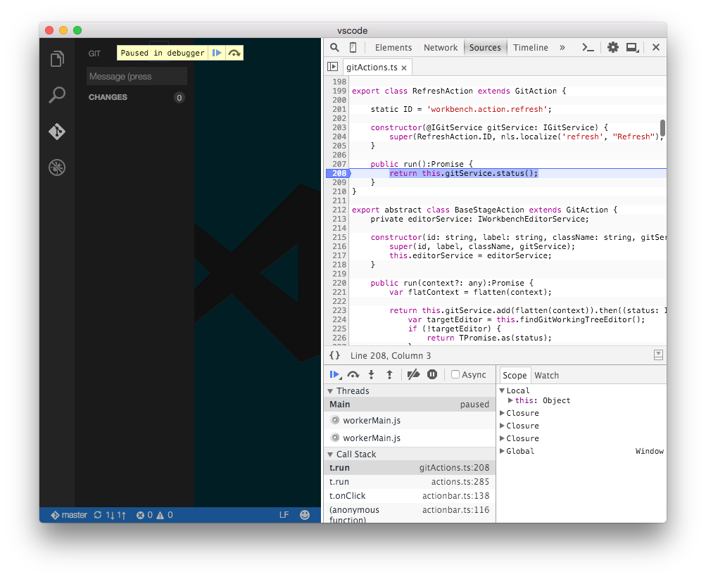

# Contributing to Code

There are many ways to contribute to the Code project: logging bugs, submitting pull requests, reporting issues, and creating suggestions.

After cloning and building the repo, check out the [issues list](https://github.com/Microsoft/vscode/issues?utf8=%E2%9C%93&q=is%3Aopen+is%3Aissue). Issues labeled [`effort easy`](https://github.com/Microsoft/vscode/issues?q=is%3Aopen+is%3Aissue+label%3A%22effort+easy%22) are good candidates to pick up if you are in the code for the first time.

## Build and Run From Source

If you want to understand how Code works or want to debug an issue, you'll want to get the source, build it, and run the tool locally.

### Installing Prerequisites

You'll need [Node.JS](https://nodejs.org/en/), at least `v4`.

We suggest to use `npm@2`, you can install it with `npm install -g npm@2`.

Code includes node module dependencies that require native compilation. To ensure the compilation is picking up the right version of header files from the Electron Shell, we have our own script to run the installation via `npm`.

For native compilation, you will need [Python](https://www.python.org/downloads/) (version `v2.7` recommended, `v3.x.x` is __*not*__ supported), as well as a C/C++ compiler tool chain.

**Windows**

* In addition to [Python v2.7](https://www.python.org/downloads/release/python-279/), make sure you have a PYTHON environment variable set to `drive:\path\to\python.exe`, not to a folder
* [Visual Studio 2013 for Windows Desktop](https://www.visualstudio.com/en-us/news/vs2013-community-vs.aspx) or [Visual Studio 2015](https://www.visualstudio.com/en-us/products/visual-studio-community-vs.aspx), make sure to select the option to install all C++ tools and the Windows SDK

**OS X**

* Command line developer tools
* Python should be installed already
* [XCode](https://developer.apple.com/xcode/downloads/) and the Command Line Tools (XCode -> Preferences -> Downloads), which will install `gcc` and the related toolchain containing `make`

**Linux**

* Python v2.7
* `make`
* A proper C/C++11 compiler tool chain, for example [GCC](https://gcc.gnu.org)
* [native-keymap](https://www.npmjs.com/package/native-keymap) needs `libx11-dev`, run: `sudo apt-get install libx11-dev`
* Building deb and rpm packages requires `fakeroot`, run: `sudo apt-get install fakeroot`

After you have these tools installed, run the following commands to check out Code and install dependencies:

**OS X**

```bash
git clone https://github.com/microsoft/vscode
cd vscode
./scripts/npm.sh install
```

**Windows**

```bash
git clone https://github.com/microsoft/vscode
cd vscode
scripts\npm install
```

**Linux**

```bash
git clone https://github.com/microsoft/vscode
cd vscode
./scripts/npm.sh install --arch=x64
# for 32bit Linux
#./scripts/npm.sh install --arch=ia32
```

**Note:** For more information on how to install NPM modules globally on UNIX systems without resorting to `sudo`, refer to [this guide](http://www.johnpapa.net/how-to-use-npm-global-without-sudo-on-osx/) .

## Development Workflow

### Incremental Build
From a terminal, where you have cloned the `vscode` repository, execute the following command to run the TypeScript incremental builder:

```bash
npm run watch
```

It will do an initial full build and then watch for file changes, compiling those changes incrementally, enabling a fast, iterative coding experience.

**Tip!** Linux users may hit a ENOSPC error when running `npm run watch`, to get around this follow instructions in the [Linux FAQ](https://code.visualstudio.com/docs/supporting/faq#_linux-faq).

**Tip!** Open VS Code on the folder where you have cloned the `vscode` repository and press <kbd>CMD+SHIFT+B</kbd> (<kbd>CTRL+SHIFT+B</kbd> on Windows, Linux) to start the builder. To view the build output open the Output stream by pressing <kbd>CMD+SHIFT+U</kbd>.

### Errors and Warnings
Errors and warnings will show in the console while developing Code. If you use VS Code to develop Code, errors and warnings are shown in the status bar at the bottom left of the editor. You can view the error list using `View | Errors and Warnings` or pressing <kbd>CMD+P</kbd> and then <kbd>!</kbd>.

**Tip!** You don't need to stop and restart the development version of Code after each change. You can just execute `Reload Window` from the command palette. We like to assign the keyboard shortcut <kbd>CMD+R</kbd> (<kbd>CTRL+R</kbd> on Windows, Linux) to this command.

### Validate your changes
To test the changes you launch a development version of VS Code on the workspace `vscode`, which you are currently editing.

**OS X and Linux**

```bash
./scripts/code.sh
```

**Windows**

```bash
.\scripts\code.bat
```

You can identify the development version of Code by the Electron icon in the Dock or Taskbar.

**Tip!** If you receive an error stating that the app is not a valid Electron app, it probably means you didn't run `npm run watch` first.

### Debugging
Code has a multi-process architecture and your code is executed in different processes.

The **render** process runs the UI code inside the Shell window. To debug code running in the **render** you can either use VS Code or the Chrome Developer Tools.

#### Using VSCode
* Install the [Debugger for Chrome](https://marketplace.visualstudio.com/items/msjsdiag.debugger-for-chrome) extension. This extension will let you attach to and debug client side code running in Chrome.
* Launch the development version of Code with the following command line option:

**OS X and Linux**

```bash
./scripts/code.sh --remote-debugging-port=9222
```

**Windows**

```bash
scripts\code --remote-debugging-port=9222
```

* Choose the `Attach to VSCode` launch configuration from the launch dropdown in the Debug viewlet and press `F5`.


#### Using the Chrome Developer Tools
* Run the `Developer: Toggle Developer Tools` command from the Command Palette in your development instance of Code to launch the Chrome tools.
* It's also possible to debug the released versions of Code, since the sources link to sourcemaps hosted online.



The **extension host** process runs code implemented by a plugin. To debug extensions (including those packaged with Code) which run in the extension host process, you can use VS Code itself. Switch to the Debug viewlet, choose the `Attach to Extension Host` configuration, and press <kbd>F5</kbd>.

### Unit Testing
Press <kbd>CMD+SHIFT+T</kbd> (<kbd>CTRL+SHIFT+T</kbd> on Windows) to start the unit tests or run the tests directly from a terminal by running `./scripts/test.sh` from the `vscode` folder (`scripts\test` on Windows). The [test README](https://github.com/Microsoft/vscode/blob/master/test/README.md) has complete details on how to run and debug tests, as well as how to produce coverage reports.

### Linting
We use [tslint](https://github.com/palantir/tslint) for linting our sources. You can run tslint across the sources by calling `gulp tslint` from a terminal or command prompt. You can also run `gulp tslint` as a Code task by pressing <kbd>CMD+P</kbd> (<kbd>CTRL+P</kbd> on Windows) and entering `task tslint`. Warnings from tslint show up in the `Errors and Warnings` quick box and you can navigate to them from inside Code.

To lint the source as you make changes you can install the [tslint extension](https://marketplace.visualstudio.com/items/eg2.tslint).

## Work Branches
Even if you have push rights on the Microsoft/vscode repository, you should create a personal fork and create feature branches there when you need them. This keeps the main repository clean and your personal workflow cruft out of sight.

## Pull Requests
Before we can accept a pull request from you, you'll need to sign a [Contributor License Agreement (CLA)](contributor-license-agreement.md). It is an automated process and you only need to do it once. The project [README.md](https://github.com/Microsoft/vscode/blob/master/README.md) details how to clone, build, run, debug and test Code.
To enable us to quickly review and accept your pull requests, always create one pull request per issue. Never merge multiple requests in one. Be sure to follow our [Coding Guidelines](coding-guidelines.md) and keep code changes as small as possible. Avoid pure formatting changes to code that has not been modified otherwise. And, if possible, cover your changes with tests.

## Where to Contribute

Check out the [issues list](https://github.com/Microsoft/vscode/issues?utf8=%E2%9C%93&q=is%3Aopen+is%3Aissue). Issues labeled [`effort easy`](https://github.com/Microsoft/vscode/issues?q=is%3Aopen+is%3Aissue+label%3A%22effort+easy%22) are good candidates to pick up if you are in the code for the first time.

## Suggestions
We're also interested in your feedback for the future of Code. You can submit a suggestion or feature request through the issue tracker. To make this process more effective, we're asking that these include more information to help define them more clearly.

## Discussion Etiquette
In order to keep the conversation clear and transparent, please limit discussion to English and keep things on topic with the issue. Be considerate to others and try to be courteous and professional at all times.